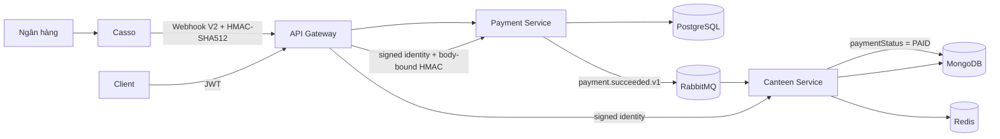
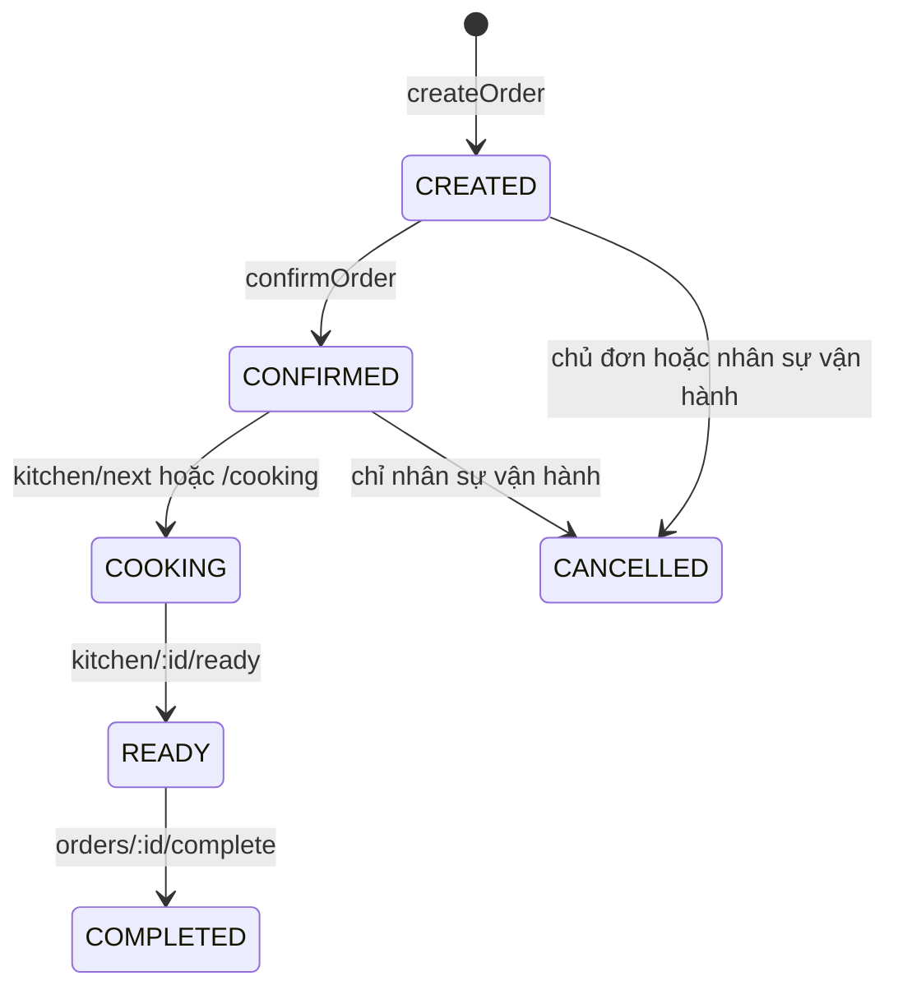
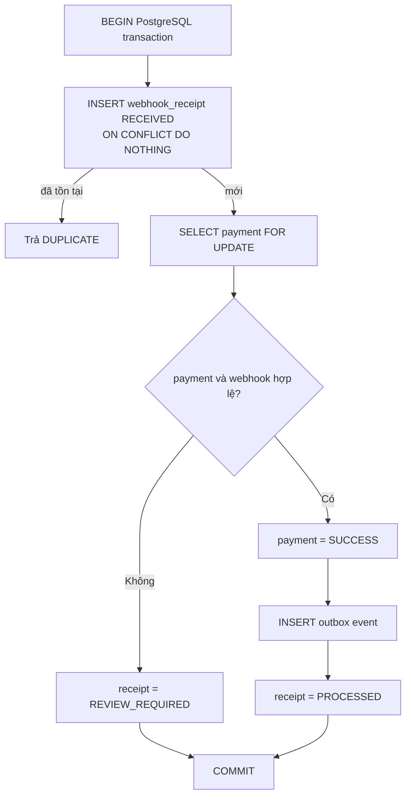
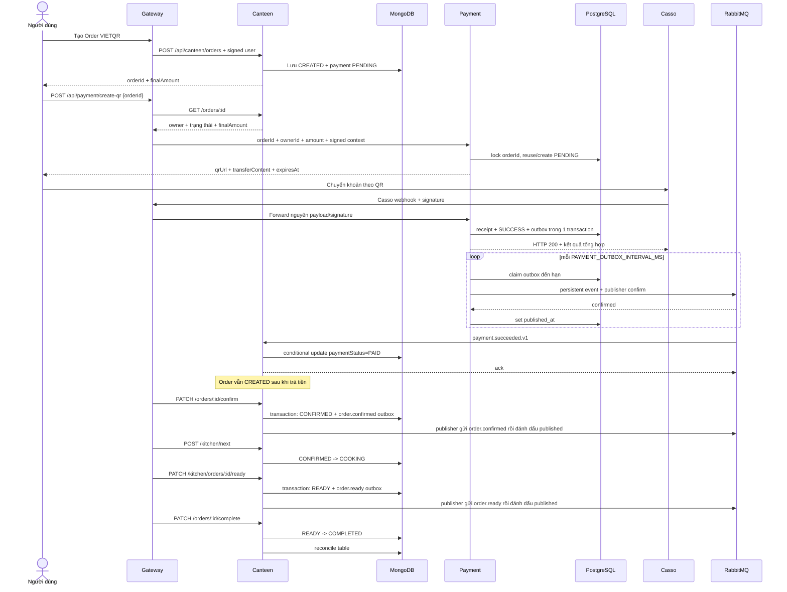

# Backend Canteen + Payment — giải thích kiến trúc, code và luồng chạy thực tế

> Tài liệu này được viết từ **source code hiện tại** của hai service
> `backend/canteen` và `backend/payment`, với trọng tâm là luồng đặt món,
> VietQR/Casso và Outbox Pattern. Gateway chỉ được nhắc ở ranh giới tích hợp để
> giải thích vì sao dữ liệu đi vào hai service là đáng tin cậy.
>
> Đây là tài liệu mô tả **code đang tồn tại**, không phải thiết kế giả định.
> Một số tài liệu cũ có thể nói tới heap trong RAM, callback trực tiếp vào
> Canteen hoặc Payment nằm trong Canteen; những điều đó không còn đúng với code
> hiện tại.

## 1. Bức tranh tổng thể

Hệ thống tách hai nguồn dữ liệu độc lập:

- **Canteen Service** sở hữu menu, bàn, đơn hàng, bếp, kho, báo cáo và Canteen
  Outbox trong MongoDB. Redis chỉ giữ lịch sử undo/redo menu. Canteen vừa
  publish vừa consume một số message RabbitMQ.
- **Payment Service** sở hữu payment intent, biên nhận webhook và outbox trong
  PostgreSQL. Service này tạo VietQR, xác thực Casso và phát sự kiện thanh toán
  thành công.
- Hai service **không truy cập database của nhau**. `orderId` và `userId` của
  MongoDB được Payment lưu dưới dạng chuỗi, không phải foreign key chéo.



### Vì sao cần tách như vậy?

`Order.status` và `Order.paymentStatus` là nghiệp vụ căn tin, còn trạng thái
giao dịch ngân hàng là nghiệp vụ tài chính. Canteen không nên tự kết luận rằng
tiền đã vào tài khoản; Payment cũng không nên tự sửa MongoDB của Canteen. Event
`payment.succeeded.v1` là hợp đồng nối hai phần này.

## 2. Cấu trúc khởi động của hai service

### 2.1. Canteen

Điểm vào là [`backend/canteen/src/main.ts`](../backend/canteen/src/main.ts).
NestJS được khởi tạo, bật shutdown hook, gắn `ValidationPipe` toàn cục rồi lắng
nghe ở `PORT` hoặc cổng mặc định `3000`.

[`backend/canteen/src/app.module.ts`](../backend/canteen/src/app.module.ts) ghép
các module:

| Module                                | Trách nhiệm chính                                                        |
| ------------------------------------- | ------------------------------------------------------------------------ |
| `CoreModule`                          | request ID, exception filter, telemetry, xác minh identity do Gateway ký |
| `DatabaseModule`                      | kết nối MongoDB bằng Mongoose                                            |
| `RedisModule`                         | kết nối Redis cho undo/redo menu                                         |
| `RabbitMQModule`                      | publish/subscribe, retry và DLQ                                          |
| `OutboxModule`                        | ghi Mongo outbox và phát event nền                                       |
| `TableModule`                         | CRUD bàn, xếp/gộp bàn                                                    |
| `CategoryModule`, `MenuModule`        | danh mục và thực đơn                                                     |
| `OrderModule`                         | tạo đơn, vòng đời đơn, consumer thanh toán                               |
| `KitchenModule`                       | hàng chờ và trạng thái chế biến                                          |
| `IngredientModule`, `InventoryModule` | nguyên liệu, lô kho và FEFO                                              |
| `AnalyticsModule`                     | thống kê món bán chạy                                                    |
| `HealthModule`                        | liveness/readiness                                                       |

### 2.2. Payment

Điểm vào là [`backend/payment/src/main.ts`](../backend/payment/src/main.ts).
Khác biệt đáng chú ý là tùy chọn `rawBody: true`, phục vụ các tình huống cần
kiểm tra tính toàn vẹn webhook. Service lắng nghe ở `PORT` hoặc cổng `5006`.

[`backend/payment/src/app.module.ts`](../backend/payment/src/app.module.ts) ghép:

| Module           | Trách nhiệm chính                                      |
| ---------------- | ------------------------------------------------------ |
| `CoreModule`     | request ID, log/trace, exception filter, Gateway guard |
| `DatabaseModule` | TypeORM + PostgreSQL + migrations                      |
| `PaymentModule`  | API payment, VietQR, Casso, repository, worker hết hạn |
| `RabbitMQModule` | confirm channel và persistent message                  |
| `OutboxModule`   | worker quét và publish outbox                          |
| `HealthModule`   | kiểm tra PostgreSQL và RabbitMQ                        |

Payment đặt `synchronize: false`; schema thật được quản lý bằng migration. Đây
là lựa chọn phù hợp cho dữ liệu tài chính vì deploy không được tự ý biến đổi
schema.

## 3. Canteen Service — dữ liệu và vai trò từng phần code

### 3.1. Các collection chính

Các schema nằm trong `backend/canteen/src/schemas`.

| Collection         | Dữ liệu quan trọng                                                         |
| ------------------ | -------------------------------------------------------------------------- |
| `categories`       | tên, mô tả, thứ tự hiển thị, `isActive`                                    |
| `menuitems`        | category, tên, giá nguyên VND, options, `isAvailable`                      |
| `tables`           | tên, sức chứa, QR URL, `empty/occupied/reserved`                           |
| `orders`           | snapshot món và giá, chủ đơn, bàn, tổng tiền, trạng thái món và thanh toán |
| `ordercounters`    | sequence nguyên tử để cấp `#1001`, `#1002`, ...                            |
| `ingredients`      | tên, đơn vị, ngưỡng tồn kho tối thiểu                                      |
| `inventorybatches` | lô nhập, số lượng, hạn dùng, giá vốn, trạng thái                           |
| `outbox_events`    | event chờ phát, lease, retry, lỗi và thời điểm đã publish                  |

MongoDB của Canteen là nguồn sự thật cho `finalAmount`. Payment chỉ nhận một bản
sao số tiền này lúc tạo payment intent.

### 3.2. Hai máy trạng thái độc lập trên Order

[`orders.schema.ts`](../backend/canteen/src/schemas/orders.schema.ts) cố ý tách:

```text
Order.status:
CREATED -> CONFIRMED -> COOKING -> READY -> COMPLETED
    \-> CANCELLED (chỉ ở những trạng thái được phép)

Order.paymentStatus:
PENDING -> PAID -> REFUNDED (REFUNDED mới chỉ có trong schema)
```

Không nên gộp hai trường này. Một đơn VietQR có thể đã `PAID` nhưng vẫn đang
`CREATED`; sau đó nhân viên mới xác nhận để đưa vào bếp. Ngược lại, đơn tiền mặt
có thể chế biến trước và chỉ được đánh dấu `PAID` khi hoàn tất giao món.

Trường `status = PAID` vẫn tồn tại trong enum lịch sử của schema nhưng luồng
hiện tại không dùng nó để thể hiện kết quả thanh toán. Code consumer chỉ sửa
`paymentStatus`.

### 3.3. Luồng tạo Order

Endpoint:

```http
POST /api/canteen/orders
```

Luồng thật nằm trong
[`OrderService.createOrder()`](../backend/canteen/src/modules/order/order.service.ts):

1. Lấy `userId` từ identity đã được Gateway ký, không lấy từ body client.
2. Kiểm tra giỏ có ít nhất một món.
3. Query toàn bộ `MenuItem` cần thiết theo lô để tránh N+1 query.
4. Query các category đang active.
5. Với từng món, kiểm tra món tồn tại, đang bán và category không bị ẩn.
6. Resolve option theo tên từ dữ liệu menu. Giá option client gửi lên không
   được tin dùng.
7. Tính `totalAmount`, `discountAmount`, `finalAmount` bằng
   `OrderDiscountCalculator`.
8. Nếu là VietQR và `finalAmount = 0`, từ chối vì không cần tạo giao dịch.
9. Nếu có `tableId`, chuyển bàn `empty/occupied -> occupied`; bàn `reserved`
   không được tự nhận.
10. Tăng counter nguyên tử để cấp `orderNumber`.
11. Lưu Order với `status=CREATED`, `paymentStatus=PENDING`.

Ý quan trọng của đoạn code tính giá:

```ts
const unitPrice = menuItem.price;
const selectedOptions = this.resolveSelectedOptions(
  menuItem,
  itemDto.selectedOptions,
);

const discountResult = OrderDiscountCalculator.calculateFinalPrice(
  itemPriceInfos,
  { dailySubsidyAmount: 0 },
);
```

Giá được đọc từ MongoDB và được snapshot vào `Order.items`. Vì vậy nếu quản trị
viên đổi giá menu sau này, đơn cũ vẫn giữ đúng giá lúc đặt.

#### Tính nhất quán của bàn khi tạo đơn

Canteen chưa dùng một Mongo transaction chung cho thao tác chiếm bàn và lưu
Order. Code dùng chiến lược bù trừ:

- Chiếm bàn trước.
- Nếu lưu Order lỗi và request này đã đổi bàn từ `empty`, gọi
  `rollbackTableOccupancy()`.
- Trước khi trả bàn về `empty`, kiểm tra còn Order chưa tất toán nào ở bàn đó
  hay không.
- Sau khi lưu Order thành công, `ensureTableOccupied()` sửa best-effort cửa sổ
  race với request khác.

Đây là **compensating logic**, không có mức atomic giống transaction
PostgreSQL của Payment.

### 3.4. Luồng xác nhận và chế biến

`PATCH /api/canteen/orders/:id/confirm` chỉ cho phép Order `CREATED`. Với phương
thức không phải tiền mặt, `paymentStatus` bắt buộc đã là `PAID`.

Điểm ưu tiên được chốt lúc xác nhận:

```text
priorityScore = roleScore * 100 + isTakeaway * 50 + waitingMinutes * 1.5
```

- VIP/BGĐ: `roleScore = 2`.
- Manager/Admin: `roleScore = 1`.
- Vai trò khác: `0`.
- Mang đi: cộng `50`.
- Mỗi phút đã chờ trước lúc confirm: cộng `1.5`.

`confirmOrder()` mở Mongo transaction. Việc chuyển Order sang `CONFIRMED` và
ghi event `order.confirmed` vào `outbox_events` dùng cùng session, nên hoặc cả
hai cùng commit, hoặc cả hai cùng rollback. HTTP request không phải chờ
RabbitMQ.

Kitchen **không duy trì một heap trong RAM**. Hàng chờ bền vững chính là các
Order `CONFIRMED` trong MongoDB:

```ts
find({ status: "CONFIRMED" }).sort({ priorityScore: -1, createdAt: 1 });
```

`POST /api/canteen/kitchen/next` dùng một `findOneAndUpdate` có sort để vừa lấy
đơn ưu tiên cao nhất, vừa chuyển nó thành `COOKING` một cách nguyên tử. Nhờ đó
hai đầu bếp bấm “nhận đơn tiếp theo” cùng lúc không cùng nhận một đơn.



Khi chuyển `COOKING -> READY`, Canteen ghi `order.ready` vào outbox trong cùng
Mongo transaction. Khi chuyển `READY -> COMPLETED`, nếu là tiền mặt còn
`PENDING`, code đồng thời đổi `paymentStatus=PAID`.

### 3.5. Khi nào bàn được trả về `empty`?

[`OrderSettlementService`](../backend/canteen/src/modules/order/order-settlement.service.ts)
được gọi từ ba nơi:

- sau khi hủy đơn;
- sau khi hoàn tất đơn;
- sau khi consumer nhận thanh toán thành công.

Service không chỉ nhìn Order vừa thay đổi. Nó tìm **mọi Order cùng bàn**. Bàn
chỉ được giải phóng khi không còn đơn nào chưa tất toán; một Order được coi là
tất toán nếu đã `CANCELLED`, hoặc vừa ở `COMPLETED/PAID` vừa có
`paymentStatus=PAID`.

Điều này xử lý đúng cả hai thứ tự sự kiện:

- món hoàn tất trước, tiền đến sau;
- tiền đến trước, món hoàn tất sau.

### 3.6. Menu, Redis, kho và analytics

- `MenuService` chỉ trả category active và món đang bán cho API public. Các
  thao tác create/update/delete được ghi thành command trong Redis để undo/redo,
  tối đa 50 bản ghi và TTL 24 giờ.
- `CategoryService` không cho xóa category còn món. `IngredientService` không
  cho xóa nguyên liệu đã có lô kho.
- `InventoryService.consumeIngredient()` dùng Mongo transaction và thuật toán
  FEFO: đánh dấu lô quá hạn, đọc lô còn hiệu lực theo `expiryDate`, tính phương
  án trừ, rồi update với điều kiện `quantity` cũ để phát hiện cạnh tranh.
- Nếu tồn kho xuống dưới ngưỡng, `inventory.low_stock` được ghi vào outbox ngay
  trong transaction xuất kho. Trừ kho và tạo cảnh báo vì vậy rollback cùng
  nhau nếu một bước lỗi.
- `AnalyticsService` dùng Mongo aggregation để thống kê món của các Order không
  bị hủy. Đây không phải Top-K heap trong RAM.

## 4. Payment Service — dữ liệu và vai trò từng phần code

### 4.1. Ba bảng PostgreSQL

#### `payments`

[`PaymentEntity`](../backend/payment/src/modules/database/entities/payment.entity.ts)
lưu payment intent và kết quả tài chính:

| Trường                           | Ý nghĩa                                                   |
| -------------------------------- | --------------------------------------------------------- |
| `id`                             | UUID của payment                                          |
| `order_id`, `user_id`            | ID từ Canteen, lưu dạng chuỗi                             |
| `payment_code`                   | mã duy nhất được nhúng vào nội dung chuyển khoản          |
| `amount`                         | số nguyên VND, DB dùng `bigint`                           |
| `status`                         | `PENDING/SUCCESS/FAILED/EXPIRED/REVIEW_REQUIRED/REFUNDED` |
| `qr_url`, `transfer_description` | dữ liệu client dùng để thanh toán                         |
| `destination_account`            | tài khoản phải khớp webhook                               |
| `provider_transaction_id`        | ID giao dịch Casso khi thành công                         |
| `provider_metadata`, `paid_at`   | metadata đã giới hạn và thời gian giao dịch               |

Migration đặt các bất biến ở tầng DB:

- `amount > 0`, `currency = VND`;
- `payment_code` unique;
- `provider_transaction_id` unique khi có giá trị;
- tối đa một `PENDING` cho mỗi Order;
- tối đa một `SUCCESS` cho mỗi Order.

#### `webhook_receipts`

Mỗi Casso transaction được nhận diện bằng cặp unique
`(provider, provider_event_id)`. `payload_hash` cho biết một ID cũ có bị gửi lại
với payload khác hay không. Đây là idempotency bền vững trong PostgreSQL, không
dựa vào cache có TTL.

#### `outbox_events`

Mỗi event cần gửi có payload và trạng thái vận hành:

| Trường                                    | Vai trò                                        |
| ----------------------------------------- | ---------------------------------------------- |
| `id`                                      | đồng thời là `eventId` và RabbitMQ `messageId` |
| `aggregate_id`                            | `payment.id`                                   |
| `event_type`, `version`, `payload`        | hợp đồng event có version                      |
| `attempt_count`, `next_attempt_at`        | số lần gửi và lịch retry                       |
| `published_at`                            | có giá trị khi broker đã confirm               |
| `failed_at`                               | có giá trị khi đã hết số lần thử               |
| `last_error`                              | lỗi đã sanitize, tối đa 500 ký tự              |
| `request_id`, `traceparent`, `tracestate` | nối log/trace xuyên service                    |

### 4.2. Tạo hoặc tái sử dụng VietQR

Client thực tế chỉ nên gửi `orderId` cho Gateway. Gateway đọc Order chính thức
từ Canteen, kiểm tra chủ đơn/trạng thái/phương thức/số tiền, rồi gọi nội bộ:

```http
POST /api/payment/create-qr
x-user-payload: <base64 user>
x-user-timestamp: <milliseconds>
x-user-signature: <HMAC-SHA256>
x-request-id: <correlation id>

{
  "orderId": "<Mongo ObjectId>",
  "orderUserId": "<Mongo ObjectId>",
  "amount": 125000
}
```

Payment không tin riêng header identity: chữ ký tạo QR còn bind cả
`orderId + orderUserId + amount` qua context `payment.create-qr.v2`. Nếu body
bị sửa giữa Gateway và Payment, chữ ký không còn hợp lệ.

[`PaymentService.createQr()`](../backend/payment/src/modules/payment/payment.service.ts)
thực hiện:

1. Chỉ cho chủ đơn hoặc `admin/manager/cashier` tạo payment.
2. Sinh mã mặc định `NRP` + 16 ký tự hex ngẫu nhiên.
3. `VietQrService` tạo URL ảnh từ bank ID, số tài khoản, template, số tiền và
   nội dung chuyển khoản.
4. Tạo candidate `PENDING`, mặc định hết hạn sau 15 phút.
5. Gọi `PaymentRepository.createOrReuse()`.

Repository dùng:

```sql
SELECT pg_advisory_xact_lock(hashtext($1)); -- $1 = orderId
```

Khóa theo Order làm tuần tự các request tạo QR cạnh tranh. Sau khi có khóa:

- nếu đã có `SUCCESS`, trả payment thành công đó;
- nếu có `PENDING` còn hạn, cùng amount và user, trả lại QR cũ;
- nếu `PENDING` cũ hết hạn hoặc không còn khớp, đổi nó thành `EXPIRED` rồi tạo
  payment mới.

### 4.3. Worker hết hạn payment

[`PaymentExpiryWorker`](../backend/payment/src/modules/payment/payment-expiry.worker.ts)
chạy ngay lúc module init và lặp theo `PAYMENT_EXPIRY_INTERVAL_MS` (mặc định
60 giây, không chấp nhận dưới 5 giây).

Query logic tương đương:

```sql
UPDATE payments
SET status = 'EXPIRED'
WHERE status = 'PENDING' AND expires_at < now();
```

Cờ `running` ngăn hai lượt sweep trong **cùng process** chồng lên nhau. Nhiều
instance vẫn có thể chạy đồng thời, nhưng phép update có điều kiện làm kết quả
idempotent. Worker này không phát event hết hạn.

### 4.4. Nhận và xác minh Casso Webhook V2

Endpoint chính:

```http
POST /api/payment/webhooks/casso
x-casso-signature: t=<timestamp-ms>,v1=<sha512-hex>
```

Hai alias còn được hỗ trợ: `/webhook/casso` và `/api/payment/callback`.

Luồng trong `PaymentService.handleCassoWebhook()`:

1. `CassoSignatureService` sort key object ở mọi cấp, giữ nguyên thứ tự array,
   JSON stringify và xác minh HMAC-SHA512 bằng constant-time comparison.
2. Có thể chấp nhận secret hiện tại và secret trước đó để xoay khóa.
3. Kiểm tra `error == 0`, payload có từ 1 đến 100 transaction.
4. Parse ID, description, amount, account, reference và thời gian giao dịch.
5. Tách `paymentCode` khỏi description sau khi URL decode, Unicode normalize và
   uppercase.
6. Hash canonical transaction để phục vụ phát hiện duplicate khác payload.
7. Xử lý từng transaction trong một PostgreSQL transaction riêng.

Mặc định freshness check của timestamp Casso bị tắt
(`CASSO_SIGNATURE_MAX_AGE_MS=0`) để không loại nhầm delivery retry cũ. Chống
replay tài chính nằm ở unique receipt, không nằm ở timestamp.

### 4.5. Transaction tài chính quan trọng nhất

Trung tâm của hệ thống là
[`PaymentRepository.processCassoTransaction()`](../backend/payment/src/modules/payment/payment.repository.ts).



Các điều kiện webhook phải vượt qua:

- thời gian giao dịch parse được;
- payment vẫn là `PENDING` và chưa hết hạn;
- số tiền nhận đúng bằng `payment.amount`;
- tài khoản nhận sau normalize đúng bằng `destination_account`;
- mã payment trong description tồn tại;
- transaction Casso chưa từng được xử lý.

`SELECT ... FOR UPDATE` khóa payment để hai webhook cạnh tranh không cùng chuyển
nó sang `SUCCESS`.

Nếu hợp lệ, **ba thay đổi sau commit hoặc rollback cùng nhau**:

```text
payments.status = SUCCESS
+ outbox_events(payment.succeeded.v1)
+ webhook_receipts.status = PROCESSED
```

Nếu sai mã, sai tiền, sai tài khoản, hết hạn hoặc sai trạng thái, receipt được
đánh dấu `REVIEW_REQUIRED`; code hiện tại không đổi payment sang
`REVIEW_REQUIRED` và cũng không phát event thành công.

### 4.6. Payload event thực tế

```json
{
  "eventId": "<UUID, cũng là outbox.id>",
  "eventType": "payment.succeeded.v1",
  "version": 1,
  "occurredAt": "2026-09-15T08:00:00.000Z",
  "data": {
    "paymentId": "<UUID>",
    "orderId": "<Mongo ObjectId>",
    "userId": "<Mongo ObjectId>",
    "amount": 125000,
    "currency": "VND",
    "paymentMethod": "VIETQR",
    "providerTransactionId": "<Casso transaction id>",
    "paidAt": "2026-09-15T07:59:55.000Z"
  }
}
```

Tên queue cố định là:

```text
canteen.payment.succeeded.v1
```

## 5. Outbox Pattern trong đúng code của dự án

### 5.1. Outbox giải quyết lỗi nào?

Nếu một service làm kiểu sau:

```text
UPDATE payment = SUCCESS
COMMIT
publish RabbitMQ
```

thì process có thể chết sau `COMMIT` nhưng trước `publish`. Payment có thể đã
ghi nhận tiền nhưng Canteen không biết; hoặc Canteen đã đổi trạng thái Order/kho
nhưng service khác không nhận được event.

Code hiện tại ghi `outbox_events` ngay trong transaction nghiệp vụ:

- Payment ghi event vào PostgreSQL cùng lúc chuyển payment sang `SUCCESS`.
- Canteen ghi event vào MongoDB cùng lúc confirm Order, chuyển món sang `READY`
  hoặc phát sinh cảnh báo tồn kho thấp.

Sau commit, event đã nằm bền vững trong database của service; worker có thể gửi
sau.

### 5.2. OutboxPublisher claim công việc ra sao?

[`OutboxPublisher`](../backend/payment/src/modules/outbox/outbox.publisher.ts)
chạy ngay khi module init và lặp mặc định mỗi 1 giây:

```sql
WITH candidates AS (
  SELECT id
  FROM outbox_events
  WHERE published_at IS NULL
    AND failed_at IS NULL
    AND next_attempt_at <= now()
  ORDER BY created_at
  FOR UPDATE SKIP LOCKED
  LIMIT 20
)
UPDATE outbox_events AS event
SET attempt_count = event.attempt_count + 1,
    next_attempt_at = now() + interval '30 seconds'
FROM candidates
WHERE event.id = candidates.id
RETURNING ...;
```

Ý nghĩa:

- mỗi lượt lấy tối đa 20 event cũ nhất;
- `SKIP LOCKED` hỗ trợ nhiều publisher cạnh tranh mà không chờ cùng row;
- tăng `attempt_count` ngay lúc claim;
- lease 30 giây qua `next_attempt_at` giảm khả năng instance khác lấy lại event
  đang gửi;
- cờ `running` ngăn hai vòng flush trong cùng process chồng nhau.

### 5.3. Publish đáng tin cậy tới RabbitMQ

Payment dùng durable queue, message `persistent: true` và **confirm channel**:

```ts
channel.sendToQueue(queueName, Buffer.from(JSON.stringify(payload)), {
  persistent: true,
  messageId: event.id,
  correlationId: event.aggregate_id,
});
await channel.waitForConfirms();
```

Chỉ sau khi broker confirm, publisher mới đặt `published_at=now()`. Nếu publish
lỗi, nó lưu `last_error` và đặt lần thử kế tiếp theo exponential backoff, tối đa
300 giây.

`PAYMENT_OUTBOX_MAX_ATTEMPTS` mặc định bằng `0`, nghĩa là retry vô hạn với
exponential backoff. Nếu vận hành cấu hình một số dương, hết số lần thử thì
`failed_at` được set và worker không tự lấy event đó nữa; khi đó bắt buộc phải có
cảnh báo và quy trình re-drive.

### 5.4. Canteen MongoDB Outbox hoạt động ra sao?

[`OutboxService`](../backend/canteen/src/modules/outbox/outbox.service.ts) nhận
bắt buộc một `ClientSession`. Vì vậy caller không thể vô tình ghi event ngoài
transaction nghiệp vụ. Service sinh UUID cho `eventId`, lưu queue, aggregate,
payload, request ID và W3C trace context.

Ba nơi enqueue hiện tại:

| Nghiệp vụ                  | Thay đổi cùng transaction | Event                 |
| -------------------------- | ------------------------- | --------------------- |
| xác nhận đơn               | `CREATED -> CONFIRMED`    | `order.confirmed`     |
| hoàn tất chế biến          | `COOKING -> READY`        | `order.ready`         |
| xuất kho xuống dưới ngưỡng | cập nhật các lô FEFO      | `inventory.low_stock` |

[`Canteen OutboxPublisher`](../backend/canteen/src/modules/outbox/outbox.publisher.ts)
dùng `findOneAndUpdate` để claim nguyên tử event cũ nhất đến hạn: tăng
`attemptCount` và dời `nextAttemptAt` theo lease mặc định 30 giây. Mỗi vòng xử
lý tối đa 20 event, lặp mặc định mỗi giây. Sau broker confirm, worker mới ghi
`publishedAt`.

Nếu RabbitMQ lỗi, `RabbitMQService.publish()` ném lỗi trở lại publisher. Worker
lưu `lastError`, đặt exponential backoff tối đa 300 giây rồi thử lại. Cấu hình
mặc định `CANTEEN_OUTBOX_MAX_ATTEMPTS=0` cũng retry vô hạn; số dương mới bật
trạng thái `failedAt`.

Mongo transaction yêu cầu MongoDB replica set hoặc MongoDB Atlas. Standalone
MongoDB không đủ cho tính atomic của Canteen Outbox.

### 5.5. Vì sao vẫn có message trùng?

Tình huống kinh điển:

```text
RabbitMQ đã confirm
        ↓
Payment process chết trước UPDATE published_at
        ↓
Outbox vẫn trông như chưa publish
        ↓
Worker gửi lại
```

Tình huống tương tự tồn tại ở cả PostgreSQL Outbox và MongoDB Outbox. Publish
kéo dài quá lease 30 giây cũng có thể làm instance khác claim lại. Vì vậy hệ
thống có semantics **at-least-once**, không phải exactly-once; mọi consumer quan
trọng vẫn phải idempotent.

## 6. Canteen consume event và chống xử lý trùng

[`PaymentConsumer`](../backend/canteen/src/modules/order/consumers/payment.consumer.ts)
subscribe queue ngay khi module khởi tạo.

### 6.1. Validate contract trước khi đụng database

Consumer kiểm tra chặt:

- `eventId` và `paymentId` là UUID;
- đúng `eventType`, `version=1`;
- `orderId`, `userId` là Mongo ObjectId;
- `amount` là số nguyên an toàn và dương;
- currency/method đúng `VND/VIETQR`;
- transaction ID có độ dài hợp lệ;
- ngày giờ là ISO chuẩn.

### 6.2. Cập nhật lần đầu là atomic và có điều kiện

Consumer chỉ update nếu Order đồng thời thỏa:

```ts
{
  _id: orderId,
  status: { $ne: 'CANCELLED' },
  userId,
  finalAmount: event.data.amount,
  paymentMethod: 'VIETQR',
  paymentStatus: 'PENDING'
}
```

Nếu khớp, một `findOneAndUpdate` đổi `paymentStatus=PAID` và ghi
`paymentId/paymentEventId/providerTransactionId/paidAt`. Các trường định danh
payment có unique sparse index, giúp ngăn cùng payment/event/provider transaction
gắn vào hai Order.

### 6.3. Delivery lặp hợp lệ

Ở lần message lặp, điều kiện `paymentStatus=PENDING` không còn khớp. Consumer
đọc Order hiện tại và chỉ coi là idempotent khi payment ID, provider transaction
ID và `paidAt` khớp; event ID cũng phải khớp nếu Order đã có trường này. Nhánh
cho phép `paymentEventId` cũ còn thiếu là tương thích dữ liệu legacy. Sau đó nó
vẫn gọi đối soát bàn để tự sửa trường hợp lần trước cập nhật Order xong nhưng
process chết trước khi giải phóng bàn.

Nếu Order không tồn tại, đã hủy, sai user, sai số tiền, sai phương thức hoặc đã
được trả bởi payment khác, handler ném `ConflictException`.

### 6.4. Retry, ack và DLQ

RabbitMQ consumer chỉ `ack` sau khi callback chạy thành công. Khi lỗi:

1. Republish cùng payload về queue, tăng header `x-retry-count`.
2. Chờ broker confirm bản sao mới.
3. Chỉ khi confirm mới ack message gốc.
4. Nếu republish thất bại, `nack(..., requeue=true)` message gốc.
5. Sau 5 lần retry, gửi thủ công sang
   `canteen.payment.succeeded.v1.dlq`, chờ confirm rồi ack message gốc.

Retry hiện tại là republish ngay, không có delay queue. Lỗi kéo dài có thể đi
qua các lần retry rất nhanh rồi vào DLQ; vận hành cần monitor DLQ.

## 7. Luồng VietQR hoàn chỉnh từ đầu tới cuối



Điểm cần nhớ: response webhook `200` chỉ nói Payment đã tiếp nhận/xử lý dữ liệu
vào PostgreSQL. Canteen có thể được cập nhật sau đó vì outbox là bất đồng bộ.

## 8. Luồng tiền mặt

Tiền mặt không đi qua Payment Service:

```text
POST Order paymentMethod=CASH
  -> CREATED + paymentStatus=PENDING
PATCH confirm
  -> CONFIRMED (không bắt buộc PAID)
Kitchen next/cooking
  -> COOKING
Kitchen ready
  -> READY
PATCH complete
  -> COMPLETED + paymentStatus=PAID
  -> đối soát và có thể trả bàn về empty
```

Đây là lý do `confirmOrder()` có nhánh:

```ts
if (order.paymentMethod !== 'CASH' && order.paymentStatus !== 'PAID') {
  throw new ConflictException(...);
}
```

## 9. Các tình huống lỗi cụ thể

| Tình huống                                                | Code hiện tại làm gì                                                 | Kết quả                                          |
| --------------------------------------------------------- | -------------------------------------------------------------------- | ------------------------------------------------ |
| Hai request tạo QR cùng lúc                               | advisory lock + partial unique index                                 | reuse một intent hoặc một request tạo trước      |
| QR cũ hết hạn                                             | create/reuse đổi intent cũ thành `EXPIRED`; worker cũng quét định kỳ | không thể webhook thành công trên intent hết hạn |
| Casso gửi cùng transaction ID hai lần                     | insert receipt `ON CONFLICT DO NOTHING`                              | trả `DUPLICATE`, không tạo event thứ hai         |
| Cùng Casso ID nhưng payload đổi                           | so `payload_hash` với receipt cũ                                     | trả duplicate kèm reason cảnh báo                |
| Webhook sai mã/tiền/tài khoản                             | receipt `REVIEW_REQUIRED`                                            | payment không thành công, không có outbox        |
| DB lỗi giữa update payment và insert outbox               | PostgreSQL rollback toàn transaction                                 | không có trạng thái nửa vời                      |
| RabbitMQ down                                             | hai OutboxPublisher ghi lỗi và retry/backoff                         | event nằm trong DB; mặc định tự retry vô hạn     |
| Payment chết sau broker confirm                           | `published_at` có thể chưa được ghi                                  | event được gửi lại; consumer phải idempotent     |
| Canteen DB tạm lỗi                                        | consumer republish và retry                                          | thành công thì ack; quá retry vào DLQ            |
| Event trùng                                               | conditional update không chạy lần hai, rồi so toàn bộ identity       | bỏ qua an toàn nếu đúng cùng payment             |
| Event sai hoặc xung đột                                   | handler ném lỗi                                                      | retry rồi DLQ để điều tra                        |
| Canteen cập nhật PAID xong nhưng chết trước reconcile bàn | event lặp gọi reconcile lại                                          | có khả năng tự phục hồi trạng thái bàn           |

## 10. API chính của hai service

### Canteen

| Method                  | Path                                      | Chức năng                                  |
| ----------------------- | ----------------------------------------- | ------------------------------------------ |
| `GET`                   | `/api/canteen/menu`                       | menu public đang bán                       |
| `GET`                   | `/api/canteen/menu/search`                | tìm món đang bán                           |
| `GET/POST/PUT/DELETE`   | `/api/canteen/admin/menu...`              | quản trị menu, undo/redo                   |
| `GET/POST/PATCH/DELETE` | `/api/canteen/categories...`              | CRUD category qua base CRUD                |
| `GET/POST/PATCH/DELETE` | `/api/canteen/tables...`                  | CRUD và trạng thái bàn                     |
| `POST`                  | `/api/canteen/tables/allocate`            | phân/gộp bàn                               |
| `POST`                  | `/api/canteen/orders`                     | tạo Order                                  |
| `GET`                   | `/api/canteen/orders/my-orders`           | lịch sử cá nhân                            |
| `GET`                   | `/api/canteen/orders`                     | danh sách vận hành có lọc/phân trang       |
| `GET`                   | `/api/canteen/orders/:id`                 | chi tiết Order và nguồn amount cho Gateway |
| `PATCH`                 | `/api/canteen/orders/:id/cancel`          | hủy theo role/trạng thái                   |
| `PATCH`                 | `/api/canteen/orders/:id/confirm`         | xác nhận vào hàng bếp                      |
| `PATCH`                 | `/api/canteen/orders/:id/complete`        | hoàn thành giao món                        |
| `GET`                   | `/api/canteen/kitchen/queue`              | hàng chờ theo priority                     |
| `POST`                  | `/api/canteen/kitchen/next`               | nhận nguyên tử đơn tiếp theo               |
| `PATCH`                 | `/api/canteen/kitchen/orders/:id/cooking` | bắt đầu nấu                                |
| `PATCH`                 | `/api/canteen/kitchen/orders/:id/ready`   | món sẵn sàng                               |
| `GET/POST/PATCH/DELETE` | `/api/canteen/inventory/ingredients...`   | CRUD nguyên liệu                           |
| `POST`                  | `/api/canteen/inventory/batches`          | nhập lô kho                                |
| `GET`                   | `/api/canteen/inventory/expiry-alerts`    | lô còn hàng theo hạn gần nhất              |
| `POST`                  | `/api/canteen/inventory/consume`          | xuất kho FEFO                              |
| `GET`                   | `/api/canteen/analytics/top-dishes`       | thống kê món bán chạy                      |
| `GET`                   | `/health/live`, `/health/ready`           | liveness/readiness                         |

Các endpoint ghi bị giới hạn theo `RolesGuard`. Guard xác minh HMAC của identity
Gateway trước khi tin `x-user-payload`.

### Payment

| Method | Path                                       | Chức năng                  |
| ------ | ------------------------------------------ | -------------------------- |
| `POST` | `/api/payment/create-qr`                   | tạo/reuse VietQR intent    |
| `GET`  | `/api/payment/history?limit=20`            | lịch sử của user hiện tại  |
| `GET`  | `/api/payment/orders/:orderId`             | payment mới nhất của Order |
| `GET`  | `/api/payment/payments/:paymentId`         | chi tiết payment           |
| `POST` | `/api/payment/webhooks/casso`              | nhận Casso Webhook V2      |
| `GET`  | `/health`, `/health/live`, `/health/ready` | liveness/readiness         |

Các API payment dành cho người dùng bắt buộc identity có chữ ký Gateway. Webhook
là public route về mặt JWT nhưng bắt buộc chữ ký Casso.

## 11. Message RabbitMQ trong Canteen

| Queue/message                  | Bên phát                | Bên nhận trong phạm vi hai service    | Độ tin cậy hiện tại                          |
| ------------------------------ | ----------------------- | ------------------------------------- | -------------------------------------------- |
| `canteen.payment.succeeded.v1` | Payment OutboxPublisher | Canteen PaymentConsumer               | outbox, confirm, retry, idempotency, DLQ     |
| `order.confirmed`              | Canteen OutboxPublisher | không thấy consumer trong hai service | Mongo outbox, confirm, retry vô hạn mặc định |
| `order.ready`                  | Canteen OutboxPublisher | không thấy consumer trong hai service | Mongo outbox, confirm, retry vô hạn mặc định |
| `inventory.low_stock`          | Canteen OutboxPublisher | không thấy consumer trong hai service | Mongo outbox, confirm, retry vô hạn mặc định |

Payload và tên queue không đổi so với implementation cũ; consumer ngoài phạm vi
hai service không cần đổi contract. Khác biệt nằm ở độ tin cậy: request nghiệp
vụ chỉ ghi database, còn publisher nền chịu trách nhiệm giao message.

## 12. Các bất biến cần giữ khi sửa code

1. Client không được quyết định amount; Gateway phải đọc `finalAmount` từ
   Canteen.
2. Tiền VND phải là số nguyên an toàn, không dùng số thực.
3. Không truy cập chéo database giữa Canteen và Payment.
4. `payment SUCCESS` và `outbox INSERT` luôn phải cùng PostgreSQL transaction.
5. Ba thay đổi phát event của Canteen phải enqueue bằng cùng Mongo session.
6. Consumer phải tiếp tục idempotent vì producer là at-least-once.
7. Thanh toán thành công chỉ đổi `Order.paymentStatus`, không tự đẩy
   `Order.status` qua vòng đời bếp.
8. Order VietQR phải `PAID` trước khi `CONFIRMED`.
9. Bàn chỉ được trả về `empty` sau khi không còn Order chưa tất toán cùng bàn.
10. Không log secret, chữ ký, số tài khoản đầy đủ hoặc raw webhook nhạy cảm.
11. Khi đổi event contract, tạo version mới thay vì âm thầm đổi
    `payment.succeeded.v1`.

## 13. Điểm vận hành cần theo dõi

- PostgreSQL `outbox_events` có `published_at IS NULL` quá lâu.
- MongoDB `outbox_events` có `publishedAt = null` quá lâu.
- `failed_at/failedAt` có giá trị khi đã cấu hình giới hạn số lần thử: cần điều
  tra và re-drive có kiểm soát.
- Số lượng message trong `canteen.payment.succeeded.v1.dlq`.
- `webhook_receipts.status = REVIEW_REQUIRED` và `failure_reason`.
- Payment `PENDING` quá `expires_at` nhưng chưa được worker chuyển trạng thái.
- Readiness của Canteen yêu cầu cả MongoDB, Redis và RabbitMQ; readiness của
  Payment yêu cầu PostgreSQL và RabbitMQ.
- MongoDB của Canteen phải là replica set/Atlas để transaction hoạt động.
- Log/trace theo `request_id`, `messageId`, `correlationId=paymentId` để nối
  HTTP request, webhook, outbox và consumer.

Lưu ý khi re-drive:

- Event có `failed_at/failedAt` không tự được publisher lấy lại. Cần xác định
  nguyên nhân, sau đó mới xóa cờ failed, đặt lại thời gian retry và cân nhắc
  attempt count bằng một quy trình vận hành có audit. Với cấu hình mặc định vô
  hạn, cờ failed không được tạo.
- Message trong DLQ có thể là lỗi dữ liệu thật (Order đã hủy, sai amount), không
  nên đẩy lại hàng loạt trước khi đọc `x-last-error` và đối soát hai database.

## 14. Bản đồ file để đọc code theo thứ tự

Nếu mới vào dự án, nên đọc theo tuyến này:

### Luồng Canteen

1. [`app.module.ts`](../backend/canteen/src/app.module.ts)
2. [`orders.schema.ts`](../backend/canteen/src/schemas/orders.schema.ts)
3. [`order.controller.ts`](../backend/canteen/src/modules/order/order.controller.ts)
4. [`order.service.ts`](../backend/canteen/src/modules/order/order.service.ts)
5. [`kitchen.service.ts`](../backend/canteen/src/modules/kitchen/kitchen.service.ts)
6. [`order-settlement.service.ts`](../backend/canteen/src/modules/order/order-settlement.service.ts)
7. [`payment.consumer.ts`](../backend/canteen/src/modules/order/consumers/payment.consumer.ts)
8. [`outbox.service.ts`](../backend/canteen/src/modules/outbox/outbox.service.ts)
9. [`outbox.publisher.ts`](../backend/canteen/src/modules/outbox/outbox.publisher.ts)
10. [`rabbitmq.service.ts`](../backend/canteen/src/modules/rabbitmq/rabbitmq.service.ts)

### Luồng Payment

1. [`app.module.ts`](../backend/payment/src/app.module.ts)
2. [`payment.controller.ts`](../backend/payment/src/modules/payment/payment.controller.ts)
3. [`payment.service.ts`](../backend/payment/src/modules/payment/payment.service.ts)
4. [`payment.repository.ts`](../backend/payment/src/modules/payment/payment.repository.ts)
5. [`casso-signature.service.ts`](../backend/payment/src/modules/payment/casso-signature.service.ts)
6. [`payment-expiry.worker.ts`](../backend/payment/src/modules/payment/payment-expiry.worker.ts)
7. [`outbox.publisher.ts`](../backend/payment/src/modules/outbox/outbox.publisher.ts)
8. [`rabbitmq.service.ts`](../backend/payment/src/modules/rabbitmq/rabbitmq.service.ts)
9. [`initial-payment-schema migration`](../backend/payment/src/modules/database/migrations/1724000000000-initial-payment-schema.ts)

## 15. Kết luận ngắn gọn

Luồng tài chính của dự án có ba lớp chống sai lệch bổ sung cho nhau:

1. **PostgreSQL transaction + constraint + row/advisory lock** bảo vệ trạng
   thái Payment và chống xử lý cạnh tranh.
2. **PostgreSQL/MongoDB Outbox + publisher confirm + retry** bảo đảm event đã
   commit có đường đi bền vững tới RabbitMQ, với semantics at-least-once.
3. **Conditional Mongo update + payment identity fields + consumer retry/DLQ**
   giúp Canteen xử lý message lặp và không nhận nhầm tiền cho Order.

Toàn bộ luồng không phải một distributed transaction duy nhất. Nó là
**eventual consistency có kiểm soát**: Payment có thể `SUCCESS` trước, rồi sau
một khoảng trễ ngắn Canteen mới thành `PAID`. Outbox chính là cầu nối làm khoảng
trễ đó có thể phục hồi thay vì biến thành mất dữ liệu vĩnh viễn.
