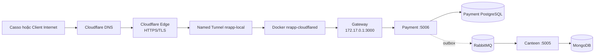
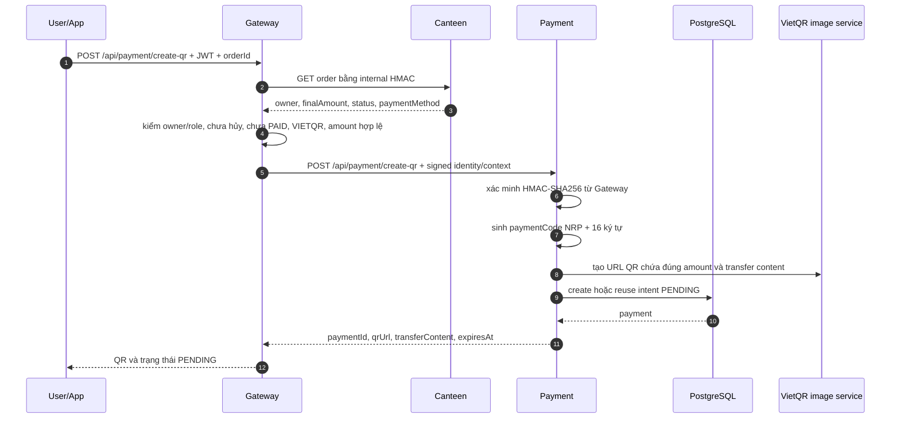
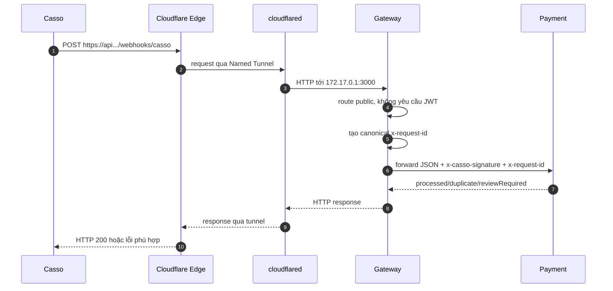
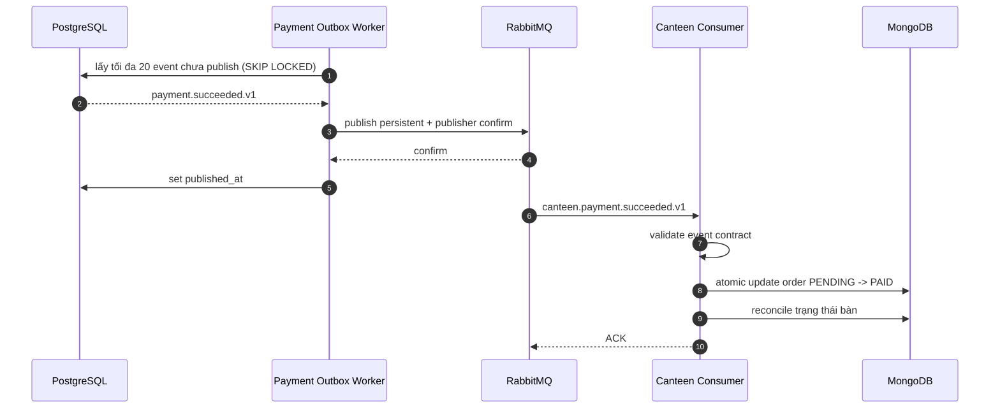
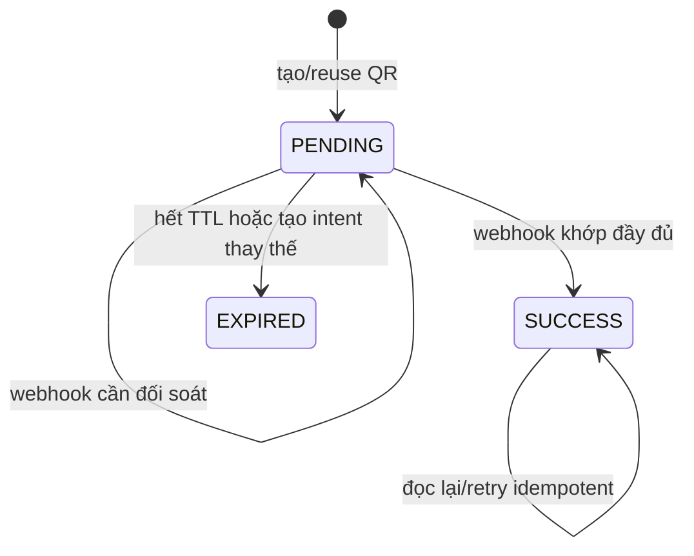

# Hướng dẫn chạy backend, cấu hình observability và tích hợp Casso qua Cloudflare Tunnel

> Cập nhật: 2026-08-27  
> Phạm vi: repository `backend`, Docker Compose, Payment/VietQR, Casso Webhook V2,
> tên miền `thanhlelmtp2006.id.vn` tại TENTEN và Cloudflare Named Tunnel.  
> Trạng thái: cấu hình local hiện tại đã chạy thành công; Casso đã **Gọi thử** và
> **Lưu tích hợp** thành công.

## 1. Đọc nhanh trước khi thao tác

Các giá trị public đang dùng:

| Mục               | Giá trị hiện tại                                               |
| ----------------- | -------------------------------------------------------------- |
| Domain            | `thanhlelmtp2006.id.vn`                                        |
| API hostname      | `api.thanhlelmtp2006.id.vn`                                    |
| Public health     | `https://api.thanhlelmtp2006.id.vn/health`                     |
| Casso Webhook V2  | `https://api.thanhlelmtp2006.id.vn/api/payment/webhooks/casso` |
| Cloudflare tunnel | `nrapp-local`                                                  |
| Connector Docker  | `nrapp-cloudflared`                                            |
| Origin hiện tại   | `http://172.17.0.1:3000`                                       |
| Cloudflare NS 1   | `clarissa.ns.cloudflare.com`                                   |
| Cloudflare NS 2   | `ram.ns.cloudflare.com`                                        |

Kết quả đã kiểm tra trên máy ngày 2026-08-27:

- 9 app container đều `healthy`.
- Gateway local trả `HTTP 200` tại `http://127.0.0.1:3000/health`.
- Payment readiness trả `HTTP 200`; PostgreSQL và RabbitMQ đều `up`.
- API qua domain trả `HTTP 200` tại
  `https://api.thanhlelmtp2006.id.vn/health`.
- Named Tunnel đang chạy với restart policy `unless-stopped`.
- Casso đã gửi dữ liệu mẫu và lưu Webhook V2 thành công.
- Quick Tunnel `trycloudflare.com` cũ không còn chạy; không cần dọn thêm.

> **Cực kỳ quan trọng:** tài liệu này không chứa giá trị thật của mật khẩu,
> `CASSO_WEBHOOK_SECRET` hoặc Cloudflare Tunnel token. Không chụp màn hình, gửi
> qua chat, commit Git hoặc dán những giá trị này vào tài liệu.

## 2. Kết luận kiến trúc hiện tại

Đây là một bản chạy **local/single-host có URL public cố định**, chưa phải hệ
thống production 24/7:

- Cloudflare giữ hostname và TLS public cố định.
- `cloudflared` trên máy tạo kết nối **đi ra ngoài** tới Cloudflare; không cần IP
  public, NAT hoặc port-forward từ router.
- Backend, Gateway và Payment vẫn chạy trên máy cá nhân bằng Docker.
- Nếu máy tắt, Docker tắt, Gateway tắt hoặc `nrapp-cloudflared` tắt thì URL vẫn
  tồn tại trong DNS nhưng request sẽ không tới được ứng dụng.
- Muốn chạy 24/7, bước sau mới chuyển backend và connector lên VPS/server luôn
  bật; URL Casso có thể giữ nguyên.

## 3. Toàn cảnh các thành phần

| Thành phần                     | Vai trò                                                                 |
| ------------------------------ | ----------------------------------------------------------------------- |
| Client/app                     | Tạo đơn, yêu cầu QR, đọc trạng thái thanh toán                          |
| Gateway `:3000`                | Public API, xác thực JWT cho người dùng và forward webhook public       |
| Canteen `:5005`                | Giữ đơn hàng và `finalAmount` chính thức trong MongoDB                  |
| Payment `:5006`                | Tạo VietQR, xác minh webhook, giữ trạng thái tài chính trong PostgreSQL |
| Payment PostgreSQL             | Lưu `payments`, `webhook_receipts`, `outbox_events`                     |
| RabbitMQ                       | Chuyển sự kiện `payment.succeeded.v1` từ Payment sang Canteen           |
| Casso                          | Theo dõi biến động ngân hàng và gọi Webhook V2                          |
| Cloudflare DNS/Edge            | Phân giải domain, TLS public và chuyển request vào Tunnel               |
| `cloudflared`                  | Connector giữ Named Tunnel từ máy local tới Cloudflare                  |
| OTel/Jaeger/Prometheus/Grafana | Trace, metric, dashboard và hỗ trợ điều tra lỗi                         |

Sơ đồ mạng public:



## 4. Biến cấu hình nằm ở đâu?

Đây là phần dễ nhầm nhất. Có năm nơi cấu hình khác nhau:

| Nơi                        | Dùng cho                                                                     | Ví dụ                                                                      |
| -------------------------- | ---------------------------------------------------------------------------- | -------------------------------------------------------------------------- |
| `backend/.env`             | Compose project, port host, credential dependency dùng chung, sampling chung | `RABBITMQ_*`, `PAYMENT_POSTGRES_*`, `*_INTERNAL_SECRET`, `OTEL_*_INTERVAL` |
| `<service>/.env`           | Cấu hình nghiệp vụ riêng của từng service                                    | `MONGO_URL`, SMTP, JWT, VietQR, Casso                                      |
| `compose.yaml`             | Giá trị dành riêng khi app chạy trong container                              | `OTEL_SERVICE_NAME`, OTLP endpoint, host nội bộ DB/MQ, `NODE_ENV`, `PORT`  |
| `logger/.env`              | Stack observability                                                          | Grafana password, Alertmanager, resource limit, retention                  |
| Dashboard Cloudflare/Casso | Cấu hình SaaS ngoài repository                                               | DNS, Tunnel route, tunnel token, Webhook URL, Casso key                    |

### 4.1. Thứ tự ưu tiên khi chạy Docker Compose

Với một app như Payment:

1. Compose đọc `payment/.env` qua `env_file`.
2. Các biến cùng tên trong `environment` của `compose.yaml` ghi đè giá trị từ
   `payment/.env`.
3. Root `backend/.env` được dùng để nội suy `${...}` trong `compose.yaml`.

Ví dụ khi chạy Payment bằng Compose:

- `PAYMENT_DB_HOST` bị đặt thành `payment-postgres`, không dùng
  `127.0.0.1` trong `payment/.env`.
- `Rabbitmq_Host` bị đặt thành `rabbitmq`.
- `OTEL_EXPORTER_OTLP_ENDPOINT` bị đặt thành
  `http://otel-collector:4318`.
- `OTEL_SERVICE_NAME` bị đặt thành `payment`.
- Riêng `CASSO_WEBHOOK_SECRET`, VietQR và các tham số nghiệp vụ vẫn lấy từ
  `payment/.env` vì Compose không ghi đè chúng.

### 4.2. Khi nào phải tự khai báo toàn bộ biến observability?

Khi chạy trong root Compose hiện tại, `compose.yaml` đã đặt phần lớn biến OTEL
cho từng app. Khi chạy app ngoài Compose, deploy từng service lên VPS, systemd,
Kubernetes hoặc một nền tảng khác, mỗi service phải có cấu hình tương đương:

```dotenv
LOG_LEVEL=info
LOG_FORMAT=json
OTEL_SERVICE_NAME=payment
OTEL_SERVICE_VERSION=<git-sha-hoac-release>
DEPLOYMENT_ENVIRONMENT=production
OTEL_EXPORTER_OTLP_ENDPOINT=http://otel-collector:4318
OTEL_EXPORTER_OTLP_PROTOCOL=http/protobuf
OTEL_PROPAGATORS=tracecontext,baggage
OTEL_TRACES_SAMPLER=parentbased_traceidratio
OTEL_TRACES_SAMPLER_ARG=<ty-le-tu-0-den-1>
OTEL_METRIC_EXPORT_INTERVAL=15000
OTEL_METRIC_EXPORT_TIMEOUT=10000
OTEL_HTTP_IGNORE_INCOMING_PATHS=/health,/healthz,/ready,/readiness
```

Quy tắc endpoint:

- App chạy trực tiếp trên host: thường dùng `http://127.0.0.1:4318`.
- App trong Docker network: dùng `http://otel-collector:4318`.
- Không dùng `localhost` để gọi container khác từ bên trong một container.
- Export timeout không nên lớn hơn export interval.

Tài liệu observability đầy đủ nằm tại:

```text
/media/thanhle/D3/pj1/docBEMD/HUONG_DAN_LUONG_OBSERVABILITY_VA_CAU_HINH.md
```

## 5. Chuẩn bị môi trường lần đầu

Chạy từ thư mục backend:

```bash
cd /media/thanhle/D3/pj1/backend
```

Kiểm tra công cụ:

```bash
docker version
docker compose version
node --version
npm --version
```

Yêu cầu Node.js của root project là `>=20.19`.

Tạo file môi trường nếu chưa tồn tại. Các lệnh này không ghi đè file đã có:

```bash
test -f .env || cp .env.example .env
test -f logger/.env || cp logger/.env.example logger/.env

for service in gateway auth user mail chat todo workschedule canteen payment; do
  test -f "$service/.env" || cp "$service/.env.example" "$service/.env"
done
```

Tìm placeholder còn sót, nhưng không in toàn bộ `.env` lên chat hoặc ticket:

```bash
rg -n 'CHANGE_ME|replace_with|replace-with|your-' \
  .env */.env logger/.env
```

Sinh secret local mạnh:

```bash
openssl rand -hex 32
```

Mỗi lần chạy chỉ copy kết quả vào đúng file `.env`; không lưu kết quả vào file
tài liệu và không commit.

Nếu đây là fresh checkout và cần chạy app/script trực tiếp trên host, cài
dependency của shared observability package trước 9 service:

```bash
npm ci --prefix logger/packages/observability

for service in gateway auth user mail chat todo workschedule canteen payment; do
  npm ci --prefix "$service"
done
```

Docker build tự làm việc này trong image; không bắt buộc cài toàn bộ
`node_modules` trên host nếu chỉ chạy container và không chạy script host.

## 6. Các biến Payment cần hiểu rõ

Mẫu sau chỉ dùng placeholder:

```dotenv
NODE_ENV=development
PORT=5006

# Compose sẽ ghi đè host/port/user/password/name bằng root .env khi chạy Docker.
PAYMENT_DB_HOST=127.0.0.1
PAYMENT_DB_PORT=5433
PAYMENT_DB_USER=<payment-db-user>
PAYMENT_DB_PASSWORD=<secret>
PAYMENT_DB_NAME=<payment-db-name>
PAYMENT_DB_SSL=false
PAYMENT_DB_RUN_MIGRATIONS=true

# Phải giống PAYMENT_INTERNAL_SECRET phía Gateway/root Compose.
PAYMENT_INTERNAL_SECRET=<secret-it-nhat-32-ky-tu>
PAYMENT_REQUIRE_SIGNATURE=false
PAYMENT_SIGNATURE_MAX_AGE_MS=300000

# Casso Webhook V2.
CASSO_WEBHOOK_SECRET=<key-bao-mat-do-casso-cap>
CASSO_WEBHOOK_PREVIOUS_SECRET=
CASSO_SIGNATURE_MAX_AGE_MS=0
CASSO_TIMEZONE_OFFSET=+07:00

# Thông tin tạo VietQR; không ghi giá trị thật vào tài liệu.
VIETQR_BANK_ID=<bank-id>
VIETQR_ACCOUNT_NUMBER=<account-number>
VIETQR_ACCOUNT_NAME=<account-name>
VIETQR_TEMPLATES=compact2
VIETQR_DESCRIPTION_PREFIX=NRAPP PAY
PAYMENT_CODE_PREFIX=NRP

PAYMENT_INTENT_TTL_MINUTES=15
PAYMENT_EXPIRY_INTERVAL_MS=60000
PAYMENT_OUTBOX_INTERVAL_MS=1000
PAYMENT_OUTBOX_MAX_ATTEMPTS=8

# false vì webhook hiện đi qua Gateway để tránh log 4xx hai lần.
PAYMENT_PUBLIC_ENTRY_LOG_REJECTIONS=false
```

Giải thích các biến quan trọng:

| Biến                                  | Ý nghĩa                                                                      |
| ------------------------------------- | ---------------------------------------------------------------------------- |
| `PAYMENT_INTERNAL_SECRET`             | Gateway ký HMAC-SHA256 cho request nội bộ sang Payment                       |
| `CASSO_WEBHOOK_SECRET`                | Payment xác minh HMAC-SHA512 từ Casso; không liên quan JWT người dùng        |
| `CASSO_WEBHOOK_PREVIOUS_SECRET`       | Cho phép giữ secret cũ tạm thời khi xoay key                                 |
| `CASSO_SIGNATURE_MAX_AGE_MS=0`        | Không chặn retry Casso chỉ vì timestamp cũ; idempotency vẫn nằm ở PostgreSQL |
| `VIETQR_*`                            | Tài khoản nhận và hình QR tạo qua `img.vietqr.io`                            |
| `PAYMENT_INTENT_TTL_MINUTES`          | Thời gian QR ở trạng thái `PENDING` trước khi hết hạn                        |
| `PAYMENT_OUTBOX_INTERVAL_MS`          | Chu kỳ quét event chưa publish                                               |
| `PAYMENT_OUTBOX_MAX_ATTEMPTS`         | Số lần publish tối đa trước khi đánh dấu outbox thất bại                     |
| `PAYMENT_PUBLIC_ENTRY_LOG_REJECTIONS` | Chỉ bật khi Payment là public edge trực tiếp, không qua Gateway              |

Sau khi sửa `payment/.env`, phải recreate Payment để container nhận biến mới:

```bash
docker compose --profile app up -d \
  --no-deps --force-recreate payment
```

Kiểm tra ngay:

```bash
curl -i http://127.0.0.1:5006/health/ready
docker compose --profile app logs --tail=100 payment
```

Kết quả mong đợi:

```json
{
  "status": "ready",
  "service": "payment",
  "dependencies": {
    "postgresql": "up",
    "rabbitmq": "up"
  }
}
```

## 7. Build và chạy toàn bộ backend bằng Docker

Kiểm tra Compose trước:

```bash
npm run observability:config
docker compose --profile app config --quiet
```

Lệnh chuẩn của repository:

```bash
npm run docker:up
```

Script này thực hiện theo thứ tự:

1. Dựng stack observability.
2. Dựng Redis, RabbitMQ, Payment PostgreSQL.
3. Build image cho 9 service.
4. Start app container.
5. Chờ healthcheck.

Nếu không muốn dùng npm wrapper:

```bash
npm run observability:up
docker compose --profile app up -d --build --wait
```

Kiểm tra trạng thái:

```bash
docker compose --profile app ps
```

Xem cả container đã thoát:

```bash
docker compose --profile app ps -a
```

Xem log app đang lỗi, ví dụ User:

```bash
docker compose --profile app logs --tail=200 user
```

Không chạy đồng thời `npm run dev` và `npm run docker:up`, vì hai chế độ dùng
cùng host port.

### 7.1. Lỗi đã gặp: build xong nhưng User thoát với exit code 1

Triệu chứng trước đây:

```text
dependency failed to start: container nrapp-backend-user-1 exited (1)
```

Sau đó Gateway không khởi động nên `curl 127.0.0.1:3000` thất bại. Nguyên nhân
là package local `@nrapp/observability` đã được copy vào image nhưng dependency
OpenTelemetry của chính package đó chưa được cài trong image runtime.

Dockerfile hiện tại đã sửa bằng cách cài dependency cho shared package ở cả
build stage và runtime stage:

```dockerfile
COPY logger/packages/observability /workspace/logger/packages/observability
RUN npm ci \
    --prefix /workspace/logger/packages/observability \
    --no-audit --no-fund
```

Ở runtime còn có `--omit=dev`. Sau khi Dockerfile đã đúng, rebuild:

```bash
docker compose --profile app up -d --build --wait
```

Nếu chỉ nhìn thấy `Built` mà app không lên, luôn xem `ps -a` và log container
đầu tiên bị thoát; không tiếp tục cấu hình domain khi Gateway chưa trả health.

## 8. Kiểm tra backend và observability

### 8.1. Health chính

```bash
curl -i http://127.0.0.1:3000/health
curl -i http://127.0.0.1:5006/health/ready
```

Gateway mong đợi:

```json
{ "status": "ok", "service": "gateway" }
```

Payment mong đợi PostgreSQL và RabbitMQ đều `up`.

### 8.2. Smoke test observability

```bash
npm run observability:smoke
```

Smoke test kiểm tra Collector, Prometheus targets và một trace đi vào Jaeger.
Health path thường bị ignore khỏi incoming trace, vì vậy muốn tạo trace business
thì gọi một API không phải `/health`.

### 8.3. Cổng mặc định

| Service/thành phần |                                Cổng host |
| ------------------ | ---------------------------------------: |
| Gateway            |                                   `3000` |
| Auth               |                                   `4000` |
| User               |                                   `5000` |
| Mail               |                                   `5001` |
| Chat               |                                   `5002` |
| Todo               |                                   `5003` |
| Workschedule       |                                   `5004` |
| Canteen            |                                   `5005` |
| Payment            |                                   `5006` |
| Grafana            |                                   `3001` |
| Redis              |                                   `6379` |
| RabbitMQ AMQP/UI   |                         `5672` / `15672` |
| Payment PostgreSQL | `5433` trên host, `5432` trong container |
| Jaeger UI          |                                  `16686` |
| Prometheus         |                                   `9090` |

## 9. Từ domain TENTEN sang Cloudflare DNS

### 9.1. Thêm domain vào Cloudflare

1. Đăng nhập Cloudflare.
2. Chọn thêm/onboard domain.
3. Nhập `thanhlelmtp2006.id.vn`.
4. Chọn Free plan và full DNS setup.
5. Rà lại DNS record trước khi đổi nameserver.

Trong lần cấu hình này Cloudflare scan thấy `0` record và domain chưa có website
hoặc email phải bảo toàn. Nếu domain đã có website/email trong tương lai, phải
giữ đúng A/AAAA/CNAME/MX/SPF/DKIM/DMARC trước khi đổi NS.

Nếu TENTEN đang có DNSSEC/DS record cũ, phải tắt/xóa DS cũ trước khi đổi
nameserver. Chỉ bật lại DNSSEC sau khi Cloudflare đã Active và làm theo DS do
Cloudflare cấp.

### 9.2. Đổi nameserver tại TENTEN

Trong giao diện TENTEN:

1. Vào quản lý dịch vụ tên miền.
2. Chọn domain `thanhlelmtp2006.id.vn`.
3. Mở phần cài đặt NameServer/DNS.
4. Chọn nameserver bên ngoài.
5. Thay nameserver cũ bằng đúng hai giá trị:

```text
clarissa.ns.cloudflare.com
ram.ns.cloudflare.com
```

6. Lưu và chờ propagation.

Nhắc việc tài khoản TENTEN từng hiển thị cảnh báo eKYC: nên hoàn tất eKYC theo
yêu cầu của nhà đăng ký để tránh ảnh hưởng quản lý/gia hạn domain.

### 9.3. Kiểm tra propagation

```bash
dig +short NS thanhlelmtp2006.id.vn @1.1.1.1
```

Kết quả đúng:

```text
clarissa.ns.cloudflare.com.
ram.ns.cloudflare.com.
```

TENTEN có thể cập nhật nhanh, nhưng nên dự trù tới 24 giờ. Chỉ đi tiếp khi
Cloudflare báo domain `Active` hoặc “Your domain is now protected by
Cloudflare”.

## 10. Quick Tunnel và Named Tunnel khác nhau thế nào?

| Loại         | URL                                                    | Dùng cho                                  |
| ------------ | ------------------------------------------------------ | ----------------------------------------- |
| Quick Tunnel | Ngẫu nhiên dạng `*.trycloudflare.com`                  | Test nhanh, URL có thể đổi                |
| Named Tunnel | Hostname của domain, ví dụ `api.thanhlelmtp2006.id.vn` | URL cố định, cấu hình lưu trên Cloudflare |

Quick Tunnel đã dùng để chứng minh Gateway public được:

```bash
docker run --rm --network host \
  cloudflare/cloudflared:latest \
  tunnel --no-autoupdate --url http://127.0.0.1:3000
```

Lệnh trên chạy foreground và container bị xóa khi dừng do có `--rm`. Nó không
phù hợp làm URL Casso lâu dài.

Hiện chỉ còn Named Tunnel; không cần xóa container Quick Tunnel nữa.

## 11. Tạo Cloudflare Named Tunnel cố định

Giao diện Cloudflare có thể đổi tên menu theo phiên bản. Với giao diện đã dùng:

```text
Cloudflare One -> Networks -> Tunnels & Mesh
```

Tài liệu Cloudflare đôi khi ghi `Networking -> Tunnels`; hai tên này cùng dẫn
tới khu vực quản lý connector.

### 11.1. Tạo tunnel

1. Chọn **Create a tunnel**.
2. Chọn loại `cloudflared`.
3. Đặt tên `nrapp-local`.
4. Chọn **Save tunnel**.
5. Ở bước connector, chọn hệ điều hành **Docker**.
6. Cloudflare hiển thị một lệnh có `--token eyJ...`.

Tunnel token là bearer credential: ai có token có thể chạy connector cho
tunnel. Không gửi token cho người khác và không đưa vào tài liệu.

Lệnh do UI sinh có dạng:

```bash
docker run cloudflare/cloudflared:latest \
  tunnel --no-autoupdate run --token '<TUNNEL_TOKEN>'
```

Để chạy nền, có tên cố định và tự lên lại cùng Docker daemon:

```bash
read -rsp 'Cloudflare tunnel token: ' NRAPP_TUNNEL_TOKEN; echo
test -n "$NRAPP_TUNNEL_TOKEN" || { echo 'Token đang rỗng'; exit 1; }

docker run -d \
  --name nrapp-cloudflared \
  --restart unless-stopped \
  cloudflare/cloudflared:latest \
  tunnel --no-autoupdate run --token "$NRAPP_TUNNEL_TOKEN"

unset NRAPP_TUNNEL_TOKEN
```

Cách nhập bằng `read -s` giúp token không nằm nguyên văn trong shell history.
Người có quyền quản trị Docker vẫn có thể inspect cấu hình container, vì vậy
production nên dùng secret manager/Compose secret phù hợp và giới hạn quyền
Docker.

### 11.2. Xác nhận connector

```bash
docker ps --filter name=nrapp-cloudflared
docker logs --tail=50 nrapp-cloudflared
```

Các dòng sau là tín hiệu tốt:

```text
Registered tunnel connection
Environment is healthy
```

`cloudflared` là daemon nên phải chạy liên tục. Nếu terminal đứng sau dòng
`Registered tunnel connection`, đó không phải treo; nó đang phục vụ tunnel.
Dùng `-d` như trên để chạy nền.

### 11.3. Tạo Published application route

Mở tunnel `nrapp-local`, chọn tab **Published application routes**, sau đó chọn
**Add a published application route** và điền:

| Trường       | Giá trị                                 |
| ------------ | --------------------------------------- |
| Subdomain    | `api`                                   |
| Domain       | `thanhlelmtp2006.id.vn`                 |
| Path         | để trống; danh sách có thể hiển thị `*` |
| Service type | `HTTP`                                  |
| Service URL  | `http://172.17.0.1:3000`                |

Cloudflare lưu ingress tương đương:

```text
api.thanhlelmtp2006.id.vn -> http://172.17.0.1:3000
catch-all -> http_status:404
```

Vì `nrapp-cloudflared` hiện chạy trên Docker default bridge:

- `127.0.0.1` bên trong container là chính container `cloudflared`.
- `172.17.0.1` là gateway của bridge, tức đường quay lại host đang mở cổng
  Gateway `3000`.

Xác nhận bridge gateway hiện tại:

```bash
docker inspect --format \
  '{{range .NetworkSettings.Networks}}{{.Gateway}}{{end}}' \
  nrapp-cloudflared
```

Nếu kết quả không phải `172.17.0.1`, phải sửa Service URL theo gateway thực tế.
Giải pháp bền hơn khi deploy sau này là đưa `cloudflared` vào cùng Compose
network với Gateway và dùng origin `http://gateway:3000`.

### 11.4. Kiểm tra domain public

```bash
dig +short api.thanhlelmtp2006.id.vn @1.1.1.1
curl -i https://api.thanhlelmtp2006.id.vn/health
```

Mong đợi `HTTP/2 200` và:

```json
{ "status": "ok", "service": "gateway" }
```

Route hiện để path trống/`*`, nghĩa là hostname này public **toàn bộ Gateway**,
không chỉ webhook Casso.

## 12. Cấu hình Casso Webhook V2

### 12.1. Chọn ngân hàng

1. Trong Casso, tạo/chỉnh integration Webhook V2.
2. Chọn tài khoản ngân hàng đã liên kết.
3. Nếu chưa liên kết, hoàn thành luồng xác thực ngân hàng theo hướng dẫn Casso.

### 12.2. Điền Webhook URL cố định

```text
https://api.thanhlelmtp2006.id.vn/api/payment/webhooks/casso
```

Không dùng lại URL `trycloudflare.com`.

### 12.3. Cấu hình Key bảo mật

Casso cấp **Key bảo mật** cho Webhook V2. Copy key vào máy một cách kín đáo:

```dotenv
CASSO_WEBHOOK_SECRET=<key-bao-mat-thuc-te>
```

Sau đó recreate Payment:

```bash
docker compose --profile app up -d \
  --no-deps --force-recreate payment

curl -i http://127.0.0.1:5006/health/ready
```

Không cần rebuild image khi chỉ thay giá trị `.env`; recreate container là đủ.

### 12.4. Gọi thử và lưu

1. Bấm **Gọi thử**.
2. Chờ thông báo “Gửi dữ liệu mẫu đến Webhook V2 thành công”.
3. Bấm **Lưu** hoặc **Lưu thay đổi**.
4. Xác nhận thông báo “Cập nhật tích hợp thành công”.

Kết quả này chứng minh:

- DNS và HTTPS hoạt động.
- Cloudflare Tunnel đưa request tới Gateway.
- Gateway forward được tới Payment.
- Header chữ ký dùng được với `CASSO_WEBHOOK_SECRET` hiện tại.
- Payment trả HTTP thành công cho Casso.

Kết quả này **chưa chứng minh một đơn hàng thật đã chuyển `PAID`**, vì payload
mẫu có thể không chứa payment code của một intent thật. Test end-to-end thật nằm
ở mục 15.

## 13. Luồng hoạt động thanh toán chi tiết

### 13.1. Giai đoạn A: tạo QR cho đơn hàng



Các kiểm tra quan trọng:

1. Client chỉ gửi `orderId`; Gateway lấy `finalAmount` chính thức từ Canteen.
2. Gateway không tin số tiền do trình duyệt tự khai báo.
3. Người thường chỉ được thanh toán đơn của mình; `admin`, `manager`, `cashier`
   có quyền cao hơn.
4. Đơn hủy, đã trả, không dùng `VIETQR` hoặc amount không hợp lệ bị từ chối.
5. Gateway ký identity và context bằng `PAYMENT_INTERNAL_SECRET`.
6. Payment tạo payment code dạng `PAYMENT_CODE_PREFIX` cộng 16 ký tự.
7. PostgreSQL dùng advisory lock theo `orderId`:
   - Đã có payment `SUCCESS` thì trả lại bản thành công.
   - Có `PENDING` còn hạn, đúng user/amount thì reuse.
   - `PENDING` cũ/sai/hết hạn bị chuyển `EXPIRED`, sau đó mới tạo intent mới.

### 13.2. Giai đoạn B: người dùng chuyển khoản và Casso phát hiện giao dịch

Người dùng quét QR. QR chứa ba thông tin mang tính quyết định:

- tài khoản nhận từ `VIETQR_ACCOUNT_NUMBER`;
- số tiền đúng bằng `finalAmount`;
- nội dung có payment code, ví dụ về hình dạng:
  `NRAPP PAY NRP<16-KY-TU>`.

Casso theo dõi tài khoản đã liên kết. Khi ngân hàng có giao dịch mới, Casso gửi
HTTPS POST tới Webhook V2 với:

- JSON chứa `id`, `description`, `amount`, `accountNumber`, thời gian giao dịch;
- header `X-Casso-Signature` dạng `t=<timestamp>,v1=<hmac-sha512>`.

### 13.3. Giai đoạn C: request đi qua Cloudflare và Gateway



Webhook là public vì Casso không có JWT người dùng. Public không có nghĩa là
không xác thực: Payment bắt buộc xác minh chữ ký Casso.

Gateway hiện áp rate limit cơ bản theo IP, mặc định 120 request/60 giây trên mỗi
instance, và upstream timeout mặc định 10 giây. Gateway chưa cấu hình trusted
proxy cho địa chỉ client qua Tunnel, nên ở tải lớn nhiều request public có thể
bị gom vào IP của connector. Đây là cấu hình dev; production phải chốt cách lấy
client IP an toàn và chuyển rate limit sang Cloudflare/Ingress/Redis.

### 13.4. Giai đoạn D: Payment xác minh Webhook V2

Payment thực hiện theo thứ tự:

1. Parse header `t=...,v1=...`.
2. Sắp xếp key của JSON ở mọi cấp để tạo canonical payload; thứ tự array được
   giữ nguyên.
3. Tạo message `<timestamp>.<canonical-json>`.
4. Tính HMAC-SHA512 với `CASSO_WEBHOOK_SECRET` và cả
   `CASSO_WEBHOOK_PREVIOUS_SECRET` nếu có.
5. So sánh bằng `timingSafeEqual`.
6. Chữ ký thiếu/sai trả `403 Chữ ký Casso không hợp lệ`.
7. Chỉ khi chữ ký đúng mới parse payload nghiệp vụ.

Sau đó Payment kiểm:

- `error` của Casso phải bằng `0`;
- `data` có từ 1 tới tối đa 100 giao dịch;
- `id` provider hợp lệ;
- `description` tồn tại;
- `amount` là số nguyên khác 0;
- `transactionDateTime` hợp lệ;
- nội dung chứa payment code đúng prefix và đúng độ dài.

### 13.5. Giai đoạn E: transaction PostgreSQL và idempotency

Mỗi giao dịch Casso được xử lý trong một PostgreSQL transaction:

1. Insert `webhook_receipts` với unique key
   `(provider, provider_event_id)`.
2. Nếu Casso retry cùng `data.id`, insert bị conflict và kết quả là
   `DUPLICATE`; payment không được cộng/đánh dấu lần hai.
3. Tìm payment theo `payment_code` và khóa hàng bằng pessimistic write lock.
4. Nếu không tìm thấy payment code, receipt thành `REVIEW_REQUIRED`.
5. Nếu tìm thấy, kiểm đồng thời:
   - payment đang `PENDING`;
   - chưa hết `expiresAt`;
   - amount nhận đúng tuyệt đối;
   - tài khoản nhận khớp;
   - thời gian provider hợp lệ.
6. Sai một điều kiện thì receipt thành `REVIEW_REQUIRED`; payment hiện tại
   không bị tự chuyển thành `SUCCESS`.
7. Nếu hợp lệ:
   - payment chuyển `SUCCESS`;
   - lưu provider transaction ID/reference/metadata/paidAt;
   - tạo outbox event `payment.succeeded.v1`;
   - receipt chuyển `PROCESSED`.
8. Ba thay đổi trên commit trong cùng một transaction.

Nếu `data` là một array, Payment xử lý tuần tự nhưng **mỗi item có transaction
PostgreSQL riêng**. Vì vậy item đầu có thể đã commit trước khi item sau gặp lỗi;
lần Casso retry sẽ được unique provider event ID xử lý idempotent.

Khi một provider event ID bị gửi lại, Payment không tạo thêm receipt mới mang
status `DUPLICATE`; nó trả outcome `DUPLICATE` dựa trên receipt gốc. Nếu cùng ID
nhưng payload hash đổi, response còn có lý do cảnh báo để phục vụ đối soát.

Điểm quan trọng của outbox: không có trạng thái “PostgreSQL đã SUCCESS nhưng
event bị quên hoàn toàn” chỉ vì RabbitMQ tạm thời ngắt đúng lúc commit.

### 13.6. Giai đoạn F: Outbox, RabbitMQ và Canteen



Chi tiết reliability:

- Worker Payment quét theo `PAYMENT_OUTBOX_INTERVAL_MS`, hiện là khoảng 1 giây.
- Outbox claim bằng `FOR UPDATE SKIP LOCKED`, phù hợp khi có nhiều worker.
- Rabbit message là durable/persistent và dùng publisher confirm.
- Publish lỗi được retry với backoff; hết
  `PAYMENT_OUTBOX_MAX_ATTEMPTS` thì đánh dấu `failed_at` và log error.
- Canteen consume lỗi retry tối đa 5 lần; hết retry thì chuyển vào queue
  `canteen.payment.succeeded.v1.dlq`.
- Canteen chỉ update order nếu user, amount, method và trạng thái đều khớp.
- Delivery trùng hợp lệ không ghi đè payment khác; consumer vẫn đối soát lại
  trạng thái bàn.

Do xử lý bất đồng bộ, có thể có một khoảng rất ngắn Payment đã `SUCCESS` nhưng
Canteen chưa kịp thành `PAID`. Đó là eventual consistency bình thường; outbox và
RabbitMQ chịu trách nhiệm hoàn tất.

### 13.7. Trạng thái và kết quả webhook

Payment trả response tổng hợp dạng:

```json
{
  "success": true,
  "processed": 1,
  "duplicate": 0,
  "reviewRequired": 0
}
```

Ý nghĩa:

| Field            | Ý nghĩa                                                              |
| ---------------- | -------------------------------------------------------------------- |
| `processed`      | Giao dịch khớp và đã tạo payment success/outbox                      |
| `duplicate`      | Cùng provider event ID đã được nhận trước đó                         |
| `reviewRequired` | Webhook hợp lệ về chữ ký nhưng không khớp intent/amount/account/time |

`success: true` ở transport không đồng nghĩa mọi item đều `processed`; luôn xem
ba bộ đếm khi điều tra.

Sơ đồ trạng thái payment chính đang dùng:



## 14. Observability đi xuyên luồng thanh toán

Gateway tạo `x-request-id`; OpenTelemetry dùng `traceparent`/`tracestate` làm
correlation chuẩn. Khi Payment ghi outbox, trace context cũng được lưu cùng
event. Khi publish và consume RabbitMQ, context được inject/extract để trace có
thể nối từ HTTP webhook sang message async và Canteen.

Luồng tra sự cố:

1. Lấy `x-request-id` từ response hoặc log.
2. Xem log Gateway, Payment và Canteen:

   ```bash
   docker compose --profile app logs --since=30m gateway payment canteen
   ```

3. Mở Jaeger tại `http://127.0.0.1:16686`.
4. Tìm service `gateway` hoặc `payment` trong khoảng thời gian giao dịch.
5. Nếu có unexpected `5xx`, lấy `errorId` rồi tìm trong log origin:

   ```bash
   docker compose --profile app logs --since=30m payment | rg '<errorId>'
   ```

Không log hoặc copy toàn bộ payment payload thật lên chat/ticket. Application
log nằm trong Docker local logs, không nằm trong Loki theo thiết kế hiện tại.

## 15. Test thanh toán end-to-end thật

### 15.1. Phân biệt hai loại test

| Test                      | Chứng minh được                                                          |
| ------------------------- | ------------------------------------------------------------------------ |
| Casso **Gọi thử**         | Domain, TLS, tunnel, route, chữ ký và HTTP response                      |
| Chuyển khoản theo QR thật | Toàn bộ intent, matching, PostgreSQL, outbox, RabbitMQ và Canteen `PAID` |

### 15.2. Quy trình test thật an toàn

1. Tạo một đơn Canteen thử nghiệm có giá trị nhỏ, hợp lệ và chọn
   `paymentMethod=VIETQR`.
2. Đăng nhập đúng user sở hữu đơn.
3. Từ app gọi tạo QR cho `orderId` đó. Không tự sửa amount ở frontend.
4. Xác nhận response có:
   - `status=PENDING`;
   - `paymentId`;
   - `qrUrl`;
   - `transferContent`;
   - `expiresAt` chưa qua.
5. Quét đúng QR hoặc chuyển khoản thủ công với **đúng tuyệt đối**:
   - tài khoản nhận;
   - số tiền của đơn thử;
   - nội dung `transferContent`, đặc biệt payment code.
6. Không chuyển sau khi QR hết hạn.
7. Theo dõi log trong một terminal riêng:

   ```bash
   docker compose --profile app logs -f --tail=100 \
     gateway payment canteen
   ```

8. Trong Casso, vào phần hoạt động/giao dịch và kiểm tra webhook trả HTTP 200.
9. Trong app, poll trạng thái payment/order tới khi:
   - Payment là `SUCCESS`;
   - Canteen order là `PAID`.

Nếu gọi API thủ công, không ghi JWT vào command history:

```bash
read -rsp 'JWT: ' NRAPP_JWT; echo

curl -fsS \
  -H "Authorization: Bearer $NRAPP_JWT" \
  "http://127.0.0.1:3000/api/payment/orders/<ORDER_ID>"

unset NRAPP_JWT
```

### 15.3. Kiểm tra PostgreSQL chỉ đọc

Các lệnh sau không in password:

```bash
docker compose exec -T payment-postgres sh -lc '
  psql -U "$POSTGRES_USER" -d "$POSTGRES_DB" -c \
  "SELECT id, order_id, amount, status, payment_code, paid_at, created_at
   FROM payments
   ORDER BY created_at DESC
   LIMIT 10;"
'
```

Receipt gần nhất:

```bash
docker compose exec -T payment-postgres sh -lc '
  psql -U "$POSTGRES_USER" -d "$POSTGRES_DB" -c \
  "SELECT provider_event_id, status, payment_id, failure_reason, received_at
   FROM webhook_receipts
   ORDER BY received_at DESC
   LIMIT 10;"
'
```

Outbox gần nhất:

```bash
docker compose exec -T payment-postgres sh -lc '
  psql -U "$POSTGRES_USER" -d "$POSTGRES_DB" -c \
  "SELECT id, event_type, attempt_count, published_at, failed_at, created_at
   FROM outbox_events
   ORDER BY created_at DESC
   LIMIT 10;"
'
```

Đây là lệnh chẩn đoán; không tự `UPDATE` trạng thái tài chính bằng SQL.

### 15.4. Payment smoke script

Repository có:

```bash
cd payment
npm run test:smoke
```

Script tự tạo intent giả, thử sửa amount, thử webhook sai tiền, gửi một webhook
đúng hai lần và kiểm một lần `PROCESSED` + một lần `DUPLICATE`.

Chỉ chạy script này với **test database/test RabbitMQ**, vì nó tạo dữ liệu thật
trong PostgreSQL và tạo order ID giả; nếu Canteen production/dev đầy đủ đang
consume, event giả có thể bị retry rồi vào DLQ do không có order tương ứng.

## 16. Vận hành hằng ngày và sau khi reboot

### 16.1. Kiểm tra nhanh toàn hệ thống

```bash
cd /media/thanhle/D3/pj1/backend

docker compose --profile app ps
docker ps --filter name=nrapp-cloudflared
curl -fsS http://127.0.0.1:3000/health
curl -fsS http://127.0.0.1:5006/health/ready
curl -fsS https://api.thanhlelmtp2006.id.vn/health
```

### 16.2. Sau khi máy khởi động lại

`nrapp-cloudflared`, Redis, RabbitMQ và PostgreSQL có restart policy phù hợp,
nhưng app services trong Compose hiện có `restart: "no"`. Vì vậy sau reboot nên
chạy:

```bash
cd /media/thanhle/D3/pj1/backend
npm run observability:up
docker compose --profile app up -d --wait
docker start nrapp-cloudflared 2>/dev/null || true
```

Sau đó chạy ba health check ở mục 16.1. Nếu container app chưa có image hoặc mã
nguồn/Dockerfile đã đổi, thêm `--build`.

### 16.3. Restart riêng một phần

```bash
docker compose --profile app restart gateway
docker compose --profile app restart payment
docker restart nrapp-cloudflared
```

Sau khi đổi `.env`, dùng recreate thay vì chỉ restart:

```bash
docker compose --profile app up -d \
  --no-deps --force-recreate payment
```

### 16.4. Dừng local

Dừng app/backend theo script repository, giữ volume nếu không thêm `--volumes`:

```bash
npm run docker:down
npm run observability:down
```

Tunnel là container độc lập với Compose:

```bash
docker stop nrapp-cloudflared
```

Khi muốn chạy lại:

```bash
docker start nrapp-cloudflared
```

## 17. Backup dữ liệu thanh toán

Payment dùng PostgreSQL riêng; Canteen order dùng MongoDB. Muốn backup đầy đủ
luồng tài chính phải backup **cả hai**, không chỉ một DB.

### 17.1. Backup Payment PostgreSQL local

```bash
umask 077
mkdir -p backups

docker compose exec -T payment-postgres sh -lc '
  pg_dump -U "$POSTGRES_USER" -d "$POSTGRES_DB" -Fc
' > "backups/payment_$(date +%Y%m%d_%H%M%S).dump"
```

Kiểm tra file tồn tại và không rỗng:

```bash
ls -lh backups/payment_*.dump
```

Không commit thư mục backup. Backup production phải được mã hóa, copy sang nơi
khác máy chạy DB, có retention và thử restore định kỳ.

### 17.2. MongoDB Canteen

Root Compose hiện không dựng MongoDB. Backup bằng `mongodump` tại đúng nơi Mongo
đang được deploy, sử dụng URI/credential từ secret manager. Không dán URI có
password vào tài liệu hoặc shell history.

Một backup Payment PostgreSQL không có order Mongo tương ứng sẽ không đủ để
khôi phục toàn bộ trạng thái đơn hàng.

### 17.3. Trước khi restore

Restore là hành động ghi đè/ảnh hưởng dữ liệu. Trước khi làm:

1. Xác định đúng môi trường và đúng database đích.
2. Giữ thêm một backup ngay trước restore.
3. Dừng luồng ghi hoặc đưa app vào maintenance.
4. Restore thử trên database tách biệt trước.
5. Đối soát `payments`, `webhook_receipts`, `outbox_events` với Canteen orders.

## 18. Troubleshooting theo triệu chứng

### 18.1. Gateway không kết nối được ở port 3000

```bash
docker compose --profile app ps -a
docker compose --profile app logs --tail=200 gateway
```

Nếu dependency như User thoát, xem log dependency đó trước; Gateway có thể chưa
trả health dù Gateway không khai báo `depends_on` trực tiếp, vì toàn bộ lệnh
Compose `--wait` đã thất bại và stack chưa đạt trạng thái sẵn sàng.

### 18.2. Payment readiness không phải 200

```bash
docker compose ps payment-postgres rabbitmq payment
docker compose --profile app logs --tail=200 payment
```

Kiểm tra DB credential root `.env`, migration và RabbitMQ credential. Không in
resolved Compose config lên chat vì có thể chứa secret.

### 18.3. `cloudflared tunnel run requires ID or name`

Trong lần lỗi trước, token truyền vào container có độ dài bằng 0. Nguyên nhân
thường là biến shell rỗng hoặc copy command sai, không phải tunnel chưa tồn tại.

Cách xử lý:

1. Quay lại tunnel `nrapp-local` trên Cloudflare.
2. Mở phần thêm connector/replica và chọn Docker.
3. Copy nguyên lệnh do Cloudflare cấp.
4. Đảm bảo token không rỗng nhưng **không `echo` token**.
5. Chạy lại connector với đúng `--token`.

Nếu token từng lộ, refresh/rotate token trong Cloudflare rồi recreate connector.

### 18.4. Đã `docker rename` nhưng `docker ps` không thấy container

Rename và đổi restart policy không tự start một container đang `Exited`:

```bash
docker ps -a --filter name=nrapp-cloudflared
docker start nrapp-cloudflared
docker ps --filter name=nrapp-cloudflared
```

### 18.5. Log dừng ở precheck/Registered connection

Đó là hành vi đúng của tiến trình foreground. Dùng container detached `-d`.
Chỉ coi là lỗi khi container exit/restart liên tục hoặc URL public không hoạt
động.

QUIC timeout ngắn có thể tự phục hồi. Nếu sau đó có `Registered tunnel
connection` và public health vẫn 200 thì chưa cần can thiệp.

### 18.6. Cloudflare 502

Tunnel đã nối Cloudflare nhưng không gọi được origin:

```bash
curl -i http://127.0.0.1:3000/health
docker inspect --format \
  '{{range .NetworkSettings.Networks}}{{.Gateway}}{{end}}' \
  nrapp-cloudflared
docker logs --tail=100 nrapp-cloudflared
```

Kiểm protocol `http://`, port `3000` và bridge gateway. Không đặt origin thành
`127.0.0.1:3000` trong connector container hiện tại.

### 18.7. Cloudflare lỗi 1033 hoặc tunnel Down/Inactive

```bash
docker ps -a --filter name=nrapp-cloudflared
docker start nrapp-cloudflared
docker logs --tail=100 nrapp-cloudflared
```

Nếu connector đang chạy nhưng không đăng ký được connection, kiểm DNS/Internet
outbound và firewall tới Cloudflare.

### 18.8. Mở webhook trong trình duyệt bị lỗi

Webhook chỉ nhận `POST`; trình duyệt thường gửi `GET`. Đây không phải test đúng.

- `/health` public trả 200: route/tunnel hoạt động.
- POST webhook thiếu/sai chữ ký trả 403: bảo mật hoạt động đúng.
- Casso **Gọi thử** thành công: request có chữ ký hợp lệ đi hết đường.

### 18.9. Casso báo 403

Kiểm tra:

- đang dùng Webhook V2;
- URL đúng;
- `CASSO_WEBHOOK_SECRET` đúng key của integration hiện tại;
- Payment đã được recreate sau khi sửa `.env`;
- Gateway vẫn forward `x-casso-signature`.

Không giảm bảo mật bằng cách bỏ bước verify chữ ký.

### 18.10. Casso HTTP 200 nhưng đơn chưa PAID

Kiểm ba bộ đếm response và DB receipt. Các nguyên nhân thường gặp:

- payload mẫu không có payment code thật;
- nội dung chuyển khoản thiếu/sai payment code;
- amount sai;
- tài khoản nhận không khớp;
- QR đã hết hạn;
- transaction time không parse được;
- outbox chưa publish;
- Canteen consumer từ chối vì order/user/amount/status không khớp.

Xem lần lượt Payment receipt, outbox, RabbitMQ queue/DLQ và Canteen log; không tự
sửa `PAID` bằng SQL/Mongo để che lỗi.

### 18.11. Refresh wizard Cloudflare quay về Create Tunnel

Không tạo tunnel trùng. Chọn **Back to Tunnels**, mở tunnel `nrapp-local`, rồi
vào tab **Published application routes**.

## 19. Lưu ý bảo mật và bước production sau này

Hiện trạng đủ cho phát triển/test có domain cố định. Trước production cần:

1. Chuyển backend và `cloudflared` lên máy chủ 24/7.
2. Đưa connector vào cùng private network với Gateway, ưu tiên origin
   `http://gateway:3000` thay IP bridge host.
3. Gateway hiện publish `0.0.0.0:3000`; trên môi trường thật cần firewall/private
   bind để người ngoài không bypass Cloudflare Tunnel.
4. Dùng secret manager/Compose secrets; rotate ngay token/key nếu từng lộ.
5. Pin version `cloudflare/cloudflared:<version>` thay vì `latest` sau khi có quy
   trình nâng cấp.
6. Dùng persistent/managed PostgreSQL, MongoDB và backup off-host tự động.
7. Test restore, RabbitMQ DLQ, outbox recovery và reconciliation.
8. Cấu hình `OTEL_SERVICE_VERSION` bằng Git SHA/release thật.
9. Chốt sampling/retention và không expose Jaeger/Prometheus/Grafana/OTLP ra
   Internet trực tiếp.
10. Có ít nhất hai connector replicas nếu cần high availability; một connector
    local vẫn là single point of failure.

## 20. Checklist cuối

### Backend

- [x] Root `.env`, service `.env`, `logger/.env` đã có.
- [x] Shared observability dependency được cài trong Docker build/runtime.
- [x] 9 service container healthy.
- [x] Gateway local health 200.
- [x] Payment readiness 200 với PostgreSQL/RabbitMQ `up`.
- [x] Observability smoke đã pass.

### Domain và tunnel

- [x] Domain `thanhlelmtp2006.id.vn` ở Cloudflare trạng thái Active.
- [x] TENTEN dùng hai Cloudflare nameserver đúng.
- [x] Named Tunnel `nrapp-local` đã tạo.
- [x] Connector `nrapp-cloudflared` chạy nền.
- [x] Restart policy connector là `unless-stopped`.
- [x] Published route trỏ `api...` tới `http://172.17.0.1:3000`.
- [x] Public API health trả 200.
- [x] Quick Tunnel cũ không còn.

### Casso

- [x] Đã chọn/liên kết ngân hàng trong Casso.
- [x] Dùng Webhook V2.
- [x] URL webhook là hostname cố định.
- [x] Key bảo mật nằm trong `payment/.env` và không lộ.
- [x] Payment đã recreate và ready.
- [x] Casso Gọi thử thành công.
- [x] Casso Lưu tích hợp thành công.
- [ ] Tạo đơn test thật và xác nhận Payment `SUCCESS`.
- [ ] Xác nhận Canteen order chuyển `PAID`.
- [ ] Kiểm tra outbox/RabbitMQ không còn event lỗi/DLQ từ bài test.

## 21. Tài liệu chính thức tham khảo

- [Cloudflare: tạo remotely-managed Tunnel bằng dashboard](https://developers.cloudflare.com/cloudflare-one/networks/connectors/cloudflare-tunnel/get-started/create-remote-tunnel/)
- [Cloudflare: Published application routes](https://developers.cloudflare.com/cloudflare-one/networks/routes/add-routes/)
- [Cloudflare: quản lý và bảo vệ tunnel token](https://developers.cloudflare.com/cloudflare-one/networks/connectors/cloudflare-tunnel/configure-tunnels/remote-tunnel-permissions/)
- [Cloudflare DNS full setup và đổi nameserver](https://developers.cloudflare.com/dns/zone-setups/full-setup/setup/)
- [TENTEN: cấu hình NameServer](https://help.tenten.vn/huong-dan-cau-hinh-nameserver-o-tenten/)
- [TENTEN: cấu hình DNSSEC](https://help.tenten.vn/huong-dan-cau-hinh-dnssec-cho-ten-mien-tai-tenten/)
- [Casso: Tích hợp Webhook V2](https://docs.casso.vn/tich-hop/webhook_v2)
- [Casso: xử lý sự kiện Webhook và X-Casso-Signature](https://developer.casso.vn/webhook/gia-lap-giao-dich-den)
- [Casso: kiểm tra trạng thái giao dịch/webhook](https://docs.casso.vn/huong-dan/huong-dan-kiem-tra-giao-dich)

## 22. File mã nguồn nên đọc cùng tài liệu này

| Nội dung                                      | File                                                      |
| --------------------------------------------- | --------------------------------------------------------- |
| Toàn bộ service, port, dependency và OTEL env | `compose.yaml`                                            |
| Cách build local shared observability package | `docker/node-service.Dockerfile`                          |
| Root script chạy/dừng/smoke                   | `package.json`                                            |
| Gateway endpoint Payment/Casso                | `gateway/src/modules/payment/payment.controller.ts`       |
| Gateway lấy authoritative order và forward    | `gateway/src/modules/payment/payment.service.ts`          |
| Payment public Casso controller               | `payment/src/modules/payment/casso-webhook.controller.ts` |
| HMAC-SHA512 Casso                             | `payment/src/modules/payment/casso-signature.service.ts`  |
| Tạo intent, QR và parse webhook               | `payment/src/modules/payment/payment.service.ts`          |
| PostgreSQL idempotency/transaction            | `payment/src/modules/payment/payment.repository.ts`       |
| Outbox publisher                              | `payment/src/modules/outbox/outbox.publisher.ts`          |
| Payment RabbitMQ publisher confirm            | `payment/src/modules/rabbitmq/rabbitmq.service.ts`        |
| Canteen consumer chuyển order sang PAID       | `canteen/src/modules/order/consumers/payment.consumer.ts` |
| Consumer retry và DLQ                         | `canteen/src/modules/rabbitmq/rabbitmq.service.ts`        |
| Payment smoke test                            | `payment/scripts/payment-smoke.mjs`                       |
