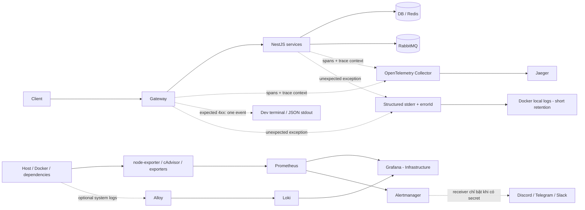

# Kế hoạch tái cấu trúc logging và observability backend

> Trạng thái: **Đã triển khai baseline local/single-host cho 9 service; chưa nghiệm thu production, HA, retention và load test**  
> Ngày lập: 2026-08-24  
> Cập nhật triển khai: 2026-09-04  
> Phạm vi đã rà: `gateway`, `auth`, `user`, `canteen`, `chat`, `todo`, `workschedule`, `payment`, `mail`, root Docker Compose và thư mục `logger`.

## 1. Kết luận và hướng đã triển khai

Baseline trước tái cấu trúc đã trộn ba loại tín hiệu khác mục đích vào cùng một đường `stdout -> Alloy -> Loki -> Grafana`, sau đó dùng log để tính p95 latency, đếm lỗi và dựng request lifecycle. Baseline mới đã tách các tín hiệu theo bảng dưới.

Kiến trúc baseline đã triển khai:

| Nhu cầu                                                                     | Công cụ chịu trách nhiệm                            | Ghi chú                                                                                                                                  |
| --------------------------------------------------------------------------- | --------------------------------------------------- | ---------------------------------------------------------------------------------------------------------------------------------------- |
| Xem một request chậm ở đâu, đi qua service nào                              | **OpenTelemetry -> OTel Collector -> Jaeger**       | Jaeger lưu và hiển thị distributed trace/span; đây là nơi điều tra latency chi tiết.                                                     |
| CPU, RAM, disk, network, container, service health, Redis/RabbitMQ/Postgres | **Exporters -> Prometheus -> Grafana**              | Prometheus thu/lưu metric; Grafana chỉ là giao diện dashboard và alerting, không phải nơi sinh hoặc lưu metric.                          |
| Cảnh báo hạ tầng                                                            | **Prometheus -> Alertmanager -> provider tùy chọn** | Alertmanager group/route/silence/retry; mặc định `noop`, chưa gọi dịch vụ ngoài khi chưa có secret.                                      |
| Lỗi backend bất thường                                                      | **Service structured stderr + OTel/Jaeger**         | Service phát sinh ghi đúng một error event/stack, tạo `errorId`, đồng thời record exception trên active span.                            |
| Error center tập trung                                                      | **Deferred - chưa triển khai**                      | Không dùng Sentry/OpenSearch; Loki hỗ trợ tìm log nhưng không thay exception grouping/ownership của error tracker.                       |
| Application và system/infra log                                             | **stdout/stderr -> Alloy -> Loki -> Grafana**       | Hai `log_scope` tách riêng; ID cardinality cao ở JSON body, không index; latency vẫn lấy từ Prometheus/Jaeger.                            |
| Lỗi client-facing để dev xem terminal                                       | **Gateway structured stdout/stderr**                | Gateway in một dòng cho mỗi `4xx` dự kiến; downstream không log lặp; không gửi lên cloud/error center.                                   |
| Log ngắn hạn tại máy/container                                              | **JSON stdout/stderr + Docker `local` rotation**    | Là đường fallback/diagnostic, tuyệt đối không POST đồng bộ tới một `logger-service`.                                                     |

Điểm cần gọi đúng tên:

- “Log tốc độ” thực chất là **trace/span latency**, đặt ở Jaeger.
- CPU/RAM/container là **metric**, Prometheus thu thập và Grafana hiển thị.
- `4xx` dự kiến là **request rejection**, xem ngay tại terminal Gateway; không phải centralized error event.
- `5xx`/exception bất thường là **error event**, hiện ghi tại service phát sinh và liên kết với Jaeger bằng `errorId`/`trace_id`.
- Grafana là lớp truy vấn/hiển thị. Backend dữ liệu phía sau Grafana mới là Prometheus hoặc Loki.

### Quyết định hiện tại về lỗi bất thường

**Không triển khai Sentry hoặc error center cloud ở giai đoạn hiện tại.** Mỗi unexpected error được service sở hữu lỗi ghi đúng một lần ra structured `stderr`, tạo `errorId` nội bộ, có `trace_id`, `request_id`, service/release và record exception trên active Jaeger span. Docker logging driver giữ fallback ngắn hạn; Alloy/Loki cung cấp tìm kiếm tập trung local với retention 7 ngày.

Giới hạn được chấp nhận trong giai đoạn này:

- chưa có grouping/regression/owner/alert cho exception;
- chưa có exception grouping/issue lifecycle và tìm kiếm xuyên nhiều server;
- log có thể hết retention theo Docker rotation hoặc Loki retention;
- container bị remove/recreate hoặc `docker compose down` có thể làm lịch sử log cũ không còn tra được như một kho lưu trữ bền vững;
- Jaeger sampling phải được cấu hình để trace lỗi quan trọng không bị mất ngoài ý muốn.

Chỉ mở lại quyết định error center khi chuyển sang nhiều host, cần alert/grouping tập trung, retention dài hơn hoặc việc điều tra qua `errorId` + Loki + Jaeger không còn đáp ứng. Khi đó mới đánh giá Sentry/OpenSearch; không cài sẵn SDK/DSN/adapter giả ở vòng này.

Express `logger-service` cũ đã được retire; không biến nó thành hệ thống log production.

## 2. Trạng thái triển khai hiện tại

### 2.1. Hạ tầng đã dựng

- Root Compose chạy 9 service, nối vào network observability và giữ application log bằng Docker logging driver `local`, rotate `10 MB x 3 file` tại [`compose.yaml`](./compose.yaml).
- [`logger/compose.yaml`](./logger/compose.yaml) đã có Jaeger `2.20.0`, OTel Collector, Prometheus, Alertmanager, node-exporter, cAdvisor, blackbox exporter, Redis/PostgreSQL exporters, Loki, Alloy và Grafana.
- RabbitMQ đã bật plugin `rabbitmq_prometheus`; Prometheus scrape dependency, host, container, application metric và readiness của chín service.
- Grafana provision Prometheus làm datasource mặc định, cùng Jaeger, Loki và Alertmanager; có dashboard hạ tầng, container, dependency, service reliability và application logs.
- Alloy chuyển application và system/infra log vào hai Loki scope riêng. Application log không được dùng để tính latency hoặc thay error center.
- Dashboard request lifecycle và rule LogQL p95/4xx/5xx cũ đã bị retire. File rule cũ chỉ còn tombstone để xóa rule đã provision trước đó.
- Compose observability chạy bằng wrapper project riêng `nrapp-observability`; wrapper chặn project trùng và `--remove-orphans` để tránh đụng container backend dùng chung network.
- Prometheus đã nối Alertmanager; cấu hình mặc định dùng receiver `noop`. Repository có receiver kết hợp Discord + Telegram dùng secret files, cùng example riêng cho Discord/Telegram/Slack.
- Baseline Compose có log rotation, resource limit, stop grace, restart policy và healthcheck tương thích; Collector/Loki distroless được kiểm readiness từ smoke script ngoài container.

### 2.2. Code ứng dụng đã rollout

- Cả 9 service dùng private local package [`@nrapp/observability`](./logger/packages/observability) để preload OpenTelemetry, ghi Pino JSON/pretty, sanitize/redact và correlation context.
- Toàn bộ `HttpLoggingInterceptor` cũ đã bị xóa; latency lấy từ trace/span, không lấy từ manual duration access log.
- Gateway có request-outcome boundary cho `4xx`, bao gồm 429 short-circuit, sampling 404 và upstream 5xx summary không lặp stack.
- Payment có HTTP/message/job exception boundary, public-entry rejection policy, PostgreSQL/RabbitMQ/outbox/worker spans và trace headers trong outbox.
- Auth, User, Mail, Payment và Canteen đã inject/extract W3C trace context qua RabbitMQ; Mail giữ context qua retry/DLQ.
- Chat tạo span/context theo từng WebSocket event; Todo và Workschedule dùng HTTP trace thay duration log.
- Unexpected `5xx` trả response an toàn có `errorId`, ghi detailed origin event một lần và record exception trên active span.
- Không có Sentry SDK, DSN, container hoặc noop vendor adapter.

### 2.3. Luồng cũ đã dọn

- Đã xóa Express logger source, `logger/package*.json` và `docker/logger.Dockerfile` khỏi Git.
- `scripts/dev.mjs` khởi động observability stack thay vì HTTP logger tự viết.
- Dashboard request-lifecycle, alert LogQL latency/5xx và interceptor duration cũ đã retire.
- Hướng dẫn cài đặt, cấu hình và vận hành nằm tại [`logger/HUONG_DAN_LUONG_OBSERVABILITY_VA_CAU_HINH.md`](./logger/HUONG_DAN_LUONG_OBSERVABILITY_VA_CAU_HINH.md).

### 2.4. Giới hạn còn lại

- Baseline hiện dành cho local/single-host: Jaeger dùng memory, Loki dùng filesystem single-node; chưa có HA, backup/restore và persistent Jaeger production.
- Chưa chốt retention, disk budget, production sampling, alert owner/contact point, nền tảng deploy và ngưỡng overhead.
- Chưa nghiệm thu end-to-end một request thật Gateway -> downstream -> DB/RabbitMQ trên production-like environment; local runtime đã xác nhận SDK -> Collector -> Jaeger, toàn bộ Prometheus target `UP` và 9/9 readiness probe thành công.
- Shared core đã nằm trong package, nhưng một số thin Nest wrapper/filter/lifecycle vẫn còn ở từng repo và cần gom tiếp nếu muốn loại hoàn toàn drift.
- Root `backend` chưa phải Git repository; thay đổi root Compose/Docker/script không có commit gốc. Chín service và `logger` vẫn là các Git repository riêng.

## 3. Kiến trúc đích



### 3.1. Trace và latency

Luồng chuẩn:

`NestJS/OpenTelemetry SDK -> OTLP -> OpenTelemetry Collector -> Jaeger`

Chỉ dùng **OpenTelemetry SDK/instrumentation**, không cài Jaeger native client. Jaeger v1 đã hết vòng đời; cấu hình mới phải theo Jaeger v2.

Yêu cầu:

- khởi tạo OTel trước khi import/bootstrap Nest application;
- auto-instrument HTTP server/client, Express/Nest, database driver được hỗ trợ;
- thêm manual span cho nghiệp vụ quan trọng, worker, outbox và đoạn chưa được auto-instrument;
- propagate W3C `traceparent`/`tracestate` qua HTTP;
- inject/extract trace context trong RabbitMQ message headers;
- tạo context theo từng WebSocket event, không dùng một context chung suốt vòng đời socket;
- span name dùng route template có cardinality thấp, ví dụ `GET /users/:id`, không dùng URL thật chứa ID/query;
- đánh dấu span lỗi và record exception tại nơi lỗi thoát khỏi span;
- gắn `service.name`, `service.version`, `deployment.environment`, `service.instance.id`.

Jaeger là nơi xem waterfall/critical path của từng request. Không tiếp tục tính p95 bằng `durationMs` parse từ log.

Alert SLO/p95 dùng aggregate metric từ OTel/Prometheus, không parse log và không thay Jaeger. Grafana đã provision dashboard `Service reliability`; alert baseline hiện có ngưỡng 5xx ratio và p95 kèm điều kiện lưu lượng tối thiểu.

Sampling dự kiến:

- local/staging: 100% để kiểm tra luồng;
- production: parent-based ratio theo lưu lượng và ngân sách;
- nếu cần luôn giữ trace lỗi/trace rất chậm: tail sampling tại OTel Collector sau khi sizing memory, không tự viết logic sampling trong từng service.

Jaeger production không dùng in-memory storage. Backend persistent, retention và capacity sẽ được chốt theo lưu lượng; deployment lớn ưu tiên OpenSearch. OTel Collector phải có batch, memory limiter, retry/queue hữu hạn và self-monitoring.

### 3.2. Hạ tầng, container và service health

Luồng chuẩn:

`exporters -> Prometheus -> Grafana`

Thành phần dự kiến:

- `node-exporter`: CPU, RAM, load, disk, filesystem, network của server Linux;
- `cAdvisor`: CPU/RAM/network/filesystem/OOM của container;
- Prometheus scrape health của chính Prometheus, exporters, OTel Collector và Jaeger;
- blackbox probing hoặc scrape health endpoint để biết service có reachable/ready;
- RabbitMQ metrics/plugin, Redis exporter, PostgreSQL exporter;
- MongoDB exporter chỉ thêm khi đã chốt cách deploy và quyền truy cập MongoDB ngoài Compose.

Dashboard Grafana dự kiến:

1. **Host overview**: CPU, RAM, swap, load, disk usage/inode/I/O, network.
2. **Container overview**: CPU, working set memory, throttling, network, restart/OOM, filesystem.
3. **Service availability**: up/readiness, restart count, uptime.
4. **Dependencies**: RabbitMQ queue/consumer/unacked, Redis memory/connections, PostgreSQL connections/locks/disk.
5. **Observability health**: scrape failures, collector dropped spans, Prometheus/Loki disk và Jaeger ingestion.

Alert tối thiểu:

- host CPU/RAM/disk/inode vượt ngưỡng đủ lâu;
- container OOM/restart loop/throttling;
- service readiness fail hoặc Prometheus target down;
- RabbitMQ queue/unacked tăng bất thường, thiếu consumer;
- PostgreSQL connection saturation/disk/replication nếu có;
- collector/exporter/backend telemetry ngừng nhận dữ liệu.

Không gọi webhook Discord/Telegram trực tiếp từ business code. Alert hạ tầng thuộc Grafana Alerting/Alertmanager; alert exception tập trung được deferred cùng error center.

### 3.3. Request rejection ở Gateway và local error flow

Gateway stdout/stderr là nơi dev xem ngay các lỗi client-facing dự kiến. Unexpected error được ghi tại service phát sinh và liên kết sang Jaeger; **chưa có error center tập trung** ở giai đoạn này.

Phân loại đề xuất:

| Nhóm                                        | Terminal/stdout policy                                                                                             | Lưu/quan sát hiện tại                                                        |
| ------------------------------------------- | ------------------------------------------------------------------------------------------------------------------ | ---------------------------------------------------------------------------- |
| Validation `400/422`                        | Gateway log `info`, có error code và **tên field sai**, không có giá trị đầu vào                                   | Docker log ngắn hạn; không gửi cloud/error center                            |
| Auth `401`                                  | Gateway log `info`; không log token/cookie; brute-force được tổng hợp thành security metric/rule                   | Docker log ngắn hạn; không tạo centralized issue                             |
| Forbidden `403`                             | Gateway log `warn` hoặc `info` theo error code                                                                     | Docker log ngắn hạn                                                          |
| Not found `404`                             | Gateway log `debug/info`, production có thể sample để tránh bot/scan tạo noise                                     | Docker log ngắn hạn                                                          |
| Conflict/domain `409`                       | Gateway log `info`                                                                                                 | Docker log ngắn hạn                                                          |
| Rate limit `429`                            | Gateway log `warn` và tăng metric; rate-limit middleware phải đi qua cùng terminal logging contract                | Docker log ngắn hạn + Prometheus aggregate metric                            |
| Unexpected `5xx`                            | Service phát sinh in structured error/stack; Gateway chỉ in summary có `originService/errorId`, không in lại stack | Docker log ngắn hạn + exception trên active Jaeger span                      |
| Dependency timeout/network/protocol error   | Boundary sở hữu lỗi in event đã sanitize                                                                           | Structured error có `dependency.name`/operation + Jaeger span                |
| RabbitMQ consumer/worker/outbox failure     | Message/job boundary in event có retry count                                                                       | Ghi khi non-retryable hoặc hết retry/DLQ; không ghi error mỗi lần retry      |
| Process bootstrap/unhandled rejection/fatal | In `fatal`, flush stdout/stderr có timeout ngắn rồi để process manager restart                                     | Docker log ngắn hạn; centralized fatal alert được deferred cùng error center |

#### Quy tắc terminal tại Gateway

- Gateway là public HTTP boundary nên ghi đúng **một terminal event** cho mỗi response `4xx` client-facing.
- Service downstream không log lặp lại expected business `4xx`; trace/span vẫn giữ status để điều tra khi cần.
- Entry point không đi qua Gateway, ví dụ payment webhook hoặc internal callback công khai riêng, áp dụng cùng policy ngay tại service đó.
- Development dùng pretty single-line output để đọc nhanh; production vẫn là JSON stdout/stderr để máy xử lý, có level/sampling theo bảng trên.
- Health/readiness và success access log mặc định không in hoặc được sample; không để healthcheck che mất lỗi thật.
- Chỉ log route template như `/users/:id`, không log raw URL/query, request body hoặc field value.

Ví dụ terminal development:

```text
[gateway] INFO 422 POST /auth/register VALIDATION_ERROR fields=email requestId=req-123
```

Event JSON tương ứng:

```json
{
  "severity": "INFO",
  "service.name": "gateway",
  "event.name": "http.request.rejected",
  "http.request.method": "POST",
  "http.route": "/auth/register",
  "http.response.status_code": 422,
  "error.code": "VALIDATION_ERROR",
  "validation.fields": ["email"],
  "request_id": "req-123",
  "trace_id": "..."
}
```

Quy tắc **log/record một lần**:

- expected `4xx`: Gateway terminal event là record duy nhất ở HTTP boundary, không có cloud event và không có downstream error log trùng;
- service phát sinh lỗi là owner của exception/stack gốc;
- gateway không ghi lại stack của upstream error đã có `errorId`; gateway chỉ ghi summary hoặc ghi lỗi transport/protocol do chính gateway sở hữu;
- consumer chỉ ghi error sau khi policy retry quyết định failure có ý nghĩa, gắn retry count thay vì tạo message khác nhau;
- một lỗi có thể xuất hiện trong structured Docker log và Jaeger span, nhưng dùng cùng `errorId`, `trace_id`, `request_id` để correlation;
- không có network call tới error backend trong request/message processing path.

Response validation/domain `4xx` đích:

```json
{
  "statusCode": 422,
  "code": "VALIDATION_ERROR",
  "message": "Dữ liệu không hợp lệ",
  "details": {
    "fields": ["email"]
  },
  "requestId": "..."
}
```

Response unexpected `5xx` đích:

```json
{
  "statusCode": 500,
  "code": "INTERNAL_ERROR",
  "message": "Internal server error",
  "requestId": "...",
  "errorId": "..."
}
```

- Không trả stack, DB error, URL nội bộ hoặc message kỹ thuật cho client.
- Validation có thể trả/log tên field để dev sửa nhanh, nhưng không trả/log giá trị nhạy cảm do client gửi.
- `requestId` vẫn được giữ để hỗ trợ người dùng và tương thích hiện tại.
- `trace_id` là correlation chuẩn giữa các service; không dùng `requestId` thay cho trace context.
- `errorId` là UUID do boundary phát sinh để tra cùng error trong terminal/Docker log và Jaeger; chỉ trả cho unexpected error.

### 3.4. Structured application log

Ứng dụng vẫn cần JSON stdout/stderr cho local debug, audit vận hành và fallback. Đề xuất dùng một logger adapter thống nhất dựa trên Pino/Nest logger integration, không để từng service tự `JSON.stringify` rồi NestJS bọc thêm prefix.

Không chọn OpenTelemetry JavaScript Logs SDK làm logger chính ở vòng đầu vì phần logs của OTel JS hiện chưa ổn định bằng traces/metrics. Pino xuất newline-delimited JSON ra stdout; collector chỉ vận chuyển/enrich, không làm business code phụ thuộc log backend.

Schema tối thiểu, bám semantic convention OpenTelemetry:

```json
{
  "timestamp": "2026-08-24T10:00:00.000Z",
  "severity": "ERROR",
  "service.name": "payment",
  "service.version": "git-sha-or-release",
  "deployment.environment": "production",
  "event.name": "payment.create.failed",
  "message": "Payment creation failed",
  "trace_id": "...",
  "span_id": "...",
  "request_id": "...",
  "error.id": "...",
  "error.code": "PAYMENT_PROVIDER_TIMEOUT",
  "exception.type": "TimeoutError",
  "exception.message": "sanitized message",
  "exception.stacktrace": "server-side only"
}
```

Quy tắc schema:

- field platform dùng tên cố định; business context đặt dưới namespace có kiểm soát;
- log route template, không log raw URL/query có dữ liệu người dùng;
- `trace_id`, `span_id`, `request_id`, `error.id`, `user.id` là high cardinality: không dùng làm Prometheus label; với Loki dùng structured metadata, không index label;
- không log toàn bộ request/response body, headers hoặc object lỗi chưa sanitize;
- logger phải hỗ trợ redaction ở config trung tâm và child context theo request/message;
- expected `4xx` client-facing tuân theo Gateway terminal policy: một structured event, không duplicate downstream và không gửi cloud/error center;
- success access log mặc định tắt hoặc sample; latency đã do trace/metric đảm nhận.

Dữ liệu cấm ghi trực tiếp:

- password, OTP, JWT/access/refresh token, cookie, authorization header;
- API key, secret ký nội bộ, DSN có credential, DB connection string;
- email/số điện thoại/PII không cần thiết;
- thông tin thẻ/tài khoản thanh toán, raw webhook payload nhạy cảm;
- upload content, chat content, request/response body đầy đủ.

Audit log cho thay đổi role, thanh toán, xóa tài khoản hoặc thao tác quản trị là một luồng bất biến có retention/quyền riêng; không trộn audit log với operational error hay access log. Audit pipeline nằm ngoài phạm vi triển khai vòng đầu nhưng schema phải chừa `event.category=audit`.

## 4. Clean architecture trong code

### 4.1. Ranh giới dependency

Business/domain code không import Jaeger, OTel exporter, Loki, Grafana hoặc bất kỳ error vendor nào.

Các abstraction ở application/platform boundary:

```text
AppLogger
  debug/info/warn/error(eventName, context, error?)

TelemetryContext
  traceId/spanId/requestId/currentLogger

ExceptionClassifier
  classify(error): expected/httpStatus/code/safeMessage/retryable/logLevel
```

Adapter hạ tầng:

```text
PinoLoggerAdapter
OpenTelemetryContextAdapter
```

Cross-cutting entry points:

- `ObservabilityModule`: cấu hình logger, tracing và context;
- global exception filter: map lỗi -> HTTP response, tạo local `errorId`, log unexpected error đúng một lần và record exception trên active span;
- Gateway request-outcome boundary được đăng ký trước rate limiter, quan sát response `finish` và emit đúng một `4xx` terminal event kể cả request bị middleware short-circuit;
- error mapper chỉ đưa `error.code` và danh sách tên field đã sanitize vào outcome context; boundary logger không đọc raw response/request body;
- HTTP tracing do OTel instrumentation đảm nhiệm; bỏ request-lifecycle logging interceptor sau khi parity đạt;
- RabbitMQ/WebSocket/worker wrappers: extract context và đặt boundary ghi lỗi;
- graceful shutdown: flush stdout/telemetry có timeout, không treo process.

Domain/application dùng typed error có `code`, `safeMessage`, `httpStatus`, `expected` và `retryable`; khi adapter cần đổi loại lỗi phải giữ original `cause`. Application code không log rồi rethrow cùng một lỗi. Boundary classifier là nơi duy nhất quyết định response, severity, có ghi stack và record exception hay không.

Collector/Jaeger/Prometheus failure phải **fail-open**: telemetry backend hỏng không được làm API business thất bại. Structured log đi thẳng stdout/stderr; không gửi log/error qua một HTTP call đồng bộ trong request path. Chưa tạo `ErrorReporter`/Noop adapter ở vòng này; chỉ bổ sung port/vendor adapter khi quyết định error center được mở lại.

### 4.2. Shared package thay vì copy file

Workspace hiện là 9 Git repository lồng nhau, root không phải một monorepo Git thống nhất. Vòng hiện tại dùng private local package `@nrapp/observability` qua `file:../logger/packages/observability`. Package nằm trong Git repo `logger`; Docker build copy package sibling vào build context.

Contract/schema, Pino/OTel adapters và test nằm trong package; mapping domain error đặc thù vẫn ở từng service. Việc publish package lên private registry, version pin và rollout độc lập là hướng dài hạn chưa thực hiện. Không quay lại cách copy toàn bộ implementation sang từng repo.

### 4.3. Context propagation và request-id

- vẫn nhận/trả `x-request-id` để tương thích;
- mặc định gateway tạo canonical `x-request-id` tại edge; nếu phải giữ ID do client gửi thì validate và lưu riêng dưới `x-client-request-id`, tránh client cố tình collision/spoof correlation;
- các service downstream giữ canonical ID từ trusted gateway; webhook/public entry tự tạo ID mới;
- OTel tự quản lý W3C trace context qua HTTP;
- dùng AsyncLocalStorage/active OTel context để lấy correlation trong logger;
- dần bỏ `requestId` khỏi chữ ký business method khi nó chỉ phục vụ logging;
- với RabbitMQ, copy `traceparent`, `tracestate`, `x-request-id` vào message headers;
- với scheduled/background job không có inbound context, tạo root span/request correlation mới.

## 5. Kế hoạch theo service

| Service        | Việc đặc thù                                                                                                                 | Mức ưu tiên |
| -------------- | ---------------------------------------------------------------------------------------------------------------------------- | ----------- |
| `gateway`      | Root/edge span, một terminal event cho mọi client-facing `4xx` kể cả 429, outbound propagation, không duplicate upstream 5xx | P0          |
| `payment`      | Bổ sung exception boundary còn thiếu; trace PostgreSQL, RabbitMQ, outbox, expiry worker, webhook; redaction payment          | P0          |
| `auth`         | Trace Redis/RabbitMQ/outbound user call; không log credential/token/OTP; security event policy                               | P1          |
| `user`         | HTTP + RabbitMQ consumer propagation; sanitize PII                                                                           | P1          |
| `canteen`      | Redis/RabbitMQ/payment consumer và settlement spans; tránh duplicate lỗi thanh toán                                          | P1          |
| `mail`         | Consumer/job boundary; không log OTP, recipient hoặc mail body không cần thiết                                               | P1          |
| `chat`         | Context riêng cho từng WebSocket event; outbound user call; không log message/upload content                                 | P1          |
| `todo`         | Outbound user call; thay duration log bằng trace                                                                             | P2          |
| `workschedule` | Outbound user call; loại `console.error`; thay duration log bằng trace                                                       | P2          |

Pilot `gateway + payment`, sau đó Canteen consumer và rollout 7 service còn lại đã hoàn thành ở mức code/build/unit-contract test. Nghiệm thu runtime xuyên đầy đủ HTTP -> DB -> RabbitMQ vẫn là ticket còn lại trước production.

## 6. Các giai đoạn triển khai

### Giai đoạn 0 - Chốt quyết định kiến trúc

- [x] Error center tập trung deferred; không dùng Sentry/OpenSearch/application-log cloud trong vòng hiện tại.
- [x] Expected 4xx chỉ theo Gateway terminal policy; unexpected 5xx dùng structured stderr + local `errorId` + Jaeger span.
- [x] Chốt vòng hiện tại dùng local file package; private registry/version pin để lại cho giai đoạn sau.
- [ ] Chốt môi trường deploy production: một Docker host, nhiều host hay Kubernetes.
- [ ] Chốt Docker log rotation/retention đủ dùng cho một host và dung lượng disk dành cho log.
- [ ] Chốt retention, traffic, ngân sách trace/metric và yêu cầu HA/backup.
- [ ] Alertmanager plumbing và ba example provider đã có; còn chốt provider, owner/on-call và quyền truy cập theo team. Alert exception tập trung vẫn deferred.

Các quyết định production còn mở không chặn baseline local, nhưng phải được chốt trước khi gọi cấu hình hiện tại là production-ready.

### Giai đoạn 1 - Contract và baseline an toàn

- [ ] Viết ADR phân tách traces/metrics/errors/system logs.
- [x] Định nghĩa `AppLogger`, `TelemetryContext`, `ExceptionClassifier` và log schema.
- [x] Định nghĩa error taxonomy/code và response envelope chung.
- [x] Quy định local `errorId` UUID và correlation bằng `errorId`/`trace_id`/`request_id` giữa response, Docker log và Jaeger.
- [x] Chốt Gateway terminal level/sampling policy cho `400/401/403/404/409/422/429`.
- [x] Định nghĩa outcome context chỉ chứa error code/tên field đã sanitize, không chứa raw payload.
- [x] Viết redaction policy + test payload nhạy cảm.
- [x] Tạo shared package cùng Pino/OTel adapters và test doubles cần thiết; không tạo error-vendor adapter.
- [ ] **Một phần:** `service.name`/environment/version đã có; release pipeline và `service.instance.id` production chưa chốt.
- [ ] **Một phần:** env contract đã đồng bộ biến chính và không có `SENTRY_*`; `OTEL_RESOURCE_ATTRIBUTES`/instance/release production còn pending.

### Giai đoạn 2 - Pilot tracing với Gateway và Payment

- [x] Thêm OTel bootstrap chạy trước NestJS.
- [x] Dựng OTel Collector và Jaeger profile local/dev.
- [x] Instrument Gateway -> Payment -> PostgreSQL/RabbitMQ/outbox ở mức code và contract test.
- [ ] **Một phần:** đã propagate HTTP/RabbitMQ context tới Canteen trong code/spec; runtime acceptance một trace xuyên toàn flow còn pending.
- [x] Record error/timeout đúng span, không lộ payload.
- [ ] Đo overhead và chốt sampling production.

### Giai đoạn 3 - Pilot Gateway rejection và local error flow

- [x] Cài Gateway request-outcome boundary để in đúng một structured terminal event cho client-facing `4xx`, kể cả 429 short-circuit.
- [x] Bổ sung global exception/message/job boundaries cho Payment.
- [x] Chuẩn hóa Gateway không ghi trùng upstream error/stack.
- [x] Unexpected error tạo local `errorId`, structured stderr có release/environment/service/`trace_id`/`request_id`, đồng thời record exception trên span.
- [x] Cấu hình Pino redaction, level/noise filter, pretty development output và JSON production output.
- [x] Contract test đã phủ `400/401/403/404/409/422/429` và upstream unexpected error.
- [ ] Runtime acceptance đủ status và xác nhận không duplicate downstream còn pending.

### Giai đoạn 4 - Metrics hạ tầng và Grafana

- [x] Dựng Prometheus, node-exporter, cAdvisor và exporters dependency cần thiết.
- [x] Provision Prometheus datasource; không để Loki là datasource mặc định cho latency.
- [x] Có dashboard/alert baseline hạ tầng, dependency, readiness/blackbox, restart/OOM/throttling và service reliability.
- [x] Thêm baseline healthcheck/readiness, restart policy, resource limit, stop grace và log rotation cho observability containers.
- [x] Thêm Alertmanager với receiver mặc định `noop`, datasource Grafana và example Discord/Telegram/Slack không commit secret.
- [x] Kiểm tra Grafana chỉ hiển thị phạm vi đã duyệt.

### Giai đoạn 5 - Rollout 7 service còn lại

- [x] Rollout theo nhóm `auth/user/canteen/mail`, sau đó `chat`, rồi `todo/workschedule`.
- [x] Bổ sung RabbitMQ/WebSocket/background context theo từng service.
- [ ] **Một phần:** core Pino/classifier/context đã shared; thin Nest wrapper/filter/lifecycle vẫn còn ở từng repo.
- [ ] **Một phần:** global filter không log expected `4xx`; cần audit tiếp các warning nghiệp vụ downstream khi có route mới.
- [ ] Loại manual `requestId` khỏi business signatures nơi an toàn.
- [ ] **Một phần:** build, unit và contract test đã chạy; integration/load test production-like chưa hoàn tất.

### Giai đoạn 6 - Dọn luồng cũ

Chỉ thực hiện sau khi parity và rollback window đã đạt:

- [x] Xóa `logger/src/index.js`, `logger/package*.json`, `docker/logger.Dockerfile` khỏi Git.
- [x] Bỏ Express `logger` khỏi `scripts/dev.mjs` và `LOGGER_HOST_PORT` khỏi env example.
- [x] Xóa/đổi dashboard `Backend request lifecycle` và alert LogQL p95/5xx cũ.
- [x] Bỏ `HttpLoggingInterceptor` ghi duration/access log sau khi trace/metric và Gateway request-outcome boundary thay thế.
- [ ] **Một phần:** Loki đã tách application và system/infra scope; storage/auth/HA hardening còn pending.
- [ ] Đổi tên thư mục `logger` thành `observability` để đúng trách nhiệm.

## 7. Production hardening

> Phần HA/sizing/backup/owner vẫn là production backlog. Compose đã có baseline resource limit, log rotation, stop grace, restart policy và health/readiness check; Jaeger vẫn dùng memory, Loki vẫn filesystem và receiver Alertmanager mặc định vẫn là `noop` cho tới khi secret ngoài Git được cấu hình.

- UI và ingestion endpoint chỉ ở private network/VPN/reverse proxy TLS; không expose thẳng ra Internet.
- Secret dùng secret manager/Compose secrets/Kubernetes secrets; không commit token/webhook.
- Pino redaction/sanitization chạy tại source trước khi dữ liệu đi ra stdout/stderr hoặc span attributes.
- Docker `local` log rotation có giới hạn size/file, disk alert và retention đủ cho thời gian điều tra dự kiến; ghi rõ việc log cũ sẽ bị xoay vòng.
- Prometheus/Jaeger/Loki retention và quota có sizing, backup, restore test và disk alert.
- Production Jaeger có persistent backend; in-memory chỉ dùng local/dev.
- Loki single-node filesystem hiện tại không được coi là HA production.
- Hạn chế quyền đọc Docker socket; cân nhắc socket proxy/agent hardening. Mount read-only vẫn cho phép đọc nhiều Docker metadata nhạy cảm.
- Pin image/package version đã kiểm thử; có lịch upgrade và CVE review.
- Collector/exporter có health/readiness check phù hợp, restart policy, resource limit và telemetry nội bộ; image distroless dùng external smoke probe.
- Queue/buffer telemetry hữu hạn; khi backend lỗi phải drop có metric, không làm đầy RAM/disk vô hạn.
- Có runbook: host down, service down, API 5xx, slow trace, queue backlog, telemetry pipeline down.
- Runbook ghi rõ giới hạn chưa có centralized error history/alert; khi MTTR hoặc số host vượt ngưỡng đã chốt phải mở lại quyết định error center.

## 8. Kiểm thử và tiêu chí hoàn thành

### Functional/correlation

- [ ] Một request qua Gateway -> service -> DB có cùng `trace_id` và đúng parent/child spans trong Jaeger.
- [x] HTTP, RabbitMQ, WebSocket và background job có unit/contract test context propagation phù hợp.
- [x] Canonical `x-request-id` do edge tạo; client ID được tách thành `x-client-request-id` và ID không hợp lệ bị loại an toàn ở contract test.
- [x] Contract test xác nhận mỗi expected `400/401/403/404/409/422/429` tạo đúng một Gateway terminal event theo level policy.
- [ ] Runtime acceptance còn phải xác nhận expected `4xx` không tạo downstream error log hoặc cloud event.
- [x] Validation terminal event chỉ có tên field sai, không có field value/raw payload trong contract test.
- [x] Unexpected 500 tạo safe envelope + detailed origin event/`errorId`; Gateway upstream summary có contract test. End-to-end runtime vẫn pending.
- [ ] Dùng `errorId` tìm được origin event trong Docker log và dùng `trace_id` tìm được exception span trong Jaeger.
- [x] Payment webhook/public entry có configurable rejection/error ownership boundary và unit test.

### Security/privacy

- [x] Shared package test khẳng định password/token/OTP/cookie/secret/PII và validation field value được redact/sanitize trước khi log.
- [ ] Không dùng raw path/user ID/email/request ID làm Prometheus label hoặc Loki indexed label.
- [x] Stack trace chỉ ở server-side structured error/Jaeger exception data, không trả client trong exception contract.

### Reliability/performance

- [ ] Collector/Jaeger/Prometheus unavailable không làm API fail hoặc tăng timeout đáng kể; local structured log vẫn được ghi.
- [ ] Load test đo CPU, memory và p95 trước/sau; ngưỡng overhead được chốt trước rollout production.
- [ ] Sampling/queue hoạt động dưới burst; có metric cho dropped spans/events.
- [ ] Kill/restart container phản ánh đúng trên Grafana và phát alert theo thời gian quy định.
- [ ] `docker compose logs` vẫn tra được `errorId` trong cửa sổ retention đã chốt sau container restart thông thường.
- [ ] Backup/restore backend persistent được diễn tập.

### Definition of Done

- [x] Không còn dùng log-derived `durationMs` làm nguồn latency chính trong code đã rollout.
- [ ] Jaeger hiển thị distributed trace xuyên các boundary chính trên production-like runtime; smoke SDK -> Collector -> Jaeger đã đạt.
- [x] Grafana có dashboard host/container/dependency/service reliability/application log và alert baseline.
- [ ] Expected `4xx` policy và contract test đủ status đã đạt; runtime acceptance không duplicate downstream còn pending.
- [ ] Unexpected error contract đã có; cần nghiệm thu Docker log -> `errorId` -> Gateway summary -> Jaeger span trên runtime thật.
- [x] Error center tập trung được ghi rõ là deferred; không có Sentry SDK/DSN/container/Noop adapter trong phạm vi hiện tại.
- [x] 9 service dùng cùng shared core contract/schema; business code không import backend observability vendor.
- [x] Express logger và request-duration interceptor cũ đã retire.
- [ ] Thin wrapper common còn copy; tiếp tục gom nếu cần loại drift hoàn toàn.
- [x] Đã có tài liệu cài đặt/vận hành baseline.
- [ ] Alert ownership, production retention, HA/backup và runbook có owner còn pending.

## 9. Các quyết định bạn cần chỉnh/chốt trong bản này

Hướng đã chốt trong lần điều chỉnh này:

- expected `4xx` được Gateway in một structured terminal event để dev xem nhanh, không gửi cloud và không log lặp ở downstream;
- unexpected error được origin service ghi structured stderr đúng một lần, tạo local `errorId` và record exception trên Jaeger span;
- error center tập trung deferred; không triển khai Sentry/OpenSearch/application error cloud ở vòng hiện tại.

| ID  | Quyết định                 | Hướng hiện tại                                                                                                   |
| --- | -------------------------- | ---------------------------------------------------------------------------------------------------------------- |
| D1  | Error center               | **Deferred - đã chốt**; không Sentry/SDK/DSN/container/error-vendor Noop adapter                                 |
| D2  | Unexpected error flow      | **Đã chốt**; origin structured stderr + local `errorId` + Jaeger exception span                                  |
| D3  | Vai trò Loki               | **Đã triển khai**; application và system/infra tách scope, không tính latency                                    |
| D4  | Grafana scope              | **Đã triển khai**; hạ tầng/dependency/container, service RED/reliability và application logs                     |
| D5  | Trace backend production   | Local dùng Jaeger 2.20 memory; persistent production backend còn pending                                         |
| D6  | Shared code                | Local file package `@nrapp/observability`; chưa publish private registry/version pin                             |
| D7  | Rollout pilot              | Code/build/unit-contract rollout đủ 9 service; runtime acceptance còn pending                                    |
| D8  | Docker error-log retention | Chưa chốt; phải sizing theo traffic/disk/MTTR, không mặc định coi `10m x 3` là đủ prod                           |
| D9  | Production platform        | Chưa chốt Docker single-host/multi-host/Kubernetes                                                               |
| D10 | Alert delivery             | Alertmanager đã dựng, mặc định `noop`; Discord/Telegram/Slack có example, provider và owner production chưa chốt |

Các ticket còn lại tập trung vào nghiệm thu runtime, load test và production hardening. Hướng dẫn chạy/cấu hình thực tế nằm tại [`logger/HUONG_DAN_LUONG_OBSERVABILITY_VA_CAU_HINH.md`](./logger/HUONG_DAN_LUONG_OBSERVABILITY_VA_CAU_HINH.md).

## 10. Tài liệu chuẩn tham chiếu

- [OpenTelemetry signals: traces, metrics và logs](https://opentelemetry.io/docs/concepts/signals/)
- [OpenTelemetry JavaScript instrumentation](https://opentelemetry.io/docs/languages/js/instrumentation/)
- [OpenTelemetry JavaScript context propagation](https://opentelemetry.io/docs/languages/js/propagation/)
- [OpenTelemetry log data model và trace/span correlation](https://opentelemetry.io/docs/specs/otel/logs/data-model/)
- [OpenTelemetry HTTP span semantic conventions](https://opentelemetry.io/docs/specs/semconv/http/http-spans/)
- [Jaeger architecture và OTLP/OTel Collector](https://www.jaegertracing.io/docs/2.20/architecture/)
- [Jaeger production storage backends](https://www.jaegertracing.io/docs/2.20/storage/)
- [Jaeger SDK migration: dùng OpenTelemetry thay native clients](https://www.jaegertracing.io/sdk-migration/)
- [Jaeger downloads và trạng thái Jaeger v1/v2](https://www.jaegertracing.io/download/)
- [Prometheus node-exporter guide](https://prometheus.io/docs/guides/node-exporter/)
- [Prometheus cAdvisor/container guide](https://prometheus.io/docs/guides/cadvisor/)
- [Prometheus metric/label naming và cardinality](https://prometheus.io/docs/practices/naming/)
- [Alertmanager configuration và integrations](https://prometheus.io/docs/alerting/latest/configuration/)
- [Grafana data sources và vai trò của Prometheus/Loki/Jaeger](https://grafana.com/docs/grafana/latest/datasources/)
- [Grafana Loki label/structured metadata](https://grafana.com/docs/loki/latest/get-started/labels/structured-metadata/)
- [OWASP Logging Cheat Sheet](https://cheatsheetseries.owasp.org/cheatsheets/Logging_Cheat_Sheet.html)
