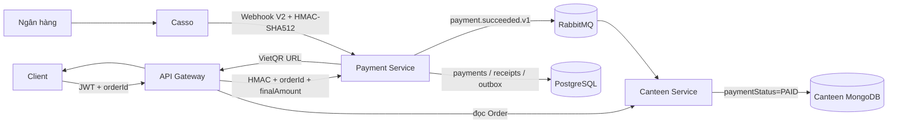
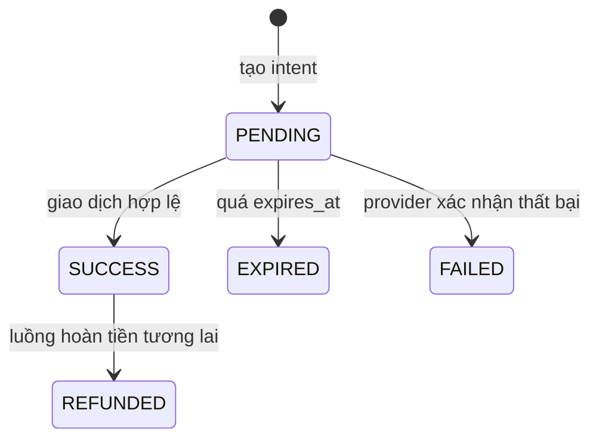
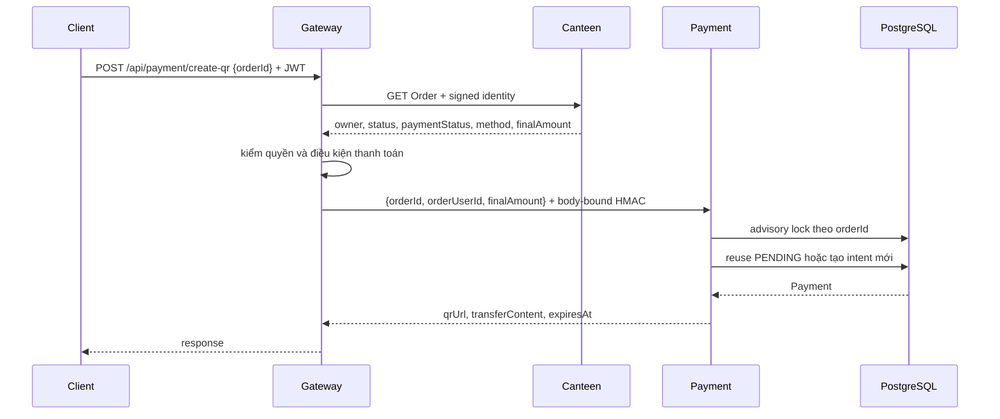

# Payment Service — hướng dẫn kỹ thuật và vận hành

Tài liệu này là nguồn tham chiếu đầy đủ cho Payment Service của NRApp: lý do
thiết kế, cấu trúc code, hợp đồng API, PostgreSQL, VietQR, Casso Webhook V2,
RabbitMQ, tích hợp Canteen/Gateway, kiểm thử, triển khai và xử lý sự cố.

## 1. Phạm vi nghiệp vụ

Payment Service xử lý **thanh toán đơn hàng Canteen**, không phải nạp tiền vào
ví game.

Luồng chuẩn:

1. Người dùng tạo Order có `paymentMethod=VIETQR` ở Canteen.
2. Client chỉ gửi `orderId` cho Gateway.
3. Gateway lấy `finalAmount` chính thức từ Canteen.
4. Payment tạo intent `PENDING` trong PostgreSQL và trả VietQR.
5. Casso gửi giao dịch ngân hàng tới webhook.
6. Payment xác minh chữ ký, tài khoản, số tiền và mã payment.
7. Payment chuyển intent sang `SUCCESS` và ghi outbox trong cùng transaction.
8. Outbox phát `payment.succeeded.v1` qua RabbitMQ.
9. Canteen cập nhật `paymentStatus=PAID` nhưng giữ nguyên vòng đời món ăn.

Payment không dùng MongoDB và không dùng Redis. PostgreSQL là nguồn dữ liệu duy
nhất cho payment, receipt và outbox.

## 2. Các bất biến bắt buộc

Những quy tắc dưới đây không được phá vỡ khi sửa code:

- Client không được quyết định số tiền. `finalAmount` phải đến từ Canteen.
- Tiền VND là số nguyên dương, không dùng `float`.
- Một Order chỉ có tối đa một payment `PENDING` và một payment `SUCCESS`.
- Một giao dịch Casso chỉ được xử lý một lần trong toàn bộ vòng đời dữ liệu.
- Cập nhật `SUCCESS` và tạo outbox phải nằm trong cùng transaction PostgreSQL.
- Webhook sai số tiền, sai tài khoản, hết hạn hoặc sai trạng thái không được phát
  event thành công.
- Thanh toán thành công chỉ đổi `Order.paymentStatus`; không được đổi
  `Order.status` thành `PAID`.
- Bàn chỉ được giải phóng khi Order đã `COMPLETED` và payment đã `PAID`.
- Secret, chữ ký, số tài khoản thật và raw webhook không được ghi vào log.

## 3. Kiến trúc tổng thể



Trách nhiệm được tách như sau:

| Thành phần | Trách nhiệm                                                           |
| ---------- | --------------------------------------------------------------------- |
| Client     | Chọn Order, hiển thị QR, polling trạng thái                           |
| Gateway    | Xác thực JWT, lấy Order chính thức, kiểm tra quyền, ký request nội bộ |
| Canteen    | Sở hữu Order, `finalAmount`, trạng thái phục vụ và bàn                |
| Payment    | Sở hữu intent, xác minh giao dịch, idempotency và outbox              |
| Casso      | Gửi giao dịch ngân hàng đã quan sát qua webhook                       |
| RabbitMQ   | Truyền event Payment sang Canteen                                     |
| PostgreSQL | Bảo đảm constraint, khóa hàng, receipt và atomic outbox               |

## 4. Bố cục source code

```text
backend/payment/
├── scripts/
│   └── payment-smoke.mjs
├── src/
│   ├── common/
│   │   ├── guards/gateway-auth.guard.ts
│   │   ├── middleware/request-id.middleware.ts
│   │   └── security/
│   │       ├── gateway-signature.service.ts
│   │       └── payment-request-context.ts
│   ├── core/core.module.ts
│   ├── modules/
│   │   ├── database/
│   │   │   ├── entities/
│   │   │   ├── migrations/
│   │   │   ├── data-source.ts
│   │   │   └── database.options.ts
│   │   ├── outbox/
│   │   │   └── outbox.publisher.ts
│   │   ├── payment/
│   │   │   ├── casso-signature.service.ts
│   │   │   ├── casso-webhook.controller.ts
│   │   │   ├── payment.controller.ts
│   │   │   ├── payment-expiry.worker.ts
│   │   │   ├── payment.repository.ts
│   │   │   ├── payment.service.ts
│   │   │   └── vietqr.service.ts
│   │   └── rabbitmq/rabbitmq.service.ts
│   ├── app.controller.ts
│   ├── app.module.ts
│   └── main.ts
├── .env.example
├── package.json
└── README.md
```

### Vai trò từng lớp

- Controller chỉ nhận HTTP, gọi service và định hình response.
- DTO kiểm tra dữ liệu đầu vào bằng `class-validator`.
- Service điều phối nghiệp vụ, parse Casso và kiểm tra quyền đọc.
- Repository chứa transaction, khóa PostgreSQL và các thao tác bền vững.
- Entity mô tả mapping TypeORM; migration mới là nguồn tạo schema thật.
- Worker expiry dọn intent quá hạn.
- Outbox publisher phát event sau khi transaction đã commit.

Không bật `synchronize`; thay đổi schema luôn phải có migration.

## 5. Mô hình PostgreSQL

### 5.1 Bảng `payments`

Các cột chính:

| Cột                       | Ý nghĩa                                                                      |
| ------------------------- | ---------------------------------------------------------------------------- |
| `id`                      | UUID nội bộ của payment                                                      |
| `order_id`                | Mongo ObjectId của Order, lưu dạng chuỗi, không tạo foreign key chéo service |
| `user_id`                 | Chủ Order tại thời điểm tạo intent                                           |
| `payment_code`            | Mã opaque nhúng vào nội dung chuyển khoản                                    |
| `amount`                  | Số nguyên VND dạng `bigint`                                                  |
| `status`                  | Trạng thái payment                                                           |
| `payment_method`          | Hiện tại là `VIETQR`                                                         |
| `provider`                | Hiện tại là `CASSO`                                                          |
| `destination_account`     | Tài khoản đích đã dùng để tạo QR                                             |
| `provider_transaction_id` | ID giao dịch Casso sau khi thành công                                        |
| `provider_metadata`       | Metadata Casso đã giới hạn, không lưu toàn bộ payload tùy tiện               |
| `review_reason`           | Dự phòng cho quy trình quản trị có audit; webhook mismatch không ghi cột này |
| `expires_at`              | Thời hạn intent                                                              |
| `paid_at`                 | Thời điểm ngân hàng ghi nhận giao dịch                                       |

Constraint quan trọng:

- `amount > 0`.
- `currency = 'VND'`.
- `payment_code` unique.
- `provider_transaction_id` unique khi khác `NULL`.
- Partial unique index: một `PENDING` trên mỗi `order_id`.
- Partial unique index: một `SUCCESS` trên mỗi `order_id`.

### 5.2 Bảng `webhook_receipts`

Receipt là khóa idempotency vĩnh viễn theo cặp
`(provider, provider_event_id)`. Casso có thể retry lâu hơn TTL của cache, vì vậy
không dùng Redis TTL cho idempotency tài chính.

`payload_hash` giúp phát hiện trường hợp cùng transaction ID nhưng payload bị
thay đổi. Duplicate delivery không tạo thêm receipt.

### 5.3 Bảng `outbox_events`

Outbox lưu event trước khi phát RabbitMQ:

- `id` đồng thời là `eventId` và RabbitMQ `messageId`.
- `payload` chứa event version hóa.
- `published_at IS NULL` nghĩa là chưa phát thành công.
- `attempt_count`, `next_attempt_at`, `last_error` phục vụ retry/backoff.

## 6. Máy trạng thái Payment



`REVIEW_REQUIRED` và `REFUNDED` hiện được dự phòng trong schema cho quy trình
quản trị có audit; webhook không tự chuyển payment sang hai trạng thái này. Không
tự đổi trạng thái trực tiếp bằng SQL nếu chưa có quy trình đối soát và audit.

## 7. Luồng tạo VietQR



Gateway chỉ chấp nhận từ client:

```json
{
  "orderId": "66c6a6a6a6a6a6a6a6a6a6a6"
}
```

Gateway đọc `finalAmount` từ Canteen rồi mới gửi nội bộ:

```json
{
  "orderId": "66c6a6a6a6a6a6a6a6a6a6a6",
  "orderUserId": "66c6b6b6b6b6b6b6b6b6b6b6",
  "amount": 125000
}
```

Payment dùng `pg_advisory_xact_lock(hashtext(orderId))` để hai request tạo QR
đồng thời không tạo hai intent. `orderUserId` là chủ Order do Canteen trả về,
không phải mặc định là người đang thao tác. Payment chỉ cho chính chủ hoặc
`admin`, `manager`, `cashier` tạo intent, rồi luôn lưu chủ Order vào
`payments.user_id`. Nếu intent `PENDING` còn hạn, cùng chủ đơn và cùng amount,
Payment trả lại intent cũ.

Mã chuyển khoản có dạng mặc định:

```text
NRP + 16 ký tự hex ngẫu nhiên
```

Không nhúng username hay raw user data vào nội dung chuyển khoản.

## 8. Chữ ký nội bộ Gateway → Payment

Gateway truyền các header:

```text
x-request-id
x-user-payload
x-user-timestamp
x-user-signature
```

`x-user-payload` là JSON user đã base64. Chữ ký HMAC-SHA256 cho request đọc:

```text
HMAC_SHA256(secret, timestamp + "." + requestId + "." + userPayload)
```

Request tạo QR còn ký thêm context:

```text
context = JSON.stringify([
  "payment.create-qr.v2", orderId, orderUserId, amount
])
HMAC_SHA256(secret,
  timestamp + "." + requestId + "." + userPayload + "." + context)
```

Vì `orderId`, `orderUserId` và `amount` đều nằm trong chữ ký, kẻ tấn công không
thể chụp một bộ header hợp lệ rồi đổi chủ đơn hoặc số tiền trong body. Timestamp
mặc định chỉ có hiệu lực 5 phút và được so sánh constant-time.

`PAYMENT_INTERNAL_SECRET` phải giống nhau ở Gateway và Payment, tối thiểu 32 ký
tự trong production.

## 9. Luồng Casso Webhook V2

Endpoint khuyến nghị:

```text
POST /api/payment/webhooks/casso
```

Các alias tương thích:

```text
POST /webhook/casso
POST /api/payment/callback
```

### 9.1 Xác minh chữ ký

Casso gửi:

```text
x-casso-signature: t=<timestamp-milliseconds>,v1=<sha512-hex>
```

Payment thực hiện:

1. Sort key object theo alphabet ở mọi cấp.
2. Giữ nguyên thứ tự array.
3. `canonical = JSON.stringify(sortedPayload)`.
4. `message = timestamp + "." + canonical`.
5. Tính HMAC-SHA512 bằng `CASSO_WEBHOOK_SECRET`.
6. So sánh bằng `timingSafeEqual`.

`CASSO_WEBHOOK_PREVIOUS_SECRET` cho phép xoay secret không gián đoạn. Khi đổi
secret, cấu hình secret mới ở biến chính, giữ secret cũ ở biến previous trong
một khoảng chuyển tiếp, sau đó xóa previous.

Mặc định `CASSO_SIGNATURE_MAX_AGE_MS=0`: không chặn delivery cũ vì Casso có thể
retry trong thời gian dài. Replay tài chính vẫn bị chặn vĩnh viễn bởi unique
receipt trong PostgreSQL. Nếu hạ tầng của bạn bảo đảm retry ngắn, có thể đặt
freshness hữu hạn như `300000`.

### 9.2 Xử lý transaction

Với mỗi transaction:

1. Insert receipt bằng `ON CONFLICT DO NOTHING`.
2. Nếu receipt đã tồn tại, trả `DUPLICATE`.
3. Tìm payment bằng `payment_code` trong description.
4. Khóa hàng payment bằng `FOR UPDATE`.
5. Kiểm tra payment còn `PENDING` và chưa hết hạn.
6. So sánh exact `amount`.
7. Chuẩn hóa và so sánh `destination_account`.
8. Cập nhật payment `SUCCESS`.
9. Insert outbox event.
10. Chuyển receipt sang `PROCESSED`.
11. Commit transaction.

Sai amount/account/status/expiry chỉ chuyển **webhook receipt** sang
`REVIEW_REQUIRED`, không phát event thành công và không làm hỏng trạng thái của
intent. Vì vậy một giao dịch đúng đến sau vẫn có thể khóa cùng payment và chuyển
nó từ `PENDING` sang `SUCCESS`; expiry worker sẽ tự chuyển intent quá hạn sang
`EXPIRED`.

Webhook response luôn có dạng dễ đọc cho Casso strict mode:

```json
{
  "success": true,
  "processed": 1,
  "duplicate": 0,
  "reviewRequired": 0
}
```

## 10. Transactional outbox và RabbitMQ

Event được phát vào queue:

```text
canteen.payment.succeeded.v1
```

Envelope:

```json
{
  "eventId": "uuid",
  "eventType": "payment.succeeded.v1",
  "version": 1,
  "occurredAt": "2026-08-20T11:05:00.000Z",
  "data": {
    "paymentId": "uuid",
    "orderId": "mongo-object-id",
    "userId": "mongo-object-id",
    "amount": 125000,
    "currency": "VND",
    "paymentMethod": "VIETQR",
    "providerTransactionId": "casso-transaction-id",
    "paidAt": "2026-08-20T11:05:00.000Z"
  }
}
```

Outbox publisher dùng confirm channel và chỉ ghi `published_at` sau
`waitForConfirms()`. Khi broker lỗi, record vẫn ở PostgreSQL và được retry với
backoff.

Canteen consumer:

- Kiểm tra version, ObjectId, owner, amount, currency và method.
- Cập nhật idempotent `paymentStatus`, `paymentId`, transaction ID và `paidAt`.
- Retry tối đa 5 lần.
- Chuyển poison message vào `canteen.payment.succeeded.v1.dlq`.
- Chỉ giải phóng bàn nếu Order đã `COMPLETED`.

## 11. API contract

### 11.1 API qua Gateway

| Method | Path                               | Auth       | Mục đích                    |
| ------ | ---------------------------------- | ---------- | --------------------------- |
| `POST` | `/api/payment/create-qr`           | JWT        | Tạo/reuse QR theo `orderId` |
| `POST` | `/api/payment/orders/:orderId/qr`  | JWT        | Alias tạo QR                |
| `GET`  | `/api/payment/orders/:orderId`     | JWT        | Payment mới nhất của Order  |
| `GET`  | `/api/payment/payments/:paymentId` | JWT        | Trạng thái payment          |
| `GET`  | `/api/payment/history?limit=20`    | JWT        | Lịch sử của user            |
| `POST` | `/api/payment/webhooks/casso`      | Casso HMAC | Webhook công khai           |

Response tạo QR:

```json
{
  "paymentId": "2b15d65c-e10c-40e4-b1e1-8f3e0ac2d95d",
  "orderId": "66c6a6a6a6a6a6a6a6a6a6a6",
  "amount": 125000,
  "currency": "VND",
  "status": "PENDING",
  "paymentMethod": "VIETQR",
  "qrUrl": "https://img.vietqr.io/image/...",
  "transferContent": "NRAPP PAY NRP...",
  "expiresAt": "2026-08-20T11:20:00.000Z",
  "paidAt": null,
  "createdAt": "2026-08-20T11:05:00.000Z"
}
```

### 11.2 Quyền truy cập

- User chỉ xem/tạo payment của Order mình sở hữu.
- `admin`, `manager`, `cashier` có thể tạo QR thay chủ Order, nhưng payment vẫn
  lưu `userId` của chủ Order để event đồng bộ đúng sang Canteen.
- Gateway còn kiểm tra owner trước khi gọi Payment.
- Payment không tin `x-user-payload` trần; chữ ký nội bộ là bắt buộc trong
  production.

## 12. Biến môi trường

### 12.1 PostgreSQL

| Biến                        | Ví dụ local     | Ghi chú                         |
| --------------------------- | --------------- | ------------------------------- |
| `PAYMENT_DB_HOST`           | `127.0.0.1`     | Compose dùng `payment-postgres` |
| `PAYMENT_DB_PORT`           | `5433`          | Trong Compose là `5432`         |
| `PAYMENT_DB_USER`           | `nrapp_payment` | User riêng                      |
| `PAYMENT_DB_PASSWORD`       | secret          | Không commit                    |
| `PAYMENT_DB_NAME`           | `nrapp_payment` | Database riêng                  |
| `PAYMENT_DB_SSL`            | `false`         | Production tùy nhà cung cấp     |
| `PAYMENT_DB_RUN_MIGRATIONS` | `true`          | Xem chiến lược deploy bên dưới  |

### 12.2 Bảo mật và Casso

| Biến                            | Bắt buộc   | Ghi chú                        |
| ------------------------------- | ---------- | ------------------------------ |
| `PAYMENT_INTERNAL_SECRET`       | Có         | Shared riêng Gateway ↔ Payment |
| `PAYMENT_REQUIRE_SIGNATURE`     | Production | Compose đặt `true`             |
| `PAYMENT_SIGNATURE_MAX_AGE_MS`  | Không      | Mặc định 300000                |
| `CASSO_WEBHOOK_SECRET`          | Có         | Service fail-fast nếu thiếu    |
| `CASSO_WEBHOOK_PREVIOUS_SECRET` | Không      | Xoay khóa                      |
| `CASSO_SIGNATURE_MAX_AGE_MS`    | Không      | Mặc định 0                     |
| `CASSO_TIMEZONE_OFFSET`         | Không      | Mặc định `+07:00`              |

### 12.3 VietQR và worker

| Biến                         | Ví dụ               |
| ---------------------------- | ------------------- |
| `VIETQR_BANK_ID`             | `OCB`               |
| `VIETQR_ACCOUNT_NUMBER`      | tài khoản nhận thật |
| `VIETQR_ACCOUNT_NAME`        | tên chủ tài khoản   |
| `VIETQR_TEMPLATES`           | `compact2` hoặc CSV |
| `VIETQR_DESCRIPTION_PREFIX`  | `NRAPP PAY`         |
| `PAYMENT_CODE_PREFIX`        | `NRP`               |
| `PAYMENT_INTENT_TTL_MINUTES` | `15`                |
| `PAYMENT_EXPIRY_INTERVAL_MS` | `60000`             |
| `PAYMENT_OUTBOX_INTERVAL_MS` | `1000`              |

### 12.4 RabbitMQ

Service hỗ trợ cả tên biến mới và tên legacy:

```env
Rabbitmq_Host=127.0.0.1
Rabbitmq_Port=5672
Rabbitmq_Username=nrapp_dev
Rabbitmq_Password=replace_me
```

## 13. Chạy local

Yêu cầu:

- Node.js 22.
- npm tương ứng lockfile.
- Docker và Docker Compose.

### 13.1 Chuẩn bị cấu hình

Từ thư mục `backend`:

```bash
cp .env.example .env
cp payment/.env.example payment/.env
```

Điền secret mạnh, thông tin Casso và tài khoản VietQR thật. Hai phía Gateway và
Payment phải dùng cùng `PAYMENT_INTERNAL_SECRET`.

### 13.2 Chạy hạ tầng, service chạy ngoài Docker

```bash
cd backend
npm run infra:up

cd payment
npm ci
npm run migration:run
npm run start:dev
```

PostgreSQL local mặc định ở `127.0.0.1:5433`; RabbitMQ ở `5672` và UI ở
`15672`.

### 13.3 Chạy Payment bằng Docker

```bash
cd backend
docker compose up -d --build --wait payment
docker compose ps payment payment-postgres rabbitmq
curl -fsS http://127.0.0.1:5006/health/ready
```

Expected readiness:

```json
{
  "status": "ready",
  "service": "payment",
  "dependencies": {
    "postgresql": "up",
    "rabbitmq": "up"
  }
}
```

## 14. Migration

Các lệnh:

```bash
npm run migration:show
npm run migration:run
npm run migration:revert
```

Ba lệnh trên dành cho source checkout và sẽ build trước khi gọi TypeORM. Image
production đã chứa `dist` nhưng không chứa Nest CLI; khi kiểm tra ngay trong
container đang chạy, dùng bản `:compiled`:

```bash
docker compose exec payment npm run migration:show:compiled
```

Khi tạo migration job từ image production, override command thành
`npm run migration:run:compiled` và đặt `PAYMENT_DB_RUN_MIGRATIONS=false` cho
job. Không chạy `nest build` bên trong runtime image.

Migration đầu tiên tạo ba bảng, constraint và partial index. Kiểm tra sau khi
chạy:

```bash
docker compose exec payment-postgres \
  psql -U nrapp_payment -d nrapp_payment \
  -c "SELECT * FROM payment_migrations ORDER BY id;"
```

Trong môi trường production nghiêm ngặt:

1. Backup database.
2. Chạy migration bằng một job duy nhất.
3. Xác nhận `migration:show` đánh dấu `[X]`.
4. Deploy app với `PAYMENT_DB_RUN_MIGRATIONS=false` để nhiều replica không cùng
   chạy migration.

Migration phải backward-compatible trong giai đoạn rolling deploy. Không xóa
cột đang được phiên bản cũ sử dụng trong cùng lần deploy thêm code mới.

## 15. Kiểm thử

### 15.1 Unit, build và lint

```bash
cd backend/payment
npm ci
npm run build
npm test -- --runInBand
npx eslint "{src,test}/**/*.ts"
```

Các test hiện phủ:

- Canonical sort và vector chữ ký Casso.
- Secret rotation, timestamp, signature sai.
- URL encoding VietQR và amount không hợp lệ.
- Tạo intent từ amount đã xác minh.
- Parse description URL-encoded.
- Webhook sai chữ ký.
- Chữ ký nội bộ bị sửa amount.
- Worker hết hạn payment.

Ngoài Payment:

```bash
cd backend/gateway && npm test
cd backend/canteen && npm test -- --runInBand
```

### 15.2 Smoke test thật

Smoke test tạo dữ liệu thật trong database được trỏ tới. Chỉ chạy trên local,
staging hoặc database test. Mặc định script sinh `orderId` ngẫu nhiên; nếu
Canteen consumer đang chạy, event thử nghiệm không tìm thấy Order tương ứng sẽ
được retry rồi chuyển vào `canteen.payment.succeeded.v1.dlq`. Có thể dừng
Canteen khi chỉ test Payment, hoặc đặt `PAYMENT_SMOKE_ORDER_ID` và
`PAYMENT_SMOKE_USER_ID` trùng một Order test thật để kiểm tra cả consumer. Dọn
payment/receipt/outbox và message DLQ thử nghiệm sau khi kiểm tra xong.

```bash
cd backend/payment

npm run test:smoke
```

Script npm tự đọc `payment/.env` trước rồi `backend/.env` sau, nên secret nội bộ
dùng đúng giá trị Compose trong khi cấu hình Casso/VietQR vẫn lấy từ Payment.
Biến môi trường đã export trong shell có độ ưu tiên cao hơn; có thể dùng cách đó
để trỏ sang staging hoặc truyền Order test cụ thể.

Script xác nhận:

1. Body bị sửa amount nhận HTTP 401.
2. Intent được tạo `PENDING`.
3. Hai webhook đồng thời tạo đúng một `PROCESSED` và một `DUPLICATE`.
4. Payment cuối cùng là `SUCCESS`.

## 16. Quan sát hệ thống

### 16.1 Health

- `GET /health`: process đang sống.
- `GET /health/ready`: PostgreSQL query được và RabbitMQ đã kết nối.

Compose dùng `/health/ready` để chỉ đánh dấu container healthy khi PostgreSQL và
RabbitMQ đều sẵn sàng. Liveness `/health` vẫn phù hợp cho cơ chế restart tiến
trình; ingress/load balancer nên dùng readiness để ngừng gửi traffic tới instance
chưa sẵn sàng.

### 16.2 Request ID

Payment giữ `x-request-id` hợp lệ hoặc tạo UUID mới, trả lại header này và đưa
vào outbox. Khi điều tra, tìm cùng request ID ở Gateway, Payment và Canteen.

### 16.3 Truy vấn PostgreSQL nhanh

Đếm trạng thái:

```sql
SELECT status, count(*)
FROM payments
GROUP BY status
ORDER BY status;
```

Webhook receipt cần review:

```sql
SELECT wr.provider_event_id,
       wr.payment_id,
       wr.failure_reason,
       wr.received_at,
       p.order_id,
       p.amount,
       p.status AS payment_status
FROM webhook_receipts wr
LEFT JOIN payments p ON p.id = wr.payment_id
WHERE wr.status = 'REVIEW_REQUIRED'
ORDER BY wr.received_at DESC;
```

Outbox bị kẹt:

```sql
SELECT id, event_type, attempt_count, next_attempt_at, last_error
FROM outbox_events
WHERE published_at IS NULL
ORDER BY created_at;
```

Webhook cùng ID nhưng payload khác:

```sql
SELECT provider, provider_event_id, payload_hash, status, failure_reason
FROM webhook_receipts
WHERE provider_event_id = '<transaction-id>';
```

### 16.4 RabbitMQ

```bash
docker compose exec rabbitmq \
  rabbitmqctl list_queues name messages consumers --formatter table
```

Cần chú ý:

- `canteen.payment.succeeded.v1` tăng message nhưng consumer bằng 0.
- `canteen.payment.succeeded.v1.dlq` có message.
- Outbox còn `published_at IS NULL` và `last_error` tăng.

## 17. Runbook xử lý sự cố

| Triệu chứng                           | Kiểm tra                                    | Hành động                                                         |
| ------------------------------------- | ------------------------------------------- | ----------------------------------------------------------------- |
| Không tạo được QR                     | Gateway log, Order method/status, signature | Xác nhận Order là VIETQR, chưa PAID và secret hai phía giống nhau |
| HTTP 401 từ Payment                   | Timestamp, request ID, body-bound context   | Đồng bộ clock, secret và deploy Gateway/Payment cùng phiên bản    |
| Webhook 403                           | Header Casso, secret, canonical payload     | Kiểm tra Webhook V2 secret và proxy có giữ JSON đúng cấu trúc     |
| Webhook trả review                    | receipt `failure_reason`, account, amount   | Đối soát sao kê; intent vẫn nhận được giao dịch đúng đến sau      |
| Payment SUCCESS nhưng Order chưa PAID | Outbox, queue, Canteen consumer/DLQ         | Khôi phục consumer; event sẽ retry hoặc republish theo quy trình  |
| Queue tăng liên tục                   | Số consumer và log Canteen                  | Khởi động Canteen, kiểm Mongo và poison event                     |
| Outbox chưa publish                   | Rabbit readiness, `last_error`              | Khôi phục RabbitMQ; publisher tự retry                            |
| Nhiều PENDING quá hạn                 | Expiry worker/log/clock                     | Kiểm `PAYMENT_EXPIRY_INTERVAL_MS` và thời gian host               |
| Migration lỗi                         | `payment_migrations`, PostgreSQL log        | Dừng rollout; khôi phục backup hoặc sửa migration tiến            |

Không xóa receipt để “cho chạy lại” giao dịch thật khi chưa hiểu nguyên nhân.
Nếu cần replay event sang Canteen, ưu tiên tạo công cụ replay có audit thay vì
sửa `published_at` thủ công.

## 18. Đối soát receipt `REVIEW_REQUIRED`

Quy trình đề nghị:

1. Lấy payment, receipt và sao kê provider theo transaction ID.
2. Xác nhận Order, owner, account nhận, amount và thời điểm.
3. Nếu tiền không thuộc Order, giữ receipt để audit và hoàn tiền theo quy trình
   ngoài hệ thống. Không đổi payment `PENDING` sang trạng thái review vì việc đó
   sẽ chặn một giao dịch đúng đến sau.
4. Nếu một giao dịch đúng đến sau, webhook tự xử lý payment bình thường. Nếu cần
   chấp nhận thủ công chính giao dịch lệch, dùng một lệnh quản trị có audit để
   cập nhật payment và tạo outbox trong **cùng transaction**.
5. Ghi người xử lý, lý do, bằng chứng và thời điểm.

Repo hiện chưa có admin API cho bước 4. Không thêm endpoint chuyển `SUCCESS`
đơn giản mà thiếu role, audit và idempotency.

## 19. Backup và khôi phục

Dữ liệu cần backup:

- Toàn bộ PostgreSQL Payment, đặc biệt `payments`, `webhook_receipts`,
  `outbox_events`, `payment_migrations`.
- RabbitMQ không thay thế backup PostgreSQL; outbox là nguồn phục hồi event.

Nguyên tắc:

- Backup định kỳ và mã hóa.
- Kiểm thử restore trên môi trường riêng.
- Giữ receipt ít nhất bằng thời gian lưu lịch sử tài chính.
- Không xóa outbox chưa publish.
- Có thể archive outbox đã publish sau thời gian retention đã thống nhất.

## 20. Triển khai production

Thứ tự rollout khuyến nghị:

1. PostgreSQL và RabbitMQ healthy.
2. Chạy migration.
3. Deploy Canteen có consumer mới.
4. Deploy Payment và kiểm readiness.
5. Deploy Gateway có route và chữ ký context.
6. Cấu hình Casso gọi endpoint public qua HTTPS.
7. Chạy một payment staging/số tiền test đã được phê duyệt.
8. Theo dõi receipt, outbox, queue và Order.

Checklist bảo mật:

- HTTPS từ Casso tới ingress.
- Payment port không public Internet; chỉ webhook route được ingress expose.
- PostgreSQL chỉ bind loopback/private network.
- Secret khác nhau cho Canteen và Payment.
- Không dùng placeholder từ `.env.example`.
- Đồng bộ NTP trên các host.
- Rotate secret định kỳ.
- Không ghi payload ngân hàng đầy đủ vào log.
- Backup và restore đã được diễn tập.

## 21. Mở rộng code đúng cách

### Thêm cột PostgreSQL

1. Sửa entity.
2. Tạo migration mới; không sửa migration đã chạy ở production.
3. Viết `up` và `down`.
4. Test migrate từ database trống và database đang có dữ liệu.
5. Deploy theo chiến lược backward-compatible.

### Thêm provider mới

1. Tạo adapter ký/xác minh riêng.
2. Tạo provider transaction identity bền vững.
3. Map payload về input chung của repository.
4. Không dùng chung parser Casso cho provider khác.
5. Thêm constraint/migration và test duplicate/concurrency.

### Thay đổi event

Không đổi nghĩa của `payment.succeeded.v1`. Khi payload không còn tương thích:

1. Tạo `payment.succeeded.v2`.
2. Cho Canteen hiểu cả v1/v2 trong thời gian chuyển tiếp.
3. Chuyển publisher sang v2.
4. Chỉ bỏ v1 sau khi queue cũ đã cạn.

### Thêm hoàn tiền

Luồng refund cần payment attempt riêng hoặc bảng refund, provider transaction
ID, state machine, idempotency, outbox `payment.refunded.v1` và quy tắc Order.
Không chỉ cập nhật cột `status='REFUNDED'`.

## 22. Những phần đã dọn khỏi backend

- Swagger cục bộ rỗng/sai ở Chat, Mail, User, Todo và Workschedule đã bỏ.
- Swagger tập trung tại Gateway `/api-docs` được giữ.
- Payment đã bỏ hoàn toàn MongoDB/Mongoose và Redis scaffold.
- User đã bỏ Redis side-effect, JWT/bcrypt helper và dependency không dùng.
- Các repo Node không còn track `dist` sinh tự động.
- Logger không còn dependency `morgan` không dùng và không track file log runtime.
- Canteen lấy cả giá món và giá option từ MenuItem trong database, đối soát lại
  bàn sau mọi thứ tự `COMPLETED`/`PAID`, và chỉ ack retry RabbitMQ sau publisher
  confirm.
- Production dependency của toàn bộ service đã được audit và cập nhật về 0
  advisory tại thời điểm hoàn tất tài liệu này.

## 23. Giới hạn hiện tại

- Chưa có API refund.
- Chưa có admin UI/API xử lý receipt `REVIEW_REQUIRED`.
- Chưa có job archive outbox/receipt.
- Chưa có metrics Prometheus riêng; hiện dùng health, structured log, SQL và
  RabbitMQ diagnostics.
- Webhook qua Gateway vẫn phụ thuộc ingress/proxy giữ nguyên ý nghĩa JSON; route
  thẳng tới Payment là lựa chọn đơn giản nhất cho production.
- Canteen consumer idempotent theo `paymentId`, nhưng chưa có bảng inbox event
  riêng nếu sau này cần audit mọi delivery.

## 24. Chuỗi commit trước bản tài liệu hiện tại

```text
5c4e330 Khởi tạo cấu hình Payment Service
94ea3b2 Thêm PostgreSQL và migration thanh toán
262a0ed Thêm xác thực nội bộ và tạo VietQR
e56a31e Xử lý webhook Casso và nghiệp vụ thanh toán
2939518 Phát sự kiện thanh toán qua outbox RabbitMQ
4411c9f Hoàn thiện API health và tài liệu Payment
a63a119 Ràng buộc số tiền vào chữ ký Gateway
f5976d6 Tự động hết hạn payment đang chờ
f32d9d1 Bắt buộc cấu hình bí mật webhook Casso
aa48a43 Thêm smoke test luồng thanh toán thực tế
d367f26 Viết hướng dẫn vận hành Payment chi tiết
035afcb Cho phép kiểm tra migration trong image runtime
51529ca Ràng buộc chủ đơn khi tạo thanh toán
1f3f2a5 Giữ intent sau giao dịch cần đối soát
dd490d5 Ghi chú dữ liệu phát sinh khi chạy smoke test
```

## 25. Tài liệu nhà cung cấp

- Casso Webhook V2 signature reference:
  <https://github.com/CassoHQ/casso-webhook-v2-verify-signature>
- Casso manual webhook setup và retry behavior:
  <https://developer.casso.vn/webhook/thiet-lap-webhook-thu-cong>
- VietQR image API: <https://www.vietqr.io/danh-sach-api/link-tao-ma-nhanh>

Khi tài liệu provider thay đổi, cập nhật adapter và test vector trước khi đổi
production.
