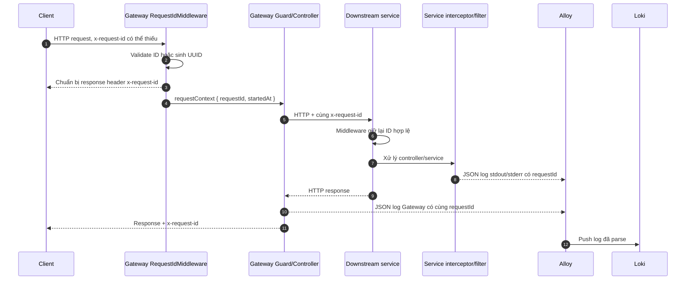
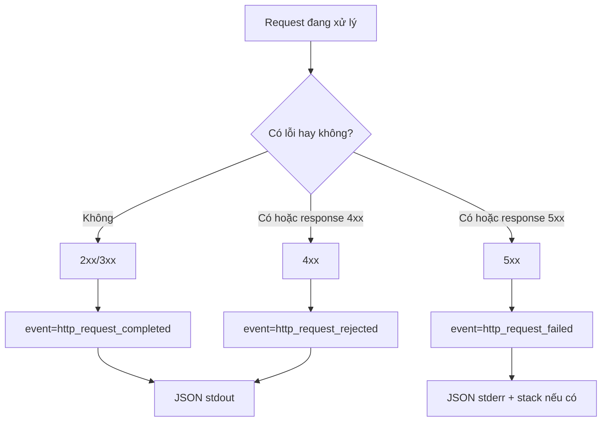
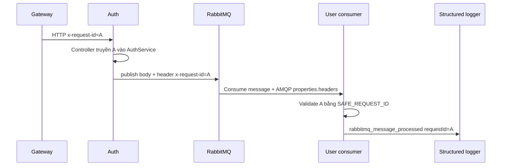
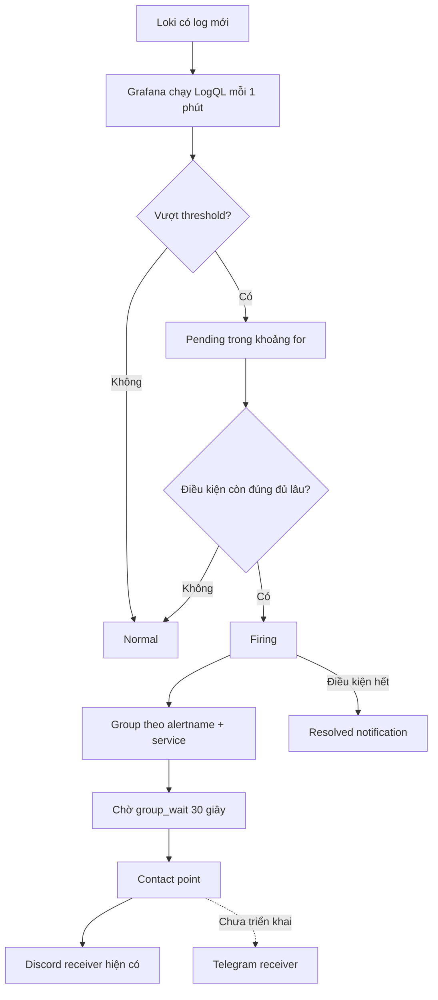

# Cẩm nang Request ID, structured logging và central observability

> Cập nhật theo source code ngày 20/08/2026.  
> Phạm vi đã triển khai chính: `gateway`, `auth`, `user`, `canteen`, `todo`.  
> Tài liệu này mô tả **trạng thái thật của source hiện tại**, không coi phần chưa chạy thử hoặc chưa cấu hình secret là đã hoàn thành.

## Mục lục

1. [Đọc nhanh trước khi đi vào chi tiết](#1-đọc-nhanh-trước-khi-đi-vào-chi-tiết)
2. [Kiến trúc tổng thể và vai trò của hai file Compose](#2-kiến-trúc-tổng-thể-và-vai-trò-của-hai-file-compose)
3. [Request ID là gì và vì sao cần nó](#3-request-id-là-gì-và-vì-sao-cần-nó)
4. [Luồng HTTP end-to-end](#4-luồng-http-end-to-end)
5. [Luồng lỗi và cách phân loại log](#5-luồng-lỗi-và-cách-phân-loại-log)
6. [Luồng RabbitMQ và những điểm đang bị đứt](#6-luồng-rabbitmq-và-những-điểm-đang-bị-đứt)
7. [Cấu trúc một dòng log JSON](#7-cấu-trúc-một-dòng-log-json)
8. [Luồng thu thập Docker log tới Grafana](#8-luồng-thu-thập-docker-log-tới-grafana)
9. [Luồng cảnh báo từ Loki tới Discord hoặc Telegram](#9-luồng-cảnh-báo-từ-loki-tới-discord-hoặc-telegram)
10. [Trạng thái chi tiết theo từng service](#10-trạng-thái-chi-tiết-theo-từng-service)
11. [Bản đồ các file quan trọng](#11-bản-đồ-các-file-quan-trọng)
12. [Setup backend và central logger từ đầu](#12-setup-backend-và-central-logger-từ-đầu)
13. [Tích hợp cảnh báo Discord](#13-tích-hợp-cảnh-báo-discord)
14. [Tích hợp cảnh báo Telegram](#14-tích-hợp-cảnh-báo-telegram)
15. [Kiểm thử từng tầng và kiểm thử end-to-end](#15-kiểm-thử-từng-tầng-và-kiểm-thử-end-to-end)
16. [Truy vấn LogQL thường dùng](#16-truy-vấn-logql-thường-dùng)
17. [Xử lý sự cố](#17-xử-lý-sự-cố)
18. [Trạng thái rollout, commit và phần còn thiếu](#18-trạng-thái-rollout-commit-và-phần-còn-thiếu)
19. [Thứ tự nên làm tiếp](#19-thứ-tự-nên-làm-tiếp)
20. [Tài liệu chính thức](#20-tài-liệu-chính-thức)

---

## 1. Đọc nhanh trước khi đi vào chi tiết

Hệ thống hiện tại có hai phần độc lập:

- Backend nhận request, tạo hoặc giữ `x-request-id`, chuyển cùng ID qua các service và ghi log JSON ra `stdout/stderr`.
- Stack observability đọc log container, đưa vào Loki, hiển thị trên Grafana và đánh giá alert rule.

Trạng thái quan trọng nhất:

| Hạng mục | Trạng thái hiện tại |
|---|---|
| Request ID + HTTP log ở Gateway/Auth/User/Canteen/Todo | Đã có trong source |
| Gateway forward ID tới downstream | Đã có cho Auth, User, Canteen, Todo, Chat, Workschedule |
| Auth → User qua RabbitMQ | Đã giữ được Request ID |
| Loki + Alloy + Grafana | Đã có file cấu hình và Compose riêng |
| Dashboard theo service/Request ID | Đã provision |
| Discord contact point | Đã provision, nhưng chưa chạy được nếu chưa điền webhook thật |
| Telegram contact point | **Chưa được triển khai trong repo** |
| Alert 4xx/5xx | **Query hiện đang lọc sai event, cần sửa trước khi tin cậy** |
| Mail/Chat/Workschedule/Payment | Chưa có đầy đủ Request ID + structured logging |
| Runtime end-to-end thực tế | Chưa được xác nhận trong lần audit tài liệu này |

Ba điều không nên hiểu nhầm:

1. Có file alert không đồng nghĩa alert đã hoạt động. Grafana cần secret thật, các container phải chạy và query phải đúng.
2. Gateway gửi `x-request-id` tới Chat/Workschedule không có nghĩa chuỗi trace đã hoàn chỉnh; hai service đó chưa tạo request context và chưa ghi log chuẩn.
3. `logger/src/index.js` là logger Express cũ. Luồng mới không POST log vào `/api/log`; luồng mới đọc trực tiếp log Docker bằng Alloy.

---

## 2. Kiến trúc tổng thể và vai trò của hai file Compose

### 2.1. Hai Compose không phải hai bản sao của nhau

| File | Project mặc định | Trách nhiệm |
|---|---|---|
| [`compose.yaml`](./compose.yaml) | `nrapp-backend` | Chạy Redis, RabbitMQ, Gateway và các service nghiệp vụ |
| [`logger/compose.yaml`](./logger/compose.yaml) | `nrapp-observability` | Chạy Loki, Alloy và Grafana |

Compose ngoài hiện **không còn service `logger` cũ**. Nó chỉ giữ application stack. Compose trong `logger` là observability stack độc lập.

```mermaid
flowchart LR
    subgraph APP[Compose ngoài: nrapp-backend]
        CLIENT[Client] --> GW[Gateway]
        GW --> AUTH[Auth]
        GW --> USER[User]
        GW --> TODO[Todo]
        GW --> CANTEEN[Canteen]
        GW --> CHAT[Chat]
        GW --> WS[Workschedule]
        AUTH <--> REDIS[(Redis)]
        AUTH --> RMQ[(RabbitMQ)]
        RMQ --> USER
        RMQ --> MAIL[Mail]
    end

    subgraph OBS[Compose trong logger: nrapp-observability]
        ALLOY[Alloy] --> LOKI[(Loki)]
        LOKI --> GRAFANA[Grafana]
        GRAFANA --> ALERT[Discord / Telegram]
    end

    APP -. Docker stdout/stderr qua docker.sock .-> ALLOY
```

Hai stack dùng network riêng và vẫn làm việc được vì:

- Alloy không gọi trực tiếp API của Gateway/Auth/User.
- Alloy mount `/var/run/docker.sock` và dùng Docker API để tìm container, đọc metadata và stream log.
- Alloy và Grafana gọi Loki qua network riêng `observability`.
- Vì vậy không cần nối network `backend` với network `observability`.

### 2.2. Vì sao bỏ logger Express cũ khỏi Compose ngoài

Logger cũ tại [`logger/src/index.js`](./logger/src/index.js) nhận `POST /api/log` rồi ghi file Winston. Source hiện tại của các service không POST log tới endpoint đó. Giữ nó trong Compose ngoài sẽ tạo thêm container, port và volume nhưng không tham gia luồng observability mới.

Các file legacy vẫn còn để tránh xóa code/dữ liệu ngoài yêu cầu:

- `logger/src/index.js`
- `docker/logger.Dockerfile`
- `logger/logs/combined.log`
- `logger/logs/error.log`

Chúng không tự chạy sau khi service `logger` bị bỏ khỏi Compose ngoài.

### 2.3. Vì sao dùng Alloy thay vì Promtail trong kế hoạch ban đầu

Kế hoạch cũ đề xuất Promtail. Implementation thực tế dùng Alloy vì Promtail đã end-of-life từ 02/03/2026 và Grafana chuyển phát triển collector sang Alloy. Chức năng trong dự án vẫn là chức năng kế hoạch cần: discover container, parse log và đẩy vào Loki.

### 2.4. Cách hai Compose được vận hành độc lập

- Chạy `docker compose up -d` ở thư mục `backend` chỉ khởi động backend.
- Chạy `docker compose up -d` ở `backend/logger` chỉ khởi động observability.
- `docker compose down` ở một thư mục không dừng project Compose còn lại.
- Dữ liệu Redis/RabbitMQ và Loki/Grafana nằm trong các named volume khác nhau.

---

## 3. Request ID là gì và vì sao cần nó

`requestId` là mã correlation của **một luồng xử lý**. Khi một request đi qua Gateway, Auth, Todo và User, các log ở bốn service có thể được tìm lại bằng cùng một ID.

Nó không phải:

- user ID;
- access token;
- mã nghiệp vụ của đơn hàng;
- một distributed trace đầy đủ có `traceId`, `spanId` và quan hệ cha-con.

### 3.1. Quy tắc nhận hoặc sinh ID

Middleware dùng regex:

```text
^[A-Za-z0-9][A-Za-z0-9._:-]{0,127}$
```

Nghĩa là:

- Độ dài từ 1 đến 128 ký tự.
- Ký tự đầu phải là chữ hoặc số.
- Các ký tự sau chỉ được là chữ, số, `.`, `_`, `:`, `-`.
- Khoảng trắng, xuống dòng, chuỗi quá dài hoặc header dạng mảng đều không hợp lệ.

Ba trường hợp:

| Input `x-request-id` | Kết quả |
|---|---|
| Có và hợp lệ | Giữ nguyên |
| Không có | Sinh UUID mới bằng `randomUUID()` |
| Có nhưng sai định dạng | Bỏ ID đó và sinh UUID mới |

Đây là behavior **fail-open**: request không bị từ chối chỉ vì thiếu hoặc sai Request ID.

### 3.2. Middleware lưu những gì

Sau khi chọn ID, middleware:

1. Tạo `request.requestContext` gồm `requestId` và `startedAt`.
2. Ghi ID chuẩn hóa lại vào request header để code phía sau dùng cùng một giá trị.
3. Ghi ID vào response header để client/support biết mã cần tra cứu.
4. Gọi `next()` để request tiếp tục.

`startedAt` dùng `process.hrtime.bigint()` vì đây là đồng hồ đơn điệu phù hợp đo duration, không bị ảnh hưởng khi giờ hệ thống thay đổi.

---

## 4. Luồng HTTP end-to-end

### 4.1. Luồng tổng quát



### 4.2. Thứ tự chi tiết tại Gateway

1. Request tới Gateway.
2. `RequestIdMiddleware` giữ hoặc sinh ID.
3. `RateLimitMiddleware` chạy sau Request ID nên response 429 vẫn có header ID.
4. Guard xác thực JWT có thể gọi Auth `/api/auth/introspect`; lời gọi này forward cùng ID.
5. Controller gọi proxy service tương ứng.
6. Proxy thêm `x-request-id` vào request downstream.
7. Downstream giữ nguyên ID vì ID của Gateway hợp lệ.
8. Nếu thành công, interceptor ghi `http_request_completed`.
9. Nếu ném exception, global filter ghi `http_request_rejected` hoặc `http_request_failed`.
10. Gateway cũng ghi terminal log cho phần xử lý của chính Gateway.
11. Client nhận response header `x-request-id`.
12. Dùng ID đó để tìm tất cả service đã tham gia.

### 4.3. Ví dụ luồng Todo đầy đủ

```text
Client
  → Gateway tạo/giữ requestId A
  → JWT guard của Gateway gọi Auth introspect với A
  → Auth ghi log với A
  → Gateway gọi Todo với A
  → Todo giữ A
  → Todo gọi User để kiểm tra hoặc populate user với A
  → User giữ và ghi log với A
  → Todo ghi log với A
  → Gateway ghi log với A
  → Client nhận header x-request-id: A
```

Khi luồng này hoàn chỉnh, tìm `A` trong Grafana phải thấy ít nhất các service thực sự tham gia: `gateway`, `auth`, `todo`, `user`.

### 4.4. Gọi thẳng vào service, bỏ qua Gateway

Request ID không phụ thuộc tuyệt đối vào Gateway. Nếu gọi trực tiếp Auth/User/Canteen/Todo:

- Có ID hợp lệ: service giữ nguyên.
- Không có hoặc ID sai: service tự sinh UUID.
- Service không crash và vẫn trả `x-request-id` ở response header.

### 4.5. Các ngoại lệ tại Gateway

- Rate-limit middleware tự trả 429 trước interceptor, nên hiện có response header Request ID nhưng chưa có structured terminal HTTP log chuẩn.
- Socket.IO proxy được gắn trực tiếp trong `main.ts`; HTTP polling/WebSocket upgrade không đi qua toàn bộ Nest request lifecycle này.

---

## 5. Luồng lỗi và cách phân loại log



### 5.1. NestJS: Gateway, Auth, Canteen

- Interceptor dùng `tap()` để log request hoàn thành thành công.
- Khi observable/controller ném lỗi, `tap()` success không chạy.
- `GlobalExceptionFilter` map exception sang status code và ghi event lỗi.
- 4xx được ghi mức warn với `http_request_rejected`.
- 5xx được ghi mức error với `http_request_failed` và stack.
- Error response do filter xử lý có thêm `requestId` trong JSON body.

### 5.2. Express: User, Todo

- Logging middleware đăng ký listener `response.once("finish")`.
- Khi response kết thúc, event được chọn dựa vào status code.
- Nếu exception đi qua global error handler, handler tự log và đặt `response.locals.requestErrorLogged = true`.
- Listener `finish` thấy cờ này sẽ bỏ qua, tránh ghi hai log cho một lỗi.

Một số controller Express tự gọi `res.status(...).json(...)` thay vì `next(error)`. Khi đó:

- terminal log vẫn có nhờ listener `finish`;
- response header vẫn có Request ID;
- nhưng JSON body có thể không có `requestId`;
- log không có đầy đủ `errorName`, `message`, `stack` như lỗi đi qua global handler.

### 5.3. Lỗi query alert hiện tại

Đây là gap quan trọng nhất của central logger hiện tại.

Source ứng dụng phát event:

```text
2xx/3xx → http_request_completed
4xx     → http_request_rejected
5xx     → http_request_failed
```

Nhưng panel 4xx/5xx và rule 5xx/health hiện lại lọc:

```logql
event="http_request_completed"
```

rồi mới kiểm tra `statusCode >= 400/500`. Hai điều kiện mâu thuẫn với taxonomy event thực tế, nên dashboard và alert có thể bỏ sót gần như toàn bộ lỗi.

Query đúng về ý nghĩa nên tách như sau:

```logql
# 4xx
{service=~"gateway|auth|user|canteen|todo", event="http_request_rejected"}
| json
| statusCode >= 400 and statusCode < 500
```

```logql
# 5xx
{service=~"gateway|auth|user|canteen|todo", event="http_request_failed"}
| json
| statusCode >= 500
```

Tài liệu chỉ ghi nhận và đề xuất sửa. Các file alert/dashboard **chưa được sửa trong bước viết tài liệu này**.

---

## 6. Luồng RabbitMQ và những điểm đang bị đứt

### 6.1. Auth → User: đã giữ được correlation



Auth chỉ đính AMQP header khi ID hợp lệ. User đọc `msg.properties.headers['x-request-id']`, validate lại rồi đưa ID vào metadata callback. `handleProfileSync` ghi các event:

- `rabbitmq_message_processed`;
- `rabbitmq_message_rejected`;
- `rabbitmq_message_failed`.

Gap nhỏ: action không được nhận diện hiện có thể bị ACK mà không ghi rejected log vì handler chưa có nhánh `else` cuối.

### 6.2. Auth → Mail: publisher có ID nhưng consumer làm mất

Auth gửi queue `send-otp` kèm Request ID. Mail hiện chỉ parse message body và không đọc `msg.properties.headers`, nên luồng bị đứt:

```text
Gateway requestId A
  → Auth giữ A
  → RabbitMQ message có header A
  → Mail bỏ qua header
  → Mail console log không có A
```

Mail cũng chưa xuất structured log và Alloy chưa thu log của Mail. Vì vậy chưa thể tìm trọn luồng login/OTP theo Request ID.

### 6.3. Canteen RabbitMQ: chưa gửi Request ID

Publisher Canteen hiện chỉ gửi JSON body và `{ persistent: true }`. Các event như `inventory.low_stock`, `order.ready`, `order.confirmed` chưa có Request ID trong AMQP header. Consumer helper của Canteen cũng chưa đọc header.

### 6.4. Nguyên tắc cần giữ khi hoàn thiện RabbitMQ

1. Request ID phải nằm trong AMQP header/metadata, không nhét lẫn vào business payload nếu không cần.
2. Publisher và consumer đều validate bằng cùng regex.
3. Consumer không có ID hợp lệ thì dùng `unknown` hoặc sinh correlation mới theo quy ước rõ ràng.
4. Log message phải có `queueName`, `requestId`, action/outcome.
5. Không log toàn bộ OTP, token hay payload nhạy cảm.

---

## 7. Cấu trúc một dòng log JSON

Ví dụ HTTP thành công:

```json
{
  "timestamp": "2026-08-20T08:30:00.000Z",
  "service": "todo",
  "event": "http_request_completed",
  "requestId": "manual-test-001",
  "userId": "66c123...",
  "method": "GET",
  "path": "/api/todo/my-tasks",
  "statusCode": 200,
  "durationMs": 18.42
}
```

Ví dụ HTTP lỗi:

```json
{
  "timestamp": "2026-08-20T08:30:01.000Z",
  "service": "auth",
  "event": "http_request_rejected",
  "requestId": "manual-test-001",
  "method": "POST",
  "path": "/api/auth/login",
  "statusCode": 401,
  "durationMs": 24.17,
  "errorName": "UnauthorizedException",
  "message": "Invalid credentials"
}
```

### 7.1. Ý nghĩa từng field

| Field | Bắt buộc | Ý nghĩa |
|---|---:|---|
| `timestamp` | Có | Thời điểm app tạo log, ISO-8601 |
| `service` | Có | Tên service cố định như `gateway`, `auth` |
| `event` | Có | Loại sự kiện để query/alert |
| `requestId` | Có với HTTP | Correlation ID xuyên service |
| `userId` | Không | Chỉ có sau khi xác thực được user |
| `method` | Có với HTTP | HTTP method |
| `path` | Có với HTTP | URL/original URL |
| `statusCode` | Có với HTTP | HTTP status cuối cùng |
| `durationMs` | Có với HTTP | Thời gian xử lý bằng monotonic clock |
| `errorName` | Khi filter có exception | Loại lỗi |
| `message` | Khi filter có exception | Thông báo lỗi đã chọn để log |
| `stack` | Thường chỉ 5xx | Stack phục vụ debug, không trả cho client |
| `queueName` | Với RabbitMQ | Queue được publish/consume |
| `outcome` | Với RabbitMQ | Kết quả nghiệp vụ của message |

### 7.2. Nest log và Express log khác hình thức bên ngoài

- Gateway/Auth/Canteen dùng Nest `Logger`, nên dòng Docker log có thể chứa timestamp/prefix/màu ANSI bao quanh JSON.
- User/Todo dùng `console.log/warn/error`, nên JSON nằm trực tiếp trên dòng log.
- Alloy dùng regex lấy `{...}` trước khi parse để hỗ trợ cả hai dạng.

### 7.3. Dữ liệu không được log

Common logger hiện không ghi body hoặc raw header. Tiếp tục giữ nguyên nguyên tắc không log:

- password;
- JWT/access token/refresh token;
- OTP;
- raw `Authorization`;
- Discord webhook URL;
- Telegram bot token;
- secret ký request;
- toàn bộ request/response body nếu chưa redact.

Lưu ý: `path` đang dựa trên `originalUrl`, có thể chứa query string. Không truyền token/secret qua query parameter.

---

## 8. Luồng thu thập Docker log tới Grafana

```mermaid
flowchart LR
    APP[App ghi JSON stdout/stderr]
    DOCKER[Docker logging driver local]
    DISC[Alloy discovery.docker]
    RELABEL[Filter theo Compose service]
    PARSE[Regex + JSON parse]
    META[Labels + structured metadata]
    LOKI[(Loki filesystem/TSDB)]
    DS[Grafana Loki datasource]
    UI[Dashboard / Explore / Alert]

    APP --> DOCKER --> DISC --> RELABEL --> PARSE --> META --> LOKI --> DS --> UI
```



### 8.1. Docker giữ log cục bộ

Compose ngoài cấu hình logging driver `local` cho app:

- mỗi file tối đa `10m`;
- giữ tối đa `3` file mỗi container.

Mục đích là tránh log Docker tăng không giới hạn. Loki có retention riêng, nên sau khi log đã được ingest, việc Docker rotate file không xóa bản đã lưu trong Loki.

### 8.2. Alloy discover và lọc container

Mỗi 5 giây Alloy đọc Docker metadata. Nó chỉ giữ container có Compose service name:

```text
gateway | auth | user | canteen | todo
```

Hệ quả: Mail, Chat, Workschedule, Payment, Redis và RabbitMQ chưa vào Loki qua pipeline này.

### 8.3. Labels và structured metadata

Alloy tạo label ổn định:

- `service`;
- `container`;
- `event`.

Các field có cardinality cao được giữ dưới dạng structured metadata:

- `requestId`;
- `userId`;
- `method`;
- `path`;
- `statusCode`;
- `durationMs`.

Không dùng `requestId` làm Loki label vì mỗi request gần như có một giá trị riêng; index hàng triệu ID khác nhau sẽ tốn bộ nhớ và làm Loki kém ổn định.

### 8.4. Loki

Loki hiện chạy single-node:

- `auth_enabled: false`;
- TSDB schema v13;
- filesystem storage trong volume `loki_data`;
- retention `168h`, tức 7 ngày;
- port host chỉ bind `127.0.0.1:3100` mặc định.

Đây là cấu hình phù hợp local/dev hoặc một host nhỏ, chưa phải high-availability production.

### 8.5. Grafana

Grafana tự provision:

- Loki datasource `http://loki:3100`;
- dashboard `Backend observability / Backend request lifecycle`;
- ba alert rule;
- Discord contact point;
- notification policy.

Dashboard có panel p95 latency, 4xx/5xx và log theo Request ID. Panel lỗi cần sửa query như mục 5.3.

---

## 9. Luồng cảnh báo từ Loki tới Discord hoặc Telegram

### 9.1. Luồng trạng thái



### 9.2. Ba rule đang được provision

| Rule | Query logic mong muốn | Threshold | `for` | Mức độ |
|---|---|---:|---:|---|
| Elevated backend 5xx errors | Đếm 5xx trong cửa sổ 5 phút theo service | `> 5` | 5 phút | critical |
| Backend health check failures | Có `/health` hoặc `/health/ready` lỗi | `> 0` | 1 phút | critical |
| High backend HTTP p95 latency | p95 `durationMs` trong 5 phút | `> 1000 ms` | 5 phút | warning |

Rule được đánh giá mỗi phút. Với `> 5`, phải có ít nhất 6 lỗi. Kết hợp cửa sổ 5 phút và `for: 5m` làm rule 5xx thiên về phát hiện lỗi kéo dài; một burst ngắn có thể rời cửa sổ trước khi chuyển sang Firing.

### 9.3. Cách notification được gom

- `group_by`: `alertname`, `service`.
- `group_wait`: 30 giây trước thông báo đầu.
- `group_interval`: 5 phút trước khi gửi cập nhật mới cho cùng nhóm.
- `repeat_interval`: nhắc lại sau 2 giờ nếu alert vẫn firing.
- `disableResolveMessage: false`: gửi thêm thông báo khi hệ thống trở lại bình thường.

### 9.4. Giới hạn của health alert hiện tại

Health rule là **log-based alert**, không phải active uptime probe độc lập:

- Nếu app còn chạy và `/health` trả lỗi, request healthcheck tạo log và rule có thể thấy.
- Nếu process/container chết hoàn toàn, app không tạo log mới; `noDataState: OK` có thể khiến Grafana coi là bình thường.
- Nếu Alloy/Loki chết, cũng có thể không có data nhưng rule không tự cảnh báo.

Vì vậy về sau cần bổ sung metric/active probe cho container down, Redis/RabbitMQ down, disk đầy và chính observability stack.

---

## 10. Trạng thái chi tiết theo từng service

### 10.1. Ma trận coverage

| Service | Inbound Request ID | HTTP structured log | Outbound HTTP giữ ID | RabbitMQ giữ ID | Alloy thu thập | Unit test lifecycle |
|---|---:|---:|---:|---:|---:|---:|
| Gateway | Có | Có | Có | Không dùng | Có | Có |
| Auth | Có | Có | Có khi gọi User | Có khi publish | Có | Có |
| User | Có | Có | Không có outbound chính | Có khi consume | Có | Có |
| Canteen | Có | Có | Không có outbound HTTP chính | **Chưa** | Có | Có |
| Todo | Có | Có | Có khi gọi User | Không dùng | Có | Có |
| Mail | **Chưa** | **Chưa** | Không | **Consumer bỏ mất ID** | Không | Không |
| Chat | **Chưa** | **Chưa** | **Không giữ ID khi gọi User** | Không dùng | Không | Không |
| Workschedule | **Chưa** | **Chưa** | **Không giữ ID khi gọi User** | Không dùng | Không | Không |
| Payment | **Chưa** | **Chưa** | Chưa có nghiệp vụ rõ | Chưa hoàn thiện | Không | Không |

### 10.2. Gateway

Đã có:

- Request context và fail-open middleware.
- Request ID chạy trước rate limit.
- Structured logger, global interceptor và exception filter.
- Forward ID tới Auth, User, Todo, Canteen, Chat, Workschedule.
- JWT introspection forward ID tới Auth.
- Canteen sử dụng cùng Request ID trong chữ ký HMAC nội bộ.

Chưa phủ:

- Structured terminal log cho 429 do rate-limit tự trả response.
- Socket.IO/WebSocket lifecycle.
- Gateway hiện chưa có module proxy Payment/Mail dù URL có trong environment Compose.

### 10.3. Auth

Đã có:

- Full HTTP lifecycle theo pattern NestJS.
- Controller nhận Request ID từ header đã được middleware chuẩn hóa.
- Forward ID khi gọi User.
- Đính ID vào RabbitMQ header cho profile sync và OTP event.

Chưa phủ:

- Consumer Mail không đọc ID của OTP event.
- Chưa có test riêng cho từng outbound call/Rabbit header.

### 10.4. User

Đã có:

- Full HTTP lifecycle theo Express.
- Async error được chuyển tới global error handler.
- RabbitMQ consumer đọc và validate Request ID.
- Structured log cho kết quả profile sync.

Chưa phủ:

- Unknown RabbitMQ action chưa có rejected branch rõ ràng.
- Nhiều controller tự trả error response, nên body/error detail chưa đồng nhất với global filter.

### 10.5. Canteen

Đã có từ pattern ban đầu:

- Request ID, structured logger, interceptor, filter.
- Gateway signature dùng Request ID chống sửa header user nội bộ.
- Unit test middleware và interceptor.
- Ghi thêm event `http_request_received` trước terminal event.

Chưa phủ:

- RabbitMQ publisher/consumer không giữ Request ID.
- Một vài field thiếu context dùng `undefined`, khi stringify có thể biến mất thay vì thành `unknown`.

### 10.6. Todo

Đã có:

- Full HTTP lifecycle theo Express.
- Forward ID khi kiểm tra user và populate dữ liệu User.
- Unit test ba case middleware và 2xx/4xx/5xx interceptor.

Chưa phủ:

- Một số controller catch lỗi rồi tự trả 500, vì vậy không có stack/error detail chuẩn từ global filter.

### 10.7. Mail

Chưa có middleware/context/structured logger. Rabbit consumer nhận message có thể chứa header ID từ Auth nhưng bỏ qua. Đây là điểm đứt của luồng OTP.

### 10.8. Chat

Gateway gửi ID tới Chat, nhưng Chat chưa có middleware/log/filter. Khi Chat gọi User, request không forward `x-request-id`; User sinh một ID mới, nên correlation bị đứt.

Socket.IO cũng cần một chiến lược correlation riêng vì WebSocket connection/message không giống một HTTP request thông thường.

### 10.9. Workschedule

Gateway gửi ID tới Workschedule, nhưng service chưa tạo context/log. Các call Workschedule → User chỉ gửi Authorization/user data hiện có, không forward Request ID.

### 10.10. Payment

Payment có mặt trong Compose nhưng chưa nằm trong rollout Request ID/logging, Alloy không collect và Gateway chưa có module proxy tương ứng trong source hiện tại.

---

## 11. Bản đồ các file quan trọng

### 11.1. Application lifecycle

| Thành phần | Gateway | Auth | User | Canteen | Todo |
|---|---|---|---|---|---|
| Request context | [`request-context.interface.ts`](./gateway/src/common/interfaces/request-context.interface.ts) | [`request-context.interface.ts`](./auth/src/common/interfaces/request-context.interface.ts) | [`request-context.interface.ts`](./user/src/common/interfaces/request-context.interface.ts) | [`request-context.interface.ts`](./canteen/src/common/interfaces/request-context.interface.ts) | [`request-context.interface.ts`](./todo/src/common/interfaces/request-context.interface.ts) |
| Request ID middleware | [`request-id.middleware.ts`](./gateway/src/common/middleware/request-id.middleware.ts) | [`request-id.middleware.ts`](./auth/src/common/middleware/request-id.middleware.ts) | [`request-id.middleware.ts`](./user/src/common/middleware/request-id.middleware.ts) | [`request-id.middleware.ts`](./canteen/src/common/middleware/request-id.middleware.ts) | [`request-id.middleware.ts`](./todo/src/common/middleware/request-id.middleware.ts) |
| Structured logger | [`structured-logger.service.ts`](./gateway/src/common/observability/structured-logger.service.ts) | [`structured-logger.service.ts`](./auth/src/common/observability/structured-logger.service.ts) | [`structured-logger.service.ts`](./user/src/common/observability/structured-logger.service.ts) | [`structured-logger.service.ts`](./canteen/src/common/observability/structured-logger.service.ts) | [`structured-logger.service.ts`](./todo/src/common/observability/structured-logger.service.ts) |
| HTTP logging | [`http-logging.interceptor.ts`](./gateway/src/common/interceptors/http-logging.interceptor.ts) | [`http-logging.interceptor.ts`](./auth/src/common/interceptors/http-logging.interceptor.ts) | [`http-logging.interceptor.ts`](./user/src/common/interceptors/http-logging.interceptor.ts) | [`http-logging.interceptor.ts`](./canteen/src/common/interceptors/http-logging.interceptor.ts) | [`http-logging.interceptor.ts`](./todo/src/common/interceptors/http-logging.interceptor.ts) |
| Exception filter | [`global-exception.filter.ts`](./gateway/src/common/filters/global-exception.filter.ts) | [`global-exception.filter.ts`](./auth/src/common/filters/global-exception.filter.ts) | [`global-exception.filter.ts`](./user/src/common/filters/global-exception.filter.ts) | [`global-exception.filter.ts`](./canteen/src/common/filters/global-exception.filter.ts) | [`global-exception.filter.ts`](./todo/src/common/filters/global-exception.filter.ts) |
| Global registration | [`core.module.ts`](./gateway/src/core/core.module.ts) | [`core.module.ts`](./auth/src/core/core.module.ts) | [`index.ts`](./user/src/index.ts) | [`core.module.ts`](./canteen/src/core/core.module.ts) | [`index.ts`](./todo/src/index.ts) |

### 11.2. Propagation

| Luồng | File chính |
|---|---|
| Gateway → Auth | [`gateway/src/modules/auth/auth.service.ts`](./gateway/src/modules/auth/auth.service.ts) |
| Gateway JWT introspection → Auth | [`gateway/src/modules/auth/common/guard/jwt/jwt.strategy.ts`](./gateway/src/modules/auth/common/guard/jwt/jwt.strategy.ts) |
| Gateway → User | [`gateway/src/modules/user/user.service.ts`](./gateway/src/modules/user/user.service.ts) |
| Gateway → Todo | [`gateway/src/modules/todo/todo.service.ts`](./gateway/src/modules/todo/todo.service.ts) |
| Gateway → Canteen | [`gateway/src/modules/canteen/canteen.service.ts`](./gateway/src/modules/canteen/canteen.service.ts) |
| Gateway → Chat | [`gateway/src/modules/chat/chat.service.ts`](./gateway/src/modules/chat/chat.service.ts) |
| Gateway → Workschedule | [`gateway/src/modules/workschedule/workschedule.service.ts`](./gateway/src/modules/workschedule/workschedule.service.ts) |
| Todo → User | [`todo/src/controllers/task.ts`](./todo/src/controllers/task.ts) |
| Auth publisher | [`auth/src/modules/rabbitmq/rabbitmq.service.ts`](./auth/src/modules/rabbitmq/rabbitmq.service.ts) |
| User consumer | [`user/src/config/rabbitmq.ts`](./user/src/config/rabbitmq.ts) |
| User Rabbit handler | [`user/src/controllers/user.ts`](./user/src/controllers/user.ts) |
| Mail consumer đang làm mất ID | [`mail/src/consumer.ts`](./mail/src/consumer.ts) |
| Canteen Rabbit helper chưa có ID | [`canteen/src/modules/rabbitmq/rabbitmq.service.ts`](./canteen/src/modules/rabbitmq/rabbitmq.service.ts) |

### 11.3. Central observability

| Chức năng | File |
|---|---|
| Chạy Loki/Alloy/Grafana | [`logger/compose.yaml`](./logger/compose.yaml) |
| Discover, parse và push log | [`logger/observability/alloy-config.alloy`](./logger/observability/alloy-config.alloy) |
| Loki storage/retention | [`logger/observability/loki-config.yaml`](./logger/observability/loki-config.yaml) |
| Loki datasource | [`loki.yaml`](./logger/observability/grafana/provisioning/datasources/loki.yaml) |
| Dashboard | [`request-lifecycle.json`](./logger/observability/grafana/dashboards/request-lifecycle.json) |
| Alert rules | [`request-alerts.yaml`](./logger/observability/grafana/provisioning/alerting/request-alerts.yaml) |
| Contact point | [`contact-points.yaml`](./logger/observability/grafana/provisioning/alerting/contact-points.yaml) |
| Notification policy | [`notification-policies.yaml`](./logger/observability/grafana/provisioning/alerting/notification-policies.yaml) |
| Runbook ngắn của logger repo | [`logger/README.md`](./logger/README.md) |

---

## 12. Setup backend và central logger từ đầu

### 12.1. Điều kiện cần

- Docker Engine đang chạy.
- Docker Compose v2, kiểm tra bằng `docker compose version`.
- User chạy Alloy có quyền truy cập Docker socket.
- Các service `.env` đã có database URL và secret nghiệp vụ phù hợp.
- Máy có outbound HTTPS nếu muốn gửi Discord/Telegram.
- Port mặc định chưa bị chiếm.

### 12.2. Chuẩn bị environment của backend

Từ thư mục gốc `backend`:

```bash
cp .env.example .env
```

Mở `.env` và ít nhất thay:

```dotenv
RABBITMQ_USER=nrapp_dev
RABBITMQ_PASSWORD=<mot-mat-khau-dai-va-ngau-nhien>
```

Không commit `.env`. Không chia sẻ output đầy đủ của `docker compose config` vì Compose có thể interpolate và in secret. Khi chỉ cần validate, dùng `--quiet`.

Lưu ý: `.env.example` ngoài hiện vẫn còn `LOGGER_HOST_PORT=5007` từ logger cũ. Biến đó không còn được `compose.yaml` sử dụng; nó là cấu hình tồn dư, không làm phát sinh container logger.

### 12.3. Validate và khởi động backend

```bash
cd /media/thanhle/D/pj1/backend
docker compose config --quiet
docker compose up -d --build
docker compose ps
```

Kiểm tra Gateway:

```bash
curl -i http://127.0.0.1:3000/health
```

Kỳ vọng:

- HTTP thành công;
- response có header `x-request-id`;
- `docker compose ps` cho thấy service healthy sau start period.

### 12.4. Chuẩn bị environment của logger

Tại thời điểm audit, `logger/.env` chỉ có biến legacy `PORT`; file đó chưa đủ để chạy Compose mới. Sao lưu trước khi thay:

```bash
cd /media/thanhle/D/pj1/backend/logger
cp .env .env.legacy-backup
cp .env.example .env
```

Sau đó mở `logger/.env` và điền:

```dotenv
GRAFANA_ADMIN_USER=admin
GRAFANA_ADMIN_PASSWORD=<mat-khau-rat-manh>
GRAFANA_ALERT_WEBHOOK_URL=https://discord.com/api/webhooks/<id>/<token>
GRAFANA_HOST_PORT=3001
LOKI_HOST_PORT=3100
ALLOY_HOST_PORT=12345
```

Với source hiện tại, `GRAFANA_ADMIN_PASSWORD` và `GRAFANA_ALERT_WEBHOOK_URL` là biến bắt buộc. Nếu thiếu, `docker compose config --quiet` sẽ dừng ngay và báo lỗi.

### 12.5. Validate và khởi động observability

```bash
cd /media/thanhle/D/pj1/backend/logger
docker compose config --quiet
docker compose up -d
docker compose ps
```

Backend nên chạy trước để dễ nhìn thấy log ngay, nhưng không bắt buộc. Alloy rediscover container mỗi 5 giây.

### 12.6. Kiểm tra ba thành phần

```bash
curl -fsS http://127.0.0.1:3100/ready
curl -fsS http://127.0.0.1:12345/-/ready
curl -fsS http://127.0.0.1:3001/api/health
```

Khi lỗi:

```bash
docker compose logs --tail=100 loki alloy grafana
```

Compose logger hiện dùng `depends_on` theo thứ tự start, chưa dùng container healthcheck để chờ Loki thực sự ready. Một vài lỗi kết nối ngắn lúc khởi động có thể tự hết sau retry.

### 12.7. Mở Grafana và kiểm tra log

1. Mở `http://127.0.0.1:3001` trên máy chạy Docker.
2. Đăng nhập bằng `GRAFANA_ADMIN_USER` và password vừa đặt.
3. Mở `Explore`.
4. Chọn datasource `Loki`.
5. Chạy:

```logql
{service=~"gateway|auth|user|canteen|todo"}
```

Nếu truy cập Grafana từ máy khác, port hiện chỉ bind loopback. Dùng SSH tunnel hoặc reverse proxy có TLS/auth; không nên bind Loki/Alloy công khai.

---

## 13. Tích hợp cảnh báo Discord

### 13.1. Trạng thái hiện tại

Discord đã được provision trong source bằng contact point `backend-discord`. Bạn chỉ cần tạo webhook, đưa URL vào `logger/.env`, recreate Grafana rồi test.

### 13.2. Tạo Discord webhook

1. Mở Discord server.
2. Vào `Server Settings` → `Integrations` → `Webhooks`.
3. Chọn `New Webhook` hoặc `Create Webhook`.
4. Đặt tên, ví dụ `Backend Alerts`.
5. Chọn channel nhận cảnh báo.
6. Chọn `Copy Webhook URL`.

URL có dạng:

```text
https://discord.com/api/webhooks/<webhook-id>/<webhook-token>
```

Không nối `/github`. Hậu tố đó chỉ dành cho GitHub webhook compatibility, không dùng cho Grafana Discord integration.

### 13.3. Cấu hình secret

Trong `logger/.env`:

```dotenv
GRAFANA_ALERT_WEBHOOK_URL=https://discord.com/api/webhooks/<webhook-id>/<webhook-token>
```

Không đặt URL thật vào `.env.example` hay `contact-points.yaml`.

### 13.4. Áp dụng thay đổi

Thay environment cần recreate container, chỉ restart process có thể vẫn dùng environment cũ:

```bash
cd /media/thanhle/D/pj1/backend/logger
docker compose config --quiet
docker compose up -d --force-recreate grafana
docker compose ps grafana
```

### 13.5. Test Discord

1. Mở Grafana.
2. Vào `Alerts & IRM` → `Alerting` → `Notification configuration`.
3. Chọn tab `Contact points`.
4. Mở `backend-discord`.
5. Nhấn `Test` và gửi predefined test notification.
6. Xác nhận channel nhận được tin.

Nút Test chỉ xác nhận credential/network/contact point. Nó chưa chứng minh LogQL, threshold và trạng thái Pending/Firing hoạt động đúng.

### 13.6. Bảo mật Discord

Webhook URL là credential. Người có URL có thể gửi tin vào channel. Nếu lộ:

1. Xóa/rotate webhook trong Discord.
2. Cập nhật `logger/.env`.
3. Recreate Grafana.
4. Không dán URL vào log, issue, ảnh chụp hay output hỗ trợ.

---

## 14. Tích hợp cảnh báo Telegram

### 14.1. Trạng thái hiện tại

Telegram **chưa có trong repo**. Biến `GRAFANA_ALERT_WEBHOOK_URL` hiện là Discord webhook và không thể thay trực tiếp bằng Telegram URL. Telegram integration cần hai giá trị khác:

- bot token;
- chat ID.

Vì contact point, alert rule và notification policy hiện đều được file-provision, cấu hình bền vững phải sửa YAML/Compose rồi recreate Grafana. Resource provisioned không nên được coi là cấu hình chỉnh trực tiếp trong UI.

### 14.2. Tạo Telegram bot

1. Trong Telegram tìm tài khoản chính thức `@BotFather`.
2. Gửi `/newbot`.
3. Đặt display name.
4. Đặt username kết thúc bằng `bot` hoặc `_bot`.
5. Lưu bot token như một mật khẩu.

Bot không thể tự bắt đầu chat cá nhân; người nhận phải mở bot và gửi `/start`, hoặc thêm bot vào group.

### 14.3. Lấy chat ID

Cách dễ nhất cho group:

1. Tạo/mở group nhận cảnh báo.
2. Thêm bot vào group.
3. Mở group bằng Telegram Web.
4. Lấy chuỗi số trong URL sau dấu `#`; group chat ID thường là số âm.

Có thể dùng Bot API `getUpdates` sau khi gửi một message vào group để đọc `message.chat.id`, nhưng không dán token vào history terminal hoặc ảnh chụp khi nhờ hỗ trợ.

### 14.4. Thiết kế khuyến nghị để gửi đồng thời Discord và Telegram

Nên tạo một contact point logic tên `backend-alerts`, bên trong có hai receiver. Khi một alert được route tới contact point này, Grafana gửi cả hai nơi.

Đây là **cấu hình cần triển khai tiếp**, chưa tồn tại trong source hiện tại.

Thêm vào `logger/.env.example` bằng placeholder và điền giá trị thật chỉ ở `logger/.env`:

```dotenv
GRAFANA_ALERT_DISCORD_WEBHOOK_URL=https://discord.com/api/webhooks/replace-me
GRAFANA_ALERT_TELEGRAM_BOT_TOKEN=replace-me
GRAFANA_ALERT_TELEGRAM_CHAT_ID=-1000000000000
```

Cho Grafana container nhận ba biến trong `logger/compose.yaml`:

```yaml
environment:
  GRAFANA_ALERT_DISCORD_WEBHOOK_URL: ${GRAFANA_ALERT_DISCORD_WEBHOOK_URL:?Set Discord webhook}
  GRAFANA_ALERT_TELEGRAM_BOT_TOKEN: ${GRAFANA_ALERT_TELEGRAM_BOT_TOKEN:?Set Telegram bot token}
  GRAFANA_ALERT_TELEGRAM_CHAT_ID: ${GRAFANA_ALERT_TELEGRAM_CHAT_ID:?Set Telegram chat ID}
```

Contact point đề xuất:

```yaml
apiVersion: 1

contactPoints:
  - orgId: 1
    name: backend-alerts
    receivers:
      - uid: backend-discord
        type: discord
        disableResolveMessage: false
        settings:
          url: $GRAFANA_ALERT_DISCORD_WEBHOOK_URL
          use_discord_username: false

      - uid: backend-telegram
        type: telegram
        disableResolveMessage: false
        settings:
          bottoken: $GRAFANA_ALERT_TELEGRAM_BOT_TOKEN
          chatid: |-
            $GRAFANA_ALERT_TELEGRAM_CHAT_ID
          parse_mode: None
```

Notification policy phải chuyển từ:

```yaml
receiver: backend-discord
```

sang:

```yaml
receiver: backend-alerts
```

Giữ chat ID dưới dạng chuỗi giúp tránh xử lý sai dấu âm hoặc giới hạn số.

### 14.5. Áp dụng và test Telegram sau khi code cấu hình đã được thêm

```bash
cd /media/thanhle/D/pj1/backend/logger
docker compose config --quiet
docker compose up -d --force-recreate grafana
docker compose logs --tail=100 grafana
```

Trong Grafana, mở contact point `backend-alerts` và test từng integration. Xác nhận cả Discord và Telegram đều nhận firing test.

Telegram giới hạn message 4096 ký tự UTF-8. Dùng `parse_mode: None` giúp tránh trường hợp message bị cắt giữa markup và gửi thất bại. Template alert nên ngắn, tập trung vào alert name, service, severity, status và link dashboard.

### 14.6. Link Grafana trong tin cảnh báo

Grafana trong container chạy port 3000, còn host expose port 3001. Nếu gửi alert ra điện thoại, link mặc định `localhost` sẽ không mở được. Khi triển khai trên server thật, cấu hình thêm URL truy cập thực, ví dụ:

```yaml
GF_SERVER_ROOT_URL: https://grafana.example.com
```

URL đó phải đi qua reverse proxy TLS và authentication phù hợp.

---

## 15. Kiểm thử từng tầng và kiểm thử end-to-end

### 15.1. Tầng 1: unit test application

Middleware test của 5 service đã có ba case:

1. ID hợp lệ được giữ nguyên.
2. Thiếu ID thì sinh UUID.
3. ID sai bị thay và middleware vẫn `next()`.

Interceptor test:

- Gateway/Auth/Canteen: tập trung success/completed.
- User/Todo: có case 2xx, 4xx, 5xx.

Lệnh chạy:

```bash
cd gateway && npm test
cd ../auth && npm test -- --runInBand
cd ../user && npm test
cd ../canteen && npm test -- --runInBand
cd ../todo && npm test
```

Chạy từng repo riêng và commit từng ý. Không gom các file `dist` sinh ra cùng thay đổi source nếu policy repo không yêu cầu track build output.

### 15.2. Tầng 2: validate cấu hình

```bash
cd /media/thanhle/D/pj1/backend
docker compose config --quiet

cd logger
docker compose config --quiet
```

Lệnh này chỉ kiểm tra Compose/interpolation; không xác nhận container, Loki query hay webhook hoạt động.

Dashboard JSON có thể kiểm tra bằng parser JSON của editor hoặc công cụ phù hợp. Alert provisioning cần kiểm tra log Grafana sau start.

### 15.3. Tầng 3: test Request ID qua Gateway → Auth

Chọn một ID an toàn dễ tìm:

```bash
RID=manual-login-test-001
curl -i -X POST http://127.0.0.1:3000/api/auth/login \
  -H "content-type: application/json" \
  -H "x-request-id: $RID" \
  -d '{"email":"nobody@example.invalid","password":"not-a-real-password"}'
```

Kỳ vọng dù login thất bại hợp lệ:

- response header là `x-request-id: manual-login-test-001`;
- Gateway có log cùng ID;
- Auth có log cùng ID;
- không có password trong log.

Kiểm tra Docker log nhanh:

```bash
docker compose logs gateway auth | rg "manual-login-test-001"
```

Kiểm tra Grafana:

```logql
{service=~"gateway|auth"} | json | requestId="manual-login-test-001"
```

### 15.4. Tầng 4: test fail-open trực tiếp

Không có header:

```bash
curl -i http://127.0.0.1:5003/health
```

Header sai:

```bash
curl -i http://127.0.0.1:5003/health \
  -H "x-request-id: unsafe id with spaces"
```

Cả hai phải trả một UUID mới trong response header, không trả lỗi chỉ vì Request ID.

### 15.5. Tầng 5: test Discord/Telegram contact point

- Dùng nút Test của Grafana.
- Xác nhận firing test tới đúng channel/chat.
- Khi đã bật `disableResolveMessage: false`, kiểm tra cả resolved message nếu UI hỗ trợ test trạng thái đó.

### 15.6. Tầng 6: test alert rule end-to-end

Chỉ làm ở dev/staging:

1. Tạo dữ liệu phù hợp với rule.
2. Quan sát `Normal → Pending → Alerting`.
3. Xác nhận notification tới Discord/Telegram.
4. Ngừng tạo điều kiện lỗi.
5. Xác nhận alert trở về Normal và nhận resolved notification.

Không hạ threshold hoặc cố tình gây 500 trên production chỉ để test.

Trước test phải sửa query event ở mục 5.3; nếu không, test 5xx/health có thể không bao giờ firing dù app đang log lỗi đúng.

### 15.7. Những test còn thiếu

- GlobalExceptionFilter response body có Request ID.
- Structured logger serialization/redaction.
- Tất cả Gateway proxy giữ ID.
- JWT introspection propagation.
- RabbitMQ publisher/consumer header.
- Auth → User và Auth → Mail end-to-end.
- Request ID xuyên Gateway → downstream → Loki.
- Rate-limit 429.
- Socket.IO correlation.
- Automated test cho LogQL alert.

---

## 16. Truy vấn LogQL thường dùng

### 16.1. Toàn bộ log trong phạm vi rollout

```logql
{service=~"gateway|auth|user|canteen|todo"}
```

### 16.2. Tìm một Request ID

```logql
{service=~"gateway|auth|user|canteen|todo"}
| json
| requestId="manual-login-test-001"
```

### 16.3. Tìm theo service

```logql
{service="auth"}
```

### 16.4. Tìm 4xx đúng taxonomy

```logql
{service=~"gateway|auth|user|canteen|todo", event="http_request_rejected"}
| json
| statusCode >= 400 and statusCode < 500
```

### 16.5. Tìm 5xx đúng taxonomy

```logql
{service=~"gateway|auth|user|canteen|todo", event="http_request_failed"}
| json
| statusCode >= 500
```

### 16.6. p95 latency theo service

```logql
quantile_over_time(
  0.95,
  {service=~"gateway|auth|user|canteen|todo", event="http_request_completed"}
  | json
  | unwrap durationMs [5m]
) by (service)
```

### 16.7. RabbitMQ profile sync của User

```logql
{service="user", event=~"rabbitmq_message_processed|rabbitmq_message_rejected|rabbitmq_message_failed"}
| json
```

---

## 17. Xử lý sự cố

### 17.1. `docker compose config` báo thiếu Grafana variables

Nguyên nhân: `logger/.env` vẫn là file legacy hoặc chưa có secret mới.

Kiểm tra **tên key**, không in value ra màn hình chia sẻ:

```bash
awk -F= 'NF && $1 !~ /^[[:space:]]*#/ {print $1}' .env
```

Cần thấy ít nhất:

```text
GRAFANA_ADMIN_USER
GRAFANA_ADMIN_PASSWORD
GRAFANA_ALERT_WEBHOOK_URL
```

### 17.2. Grafana mở được nhưng không có log

Kiểm tra theo thứ tự:

1. Backend container có chạy không: `docker compose ps` ở thư mục ngoài.
2. App có ghi log không: `docker compose logs gateway`.
3. Tên Compose service có nằm trong regex Alloy không.
4. Alloy có truy cập được Docker socket không.
5. Alloy có parse lỗi Nest prefix/ANSI không.
6. Loki có ready không.
7. Grafana datasource Loki có healthy không.

Lệnh:

```bash
curl -fsS http://127.0.0.1:12345/-/ready
curl -fsS http://127.0.0.1:3100/ready
docker compose logs --tail=200 alloy loki grafana
```

### 17.3. Có log nhưng tìm Request ID không ra đủ service

Kiểm tra service nào thực sự tham gia. Sau đó tìm điểm đứt:

- Gateway có forward header không.
- Downstream có middleware không.
- Downstream có tự gọi service khác mà bỏ header không.
- Rabbit producer có gửi AMQP header không.
- Consumer có đọc header không.
- Alloy có whitelist service đó không.

Các điểm đứt đã biết: Chat → User, Workschedule → User, Auth → Mail consumer, Canteen RabbitMQ.

### 17.4. Discord/Telegram Test thất bại

```bash
docker compose logs --tail=200 grafana
```

Tìm các dấu hiệu:

- HTTP 400: payload/setting sai.
- HTTP 401/403: token/webhook/chat permission sai.
- HTTP 429: rate limit.
- DNS/timeout: host không ra Internet hoặc firewall chặn.

Discord phải dùng Discord receiver với Discord webhook URL. Telegram phải dùng Telegram receiver với bot token/chat ID; generic webhook payload không tự tương thích hai nền tảng này.

### 17.5. Contact point có nhưng không sửa được trong UI

Đó là behavior của file provisioning. Sửa file YAML nguồn rồi recreate Grafana hoặc dùng provisioning reload phù hợp. Không tạo một cấu hình UI trùng tên rồi mong nó override file.

### 17.6. Alert không firing dù có 500

Kiểm tra:

1. Query có dùng `event="http_request_failed"` chưa.
2. Trong 5 phút có ít nhất 6 lỗi không.
3. Điều kiện có duy trì đủ `for: 5m` không.
4. Rule đang Normal, Pending, Error hay No Data.
5. Loki datasource query có trả series số không.
6. Notification policy có route tới đúng contact point không.

### 17.7. Container chết nhưng health alert không gửi

Đây là giới hạn đã biết: rule dựa trên application log và `noDataState: OK`. Cần active probe/metric bên ngoài để phát hiện process chết hoàn toàn.

### 17.8. Dừng và xóa dữ liệu

Dừng nhưng giữ volume:

```bash
docker compose down
```

Không dùng `docker compose down --volumes` trừ khi chủ động muốn xóa toàn bộ Loki/Grafana data của project hiện tại. Hai Compose là hai project; luôn kiểm tra đúng thư mục trước khi chạy lệnh xóa volume.

---

## 18. Trạng thái rollout, commit và phần còn thiếu

### 18.1. Đối chiếu kế hoạch

| Phase | Trạng thái | Ghi chú |
|---|---|---|
| Phase 1: audit | Đã thực hiện | Đã audit cả 9 service, rộng hơn phạm vi gốc |
| Phase 2: kiến trúc dùng chung | Chọn copy riêng | Các service là Git repo độc lập, framework cũng khác Nest/Express |
| Phase 3: Auth/User/Todo | Cơ bản đã có | Middleware, logger, interceptor/filter và propagation chính |
| Review Gateway/Canteen | Đã có lifecycle + test | Canteen RabbitMQ còn gap |
| Phase 4: central logger | Có cấu hình | Dùng Alloy thay Promtail; runtime cần `.env` thật |
| Dashboard theo Request ID | Đã provision | Panel 4xx/5xx cần sửa query event |
| Discord | Đã provision | Chưa xác nhận delivery với webhook thật |
| Telegram | Chưa triển khai | Mục 14 là hướng triển khai đề xuất |
| Phase 5: E2E | Chưa hoàn tất | Chưa chứng minh một ID xuyên toàn chuỗi trên runtime hiện tại |

### 18.2. Vì sao chọn copy riêng thay shared package

Thư mục backend không phải một Git repository chung; Gateway/Auth/User/Canteen/Todo là các repo độc lập và dùng cả NestJS lẫn Express. Một package nội bộ sẽ thêm quy trình version/publish/install chưa có. Vì vậy rollout hiện copy pattern nhỏ vào từng repo và dùng test để giữ behavior đồng nhất.

Đây là lựa chọn thực dụng cho hiện tại, không có nghĩa copy-paste là kiến trúc cuối cùng. Khi có registry nội bộ hoặc monorepo package management, có thể tách phần thuần framework như regex, event schema và redaction thành package chung.

### 18.3. Các nhóm commit đã tạo

Mỗi hash dưới đây thuộc repo trong cột tương ứng, không thuộc một Git repo gốc chung.

#### Gateway

| Commit | Nội dung |
|---|---|
| `548e288` | Test Request ID |
| `401ec25` | Structured JSON logger |
| `248246a` | HTTP logging interceptor |
| `720cb58` | Global exception logging |
| `fdd6497` | Đăng ký lifecycle global |
| `dd7bab5` | Forward ID tới Auth |
| `5bc7c83` | Forward ID tới User |
| `0886b83` | Forward ID tới Todo |
| `a63d8f5` | Forward ID tới Chat |
| `48e6b16` | Forward ID tới Workschedule |

Request ID/Canteen signature đã có từ các commit trước đó (`4673187`, `5cb75f7`).

#### Auth

| Commit | Nội dung |
|---|---|
| `f4afb38` | Request context contract |
| `d7ee99c` | Fail-open Request ID middleware |
| `e830d3c` | Structured JSON logger |
| `2b8a457` | HTTP lifecycle logging |
| `9f43dbb` | Global exception logging |
| `bca9878` | Đăng ký lifecycle global |
| `f575fe7` | Request ID trong RabbitMQ header |
| `966cb63` | Propagate ID trong Auth calls |

#### User

| Commit | Nội dung |
|---|---|
| `0bcaf48` | Request context contract |
| `5a13c57` | Fail-open Request ID middleware |
| `65a8c18` | Structured JSON logger |
| `8db2870` | HTTP lifecycle logging |
| `fb4b75c` | Global exception logging |
| `a40bb3d` | Đăng ký lifecycle |
| `2dc7cdc` | Chuyển async errors tới global filter |
| `f76cfe6` | Giữ ID trong RabbitMQ consumer |

#### Todo

| Commit | Nội dung |
|---|---|
| `b1d1563` | Request context contract |
| `80eb9d4` | Fail-open Request ID middleware |
| `550e842` | Structured JSON logger |
| `4f5cfda` | HTTP lifecycle logging |
| `c7e8e25` | Global exception logging |
| `338cac9` | Đăng ký lifecycle |
| `0f36d49` | Forward ID tới User |

#### Canteen

| Commit | Nội dung |
|---|---|
| `564c56b` | Test Request ID |
| `7f8cc5a` | Test HTTP logging |

Lifecycle Canteen đã có từ implementation trước rollout này.

#### Logger

| Commit | Nội dung |
|---|---|
| `707f862` | Loki + Alloy pipeline |
| `fec3bc1` | Grafana dashboard |
| `bc96008` | Provision alerting |
| `f4ca7bc` | Operations runbook |
| `5263baa` | Parse JSON bị Nest ANSI/prefix bao quanh |

### 18.4. Thay đổi Compose ngoài

Service logger Express cũ và volume `logger_data` đã bị bỏ khỏi `compose.yaml`. Thư mục backend gốc không phải Git repository, nên thay đổi file root này không có commit tương ứng.

### 18.5. Working tree cần chú ý trước khi làm tiếp

Trong lần audit đã thấy một số repo có thay đổi chưa commit, gồm Auth, User, Mail và Workschedule. Một số file là source, một số là `dist`. Không nên chạy lệnh commit hàng loạt từ backend root hoặc gom tất cả thành một commit.

Trước mỗi bước tiếp theo:

```bash
cd <service>
git status --short
git diff --stat
git diff
```

Chỉ stage đúng file của một ý nhỏ, test ý đó, rồi commit riêng.

---

## 19. Thứ tự nên làm tiếp

Để giữ thay đổi nhỏ và dễ kiểm soát, nên đi theo thứ tự:

1. **Logger:** sửa query 4xx dashboard thành `http_request_rejected`, test JSON/config, commit.
2. **Logger:** sửa query 5xx dashboard/alert thành `http_request_failed`, test, commit.
3. **Logger:** sửa health query để nhận event lỗi, test, commit.
4. **Logger:** thêm Telegram environment contract, commit riêng.
5. **Logger:** thêm contact point Discord + Telegram và đổi policy, commit riêng.
6. **Local secret:** điền `logger/.env`, không commit.
7. **Runtime:** chạy Loki/Alloy/Grafana và Test contact point.
8. **Runtime E2E:** chứng minh một Request ID xuyên Gateway → Auth/Todo/User → Loki.
9. **Mail:** đọc Rabbit header và structured-log OTP lifecycle, từng commit nhỏ.
10. **Chat:** thêm inbound lifecycle, rồi commit riêng phần forward ID tới User.
11. **Workschedule:** thêm inbound lifecycle, rồi commit riêng phần forward ID tới User.
12. **Canteen:** propagate Request ID qua RabbitMQ.
13. **Payment:** triển khai lifecycle khi contract nghiệp vụ đã rõ.
14. **Alloy/dashboard/alert:** chỉ mở rộng whitelist sau khi service mới đã xuất JSON đúng schema.
15. **Monitoring:** bổ sung active uptime/metrics để phát hiện container hoặc observability stack chết.

Không nên làm cả 15 bước trong một commit. Mỗi bước phải có diff nhỏ, kiểm tra phù hợp và commit riêng trong đúng repo.

---

## 20. Tài liệu chính thức

- [Grafana Alloy thay Promtail](https://grafana.com/docs/loki/latest/send-data/promtail/)
- [Grafana file provisioning cho alert](https://grafana.com/docs/grafana/latest/alerting/set-up/provision-alerting-resources/file-provisioning/)
- [Grafana Discord integration](https://grafana.com/docs/grafana/latest/alerting/configure-notifications/manage-contact-points/integrations/configure-discord/)
- [Discord: tạo webhook](https://support.discord.com/hc/en-us/articles/228383668-Intro-to-Webhooks)
- [Grafana Telegram integration](https://grafana.com/docs/grafana/latest/alerting/configure-notifications/manage-contact-points/integrations/configure-telegram/)
- [Telegram BotFather và bảo vệ bot token](https://core.telegram.org/bots/features)
- [Telegram Bot API](https://core.telegram.org/bots/api)

---

## Kết luận

Luồng cốt lõi đã hình thành đúng hướng: application chỉ tạo correlation và ghi structured log; Alloy/Loki/Grafana chịu trách nhiệm tập trung, tìm kiếm và cảnh báo. Phần đã hoàn chỉnh nhất là HTTP lifecycle của Gateway/Auth/User/Canteen/Todo. Phần cần ưu tiên ngay là sửa LogQL alert/dashboard, cấu hình secret runtime, test end-to-end, rồi mới mở rộng Telegram và bốn service còn thiếu.
