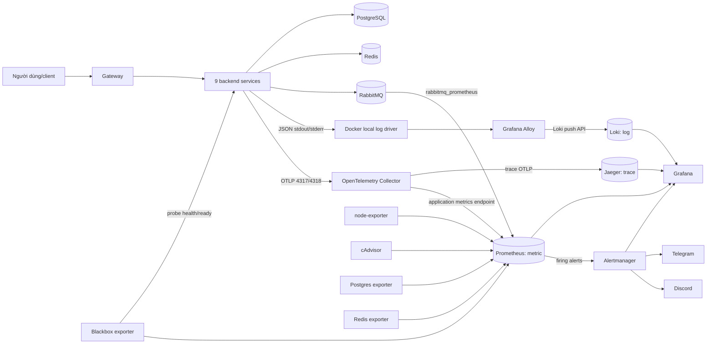

# Tài liệu nhập môn Logging và Observability của NRApp

> Dành cho người bắt đầu từ số 0. Tài liệu được đối chiếu với nguồn chính thức
> và cập nhật ngày **2026-09-05**. Mục tiêu là giúp bạn hiểu hệ thống trước khi
> phải đọc các file YAML, Alloy, PromQL hoặc LogQL.

## Mục lục

1. [Bức tranh đơn giản nhất](#1-bức-tranh-đơn-giản-nhất)
2. [Logging, monitoring và observability](#2-logging-monitoring-và-observability)
3. [Ba tín hiệu log, metric và trace](#3-ba-tín-hiệu-log-metric-và-trace)
4. [Kiến trúc observability của NRApp](#4-kiến-trúc-observability-của-nrapp)
5. [Một request đi qua hệ thống](#5-một-request-đi-qua-hệ-thống)
6. [Giải thích từng công nghệ](#6-giải-thích-từng-công-nghệ)
7. [Kiến thức nền về log](#7-kiến-thức-nền-về-log)
8. [Kiến thức nền về metric và PromQL](#8-kiến-thức-nền-về-metric-và-promql)
9. [Kiến thức nền về distributed tracing](#9-kiến-thức-nền-về-distributed-tracing)
10. [Dashboard hiện có và cách đọc](#10-dashboard-hiện-có-và-cách-đọc)
11. [Alert hoạt động như thế nào](#11-alert-hoạt-động-như-thế-nào)
12. [Vì sao chọn bộ công nghệ này](#12-vì-sao-chọn-bộ-công-nghệ-này)
13. [Bảo mật và dữ liệu không được ghi log](#13-bảo-mật-và-dữ-liệu-không-được-ghi-log)
14. [Retention, persistence, rotation và HA](#14-retention-persistence-rotation-và-ha)
15. [Cẩm nang vận hành hằng ngày](#15-cẩm-nang-vận-hành-hằng-ngày)
16. [Xử lý sự cố theo triệu chứng](#16-xử-lý-sự-cố-theo-triệu-chứng)
17. [Lộ trình tự học](#17-lộ-trình-tự-học)
18. [Từ điển thuật ngữ](#18-từ-điển-thuật-ngữ)
19. [Nguồn chính thức](#19-nguồn-chính-thức)

---

## 1. Bức tranh đơn giản nhất

Hệ thống này không phải “một logger”. Nó là một chuỗi nhiều thành phần. Mỗi
thành phần chỉ giải quyết một phần của bài toán:

| Câu hỏi | Dữ liệu phù hợp | Nơi lưu/xem chính |
|---|---|---|
| Chuyện gì vừa xảy ra, nội dung lỗi là gì? | Log | Alloy → Loki → Grafana |
| Bao nhiêu request, bao nhiêu lỗi, CPU bao nhiêu? | Metric | Prometheus → Grafana |
| Request này đi qua service nào và chậm ở đâu? | Trace | OTel Collector → Jaeger |
| Khi nào cần báo cho con người? | Alert | Prometheus → Alertmanager → Telegram/Discord |

Hình dung đơn giản:

- **Ứng dụng** là người kể lại những gì nó đang làm.
- **Alloy và OTel Collector** là người thu gom/chuyển phát.
- **Loki, Prometheus và Jaeger** là ba kho chuyên dụng.
- **Grafana** là màn hình đọc dữ liệu trong các kho đó.
- **Alertmanager** là tổng đài quyết định gửi cảnh báo cho ai.

Điểm dễ nhầm nhất: Grafana không tự sinh dữ liệu và không phải nơi lưu toàn bộ
dữ liệu. Dashboard trống thường có nghĩa query chưa lấy được dữ liệu từ
datasource, không nhất thiết Grafana bị hỏng.

---

## 2. Logging, monitoring và observability

### 2.1 Logging

Logging là việc ứng dụng ghi lại các sự kiện rời rạc, ví dụ:

```json
{
  "timestamp": "2026-09-05T10:15:30.123Z",
  "severity": "error",
  "service": "payment",
  "message": "Payment provider timed out",
  "request_id": "req_01J...",
  "trace_id": "4bf92f3577b34da6a3ce929d0e0e4736",
  "error": {
    "type": "TimeoutError",
    "code": "PROVIDER_TIMEOUT"
  }
}
```

Một dòng log tốt trả lời được: **khi nào, ở đâu, mức độ gì, chuyện gì xảy ra và
sự kiện thuộc request nào**.

### 2.2 Monitoring

Monitoring là theo dõi trước những đại lượng và điều kiện đã biết, chẳng hạn:

- tỷ lệ HTTP 5xx vượt 5%;
- p95 latency vượt 1,5 giây;
- filesystem còn dưới 10%;
- service không trả lời readiness probe;
- Collector không export được span.

Monitoring trả lời tốt câu hỏi: “Điều mà ta đã dự đoán và đặt rule có đang xảy
ra không?”.

### 2.3 Observability

Observability là khả năng hiểu trạng thái bên trong hệ thống thông qua dữ liệu
nó phát ra, kể cả khi gặp kiểu lỗi chưa được dự đoán. Theo
[OpenTelemetry Observability Primer](https://opentelemetry.io/docs/concepts/observability-primer/),
một hệ thống được instrument tốt phải phát ra đủ tín hiệu để điều tra mà không
phải thêm log và deploy lại ngay giữa sự cố.

Ví dụ:

- Monitoring nói: “p95 của payment đang cao”.
- Observability giúp lần tiếp: dashboard → trace chậm → span gọi PostgreSQL →
  log cùng `trace_id` → lỗi timeout/lock cụ thể.

Observability không thay thế monitoring. Monitoring là một phần của
observability.

### 2.4 Telemetry và instrumentation

**Telemetry** là dữ liệu hệ thống phát ra: logs, metrics, traces và context.

**Instrumentation** là việc gắn mã hoặc thư viện vào ứng dụng để tạo telemetry.
OpenTelemetry hỗ trợ:

- auto/zero-code instrumentation: thư viện tự bọc HTTP, database, framework;
- manual instrumentation: lập trình viên tạo metric/span/event cho nghiệp vụ.

Auto instrumentation cho độ phủ nhanh. Manual instrumentation cho ngữ nghĩa
nghiệp vụ sâu. Hệ thống tốt thường dùng cả hai.

---

## 3. Ba tín hiệu log, metric và trace

OpenTelemetry gọi logs, metrics và traces là các **signals**. Trace là đường đi
của request, metric là phép đo tại runtime, log là bản ghi một sự kiện. Xem
[OpenTelemetry Signals](https://opentelemetry.io/docs/concepts/signals/).

| Đặc điểm | Log | Metric | Trace |
|---|---|---|---|
| Đơn vị cơ bản | Một event/dòng | Một sample số | Một span |
| Mạnh nhất khi | Đọc chi tiết lỗi | Xem xu hướng/tổng quan | Theo dấu một request |
| Query | LogQL | PromQL | Jaeger search/UI |
| Dung lượng | Thường lớn | Nhỏ hơn log | Lớn nếu lấy 100% |
| Ví dụ | `database timeout` | `5xx = 7,2%` | Gateway 20 ms → payment 1,8 s |
| ID liên kết | `trace_id`, `request_id` | labels/exemplar | `trace_id`, `span_id` |

Không tín hiệu nào đủ một mình. Nếu chỉ có log, khó thấy xu hướng và percentile.
Nếu chỉ có metric, ta biết “có lỗi” nhưng thiếu request cụ thể. Nếu chỉ có trace,
ta có đường đi nhưng có thể thiếu nội dung nghiệp vụ và lịch sử tổng hợp.

Quy trình điều tra thường là:

```text
Metric phát hiện bất thường
        ↓
Trace xác định service/span chậm hoặc lỗi
        ↓
Log cùng trace_id giải thích chi tiết
```

Đây là lý do datasource Loki link `TraceID` sang Jaeger và datasource Jaeger có
link ngược từ trace sang log.

---

## 4. Kiến trúc observability của NRApp

### 4.1 Sơ đồ tổng thể



### 4.2 Ba pipeline phải phân biệt

Log:

```text
Backend → stdout/stderr → Docker local driver → Alloy → Loki → Grafana
```

Metric:

```text
Backend/Collector/exporters → endpoint /metrics → Prometheus scrape → Grafana
```

Riêng metric do SDK OpenTelemetry tạo được app **push** vào Collector trước;
sau đó Prometheus **pull/scrape** endpoint Collector expose.

Trace:

```text
Backend OTel SDK → OTLP → OTel Collector → Jaeger → Jaeger UI/Grafana
```

### 4.3 Các service được theo dõi

Pipeline application áp dụng cho chín backend service:

1. `gateway`
2. `auth`
3. `user`
4. `canteen`
5. `chat`
6. `todo`
7. `workschedule`
8. `payment`
9. `mail`

Alloy allowlist đúng các service này để không vô tình đưa toàn bộ log container
khác vào application scope. Blackbox Exporter cũng probe health/readiness của
cả chín service.

### 4.4 Phiên bản đã triển khai

| Thành phần | Image/phiên bản | Vai trò |
|---|---|---|
| Grafana | `grafana/grafana:13.2.0` | UI và dashboard |
| Grafana Alloy | `grafana/alloy:v1.18.0` | Thu log Docker |
| Loki | `grafana/loki:3.7.0` | Lưu và query log |
| Prometheus | `prom/prometheus:v3.12.0` | Lưu/query metric, chạy rule |
| Alertmanager | `prom/alertmanager:v0.34.0` | Route notification |
| OTel Collector | `otel/opentelemetry-collector:0.159.0` | Nhận/xử lý/export telemetry |
| Jaeger | `jaeger:2.20.0` | Lưu/query/hiển thị trace |
| Blackbox Exporter | `v0.28.0` | Probe endpoint từ ngoài app |
| node-exporter | `v1.11.1` | Metric host Linux |
| cAdvisor | `v0.57.0` | Metric container |
| Redis Exporter | `v1.89.0` | Chuyển Redis INFO thành metric |
| PostgreSQL Exporter | `v0.20.1` | Chuyển PostgreSQL stats thành metric |

Pin version giúp môi trường lặp lại được. Không nên dùng `latest` cho thành phần
lõi ở production vì lần pull mới có thể mang breaking change.

---

## 5. Một request đi qua hệ thống

Giả sử client gọi `POST /payments`.

### 5.1 Khi request bắt đầu

Gateway nhận request và middleware tạo hoặc tiếp nhận trace context. Header W3C:

```text
traceparent: 00-4bf92f3577b34da6a3ce929d0e0e4736-00f067aa0ba902b7-01
```

- `4bf9...4736`: `trace_id`, định danh toàn bộ hành trình;
- `00f0...02b7`: ID span cha hiện tại;
- `01`: trace được đánh dấu sampled.

[W3C Trace Context](https://www.w3.org/TR/trace-context/) giúp thư viện/vendor
truyền context cho nhau mà không làm đứt trace.

### 5.2 Mỗi service tạo span

```text
POST /payments                       1.92 s  gateway/server span
├── auth.verifyToken                 22 ms   auth/internal span
├── POST payment/create              1.84 s  payment/server span
│   ├── SELECT payment_method        35 ms   PostgreSQL client span
│   └── provider.authorize           1.76 s  external client span
└── publish payment.completed        18 ms   RabbitMQ producer span
```

Waterfall cho thấy phần lớn 1,92 giây nằm ở `provider.authorize`, không phải
gateway hay PostgreSQL.

### 5.3 Log, metric và alert đồng thời được tạo

Gateway và payment ghi log có cùng `trace_id`. Instrumentation cập nhật request
counter, status và duration histogram. Prometheus scrape các giá trị tổng hợp để
tính request/giây, tỷ lệ lỗi và p95.

Nếu điều kiện bất thường kéo dài đủ `for`, alert chuyển từ `pending` sang
`firing`. Prometheus gửi alert tới Alertmanager; Alertmanager group/deduplicate
rồi mới gửi Telegram và Discord.

---

## 6. Giải thích từng công nghệ

### 6.1 Application logger

Application logger là thư viện/lớp trong source backend dùng tạo log. Nó khác
Loki:

- logger **tạo** event;
- Docker/Alloy **thu** event;
- Loki **lưu/query** event;
- Grafana **hiển thị** event.

Logger nên xuất JSON một dòng ra `stdout`/`stderr`. JSON giúp parse field ổn định
hơn chuỗi tự do. Ghi stdout giúp app không tự quản file, permission, rotation và
transport tới server khác.

### 6.2 Docker và Docker Compose

**Image** là gói bất biến dùng làm khuôn. **Container** là instance đang chạy từ
image. **Service** trong Compose mô tả cách chạy container: image, command,
environment, network, port, volume, healthcheck, restart và dependency.

#### Host port và container port

`127.0.0.1:3001:3000` nghĩa là trình duyệt host gọi port `3001`, Grafana trong
container nghe `3000`, và cổng chỉ bind loopback. Container cùng network gọi
nhau bằng service name và container port, ví dụ `http://loki:3100`. Docker
khuyến nghị tên service thay vì IP động:
[Networking in Compose](https://docs.docker.com/compose/how-tos/networking/).

#### Volume và bind mount

- **Named volume**: Docker quản lý, giữ dữ liệu qua container recreate.
- **Bind mount**: ánh xạ path source vào container, phù hợp YAML/JSON cần Git.

Container bị xóa không đồng nghĩa named volume bị xóa. `down -v`, `volume rm`
hoặc `volume prune` mới có thể xóa nó. Xem
[Docker Volumes](https://docs.docker.com/engine/storage/volumes/).

#### Healthcheck và restart

Healthcheck phân loại `healthy`/`unhealthy`. Process running chưa chắc app sẵn
sàng; Node có thể còn sống nhưng database pool chưa sẵn sàng.

`restart: unless-stopped` tự chạy lại container khi nó thoát hoặc daemon khởi
động, trừ khi operator đã chủ động stop. Nó tăng tự phục hồi nhưng không phải HA.

#### Docker local logging driver

Docker nhận stdout/stderr. Stack dùng `local` driver và giới hạn
`max-size`/`max-file` để xoay log, tránh đầy disk. Docker khuyến nghị `local` cho
trường hợp phổ thông; `json-file` mặc định không rotation có thể làm đầy ổ:
[Docker logging drivers](https://docs.docker.com/engine/logging/configure/).

### 6.3 Grafana Alloy

Alloy là telemetry collector của Grafana, dựa trên hệ sinh thái OTel Collector
và hỗ trợ native Prometheus/Loki. Trong kiến trúc này Alloy phụ trách Docker log:

```text
discovery.docker → discovery.relabel → loki.source.docker
                 → loki.process → loki.write → Loki
```

- `discovery.docker`: hỏi Docker xem container nào tồn tại;
- `discovery.relabel`: lọc service, đổi metadata thành label;
- `loki.source.docker`: tail stdout/stderr;
- `loki.process`: parse/thêm/bỏ field;
- `loki.write`: push batch log vào Loki.

Source giữ **positions file** để restart rồi đọc tiếp đúng vị trí. Xem
[loki.source.docker](https://grafana.com/docs/alloy/latest/reference/components/loki/loki.source.docker/).

Promtail đã EOL ngày 2026-03-02 và phát triển mới chuyển sang Alloy, nên không
xây mới bằng Promtail. Nguồn:
[Grafana log clients](https://grafana.com/docs/enterprise-logs/latest/send-data/).

Alloy cần Docker socket để discover/read logs. Socket này có quyền rất mạnh; ai
điều khiển daemon có thể đạt quyền tương đương root trên host. Không public nó
qua TCP. Xem [Protect Docker daemon socket](https://docs.docker.com/engine/security/protect-access/).

### 6.4 Grafana Loki và LogQL

Loki là hệ thống tập trung log. Nó không index toàn bộ nội dung; chỉ index
timestamp và labels, còn nội dung nén thành chunks. Cách này làm index nhỏ và
giảm chi phí. Xem [Loki overview](https://grafana.com/docs/loki/latest/get-started/overview/).

- **label**: key/value mô tả nguồn, như `service="payment"`;
- **stream**: các dòng có cùng label set;
- **chunk**: khối nén nội dung log của stream trong một khoảng thời gian;
- **index**: bản đồ từ labels/thời gian tới chunk;
- **tenant**: không gian dữ liệu logic nếu bật multi-tenancy.

NRApp chỉ index label low-cardinality:

```text
service, container, compose_project, stream, log_scope
```

Không index `trace_id`, `request_id`, `user_id`, URL động hay `error.id`. Mỗi tổ
hợp labels tạo stream mới; label không giới hạn gây index lớn và nhiều chunk
nhỏ. Xem [Loki cardinality](https://grafana.com/docs/loki/latest/get-started/labels/cardinality/).

LogQL có dạng:

```logql
{stream_selector} | pipeline
```

Ví dụ:

```logql
{log_scope="application", service="payment"}
  | json
  | severity=~"error|fatal"
```

```logql
{log_scope="application"}
  | json
  | trace_id="4bf92f3577b34da6a3ce929d0e0e4736"
```

```logql
sum by (service) (
  count_over_time(
    {log_scope="application"} | json | severity=~"error|fatal" [5m]
  )
)
```

Loki gọi đây là “schema at query”: parse cấu trúc lúc query thay vì index toàn
bộ lúc ingest. Xem [Query Loki](https://grafana.com/docs/loki/latest/query/).

### 6.5 OpenTelemetry SDK, OTLP và Collector

OpenTelemetry (**OTel**) là framework/toolkit vendor-neutral để tạo, thu và
export telemetry. OTel không phải database hay dashboard.

- **API**: giao diện code gọi để tạo span/metric;
- **SDK**: implementation thực thi sampling, processing, exporting;
- **instrumentation library**: tự instrument HTTP, database, Redis...;
- **resource attributes**: mô tả nguồn, ví dụ `service.name`;
- **semantic conventions**: quy ước tên field giữa ngôn ngữ/vendor.

OTel tránh khóa app vào một backend. Sau này đổi Jaeger hoặc hệ metric khác mà
không viết lại toàn bộ instrumentation. Xem
[What is OpenTelemetry?](https://opentelemetry.io/docs/what-is-opentelemetry/).

**OTLP** là OpenTelemetry Protocol. Hai transport phổ biến:

- OTLP/gRPC mặc định port `4317`;
- OTLP/HTTP mặc định port `4318`, path `/v1/traces`, `/v1/metrics`, `/v1/logs`.

Cả hai dùng schema Protobuf. Repo cho app dùng `http/protobuf` tới Collector.
Chi tiết: [OTLP Specification](https://opentelemetry.io/docs/specs/otlp/).

Collector là tiến trình trung gian với pipeline:

```text
Receiver → Processor(s) → Exporter(s)
```

- receiver: cổng vào, như OTLP 4317/4318;
- processor: batch, memory limit, enrich, filter, sampling;
- exporter: cổng ra tới Jaeger hoặc Prometheus endpoint;
- extension: health check và chức năng vận hành.

Tài liệu: [OTel Collector Architecture](https://opentelemetry.io/docs/collector/architecture/).

App không gửi thẳng Jaeger vì Collector cho một endpoint chung, batch/retry
thống nhất, đổi backend không sửa từng service, quan sát pipeline và fan-out khi
cần.

### 6.6 Prometheus, target và exporter

Prometheus là monitoring system và time-series database. Nó lưu:

```text
metric_name{label="value", ...} timestamp value
```

Mỗi tổ hợp metric name + labels là một **time series**. Prometheus chủ yếu dùng
pull model: định kỳ HTTP GET `/metrics`, gọi là scrape. Nó lưu sample và đánh giá
rules. Xem [Prometheus Overview](https://prometheus.io/docs/introduction/overview/).

- **target**: endpoint cần scrape;
- **job**: nhóm target cùng mục đích;
- **instance**: một target cụ thể;
- **scrape interval**: khoảng cách hai lần scrape;
- **scrape timeout**: thời gian tối đa;
- **sample**: giá trị tại timestamp;
- **TSDB**: time-series database;
- **`up`**: `1` khi scrape thành công, `0` khi thất bại.

Pull model giúp Prometheus biết target nào hỏng, dễ mở `/metrics` debug và quản
lý scrape/retention tập trung.

**Exporter** là adapter:

```text
Hệ thống gốc → exporter đọc API/stats → /metrics → Prometheus scrape
```

- `node-exporter`: CPU, RAM, filesystem, network của **host** từ `/proc`, `/sys`;
- `cAdvisor`: CPU, working-set memory, network, OOM, throttling của **container**;
- Redis Exporter: chuyển Redis `INFO` thành metric;
- PostgreSQL Exporter: đọc statistics views như `pg_stat_activity`;
- RabbitMQ: dùng plugin `rabbitmq_prometheus` tích hợp ở port `15692`.

Nguồn chính thức:

- [node_exporter](https://github.com/prometheus/node_exporter)
- [cAdvisor](https://github.com/google/cadvisor)
- [Redis INFO](https://redis.io/docs/latest/commands/info/)
- [PostgreSQL Monitoring](https://www.postgresql.org/docs/18/monitoring.html)
- [RabbitMQ Monitoring](https://www.rabbitmq.com/docs/monitoring)

### 6.7 Blackbox Exporter

Blackbox Exporter kiểm tra từ góc nhìn bên ngoài process. Nó probe HTTP, HTTPS,
TCP, DNS, ICMP, gRPC. NRApp gửi GET tới health/readiness của chín service.

- `probe_success = 1`: đạt điều kiện;
- `probe_success = 0`: DNS/connect/timeout/status/body không đạt;
- `probe_duration_seconds`: thời gian probe;
- `probe_http_status_code`: status nhận được.

Prometheus gọi `/probe?target=...&module=...`; relabeling đổi target gốc thành
parameter và địa chỉ scrape thành Blackbox Exporter. Đây là
[multi-target exporter pattern](https://prometheus.io/docs/guides/multi-target-exporter/).

**Black-box** hỏi “client có gọi được không?”. **White-box** nhìn internal state
như CPU, pool, queue. Process có thể sống và metric scrape được nhưng endpoint
nghiệp vụ không ready, nên cần cả `up` lẫn `probe_success`.

### 6.8 Jaeger

Jaeger là backend distributed tracing. Nó nhận span, lưu trace và cung cấp UI
để tìm trace, xem waterfall, quan hệ parent/child, critical path và lỗi.

OTel tạo/thu/chuyển telemetry; Jaeger lưu/query/hiển thị trace. Jaeger khuyến
nghị instrument bằng OTel SDK. Xem
[Jaeger Introduction](https://www.jaegertracing.io/docs/2.20/).

Hiện Jaeger chạy all-in-one, dùng memory storage. Cách này tiện local/dev nhưng
trace mất khi restart và không phù hợp production:
[Jaeger Memory Storage](https://www.jaegertracing.io/docs/2.20/storage/memory/).

### 6.9 Grafana

Grafana là visualization/exploration UI. Nó kết nối bốn datasource:

| Datasource | Dữ liệu |
|---|---|
| Prometheus | Metrics |
| Loki | Logs |
| Jaeger | Traces |
| Alertmanager | Alerts và silences |

**Dashboard** là tập panel dựng sẵn. **Explore** là nơi query ad-hoc. **Panel**
là biểu đồ/stat/table/log view. **Variable** là bộ lọc như service/severity.
Grafana query datasource khi mở dashboard, không copy toàn bộ dữ liệu vào nó.

Datasource/dashboard được provision as code từ YAML/JSON để clone, review và
deploy đồng nhất. Dashboard provisioned chỉnh trong UI có thể bị file ghi đè:
[Grafana Provisioning](https://grafana.com/docs/grafana/latest/administration/provisioning/).

### 6.10 Alertmanager, Telegram và Discord

Prometheus đánh giá alert expression. Alertmanager nhận alert rồi:

- deduplicate;
- group;
- route;
- inhibit;
- silence;
- gửi firing/resolved notification.

Xem [Prometheus Alertmanager](https://prometheus.io/docs/alerting/0.33/alertmanager/).

Telegram/Discord chỉ là notification receiver, không lưu telemetry. Credential
được đọc từ ba secret file `discord_webhook_url`, `telegram_bot_token`,
`telegram_chat_id`. Cấu hình file secret là tính năng chính thức:
[Alertmanager Configuration](https://prometheus.io/docs/alerting/latest/configuration/).

Receiver mặc định là `noop` đến khi operator tạo đủ secret và chủ động bật cấu
hình. Điều này tránh clone mới vô tình gửi alert ra kênh thật.

---

## 7. Kiến thức nền về log

### 7.1 Structured log và plain-text log

Plain text:

```text
Payment error for user 42: timeout after 3000ms
```

Structured JSON:

```json
{
  "severity": "error",
  "service": "payment",
  "event": "payment_provider_timeout",
  "duration_ms": 3000,
  "user_ref": "usr_hash_...",
  "trace_id": "4bf92f3577b34da6a3ce929d0e0e4736"
}
```

JSON tốt hơn cho máy vì không cần regex mong manh, field/type ổn định, dễ lọc,
aggregate và redaction. `message` vẫn phải dễ đọc cho con người; structured log
không có nghĩa nhét nguyên mọi object vào log.

### 7.2 Log level/severity

| Level | Khi dùng | Ví dụ |
|---|---|---|
| `trace` | Chi tiết cực sâu, volume rất lớn | từng bước parser |
| `debug` | Chẩn đoán trong dev/tạm thời | cache lookup decision |
| `info` | Sự kiện bình thường đáng biết | service started, order created |
| `warn` | Bất thường nhưng request còn tiếp tục | retry, fallback |
| `error` | Operation/request thất bại | database timeout |
| `fatal` | Process không thể tiếp tục an toàn | config invalid |

Không dùng `error` cho mọi HTTP 4xx. Một 401/404 có thể là hành vi client bình
thường tùy ngữ cảnh. Retry thành công vẫn có thể là `warn` vì dependency bất ổn.

### 7.3 Các ID thường gặp

| ID | Phạm vi | Mục đích |
|---|---|---|
| `request_id` | Một request theo quy ước app | Support/debug nhanh |
| `trace_id` | Toàn bộ hành trình phân tán | Nối span/log giữa service |
| `span_id` | Một operation trong trace | Xác định đúng bước |
| `error.id` | Một occurrence lỗi | Trao đổi với support/user |
| Business ID | Order/payment/todo... | Liên hệ nghiệp vụ, cần bảo vệ PII |

Không giả định `request_id` bằng `trace_id`. Request ID là quy ước ứng dụng;
trace ID có format và ngữ nghĩa tracing riêng.

### 7.4 Stack trace

Stack trace là chuỗi call frame cho biết exception đi qua function/file nào. Nó
hữu ích nhưng dài, tốn storage và có thể lộ đường dẫn/source detail. Không log
lặp cùng exception ở mọi tầng; việc đó nhân bản noise mà không thêm thông tin.

### 7.5 Rotation khác retention

- **Rotation**: chia/đổi file đang ghi theo size/time và xóa file local cũ theo
  count. Docker local driver làm việc này.
- **Retention**: giữ dữ liệu trong backend bao lâu. Loki Compactor xử lý
  retention của log tập trung.

Rotation 3 × 10 MB không có nghĩa Loki chỉ giữ 30 MB. Alloy đã chuyển log sang
Loki; hai nơi có vòng đời độc lập.

### 7.6 Application log và system log

NRApp dùng:

```text
log_scope="application"
log_scope="system"
```

Application là log chín service nghiệp vụ. System là log observability/hạ tầng
được allowlist. Tách scope giúp developer không bị lẫn log Loki/Grafana/exporter,
nhưng operator vẫn điều tra được chính telemetry pipeline.

---

## 8. Kiến thức nền về metric và PromQL

### 8.1 Bốn loại metric

Prometheus client libraries có bốn core types:
[Prometheus Metric Types](https://prometheus.io/docs/concepts/metric_types/).

#### Counter

Chỉ tăng hoặc reset về 0 khi process restart, ví dụ `http_requests_total`,
`errors_total`. Dùng `rate()`/`increase()`, không dùng raw counter để kết luận
request/giây.

```promql
rate(http_requests_total[5m])
```

#### Gauge

Có thể tăng hoặc giảm: active connections, memory, queue depth. Có thể đọc trực
tiếp hoặc dùng `avg_over_time`, `max_over_time`.

#### Histogram

Đếm observation vào các bucket `le`, đồng thời có `_sum` và `_count`. Dùng cho
request duration/response size và percentile:

```text
request_duration_seconds_bucket{le="0.1"}
request_duration_seconds_bucket{le="0.5"}
request_duration_seconds_bucket{le="1"}
request_duration_seconds_sum
request_duration_seconds_count
```

#### Summary

Cũng đo phân phối, có `_sum`, `_count` và có thể quantile ở client. Summary
quantile khó aggregate đúng qua nhiều instance; histogram thường linh hoạt hơn
cho PromQL server-side.

### 8.2 Label và cardinality

Label hợp lý:

```text
method=GET|POST
status_code=200|400|500
service=payment|auth|...
route=/users/:id
```

Label nguy hiểm:

```text
user_id=mọi user
trace_id=mỗi request
email=không giới hạn
url=/users/123, /users/124, ...
```

Mỗi combination tạo time series và tốn RAM/disk/CPU/network. Prometheus cảnh
báo không dùng label cho user ID, email hoặc tập không giới hạn:
[Metric and label naming](https://prometheus.io/docs/practices/naming/).

Phải dùng route template `/users/:id`, không dùng path thật `/users/92837`.
OpenTelemetry cũng yêu cầu `http.route` low-cardinality:
[HTTP semantic conventions](https://opentelemetry.io/docs/specs/semconv/http/http-spans/).

### 8.3 PromQL cơ bản

```promql
# Chọn metric
up

# Lọc label
up{job="backend-readiness"}

# Regex
up{service=~"payment|auth"}

# Tổng request mỗi giây theo service
sum by (service) (rate(http_requests_total[5m]))
```

`by (service)` giữ label service; labels khác bị aggregate.

### 8.4 Throughput và tỷ lệ 5xx

Tên metric thực tế phụ thuộc version OTel SDK. Dùng autocomplete của Grafana/
Prometheus và dashboard hiện tại để lấy tên đúng. Công thức điển hình:

```promql
sum by (service_name) (
  rate(http_server_request_duration_seconds_count[5m])
)
```

```promql
sum(rate(http_server_request_duration_seconds_count{
  http_response_status_code=~"5.."
}[5m]))
/
sum(rate(http_server_request_duration_seconds_count[5m]))
```

Nhân `100` nếu cần phần trăm. Rule nên có minimum traffic: một lỗi trên một
request là 100% nhưng chưa chắc đáng đánh thức on-call.

### 8.5 p50, p95 và p99

- p50: 50% request nhanh hơn hoặc bằng giá trị này;
- p95: 95% request nhanh hơn hoặc bằng, 5% chậm hơn;
- p99: 99% request nhanh hơn hoặc bằng.

p95 = 1,5 s không phải mọi request mất 1,5 s và không phải average.

```promql
histogram_quantile(
  0.95,
  sum by (le, service_name) (
    rate(http_server_request_duration_seconds_bucket[5m])
  )
)
```

Phải giữ `le` khi aggregate; bỏ nó thì không còn buckets để tính percentile.

### 8.6 `rate()`, `increase()` và counter reset

- `rate(counter[5m])`: tốc độ trung bình mỗi giây;
- `increase(counter[5m])`: tăng tổng cộng bao nhiêu trong 5 phút.

Hai hàm xử lý counter reset. Không dùng `rate()` trên gauge.

### 8.7 “No data” không bằng zero

- `0`: series tồn tại và giá trị zero;
- no data: không có series/sample phù hợp.

Service idle có thể chưa tạo HTTP duration series, nên panel throughput không có
dòng dù service ready. Không biến mọi no-data thành zero: khi telemetry pipeline
mất dữ liệu, no-data chính là sự cố.

### 8.8 Bốn golden signals

Google SRE khuyên dashboard service có:

- **latency**: thời gian phục vụ;
- **traffic**: lượng request/nhu cầu;
- **errors**: request thất bại;
- **saturation**: tài nguyên gần/quá giới hạn.

Service Reliability dashboard đi theo triết lý này. Nguồn:
[Google SRE – Monitoring Distributed Systems](https://sre.google/sre-book/monitoring-distributed-systems/).

---

## 9. Kiến thức nền về distributed tracing

### 9.1 Trace và span

**Trace** là hành trình của một transaction phân tán. **Span** là một đơn vị công
việc có start time, duration, name, status và attributes.

Một span thường có `trace_id`, `span_id`, `parent_span_id`, name, kind,
start/end time, attributes, events và status.

| Span kind | Nghĩa | Ví dụ |
|---|---|---|
| `SERVER` | Nhận request | payment nhận HTTP từ gateway |
| `CLIENT` | Gọi dependency | payment gọi PostgreSQL/provider |
| `PRODUCER` | Gửi message | publish RabbitMQ |
| `CONSUMER` | Nhận message | mail xử lý event |
| `INTERNAL` | Công việc nội bộ | validate business rule |

**Attribute** là metadata key/value. **Event** là điểm thời gian đáng chú ý như
exception/retry. **Status** mô tả kết quả. Không đưa password/token/body nhạy
cảm vào span; trace cũng cần bảo vệ như log.

### 9.2 Parent/child, concurrency và critical path

Parent/child cho biết operation nào sinh operation nào. Critical path là chuỗi
span quyết định tổng latency. Hai call 500 ms chạy song song có thể làm request
tăng khoảng 500 ms, không phải 1.000 ms. Waterfall giúp thấy concurrency.

### 9.3 Context propagation

SDK inject `traceparent` vào outgoing request/message và extract ở service nhận.
Nếu service không propagate header, trace bị tách. Context propagation cũng cho
phép inject trace/span ID vào log:
[OTel Context Propagation](https://opentelemetry.io/docs/concepts/context-propagation/).

Với RabbitMQ/background job, context phải được truyền qua message headers; HTTP
auto-instrumentation không tự giải quyết messaging tùy chỉnh.

### 9.4 Sampling

Giữ 100% trace tốn network/CPU/storage khi traffic tăng.

- **head sampling**: quyết định sớm; rẻ nhưng chưa biết trace cuối cùng lỗi/chậm;
- **tail sampling**: đợi phần lớn/toàn trace; có thể giữ error/slow traces nhưng
  cần state/tài nguyên ở Collector.

Traffic thấp không nên sampling tùy tiện. Khi cần tối ưu, ưu tiên giữ 100% error
và slow traces, lấy mẫu success. Xem
[OpenTelemetry Sampling](https://opentelemetry.io/docs/concepts/sampling/).

---

## 10. Dashboard hiện có và cách đọc

### 10.1 Backend observability / Service reliability

Dashboard trả lời readiness, request rate, 5xx ratio, p95, throughput theo
service, slow routes, rejected requests và OTel span pipeline.

```text
http://127.0.0.1:3001/d/nrapp-service-reliability/service-reliability
```

Cách đọc:

1. Chọn time range 15 phút hoặc 1 giờ.
2. Chọn service ở variable.
3. Xem readiness.
4. Đọc traffic cùng error ratio, không tách rời.
5. Xem p95 và slow routes.
6. Chuyển Jaeger tìm trace chậm/lỗi.
7. Từ trace chuyển log theo `trace_id`.

### 10.2 Backend observability / Application logs

Cho biết service phát log, volume, warning/error và structured log chi tiết.

```text
http://127.0.0.1:3001/d/nrapp-application-logs/application-logs
```

Lọc theo service, severity, search và time range. Service idle có thể không có
log mới; mở time range rộng hơn trước khi kết luận pipeline hỏng.

### 10.3 Infrastructure overview

Cho góc nhìn host và pipeline: CPU, memory, filesystem, target up/down, Collector
receive/export/drop và dependency health. Mở trang này khi nhiều service cùng
chậm/lỗi.

### 10.4 Container health

Hiển thị CPU, memory working set, network, uptime, restart/recreate, OOM và CPU
throttling.

- **OOMKilled**: kernel/cgroup dừng container do vượt memory.
- **CPU throttling**: container muốn dùng CPU nhưng bị quota giới hạn.

Process vẫn có thể running trước/sau sự cố, nên chỉ nhìn `docker ps` chưa đủ.

### 10.5 Backend dependencies

Quan sát PostgreSQL connections, Redis memory/clients, RabbitMQ backlog/consumer
và exporter health. Nếu app chậm nhưng host bình thường, mở dashboard này.

### 10.6 Vì sao dashboard/folder có thể trống?

- `/dashboards` chỉ là catalog;
- folder cũ có thể còn trong Grafana volume;
- datasource tồn tại không làm dashboard tự sinh;
- dashboard chỉ provision khi provider YAML trỏ đúng JSON;
- panel trống có thể do time range, filter, idle traffic hoặc no-data.

Nếu dashboard không xuất hiện, kiểm provisioning/Grafana logs. Nếu chỉ panel
trống, kiểm datasource, query, variable, time range và traffic.

---

## 11. Alert hoạt động như thế nào

```text
Prometheus scrape metric
        ↓
Evaluate PromQL rule
        ↓
inactive → pending → firing
        ↓
Alertmanager group/dedup/route/inhibit
        ↓
Telegram + Discord
        ↓
Điều kiện hết → resolved
```

- `inactive`: expression không có series vi phạm;
- `pending`: đã vi phạm nhưng chưa đủ thời gian `for`;
- `firing`: vi phạm liên tục đủ thời gian;
- resolved: không còn vi phạm.

`for: 5m` tránh alert vì spike ngắn nhưng đặt quá dài làm phát hiện chậm. Ngưỡng
phải dựa trên user impact/SLO.

### 11.1 Bảy application alert

| Alert | Ý nghĩa |
|---|---|
| `BackendServiceUnavailable` | Readiness probe thất bại |
| `BackendHttp5xxRatioHigh` | Tỷ lệ 5xx cao và đủ traffic |
| `BackendHttpLatencyP95High` | p95 cao và đủ traffic |
| `BackendContainerOomKilled` | Container bị OOM |
| `BackendContainerCpuThrottlingHigh` | CPU bị throttle nhiều |
| `ContainerRestartLoop` | Container restart/recreate liên tục |
| `ApplicationLogPipelineUnavailable` | Pipeline application log không hoạt động |

Nhóm infrastructure còn theo dõi target down, host CPU/RAM/filesystem,
Collector drop/export failure, RabbitMQ backlog, PostgreSQL saturation và Redis
memory.

### 11.2 Group, dedup, inhibition và silence

- **Grouping**: nhiều alert liên quan thành một notification.
- **Deduplication**: cùng alert lặp không spam như alert mới.
- **Inhibition**: alert nguyên nhân lớn chặn notification phụ.
- **Silence**: operator tắt notification khớp matcher trong khoảng thời gian.

Silence chỉ tắt notification, không sửa sự cố và không dừng rule evaluation.
Luôn ghi owner/reason/end time.

Alert tốt phải có impact rõ, hành động cụ thể, owner, runbook/dashboard link và
ít false positive. Google SRE nhấn mạnh signal cao/noise thấp vì alert quá nhiều
làm con người bỏ qua cả alert thật.

---

## 12. Vì sao chọn bộ công nghệ này

| Thành phần | Vì sao chọn | Trade-off chính |
|---|---|---|
| OpenTelemetry | Chuẩn mở, vendor-neutral, đa ngôn ngữ | Cần hiểu semantic conventions/version SDK |
| OTel Collector | Tách app khỏi telemetry backend | Thêm một hop cần monitor |
| Prometheus | Metric/exporter mạnh, PromQL, alerting | Local single-node, cần kiểm cardinality |
| Loki | Tích hợp Grafana, index nhỏ, hợp container log | Full-text cực lớn không phải thế mạnh |
| Alloy | Docker logs native, kế nhiệm Promtail | Cần Docker socket và Alloy syntax |
| Jaeger | UI tracing trưởng thành, nhận OTLP | Memory all-in-one chưa bền/HA |
| Grafana | Một UI nối mọi signal | Dashboard phải được bảo trì |
| Alertmanager | Group/dedup/route/silence mạnh | Không phải incident-management đầy đủ |
| Blackbox Exporter | Availability từ ngoài app | HTTP 200 không chứng minh mọi nghiệp vụ đúng |
| Exporters | Tái dùng adapter cộng đồng | Thêm credential/quyền/failure mode |
| Docker Compose | Gọn, tái tạo tốt trên một host | Không orchestration/HA đa node |

### 12.1 Loki thay vì ELK/OpenSearch

Loki phù hợp vì stack đã dùng Grafana, workload là container structured logs,
query bắt đầu từ time + service + severity, không cần index mọi từ, và vận hành
single-node gọn. OpenSearch/Elasticsearch hợp hơn nếu full-text/SIEM/search sâu
trên lượng lớn là yêu cầu cốt lõi, nhưng index và vận hành nặng hơn.

### 12.2 Prometheus thay vì đếm mọi thứ từ log

Metric rẻ hơn và có semantics rõ cho rate, histogram, alert. Dùng log tính mọi
SLI phụ thuộc việc log có drop/đổi format và query nặng hơn.

- tổng hợp cần dashboard/alert → metric;
- nội dung event → log;
- timing/quan hệ transaction → trace.

### 12.3 Jaeger thay vì trace trong log

Log không tự mô hình hóa parent/child, concurrency, critical path, waterfall.
Jaeger hiểu trace data model và ghép span thành hành trình.

### 12.4 Vì sao có cả Alloy và OTel Collector?

Alloy thu Docker runtime logs; OTel Collector nhận metrics/traces app push qua
OTLP. Tách giúp failure domain và tuning rõ: lỗi log collection không làm mất
trace receiver, trace traffic có thể scale độc lập. Có thể gộp sau này nhưng chỉ
sau benchmark, failure test và migration plan.

### 12.5 Dashboard as code

Dashboard UI chỉnh tay nhanh nhưng khó tái tạo. YAML/JSON provisioning cho phép
review, backup và deploy đồng nhất. Đây là workflow Grafana hỗ trợ chính thức:
[Provision Grafana](https://grafana.com/docs/grafana/latest/administration/provisioning/).

---

## 13. Bảo mật và dữ liệu không được ghi log

Không ghi trực tiếp:

- password, PIN, OTP;
- access/refresh token, API key, cookie/session;
- Authorization header;
- database connection string có credential;
- private/encryption key;
- Discord webhook, Telegram bot token;
- số thẻ, CVV, dữ liệu thanh toán đầy đủ;
- body chứa PII/secret;
- raw email, phone, address nếu không thật sự cần;
- dữ liệu sức khỏe/định danh nhà nước/dữ liệu nhạy cảm.

OWASP khuyên remove, mask, sanitize, hash hoặc encrypt dữ liệu nhạy cảm trước
khi log: [OWASP Logging Cheat Sheet](https://cheatsheetseries.owasp.org/cheatsheets/Logging_Cheat_Sheet.html).

### 13.1 Redaction, masking và hashing

- **redaction**: thay bằng `[REDACTED]`;
- **masking**: giữ phần nhận biết, như `****1234`;
- **hash/pseudonymization**: giá trị ổn định khó đọc ngược, cần salt/key và
  threat model phù hợp.

Đây không thay thế password hashing chuẩn.

### 13.2 Log injection

Input user có thể chứa newline/delimiter để tạo log giả. Logger phải encode JSON
đúng, sanitize control characters; không nối input thô vào format tự chế.

### 13.3 Secret, port và quyền

Alertmanager secrets phải Git-ignore, permission tối thiểu, mount read-only.
Không paste secret vào issue/chat, commit `.env`, in resolved config ra CI log.

UI/API quản trị bind `127.0.0.1`. Muốn remote access, dùng VPN hoặc reverse proxy
có TLS/auth; không đổi hàng loạt sang `0.0.0.0` cho tiện.

Alloy cần Docker socket và cAdvisor cần host mounts/privileged. Chỉ dùng image
chính thức pin version, không public API, giới hạn ai được sửa cấu hình. Grafana
cần mật khẩu mạnh, account theo role, audit quyền và retention phù hợp.

---

## 14. Retention, persistence, rotation và HA

| Dữ liệu | Nơi sống chính | Khi container recreate |
|---|---|---|
| Docker log gần đây | Docker local driver | Theo vòng đời/rotation container |
| Loki logs | Loki volume/filesystem | Còn nếu volume còn |
| Prometheus metrics | Prometheus TSDB volume | Còn nếu volume còn |
| Grafana users/settings | Grafana volume | Còn nếu volume còn |
| Dashboard/datasource definitions | Source bind mount | Tái provision được |
| Alertmanager silences/nflog | Alertmanager volume | Còn nếu volume còn |
| Jaeger traces hiện tại | Memory | **Mất khi Jaeger restart** |
| Alloy positions | Alloy storage path | Quyết định resume tail |

Retention không phải backup. Loki filesystem không tự xóa chỉ vì disk sắp đầy;
deletion phụ thuộc Compactor/retention. Operator vẫn phải monitor free disk:
[Loki Storage](https://grafana.com/docs/loki/latest/configure/storage/) và
[Loki Retention](https://grafana.com/docs/loki/latest/operations/storage/retention/).

Volume sống qua recreate nhưng không chống host disk hỏng, `down -v`, prune,
corruption, ransomware hoặc thao tác nhầm. Production cần backup đã test restore
hoặc distributed/object storage.

`restart: unless-stopped` không phải high availability. Stack hiện chỉ một host,
một instance mỗi thành phần lõi, Jaeger memory, nên phù hợp local/dev/môi trường
nhỏ hơn là HA production.

Jaeger production cần persistent backend. Tài liệu hỗ trợ OpenSearch,
Elasticsearch, Cassandra và khuyến nghị OpenSearch ở quy mô lớn:
[Jaeger Storage Backends](https://www.jaegertracing.io/docs/2.20/storage/).
Không tự thêm OpenSearch khi chưa quyết traffic, sampling, retention, replica,
disk, backup, TLS và credentials.

---

## 15. Cẩm nang vận hành hằng ngày

Đứng tại:

```bash
cd /media/thanhle/D5/pj1/backend
```

### 15.1 Kiểm tra pipeline

```bash
npm run observability:smoke
npm run observability:acceptance
```

Acceptance kiểm health stack, Prometheus targets, 9/9 readiness, 9/9 application
metrics, 9/9 nguồn log và trace end-to-end.

### 15.2 Container và logs

```bash
docker compose -f logger/compose.yaml ps
```

```bash
docker compose -f logger/compose.yaml logs --tail=100 \
  alloy loki prometheus otel-collector jaeger grafana alertmanager
```

```bash
docker compose -f logger/compose.yaml logs -f alloy loki otel-collector
```

`Up (healthy)` là tốt. `Up` không có health status có thể do image không khai
báo healthcheck; kiểm endpoint/log riêng.

### 15.3 Endpoints và UI

```bash
curl -fsS http://127.0.0.1:9090/-/ready
curl -fsS http://127.0.0.1:9093/-/ready
curl -fsS http://127.0.0.1:3100/ready
curl -fsS http://127.0.0.1:12345/-/ready
curl -fsS http://127.0.0.1:13133/
curl -fsS http://127.0.0.1:3001/api/health
```

| Dịch vụ | URL |
|---|---|
| Grafana | `http://127.0.0.1:3001` |
| Jaeger UI | `http://127.0.0.1:16686` |
| Prometheus | `http://127.0.0.1:9090` |
| Prometheus targets | `http://127.0.0.1:9090/targets` |
| Prometheus alerts | `http://127.0.0.1:9090/alerts` |
| Alertmanager | `http://127.0.0.1:9093` |
| Alloy UI | `http://127.0.0.1:12345` |
| Loki readiness | `http://127.0.0.1:3100/ready` |

### 15.4 Validate trước restart

```bash
npm run observability:config
```

```bash
docker run --rm \
  -v "$PWD/logger/observability/prometheus:/etc/prometheus:ro" \
  --entrypoint /bin/promtool \
  prom/prometheus:v3.12.0 \
  check config /etc/prometheus/prometheus.yaml
```

```bash
docker run --rm \
  -v "$PWD/logger/observability/alertmanager:/etc/alertmanager:ro" \
  --entrypoint /bin/amtool \
  prom/alertmanager:v0.34.0 \
  check-config /etc/alertmanager/discord-telegram.yaml
```

### 15.5 Bật Telegram và Discord

1. Tạo Discord incoming webhook cho đúng channel.
2. Tạo Telegram bot bằng BotFather.
3. Thêm bot vào group/chat và lấy numeric chat ID.
4. Tạo ba secret file theo README Alertmanager secrets.
5. Đặt trong `logger/.env`:

```dotenv
ALERTMANAGER_CONFIG_FILE=./observability/alertmanager/discord-telegram.yaml
```

6. Validate và recreate Alertmanager:

```bash
node scripts/observability-compose.mjs up -d --force-recreate alertmanager
```

7. Test cả firing và resolved. Không chờ sự cố thật mới biết bot thiếu quyền.

### 15.6 Quy trình điều tra chuẩn

```text
1. Ghi thời gian, service, triệu chứng và user impact
2. Service Reliability: readiness, rate, 5xx, p95
3. Infrastructure: host/container/dependency
4. Jaeger: chọn trace lỗi/chậm
5. Loki: log cùng trace_id
6. So sánh deploy/config change gần nhất
7. Mitigate trước nếu user đang bị ảnh hưởng
8. Xác nhận metric hồi phục và alert resolved
9. Ghi postmortem/runbook nếu cần
```

---

## 16. Xử lý sự cố theo triệu chứng

### 16.1 Grafana mở được nhưng panel trống

Kiểm lần lượt time range, dashboard variables, datasource health, Prometheus
target, query trong Explore, app có traffic/log không, provisioning và Grafana
logs. “No data” không đồng nghĩa Grafana chết; mail worker idle có thể không có
HTTP metric trong 5 phút.

### 16.2 Prometheus target DOWN

- `up=0`: Prometheus không scrape được metric endpoint;
- `probe_success=0`: Blackbox gọi health endpoint không đạt;
- exporter down: exporter chết hoặc mất connection;
- app readiness fail nhưng app metric up: process sống, dependency/readiness lỗi.

Kiểm DNS service name, network membership, container port, path, timeout,
TLS/auth và target logs.

### 16.3 Có metric nhưng không có log

1. App có ghi stdout/stderr không?
2. Service có trong Alloy allowlist không?
3. Alloy UI `loki.source.docker.application` có target không?
4. Parsing errors có tăng không?
5. `loki.write` có retry/error không?
6. Loki `/ready` OK không?
7. Query đúng `log_scope`/time range không?
8. Alloy positions có được lưu không?

### 16.4 Log không link được trace

Kiểm `trace_id` có 32 ký tự hex. Nếu thiếu/sai: logger chưa inject active
context, log chạy ngoài async context, derived-field regex không khớp hoặc Jaeger
datasource link sai. Trace có ID nhưng bị sampler/drop cũng có thể không tìm thấy.

### 16.5 Jaeger không có trace

1. Trong container phải gọi `otel-collector`, không gọi `localhost`.
2. Protocol khớp HTTP/protobuf hoặc gRPC.
3. Port 4318/4317 reachable trên shared network.
4. `service.name` đã đặt.
5. OTel SDK init trước framework/module cần instrument.
6. Sampler không drop.
7. Collector accepted/refused/export-failed spans.
8. Jaeger running và time range/search đúng.
9. Nhớ memory storage mất trace sau restart.

### 16.6 p95 cao nhưng average bình thường

Không mâu thuẫn: đa số request nhanh nhưng 5% tail chậm. Tìm slow routes, trace
duration cao, dependency span và CPU throttling.

### 16.7 Error ratio cao nhưng lỗi ít

Xem denominator traffic. Một lỗi trên một request là 100%. Rule có minimum
traffic để giảm false alarm; dashboard luôn đọc rate cùng ratio.

### 16.8 Alert firing nhưng Telegram/Discord im lặng

Kiểm Alertmanager UI đã nhận alert, receiver có còn `noop`, env config file,
container đã recreate, secret content/permission, bot membership, Telegram chat
ID, Discord webhook, group wait/routing và HTTP 4xx/429/timeout trong logs.

### 16.9 Restart loop hoặc disk tăng nhanh

Với restart loop, xem `docker inspect`, exit code, OOMKilled, healthcheck,
permission, invalid config, port conflict và dependency. Restart policy không
sửa root cause.

Với disk, tách Docker logs, Loki chunks/index, Prometheus TSDB, Grafana/
Alertmanager volumes, writable layers, retention, cardinality và debug volume.
Không chạy `docker volume prune` khi chưa xác định/backup đúng target.

---

## 17. Lộ trình tự học

### Giai đoạn 1: hiểu luồng

1. Đọc phần 1–6.
2. Mở Grafana và nhận biết bốn datasource.
3. Mở Prometheus `/targets`, hiểu UP/DOWN.
4. Mở Alloy UI, tìm hai Docker log sources.
5. Mở Jaeger, chọn trace và đọc waterfall.

### Giai đoạn 2: query cơ bản

1. LogQL theo service, severity, trace ID.
2. PromQL `up`, `probe_success`, `rate()`.
3. Hiểu counter reset và no-data.
4. Hiểu histogram và p95.

### Giai đoạn 3: lỗi giả lập an toàn

1. Gọi test endpoint an toàn.
2. Tìm thay đổi ở metric.
3. Tìm trace.
4. Từ trace tìm log.
5. Ghi lại thành runbook.

### Giai đoạn 4: vận hành

1. Validate config trước deploy.
2. Test notification firing/resolved.
3. Đặt retention theo dung lượng thực.
4. Test backup/restore.
5. Thiết kế SLI/SLO theo user journey.
6. Sau đó mới cân nhắc sampling, HA và persistent trace backend.

---

## 18. Từ điển thuật ngữ

| Thuật ngữ | Giải thích ngắn |
|---|---|
| Agent | Tiến trình gần nguồn để thu/chuyển telemetry |
| Alert | Điều kiện bất thường được rule phát hiện |
| Alertmanager | Group, dedup, route, silence và gửi notification |
| Alloy | Collector Grafana; repo dùng thu Docker logs |
| Annotation | Mô tả alert như summary/runbook |
| Attribute | Metadata key/value trên span/log/resource |
| Baggage | Context key/value truyền xuyên service |
| Batch | Gom item để gửi hiệu quả hơn |
| Bind mount | Ánh xạ path host vào container |
| Black-box monitoring | Kiểm hệ thống từ ngoài như client |
| Cardinality | Số giá trị/tổ hợp label khác nhau |
| cAdvisor | Metric tài nguyên container/cgroup |
| Chunk | Khối nén nội dung Loki log stream |
| Collector | Nhận, xử lý và chuyển telemetry |
| Container | Instance đang chạy của image |
| Correlation | Liên kết logs/metrics/traces cùng sự kiện |
| Counter | Metric chỉ tăng, trừ reset |
| Critical path | Chuỗi operation quyết định tổng latency |
| Dashboard | Tập panel dựng sẵn |
| Datasource | Kết nối Grafana tới data backend |
| Deduplication | Loại notification trùng |
| Derived field | Field tách từ log để link, như TraceID |
| Dimension | Chiều phân loại dữ liệu, thường là label |
| Discovery | Tự tìm target/container |
| Distributed trace | Trace qua nhiều process/service |
| Error budget | Mức không tin cậy cho phép theo SLO |
| Event | Sự kiện tại một thời điểm |
| Exemplar | Metric sample liên kết trace cụ thể |
| Explore | Grafana query ad-hoc |
| Exporter | Adapter expose metric/gửi telemetry |
| Firing | Alert vi phạm đủ thời gian |
| Gauge | Metric có thể tăng/giảm |
| Golden signals | Latency, traffic, errors, saturation |
| Grafana | UI hiển thị nhiều datasource |
| gRPC | RPC trên HTTP/2; OTLP thường dùng 4317 |
| Healthcheck | Phép kiểm container/process có khỏe |
| Histogram | Metric phân phối observation vào buckets |
| Image | Khuôn bất biến tạo container |
| Index | Cấu trúc giúp tìm dữ liệu |
| Ingestion | Quá trình nhận data vào backend |
| Inhibition | Chặn alert phụ khi alert nguồn firing |
| Instrumentation | Gắn cơ chế tạo telemetry |
| Jaeger | Backend/UI distributed tracing |
| Job | Nhóm scrape targets Prometheus |
| Label | Key/value chọn và phân chiều dữ liệu |
| Latency | Thời gian xử lý/phản hồi |
| Loki | Backend tập trung logs |
| LogQL | Ngôn ngữ query Loki |
| Masking | Che một phần dữ liệu nhạy cảm |
| Metric | Phép đo số theo thời gian |
| No data | Không có series/sample, khác zero |
| Notification | Tin Alertmanager gửi receiver |
| OOMKilled | Process bị dừng vì hết/vượt memory |
| OpenTelemetry | Chuẩn/toolkit vendor-neutral |
| OTLP | Protocol OpenTelemetry |
| p50/p95/p99 | Percentile của một phân phối |
| Panel | Một phần tử dashboard |
| Pending | Alert vi phạm nhưng chưa đủ `for` |
| PII | Dữ liệu nhận diện cá nhân |
| Positions file | Vị trí Alloy đã đọc log |
| Processor | Batch/filter/enrich trong pipeline |
| Prometheus | TSDB, query và alert engine cho metric |
| PromQL | Ngôn ngữ query Prometheus |
| Propagation | Truyền trace context qua service |
| Provisioning | Tạo dashboard/datasource từ config |
| Pull | Bên thu chủ động lấy data |
| Push | Nguồn chủ động gửi data |
| Receiver | Điểm vào Collector; hoặc đích Alertmanager |
| Redaction | Xóa/che toàn bộ giá trị nhạy cảm |
| Relabeling | Biến đổi/filter labels/targets |
| Request ID | ID request theo quy ước app |
| Resource | Thực thể sinh telemetry |
| Retention | Thời gian giữ data |
| Rotation | Xoay file theo size/time/count |
| Route template | Route chuẩn hóa như `/users/:id` |
| Sample | Giá trị metric tại timestamp |
| Sampling | Chỉ giữ một phần trace |
| Saturation | Tài nguyên gần/quá giới hạn |
| Scrape | Prometheus HTTP lấy metrics |
| Semantic conventions | Quy ước tên/nghĩa telemetry |
| Severity | Mức log debug/info/warn/error... |
| Silence | Tắt notification có thời hạn |
| SLI | Chỉ số đo service như availability |
| SLO | Mục tiêu cho SLI |
| Span | Một operation có thời gian trong trace |
| Stack trace | Chuỗi call frame dẫn tới exception |
| stdout/stderr | Output streams chuẩn của process |
| Stream | Loki logs có cùng label set |
| Structured log | Log có schema/fields, thường JSON |
| Summary | Metric distribution tính client-side |
| Target | Endpoint scrape/probe |
| Telemetry | Data hệ thống phát ra để quan sát |
| Tenant | Không gian dữ liệu logic tách biệt |
| Throttling | Bị giới hạn tài nguyên/quota |
| Time series | Chuỗi samples có cùng name/labels |
| Trace | Hành trình gồm nhiều spans |
| Trace context | ID/flags truyền để nối trace |
| TSDB | Time-series database |
| Variable | Bộ lọc động dashboard |
| Vendor-neutral | Không khóa vào nhà cung cấp |
| Volume | Docker-managed persistent storage |
| Waterfall | Biểu diễn spans theo thời gian |
| White-box monitoring | Quan sát internal state |

---

## 19. Nguồn chính thức

Tài liệu này tổng hợp và diễn giải, không sao chép nguyên văn. Khi phiên bản mới
khác đi, ưu tiên specification/documentation chính thức dưới đây.

### OpenTelemetry và W3C

- [OpenTelemetry Documentation](https://opentelemetry.io/docs/)
- [Observability Primer](https://opentelemetry.io/docs/concepts/observability-primer/)
- [Signals](https://opentelemetry.io/docs/concepts/signals/)
- [Instrumentation](https://opentelemetry.io/docs/concepts/instrumentation/)
- [Context Propagation](https://opentelemetry.io/docs/concepts/context-propagation/)
- [Semantic Conventions](https://opentelemetry.io/docs/concepts/semantic-conventions/)
- [Collector Architecture](https://opentelemetry.io/docs/collector/architecture/)
- [OTLP Specification](https://opentelemetry.io/docs/specs/otlp/)
- [Sampling](https://opentelemetry.io/docs/concepts/sampling/)
- [W3C Trace Context](https://www.w3.org/TR/trace-context/)

### Prometheus và Alertmanager

- [Prometheus Overview](https://prometheus.io/docs/introduction/overview/)
- [Prometheus Data Model](https://prometheus.io/docs/concepts/)
- [Metric Types](https://prometheus.io/docs/concepts/metric_types/)
- [PromQL Basics](https://prometheus.io/docs/prometheus/latest/querying/basics/)
- [Metric and Label Naming](https://prometheus.io/docs/practices/naming/)
- [Instrumentation Best Practices](https://prometheus.io/docs/practices/instrumentation/)
- [Alert Rules](https://prometheus.io/docs/prometheus/latest/configuration/recording_rules/)
- [Alertmanager Configuration](https://prometheus.io/docs/alerting/latest/configuration/)
- [Notification Integrations](https://prometheus.io/docs/alerting/latest/integrations/)
- [Multi-target Exporter Pattern](https://prometheus.io/docs/guides/multi-target-exporter/)

### Grafana, Loki và Alloy

- [Grafana Documentation](https://grafana.com/docs/grafana/latest/)
- [Grafana Data Sources](https://grafana.com/docs/grafana/latest/datasources/)
- [Grafana Provisioning](https://grafana.com/docs/grafana/latest/administration/provisioning/)
- [Grafana Loki](https://grafana.com/docs/loki/latest/)
- [Loki Overview](https://grafana.com/docs/loki/latest/get-started/overview/)
- [Loki Cardinality](https://grafana.com/docs/loki/latest/get-started/labels/cardinality/)
- [LogQL](https://grafana.com/docs/loki/latest/query/)
- [Loki Storage](https://grafana.com/docs/loki/latest/configure/storage/)
- [Loki Retention](https://grafana.com/docs/loki/latest/operations/storage/retention/)
- [Grafana Alloy](https://grafana.com/docs/alloy/latest/)
- [How Alloy Works](https://grafana.com/docs/alloy/latest/introduction/how-alloy-works/)
- [Docker Log Source](https://grafana.com/docs/alloy/latest/reference/components/loki/loki.source.docker/)

### Jaeger

- [Jaeger 2.20 Introduction](https://www.jaegertracing.io/docs/2.20/)
- [Getting Started / All-in-one](https://www.jaegertracing.io/docs/2.20/getting-started/)
- [Jaeger APIs and Ports](https://www.jaegertracing.io/docs/2.20/architecture/apis/)
- [Storage Backends](https://www.jaegertracing.io/docs/2.20/storage/)
- [Memory Storage Limitation](https://www.jaegertracing.io/docs/2.20/storage/memory/)

### Docker, databases và exporters

- [Docker Compose Networking](https://docs.docker.com/compose/how-tos/networking/)
- [Docker Volumes](https://docs.docker.com/engine/storage/volumes/)
- [Compose Services](https://docs.docker.com/reference/compose-file/services/)
- [Docker Logging Drivers](https://docs.docker.com/engine/logging/configure/)
- [Docker Socket Protection](https://docs.docker.com/engine/security/protect-access/)
- [node_exporter](https://github.com/prometheus/node_exporter)
- [cAdvisor](https://github.com/google/cadvisor)
- [PostgreSQL Exporter](https://github.com/prometheus-community/postgres_exporter)
- [Redis Exporter](https://github.com/oliver006/redis_exporter)
- [RabbitMQ Monitoring](https://www.rabbitmq.com/docs/monitoring)
- [Blackbox Exporter](https://github.com/prometheus/blackbox_exporter)

### Reliability và security

- [Google SRE – Monitoring Distributed Systems](https://sre.google/sre-book/monitoring-distributed-systems/)
- [Google SRE – Alerting on SLOs](https://sre.google/workbook/alerting-on-slos/)
- [OWASP Logging Cheat Sheet](https://cheatsheetseries.owasp.org/cheatsheets/Logging_Cheat_Sheet.html)
