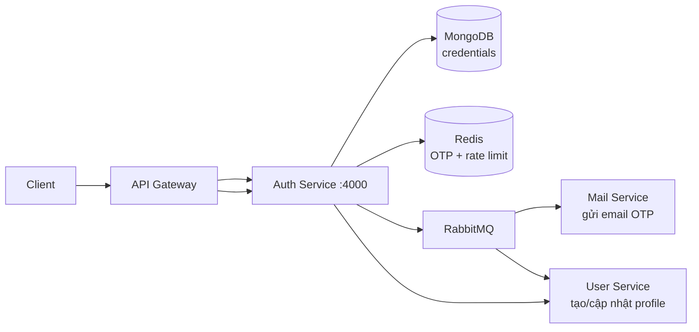
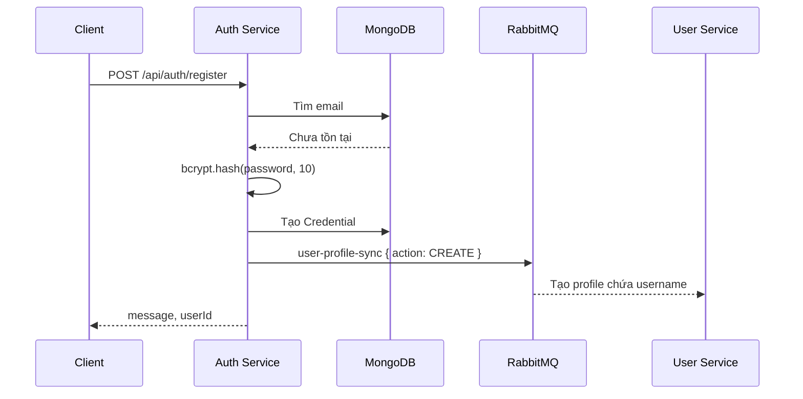
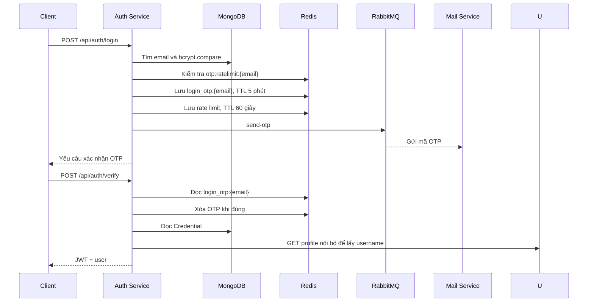

# Auth Backend

Tài liệu này mô tả service `auth/` đang có trong repository. Đây là một NestJS
microservice chịu trách nhiệm quản lý **credential** (email, mật khẩu đã băm,
role), xác minh đăng nhập qua OTP và cấp/kiểm tra JWT. Thông tin hồ sơ như
`username` thuộc User Service, không nằm trong collection credential.

## 1. Vai trò trong hệ thống



`Auth Service` vừa giao tiếp đồng bộ qua HTTP (với Client/Gateway/User Service),
vừa phát sự kiện bất đồng bộ qua RabbitMQ (Mail Service và User Service).

## 2. Cấu trúc thư mục

```text
auth/
├── src/
│   ├── main.ts                         # Khởi tạo HTTP server NestJS
│   ├── app.module.ts                   # Ghép các module của ứng dụng
│   ├── config/env.config.ts            # File cũ, hiện không được import
│   ├── schemas/credential.schema.ts    # MongoDB schema Credential
│   └── modules/
│       ├── database/                   # Kết nối MongoDB/Mongoose
│       ├── redis/                      # Lưu OTP và rate limit
│       ├── rabbitmq/                   # Publish message vào queue
│       └── auth/                       # API, nghiệp vụ và DTO auth
│           ├── auth.controller.ts
│           ├── auth.service.ts
│           ├── auth.module.ts
│           ├── dto/
│           └── strategies/             # Có JwtStrategy/LocalStrategy, chưa đăng ký trong AuthModule
├── .env                                # Cấu hình môi trường, không nên commit secret
├── package.json
└── doc.md
```

## 3. Khởi động ứng dụng

`src/main.ts` thực hiện các việc sau:

1. Đặt DNS resolver Google (`8.8.8.8`, `8.8.4.4`).
2. Tạo Nest application từ `AppModule`.
3. Bật `ValidationPipe` toàn cục:
   - `whitelist: true`: bỏ field không khai báo trong DTO;
   - `transform: true`: chuyển kiểu dữ liệu theo DTO khi có thể.
4. Lắng nghe tại `PORT`, mặc định là `4000`.

`AppModule` nạp `.env` một lần với `ConfigModule.forRoot({ isGlobal: true })`,
sau đó đăng ký `DatabaseModule`, `AuthModule`, `RedisModule` và `RabbitMQModule`.

> `AuthModule` cũng import Redis/RabbitMQ. Nest dùng singleton theo module, nên
> service vẫn được inject được; tuy nhiên việc import tại `AppModule` là dư thừa
> về mặt cấu trúc.

## 4. Dữ liệu credential trong MongoDB

File: `src/schemas/credential.schema.ts`

| Field | Kiểu | Ràng buộc | Ý nghĩa |
| --- | --- | --- | --- |
| `_id` | ObjectId | MongoDB tự tạo | ID tài khoản dùng để liên kết sang User Service |
| `email` | string | bắt buộc, unique, trim | Định danh đăng nhập |
| `passwordHash` | string | bắt buộc | Mật khẩu sau khi băm bằng bcrypt, không lưu mật khẩu gốc |
| `role` | string | bắt buộc, mặc định `user` | Quyền hiện tại: `admin`, `user`, hoặc `manager` |
| `createdAt`, `updatedAt` | Date | tự tạo | Có nhờ `@Schema({ timestamps: true })` |

`CredentialDocument = Credential & Document` là type kết hợp giữa class
Credential và MongoDB document. Nó được inject vào `AuthService` bằng
`@InjectModel(Credential.name)` để truy vấn collection.

Ba field dùng `!` (`email!`, `passwordHash!`, `role!`) vì giá trị của chúng do
Mongoose gán khi tạo/hydrate document. Dấu này chỉ nói với TypeScript rằng field
sẽ có giá trị trước khi được đọc; nó không làm giảm validation của Mongoose.

## 5. Module và dependency injection

### DatabaseModule

Tạo kết nối Mongoose từ các biến sau:

- `MONGO_URL`, mặc định `mongodb://localhost:27017/chatapp`;
- `MONGO_DB_NAME`, mặc định `nrapp`.

### AuthModule

- Đăng ký `CredentialSchema` để Mongoose cung cấp model `Credential`.
- Cấu hình `JwtModule` với `JWT_SECRET`, token hết hạn sau `7d`.
- Cung cấp `AuthService`, `AuthController`.
- Import `RedisModule` và `RabbitMQModule` để `AuthService` dùng được hai service đó.

### RedisService

Kết nối đến `REDIS_URL` (mặc định `redis://localhost:6379`) khi module khởi tạo.
Nó có ba thao tác được Auth dùng: `set(key, value, ttl)`, `get(key)` và `del(key)`.
Redis tự xóa dữ liệu khi TTL hết hạn.

### RabbitMQService

Kết nối AMQP dùng `Rabbitmq_Host`, `Rabbitmq_Username`,
`Rabbitmq_Password`. Khi RabbitMQ mất kết nối, service thử kết nối lại với
exponential backoff, tối đa 15 giây giữa hai lần thử. `publish(queue, message)`
tạo queue durable và gửi message persistent.

Các queue do Auth phát ra:

| Queue | Khi nào gửi | Payload chính |
| --- | --- | --- |
| `user-profile-sync` | Đăng ký, Google lần đầu, đổi role/email, xóa account | `action`, `userId`, các field profile thay đổi |
| `send-otp` | Đăng nhập thành công password | `to`, `subject`, `body` |

Nếu không publish được sự kiện đồng bộ profile, credential vẫn được cập nhật và
chỉ ghi log. Vì vậy, profile giữa các service có thể tạm thời không đồng bộ.

## 6. Luồng nghiệp vụ

### 6.1 Đăng ký bằng email và mật khẩu



Password được hash với bcrypt cost factor `10`. Response không trả về hash và
không cấp JWT ngay; user cần thực hiện login và xác minh OTP.

### 6.2 Login qua OTP



Quy tắc hiện tại:

- OTP là số ngẫu nhiên 6 chữ số;
- key OTP: `login_otp:{email}`, sống 5 phút;
- key hạn chế gửi lại: `otp:ratelimit:{email}`, sống 60 giây;
- OTP bị xóa ngay sau khi xác minh đúng, nên không thể dùng lại;
- password sai và email không tồn tại trả cùng một thông báo để hạn chế lộ email tồn tại;
- nếu User Service không phản hồi, token vẫn được cấp nhưng `username` là chuỗi rỗng.

### 6.3 JWT và Gateway

Payload JWT do service ký có dạng:

```json
{
  "user": {
    "_id": "Mongo ObjectId",
    "email": "user@example.com",
    "username": "minh",
    "role": "user"
  },
  "iat": 0,
  "exp": 0
}
```

Gateway gửi token đến `POST /api/auth/introspect`. Auth verify chữ ký và thời
hạn JWT, sau đó kiểm tra credential còn tồn tại. Chỉ khi cả hai điều kiện đúng
mới trả `valid: true`. Gateway có thể mã hóa `user` thành base64 rồi đặt vào
header `x-user-payload` khi chuyển tiếp các route `/me`.

`POST /api/auth/refresh` verify token với `ignoreExpiration: true`, sau đó cấp
token mới nếu credential vẫn tồn tại. Nghĩa là token hết hạn vẫn có thể refresh
được; hiện chưa có refresh token riêng, không có thời hạn refresh tối đa và
không có cơ chế revoke theo từng token.

### 6.4 Google login

`POST /api/auth/login-google` nhận `token`:

1. Thử gọi Google `tokeninfo` như ID token.
2. Nếu không được, gọi Google `userinfo` như OAuth access token.
3. Lấy email/name; tìm credential theo email.
4. Nếu chưa có, tạo credential với password ngẫu nhiên đã hash và publish
   `user-profile-sync: CREATE`.
5. Lấy username từ User Service nếu có, rồi ký JWT.

## 7. API HTTP

Base URL khi chạy local: `http://localhost:4000`.

| Method | Path | Body/header cần thiết | Kết quả |
| --- | --- | --- | --- |
| POST | `/api/auth/register` | `{ email, password, username }` | Tạo credential và phát event tạo profile |
| POST | `/api/auth/login` | `{ email, password }` | Tạo OTP và yêu cầu Mail Service gửi mail |
| POST | `/api/auth/verify` | `{ email, otp }` | Kiểm tra OTP, trả JWT |
| POST | `/api/auth/introspect` | `Authorization: Bearer <JWT>` | Kiểm tra JWT cho Gateway |
| POST | `/api/auth/refresh` | `{ token }` | Ký JWT mới từ token cũ |
| POST | `/api/auth/login-google` | `{ token }` | Đăng nhập/đăng ký qua Google |
| PATCH | `/api/auth/users/:id/role` | `{ role }` | Đổi role (`admin`, `user`, `manager`) |
| GET | `/api/auth/me` | `x-user-payload: <base64 JSON user>` | Đọc credential của user hiện tại |
| PATCH | `/api/auth/me/email` | header trên, `{ email }` | Đổi email và phát event đồng bộ |
| DELETE | `/api/auth/me` | header trên | Xóa credential của chính user |
| GET | `/api/auth/users/:userId` | — | Đọc credential bất kỳ |
| DELETE | `/api/auth/users/:userId` | — | Xóa credential bất kỳ |

Ví dụ đăng ký:

```bash
curl -X POST http://localhost:4000/api/auth/register \
  -H 'Content-Type: application/json' \
  -d '{"email":"minh@example.com","password":"matkhau123","username":"minh"}'
```

Ví dụ login và verify:

```bash
curl -X POST http://localhost:4000/api/auth/login \
  -H 'Content-Type: application/json' \
  -d '{"email":"minh@example.com","password":"matkhau123"}'

curl -X POST http://localhost:4000/api/auth/verify \
  -H 'Content-Type: application/json' \
  -d '{"email":"minh@example.com","otp":"123456"}'
```

Các DTO áp dụng validation cho ba endpoint đầu:

| DTO | Validation |
| --- | --- |
| `RegisterDto` | email đúng định dạng; password ít nhất 6 ký tự; username không rỗng |
| `LoginDto` | email đúng định dạng; password không rỗng |
| `VerifyOtpDto` | email đúng định dạng; otp không rỗng và dài đúng 6 ký tự |

Các body inline như `{ role: string }`, `{ token: string }`, `{ email: string }`
chưa có DTO riêng nên chưa được `class-validator` validate.

## 8. Biến môi trường

Không commit giá trị secret. Có thể tạo `auth/.env` theo mẫu sau và thay bằng
giá trị triển khai thực tế:

```dotenv
PORT=4000
MONGO_URL=mongodb://localhost:27017/chatapp
MONGO_DB_NAME=nrapp
REDIS_URL=redis://localhost:6379
JWT_SECRET=replace-with-a-long-random-secret
Rabbitmq_Host=localhost
Rabbitmq_Username=guest
Rabbitmq_Password=guest
USER_SERVICE=http://localhost:5000
```

Khi dùng Docker Compose ở root repository, các giá trị host service đã được ghi
đè: Redis là `redis`, RabbitMQ là `rabbitmq`, User Service là `http://user:5000`.

## 9. Chạy và kiểm tra

Từ thư mục `auth/`:

```bash
npm install
npm run start:dev
npm run build
npm test
```

Hoặc chạy toàn bộ hạ tầng từ root repository (cần `backend/.env` có
`RABBITMQ_USER` và `RABBITMQ_PASSWORD`):

```bash
docker compose up --build auth redis rabbitmq mail user
```

## 10. Lưu ý bảo mật và phần nên hoàn thiện

- `JWT_SECRET` hiện có fallback trong code. Production phải luôn đặt secret mạnh
  qua biến môi trường và nên bỏ fallback này để tránh chạy nhầm với secret mặc định.
- Các endpoint đổi role, xem/xóa user theo ID chưa có guard/role guard trong
  `AuthController`. Chúng chỉ an toàn nếu Gateway nội bộ thật sự chặn trước;
  nên bổ sung `JwtAuthGuard` và `RolesGuard` trực tiếp tại service.
- Header `x-user-payload` chỉ là base64, **không phải chữ ký**. Endpoint `/me`
  chỉ nên cho phép Gateway tin cậy gọi; nếu public trực tiếp thì client có thể
  giả payload. Nên tự xác thực JWT ở Auth Service hoặc dùng signed internal header.
- Cần thêm DTO/validation cho đổi role, refresh, Google login và đổi email.
- Mã OTP hiện lưu dạng text trong Redis và chưa giới hạn số lần nhập sai. Có thể
  hash OTP, thêm số lần thử tối đa, và xóa OTP sau nhiều lần sai.
- `refresh` chấp nhận token đã hết hạn mà không giới hạn phiên. Nên dùng refresh
  token riêng, lưu hash/rotation/revoke trong Redis hoặc database.
- Đăng ký rồi publish event là hai thao tác độc lập. Nếu queue lỗi, MongoDB đã
  ghi nhưng User Service chưa có profile. Outbox pattern hoặc retry job sẽ giúp
  đảm bảo đồng bộ hơn.
- File `strategies/jwt.strategy.ts` và `strategies/local.strategy.ts` đang tồn
  tại nhưng chưa nằm trong `providers` của `AuthModule`, nên chưa tham gia vào
  luồng xác thực hiện tại.

## 11. Lỗi TypeScript đã sửa

Thông báo `TS2564: Property 'email' has no initializer...` xuất hiện vì
TypeScript không biết Mongoose sẽ gán các field khi tạo document. Schema đã đổi
từ `email: string` thành `email!: string` (tương tự cho `passwordHash`, `role`).
Đây là cách phù hợp cho NestJS + Mongoose khi field bắt buộc được Mongoose quản
lý. Cảnh báo `baseUrl is deprecated` cũng được loại bỏ vì project không dùng
`paths` alias và không cần `baseUrl`.
