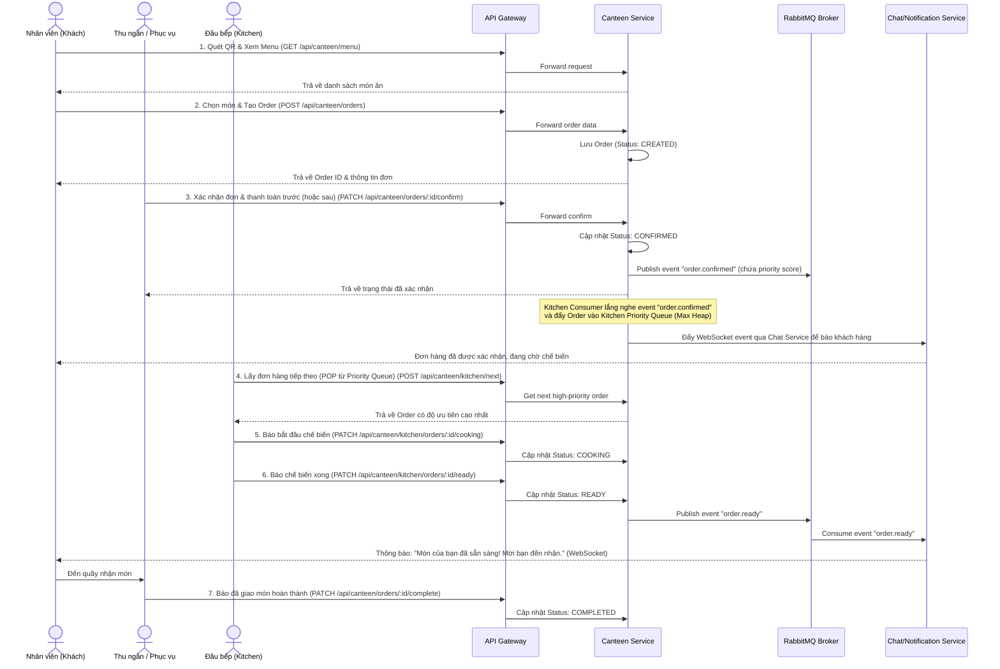

# Canteen Management Service - System Design & Business Specification

Tài liệu này đặc tả chi tiết kiến trúc, thiết kế cơ sở dữ liệu, danh sách API và giải thuật áp dụng cho module **Canteen Management** (Dịch vụ Quản lý Nhà ăn) tích hợp trong hệ thống Microservices hiện tại. 

Hệ thống được thiết kế để giải quyết bài toán nghiệp vụ thực tế tại canteen doanh nghiệp, đồng thời áp dụng tối ưu các cấu trúc dữ liệu và giải thuật (Priority Queue, Heap, Stack) để giải quyết các vấn đề hiệu năng và quy trình nghiệp vụ.

---

## 1. Luồng Nghiệp Vụ & Kiến Trúc Hệ Thống (Business Workflows)

### 1.1 Luồng Gọi Món và Xử Lý Đơn Hàng (Order & Cooking Lifecycle)



### 1.2 Luồng Thanh Toán (Payment Flow)
Hỗ trợ cả thanh toán trước khi chế biến (Fast-food style) hoặc thanh toán sau khi ăn (Restaurant style). Quy trình tích hợp ví điện tử / VietQR:
1. Client gửi yêu cầu thanh toán (`POST /api/canteen/payments/create-qr`).
2. Canteen Service sinh link thanh toán hoặc VietQR dynamic image dựa trên Số tiền và Nội dung chuyển khoản (`CANTEEN_ORDER_1001`).
3. Sau khi người dùng chuyển khoản thành công, Payment Gateway (hoặc một mô phỏng Callback/Webhook) gửi yêu cầu xác nhận tới `POST /api/canteen/payments/callback`.
4. Canteen Service chuyển trạng thái đơn hàng sang `PAID` và bắn sự kiện `payment.succeeded` lên RabbitMQ để đồng bộ.

---

## 2. Thiết Kế Cơ Sở Dữ Liệu (MongoDB / Mongoose Schemas)

Tất cả các collection được lưu trữ trong Database `canteen` để đảm bảo tính độc lập dữ liệu theo nguyên tắc Microservices.

### 2.1 Collection: `tables` (Bàn ăn)
Lưu thông tin vị trí bàn ăn để sinh QR code và quản lý sức chứa.
```typescript
{
  _id: ObjectId,
  name: String,        // Ví dụ: "Bàn A1", "Quầy Bar 1"
  qrCodeUrl: String,   // Link chứa thông tin quét mã QR
  capacity: Number,    // Sức chứa tối đa (chỗ ngồi)
  status: String,      // "empty" (trống), "occupied" (đang có khách), "reserved" (đặt trước)
  createdAt: Date,
  updatedAt: Date
}
```

### 2.2 Collection: `categories` (Danh mục thực đơn)
```typescript
{
  _id: ObjectId,
  name: String,        // Ví dụ: "Cơm trưa", "Đồ uống", "Combo Tiết kiệm"
  description: String,
  isActive: Boolean,   // Cho phép hiển thị hay không
  displayOrder: Number // Thứ tự sắp xếp hiển thị trên UI
}
```

### 2.3 Collection: `menu_items` (Món ăn / Đồ uống)
```typescript
{
  _id: ObjectId,
  categoryId: ObjectId,  // Liên kết tới categories._id
  name: String,          // Tên món ăn
  description: String,
  price: Number,         // Giá bán gốc (VND)
  imageUrl: String,
  isAvailable: Boolean,  // Còn hàng hay không
  options: [             // Các tùy chọn thêm (Toppings / Size)
    {
      name: String,      // Ví dụ: "Thêm trứng", "Size L"
      price: Number      // Giá cộng thêm
    }
  ],
  createdAt: Date,
  updatedAt: Date
}
```

### 2.4 Collection: `orders` (Đơn hàng)
Bảng trung tâm lưu trữ thông tin gọi món và trạng thái xử lý.
```typescript
{
  _id: ObjectId,
  orderNumber: String,     // Mã hiển thị dạng số tăng dần, vd: "#1001"
  userId: ObjectId,        // ID nhân viên gọi món (lấy từ Gateway Payload)
  userRole: String,        // Quyền của người gọi món (user/manager/vip)
  tableId: ObjectId,       // ID bàn ăn (null nếu mang đi - Takeaway)
  items: [
    {
      menuItemId: ObjectId,
      name: String,
      quantity: Number,
      unitPrice: Number,
      selectedOptions: [
        {
          name: String,
          price: Number
        }
      ],
      note: String
    }
  ],
  totalAmount: Number,
  discountAmount: Number,
  finalAmount: Number,
  status: String,          // "CREATED" | "CONFIRMED" | "COOKING" | "READY" | "COMPLETED" | "PAID" | "CANCELLED"
  priorityScore: Number,   // Điểm ưu tiên tính toán cho Kitchen Heap
  paymentStatus: String,   // "PENDING" | "PAID" | "REFUNDED"
  paymentMethod: String,   // "CASH" | "VNPAY" | "MOMO" | "VIETQR"
  createdAt: Date,
  updatedAt: Date
}
```

### 2.5 Collection: `ingredients` (Kho nguyên liệu)
Quản lý các loại nguyên liệu thô để nấu ăn.
```typescript
{
  _id: ObjectId,
  name: String,        // Tên nguyên liệu: "Thịt gà", "Sữa tươi", "Rau cải"
  unit: String,        // Đơn vị tính: "kg", "lít", "bó"
  minimumThreshold: Number // Mức tối thiểu cần cảnh báo nhập hàng
}
```

### 2.6 Collection: `inventory_batches` (Lô hàng trong kho)
Do mỗi đợt nhập hàng có hạn sử dụng khác nhau, ta quản lý theo từng lô (Batch) để áp dụng thuật toán FEFO (First Expired First Out).
```typescript
{
  _id: ObjectId,
  ingredientId: ObjectId,  // Liên kết tới ingredients._id
  quantity: Number,        // Số lượng hiện tại của lô này
  originalQuantity: Number,// Số lượng nhập vào ban đầu
  expiryDate: Date,        // Hạn sử dụng (Trọng số để sắp xếp Min Heap)
  importDate: Date,
  costPrice: Number,       // Giá nhập của lô này (VND)
  supplier: String,
  status: String           // "ACTIVE" (đang sử dụng), "EXPIRED" (hết hạn), "DEPLETED" (hết hàng)
}
```

---

## 3. Đặc Tả Hệ Thống API (API Specification)

Toán bộ API của canteen sẽ được route thông qua Gateway dưới prefix `/api/canteen`.

### 3.1 Nhóm API Thực Đơn (Menu APIs - Menu Module)

| Method | Endpoint | Quyền hạn | Mô tả |
| :--- | :--- | :--- | :--- |
| **GET** | `/api/canteen/menu` | Tất cả | Lấy toàn bộ thực đơn đang bán (phân nhóm theo Category). |
| **POST** | `/api/canteen/admin/menu` | Admin/Manager | Tạo mới món ăn. |
| **PUT** | `/api/canteen/admin/menu/:id` | Admin/Manager | Cập nhật thông tin món ăn (Lưu trạng thái cũ vào Stack). |
| **DELETE** | `/api/canteen/admin/menu/:id` | Admin/Manager | Xóa món ăn khỏi menu (Soft delete). |
| **POST** | `/api/canteen/admin/menu/undo` | Admin/Manager | Hoàn tác (Undo) thao tác sửa đổi vừa thực hiện trên Menu. |
| **POST** | `/api/canteen/admin/menu/redo` | Admin/Manager | Làm lại (Redo) thao tác vừa hoàn tác trên Menu. |

### 3.2 Nhóm API Đơn Hàng (Order APIs - Order Module)

| Method | Endpoint | Quyền hạn | Mô tả |
| :--- | :--- | :--- | :--- |
| **POST** | `/api/canteen/orders` | Nhân viên | Tạo giỏ hàng và đặt món (Trạng thái ban đầu: `CREATED`). |
| **GET** | `/api/canteen/orders/my-orders` | Nhân viên | Xem lịch sử đơn hàng cá nhân. |
| **GET** | `/api/canteen/orders/:id` | Nhân viên / Bếp | Lấy thông tin chi tiết của một đơn hàng. |
| **PATCH** | `/api/canteen/orders/:id/confirm` | Thu ngân / Admin | Xác nhận đơn hàng, tính điểm ưu tiên và gửi sự kiện chế biến. |
| **PATCH** | `/api/canteen/orders/:id/complete` | Thu ngân / Admin | Xác nhận khách đã nhận món ăn thành công, đóng Order. |

### 3.3 Nhóm API Nhà Bếp (Kitchen APIs - Kitchen Module)

| Method | Endpoint | Quyền hạn | Mô tả |
| :--- | :--- | :--- | :--- |
| **GET** | `/api/canteen/kitchen/queue` | Đầu bếp / Admin | Xem danh sách các đơn hàng đang chờ trong hàng đợi ưu tiên. |
| **POST** | `/api/canteen/kitchen/next` | Đầu bếp | Lấy đơn hàng có độ ưu tiên cao nhất ra khỏi hàng đợi để chế biến. |
| **PATCH** | `/api/canteen/kitchen/orders/:id/cooking` | Đầu bếp | Chuyển trạng thái đơn hàng sang `COOKING`. |
| **PATCH** | `/api/canteen/kitchen/orders/:id/ready` | Đầu bếp | Đánh dấu món ăn đã chuẩn bị xong, chuyển trạng thái `READY`. |

### 3.4 Nhóm API Quản Lý Kho (Inventory APIs - Inventory Module)

| Method | Endpoint | Quyền hạn | Mô tả |
| :--- | :--- | :--- | :--- |
| **POST** | `/api/canteen/inventory/ingredients` | Admin | Khởi tạo nguyên liệu mới. |
| **POST** | `/api/canteen/inventory/batches` | Admin | Nhập lô hàng mới (đẩy vào Min Heap quản lý hạn sử dụng). |
| **GET** | `/api/canteen/inventory/expiry-alerts` | Admin / Đầu bếp | Lấy danh sách nguyên liệu sắp hết hạn cần sử dụng trước (Min Heap). |
| **POST** | `/api/canteen/inventory/consume` | Đầu bếp | Khấu trừ nguyên liệu sau khi nấu ăn (tự động trừ lô hết hạn trước). |

### 3.5 Nhóm API Báo Cáo & Phân Tích (Analytics APIs - Analytics Module)

| Method | Endpoint | Quyền hạn | Mô tả |
| :--- | :--- | :--- | :--- |
| **GET** | `/api/canteen/analytics/top-dishes` | Admin / Manager | Trả về Top K món ăn bán chạy nhất (sử dụng Top-K Min Heap). |

---

## 4. Thiết Kế Cấu Trúc Dữ Liệu & Giải Thuật (Data Structures & Algorithms)

Đây là điểm nhấn công nghệ cốt lõi giúp hệ thống của bạn vượt trội hơn các dự án CRUD thông thường. Dưới đây là thiết kế chi tiết cho từng cấu trúc dữ liệu.

### 4.1 Kitchen Service: Priority Queue (Max Heap) để Ưu Tiên Đơn Hàng

Trong giờ cao điểm, hàng trăm khách hàng đặt món cùng lúc. Nhà bếp cần ưu tiên phục vụ các đối tượng đặc biệt (VIP, Ban giám đốc), các đơn hàng mang đi gấp (Express), hoặc các đơn hàng đã chờ đợi quá lâu để đảm bảo trải nghiệm khách hàng.

#### Công thức tính điểm ưu tiên (Priority Score):
$$\text{Score} = (\text{userRoleScore} \times 100) + (\text{isTakeaway} \times 50) + (\text{waitingMinutes} \times 1.5)$$

*Chi tiết tham số:*
- **userRoleScore**: Khách VIP / BGĐ = 2, Quản lý / Manager = 1, Nhân viên thông thường = 0.
- **isTakeaway**: Đơn mang đi gấp = 1, Ăn tại bàn = 0.
- **waitingMinutes**: Số phút trôi qua kể từ khi đơn hàng được tạo (`CREATED`). Điểm này tăng dần theo thời gian thực để tránh tình trạng đơn hàng bình thường bị "đói" (starvation) vô hạn khi liên tục có đơn VIP chen ngang.

#### Cấu trúc dữ liệu Node trong Heap:
```typescript
interface KitchenOrderNode {
  orderId: string;
  orderNumber: string;
  priorityScore: number;
  confirmedAt: Date;
}
```

#### Thiết kế giải thuật Max Heap trong `kitchen/priority-queue.ts`:
```typescript
export class KitchenPriorityQueue {
  private heap: KitchenOrderNode[] = [];

  // Lấy kích thước hàng đợi
  size(): number {
    return this.heap.length;
  }

  // Thêm một đơn hàng mới vào hàng đợi
  push(node: KitchenOrderNode): void {
    this.heap.push(node);
    this.siftUp(this.heap.length - 1);
  }

  // Lấy đơn hàng có độ ưu tiên cao nhất ra để chế biến
  pop(): KitchenOrderNode | null {
    if (this.size() === 0) return null;
    const root = this.heap[0];
    const lastNode = this.heap.pop()!;
    
    if (this.size() > 0) {
      this.heap[0] = lastNode;
      this.siftDown(0);
    }
    return root;
  }

  // Xem trước đơn hàng tiếp theo mà không xóa khỏi hàng đợi
  peek(): KitchenOrderNode | null {
    return this.size() > 0 ? this.heap[0] : null;
  }

  // Duy trì tính chất Max Heap từ dưới lên khi chèn phần tử
  private siftUp(index: number): void {
    let current = index;
    while (current > 0) {
      const parent = Math.floor((current - 1) / 2);
      if (this.heap[current].priorityScore <= this.heap[parent].priorityScore) {
        break;
      }
      this.swap(current, parent);
      current = parent;
    }
  }

  // Duy trì tính chất Max Heap từ trên xuống khi lấy phần tử gốc
  private siftDown(index: number): void {
    let current = index;
    const length = this.size();

    while (current * 2 + 1 < length) {
      let leftChild = current * 2 + 1;
      let rightChild = current * 2 + 2;
      let largest = current;

      if (this.heap[leftChild].priorityScore > this.heap[largest].priorityScore) {
        largest = leftChild;
      }

      if (rightChild < length && this.heap[rightChild].priorityScore > this.heap[largest].priorityScore) {
        largest = rightChild;
      }

      if (largest === current) {
        break;
      }

      this.swap(current, largest);
      current = largest;
    }
  }

  private swap(i: number, j: number): void {
    const temp = this.heap[i];
    this.heap[i] = this.heap[j];
    this.heap[j] = temp;
  }

  // Hàm cập nhật lại điểm ưu tiên theo thời gian chờ (Tái cấu trúc lại Heap)
  // Được gọi định kỳ (ví dụ mỗi 1 phút) để tăng điểm waitingMinutes cho các đơn hàng đang chờ
  refreshPriorities(): void {
    const now = new Date();
    for (let i = 0; i < this.heap.length; i++) {
      const waitTimeMinutes = Math.floor((now.getTime() - this.heap[i].confirmedAt.getTime()) / 60000);
      // Giữ nguyên phần điểm cố định (Role, Takeaway), cộng thêm điểm chờ đợi mới
      // Giả sử điểm cố định ban đầu đã được lưu riêng hoặc tính toán lại từ Database
    }
    // Build lại Heap toàn bộ (Heapify) O(N)
    for (let i = Math.floor(this.size() / 2) - 1; i >= 0; i--) {
      this.siftDown(i);
    }
  }
}
```

---

### 4.2 Menu Service: Undo/Redo System cho Chỉnh Sửa Menu Bằng Stack

Khi quản trị viên (Admin/Manager) chỉnh sửa thông tin món ăn hoặc cấu hình giá cả thực đơn, họ có thể thao tác sai sót. Việc xây dựng tính năng **Undo / Redo** (Hoàn tác / Làm lại) giúp khôi phục dữ liệu nhanh chóng mà không cần reload hoặc truy vấn phức tạp vào database.

#### Nguyên lý hoạt động:
- **Undo Stack**: Chứa danh sách các trạng thái thay đổi đã thực hiện (mỗi thao tác là một Command).
- **Redo Stack**: Chứa các trạng thái đã bị Undo để có thể khôi phục lại khi cần.
- Nếu người dùng thực hiện một thao tác chỉnh sửa mới, **Redo Stack** sẽ bị xóa sạch (để đảm bảo luồng lịch sử tuyến tính).

#### Thiết kế Command Pattern & Stack trong `menu/undo-stack.ts`:
```typescript
export interface MenuCommand {
  type: 'CREATE' | 'UPDATE' | 'DELETE';
  menuItemId: string;
  previousData: any; // Trạng thái dữ liệu trước khi thay đổi (Dành cho Undo)
  newData: any;      // Trạng thái dữ liệu sau khi thay đổi (Dành cho Redo)
}

export class MenuHistoryManager {
  private undoStack: MenuCommand[] = [];
  private redoStack: MenuCommand[] = [];
  private readonly MAX_HISTORY_LIMIT = 50; // Giới hạn kích thước Stack để tối ưu bộ nhớ

  // Ghi nhận một hành động mới
  pushCommand(command: MenuCommand): void {
    if (this.undoStack.length >= this.MAX_HISTORY_LIMIT) {
      this.undoStack.shift(); // Xóa phần tử cũ nhất ở đáy Stack nếu vượt giới hạn
    }
    this.undoStack.push(command);
    this.redoStack = []; // Xóa sạch Redo Stack khi có hành động mới
  }

  // Lấy hành động cuối cùng để hoàn tác (Undo)
  popUndo(): MenuCommand | null {
    if (this.undoStack.length === 0) return null;
    const command = this.undoStack.pop()!;
    this.redoStack.push(command); // Đẩy vào Redo Stack để có thể khôi phục
    return command;
  }

  // Lấy hành động vừa Undo để làm lại (Redo)
  popRedo(): MenuCommand | null {
    if (this.redoStack.length === 0) return null;
    const command = this.redoStack.pop()!;
    this.undoStack.push(command); // Đẩy ngược lại vào Undo Stack
    return command;
  }

  clear(): void {
    this.undoStack = [];
    this.redoStack = [];
  }
}
```

---

### 4.3 Inventory Service: Min Heap (FEFO) Quản Lý Lô Nguyên Liệu Hạn Sử Dụng

Quy tắc bất di bất dịch trong quản lý thực phẩm là **FEFO (First Expired First Out - Hàng sắp hết hạn dùng trước)** để tránh lãng phí nguyên liệu hư hỏng.

#### Cấu trúc dữ liệu Node lô hàng:
```typescript
interface InventoryBatchNode {
  batchId: string;
  ingredientId: string;
  expiryDate: Date;
  quantity: number;
}
```

#### Thiết kế giải thuật Min Heap trong `inventory/min-heap.ts`:
```typescript
export class InventoryMinHeap {
  private heap: InventoryBatchNode[] = [];

  size(): number {
    return this.heap.length;
  }

  push(node: InventoryBatchNode): void {
    this.heap.push(node);
    this.siftUp(this.heap.length - 1);
  }

  // Lấy ra lô hàng cận date nhất để chế biến
  pop(): InventoryBatchNode | null {
    if (this.size() === 0) return null;
    const root = this.heap[0];
    const lastNode = this.heap.pop()!;

    if (this.size() > 0) {
      this.heap[0] = lastNode;
      this.siftDown(0);
    }
    return root;
  }

  peek(): InventoryBatchNode | null {
    return this.size() > 0 ? this.heap[0] : null;
  }

  private siftUp(index: number): void {
    let current = index;
    while (current > 0) {
      const parent = Math.floor((current - 1) / 2);
      if (this.heap[current].expiryDate.getTime() >= this.heap[parent].expiryDate.getTime()) {
        break;
      }
      this.swap(current, parent);
      current = parent;
    }
  }

  private siftDown(index: number): void {
    let current = index;
    const length = this.size();

    while (current * 2 + 1 < length) {
      let leftChild = current * 2 + 1;
      let rightChild = current * 2 + 2;
      let smallest = current;

      if (this.heap[leftChild].expiryDate.getTime() < this.heap[smallest].expiryDate.getTime()) {
        smallest = leftChild;
      }

      if (rightChild < length && this.heap[rightChild].expiryDate.getTime() < this.heap[smallest].expiryDate.getTime()) {
        smallest = rightChild;
      }

      if (smallest === current) {
        break;
      }

      this.swap(current, smallest);
      current = smallest;
    }
  }

  private swap(i: number, j: number): void {
    const temp = this.heap[i];
    this.heap[i] = this.heap[j];
    this.heap[j] = temp;
  }

  // Hàm trả về toàn bộ danh sách sắp xếp theo hạn sử dụng tăng dần (bằng cách clone heap và pop dần)
  // Độ phức tạp: O(N log N)
  getSortedBatches(): InventoryBatchNode[] {
    const tempHeap = new InventoryMinHeap();
    tempHeap.heap = [...this.heap];
    const sorted: InventoryBatchNode[] = [];
    while (tempHeap.size() > 0) {
      sorted.push(tempHeap.pop()!);
    }
    return sorted;
  }
}
```

---

### 4.4 Analytics Service: Tìm Top K Món Ăn Bán Chạy Nhất Bằng Min Heap

Để hiển thị mục "Top 10 món ăn yêu thích nhất trong tuần" trên giao diện trang chủ của khách hàng, hệ thống cần thống kê số lượng bán của các món ăn.
Nếu canteen có hàng trăm món, thay vì truy vấn toàn bộ và thực hiện sắp xếp (Sort) tốn tài nguyên $O(N \log N)$, chúng ta sử dụng một **Min Heap kích thước tối đa là K** để lọc ra Top K món ăn bán chạy nhất với độ phức tạp tối ưu hơn nhiều: $O(N \log K)$.

#### Nguyên lý giải thuật:
1. Thống kê số lượng bán của tất cả món ăn trong một Map: `Map<menuItemId, salesCount>`.
2. Duyệt qua từng cặp `(menuItemId, salesCount)` trong Map:
   - Đẩy phần tử vào Min Heap (sắp xếp theo `salesCount` tăng dần).
   - Nếu kích thước của Heap vượt quá $K$, thực hiện `pop()` để loại bỏ phần tử có số lượng bán **nhỏ nhất** ở gốc Heap.
3. Sau khi duyệt hết tất cả các món ăn, các phần tử còn lại trong Min Heap chính là Top K món ăn bán chạy nhất.

#### Thiết kế Heap Node bán chạy:
```typescript
interface DishSalesNode {
  menuItemId: string;
  name: string;
  salesCount: number;
}
```

#### Thiết kế giải thuật tìm Top-K trong `analytics/top-k-heap.ts`:
```typescript
export class TopKActiveHeap {
  private heap: DishSalesNode[] = [];
  private readonly K: number;

  constructor(k: number) {
    this.K = k;
  }

  size(): number {
    return this.heap.length;
  }

  // Thêm món ăn vào Heap. Nếu kích thước > K, pop phần tử nhỏ nhất ra.
  add(node: DishSalesNode): void {
    if (this.size() < this.K) {
      this.push(node);
    } else if (node.salesCount > this.heap[0].salesCount) {
      // Nếu số lượng bán của món này lớn hơn món bán ít nhất trong Top K hiện tại,
      // thay thế món ít nhất đó và siftDown.
      this.heap[0] = node;
      this.siftDown(0);
    }
  }

  private push(node: DishSalesNode): void {
    this.heap.push(node);
    this.siftUp(this.heap.length - 1);
  }

  pop(): DishSalesNode | null {
    if (this.size() === 0) return null;
    const root = this.heap[0];
    const lastNode = this.heap.pop()!;
    if (this.size() > 0) {
      this.heap[0] = lastNode;
      this.siftDown(0);
    }
    return root;
  }

  // Trả về kết quả Top K sắp xếp từ cao xuống thấp
  getTopK(): DishSalesNode[] {
    const result: DishSalesNode[] = [];
    // Clone heap để pop dần tránh làm mất dữ liệu gốc
    const tempHeap = new TopKActiveHeap(this.K);
    tempHeap.heap = [...this.heap];
    
    while (tempHeap.size() > 0) {
      result.push(tempHeap.pop()!);
    }
    // Do Min Heap pop ra từ bé đến lớn, ta đảo ngược mảng để có từ lớn đến bé
    return result.reverse();
  }

  private siftUp(index: number): void {
    let current = index;
    while (current > 0) {
      const parent = Math.floor((current - 1) / 2);
      if (this.heap[current].salesCount >= this.heap[parent].salesCount) {
        break;
      }
      this.swap(current, parent);
      current = parent;
    }
  }

  private siftDown(index: number): void {
    let current = index;
    const length = this.size();

    while (current * 2 + 1 < length) {
      let leftChild = current * 2 + 1;
      let rightChild = current * 2 + 2;
      let smallest = current;

      if (this.heap[leftChild].salesCount < this.heap[smallest].salesCount) {
        smallest = leftChild;
      }

      if (rightChild < length && this.heap[rightChild].salesCount < this.heap[smallest].salesCount) {
        smallest = rightChild;
      }

      if (smallest === current) {
        break;
      }

      this.swap(current, smallest);
      current = smallest;
    }
  }

  private swap(i: number, j: number): void {
    const temp = this.heap[i];
    this.heap[i] = this.heap[j];
    this.heap[j] = temp;
  }
}
```

---

### 4.5 Inventory Service: Giải Thuật Khấu Trừ Nguyên Liệu Theo Lô FEFO (FEFO Batch Consumption Algorithm)

Trong phần 4.3, chúng ta đã xây dựng cấu trúc `InventoryMinHeap` để quản lý các lô hàng theo hạn sử dụng. Khi đầu bếp chế biến một đơn hàng (`POST /api/canteen/inventory/consume`), hệ thống cần tự động tính toán và khấu trừ số lượng nguyên liệu từ các lô cận date nhất đến các lô mới hơn, đồng thời cảnh báo khi kho chạm ngưỡng tối thiểu.

#### Nguyên lý giải thuật:
1. Lấy danh sách nguyên liệu cần dùng cho món ăn (ví dụ: món "Cơm gà" cần `500g` Thịt gà).
2. Lấy danh sách các lô hàng active của nguyên liệu đó, sắp xếp theo `expiryDate` tăng dần (sử dụng `InventoryMinHeap`).
3. Duyệt qua từng lô hàng:
   - Nếu số lượng của lô hiện tại `batch.quantity >= remainingNeeded`: Trừ số lượng cần thiết khỏi lô này và kết thúc luồng cho nguyên liệu đó.
   - Nếu `batch.quantity < remainingNeeded`: Trừ toàn bộ số lượng trong lô này (`batch.quantity = 0`, chuyển trạng thái `DEPLETED`), giảm `remainingNeeded` tương ứng và tiếp tục chuyển sang lô tiếp theo trong Heap.
4. Sau khi khấu trừ, kiểm tra tổng tồn kho còn lại của nguyên liệu: nếu $\le \text{minimumThreshold}$, phát sự kiện `inventory.low_stock` sang RabbitMQ.

#### Thiết kế giải thuật trong `inventory/fefo-consumption.ts`:
```typescript
export interface BatchConsumptionResult {
  batchId: string;
  consumedQuantity: number;
  remainingBatchQuantity: number;
  status: 'ACTIVE' | 'DEPLETED';
}

export interface InventoryDeductionReport {
  ingredientId: string;
  requestedQuantity: number;
  totalConsumed: number;
  isFullyFulfilled: boolean;
  affectedBatches: BatchConsumptionResult[];
  isLowStockAlert: boolean;
}

export class FEFOConsumptionService {
  /**
   * Thực hiện khấu trừ nguyên liệu dựa trên hàng đợi Min Heap FEFO
   */
  static consumeIngredient(
    ingredientId: string,
    requiredAmount: number,
    minHeap: InventoryMinHeap,
    minimumThreshold: number
  ): InventoryDeductionReport {
    let remainingNeeded = requiredAmount;
    const affectedBatches: BatchConsumptionResult[] = [];
    let totalStockBefore = 0;

    // Clone Heap để thực hiện khấu trừ tuyến tính
    const sortedBatches = minHeap.getSortedBatches();
    
    for (const batch of sortedBatches) {
      totalStockBefore += batch.quantity;
    }

    for (const batch of sortedBatches) {
      if (remainingNeeded <= 0) break;

      const deductAmount = Math.min(batch.quantity, remainingNeeded);
      batch.quantity -= deductAmount;
      remainingNeeded -= deductAmount;

      const newStatus = batch.quantity === 0 ? 'DEPLETED' : 'ACTIVE';
      
      affectedBatches.push({
        batchId: batch.batchId,
        consumedQuantity: deductAmount,
        remainingBatchQuantity: batch.quantity,
        status: newStatus
      });
    }

    const totalConsumed = requiredAmount - remainingNeeded;
    const remainingTotalStock = totalStockBefore - totalConsumed;

    return {
      ingredientId,
      requestedQuantity: requiredAmount,
      totalConsumed,
      isFullyFulfilled: remainingNeeded === 0,
      affectedBatches,
      isLowStockAlert: remainingTotalStock <= minimumThreshold
    };
  }
}
```

---

### 4.6 Menu Service: Cấu Trúc Trie (Prefix Tree) Cho Tìm Kiếm Món Ăn Fast Autocomplete

Vào giờ cao điểm, khách hàng tìm kiếm món ăn trên ứng dụng di động/web (vd: gõ "cơm", "bún", "trà"). Nếu sử dụng truy vấn Regex của Database (`$regex: /cơm/i`), DB sẽ phải scan toàn bộ bảng `menu_items`, gây nghẽn RAM và tăng độ trễ latency.

Chúng ta xây dựng cấu trúc **Trie (Cây tiền tố)** lưu trữ trong RAM của Canteen Service để hỗ trợ tìm kiếm món ăn với độ phức tạp cực kỳ tối ưu: $O(L)$ với $L$ là độ dài từ khóa tìm kiếm.

#### Cấu trúc Node và Trie Tree trong `menu/menu-trie.ts`:
```typescript
class TrieNode {
  children: Map<string, TrieNode> = new Map();
  isEndOfWord: boolean = false;
  menuItemIds: Set<string> = new Set(); // Lưu danh sách ID món ăn khớp với tiền tố này
}

export class MenuSearchTrie {
  private root: TrieNode = new TrieNode();

  // Chuyển đổi tiếng Việt có dấu sang không dấu & viết thường để search linh hoạt
  private normalizeText(text: string): string {
    return text
      .normalize('NFD')
      .replace(/[\u0300-\u036f]/g, '')
      .replace(/đ/g, 'd')
      .replace(/Đ/g, 'D')
      .toLowerCase()
      .trim();
  }

  // Thêm một món ăn vào Trie (Index các từ đơn trong tên món)
  insert(name: string, menuItemId: string): void {
    const normalized = this.normalizeText(name);
    const words = normalized.split(/\s+/);

    // Index cả tên đầy đủ lẫn từng từ đơn (vd: "Cơm Gà" -> index "com ga" và "ga")
    for (let i = 0; i < words.length; i++) {
      const phrase = words.slice(i).join(' ');
      this.insertPhrase(phrase, menuItemId);
    }
  }

  private insertPhrase(phrase: string, menuItemId: string): void {
    let current = this.root;
    for (const char of phrase) {
      if (!current.children.has(char)) {
        current.children.set(char, new TrieNode());
      }
      current = current.children.get(char)!;
      current.menuItemIds.add(menuItemId);
    }
    current.isEndOfWord = true;
  }

  // Tìm kiếm danh sách menuItemId theo tiền tố (Prefix Search) - O(L)
  searchPrefix(prefix: string): string[] {
    const normalized = this.normalizeText(prefix);
    let current = this.root;

    for (const char of normalized) {
      if (!current.children.has(char)) {
        return []; // Không tìm thấy tiền tố khớp
      }
      current = current.children.get(char)!;
    }

    return Array.from(current.menuItemIds);
  }

  // Clear và build lại Trie khi menu thay đổi
  clear(): void {
    this.root = new TrieNode();
  }
}
```

---

### 4.7 Table Service: Giải Thuật Phân Bổ & Gộp Bàn Tự Động (Greedy Table Allocation & Merging)

Khi một nhóm nhân viên đi ăn cùng nhau (ví dụ: nhóm 6 người, 8 người), hệ thống cần tự động gợi ý bàn trống phù hợp hoặc tính toán phương án **gộp các bàn trống liền kề** sao cho tối ưu số chỗ thừa (capacity waste) và giảm thiểu số bàn phải gộp.

#### Nguyên lý giải thuật Greedy:
1. **Trường hợp 1 (Single Table)**: Tìm bàn trống đơn có sức chứa `capacity >= partySize` sao cho `(capacity - partySize)` nhỏ nhất (Best-fit).
2. **Trường hợp 2 (Table Merging)**: Nếu không có bàn đơn nào đủ sức chứa, áp dụng giải thuật Tham ăn (Greedy) kết hợp Gom nhóm:
   - Lọc danh sách tất cả bàn trống (`status == 'empty'`).
   - Sắp xếp bàn trống theo sức chứa giảm dần.
   - Lựa chọn các bàn sao cho tổng sức chứa $\ge \text{partySize}$ với số lượng bàn ít nhất.

#### Thiết kế giải thuật trong `table/table-allocation.ts`:
```typescript
export interface TableAllocationResult {
  allocatedTableIds: string[];
  totalCapacity: number;
  partySize: number;
  isMerged: boolean;
  wasteCapacity: number;
}

export interface TableItem {
  id: string;
  name: string;
  capacity: number;
  status: 'empty' | 'occupied' | 'reserved';
}

export class TableAllocationService {
  static allocateTables(emptyTables: TableItem[], partySize: number): TableAllocationResult | null {
    if (emptyTables.length === 0 || partySize <= 0) return null;

    // 1. Tìm Best-Fit cho bàn đơn
    let bestSingleTable: TableItem | null = null;
    let minWaste = Infinity;

    for (const table of emptyTables) {
      if (table.capacity >= partySize) {
        const waste = table.capacity - partySize;
        if (waste < minWaste) {
          minWaste = waste;
          bestSingleTable = table;
        }
      }
    }

    if (bestSingleTable) {
      return {
        allocatedTableIds: [bestSingleTable.id],
        totalCapacity: bestSingleTable.capacity,
        partySize,
        isMerged: false,
        wasteCapacity: minWaste
      };
    }

    // 2. Nếu không bàn đơn nào vừa, thực hiện gộp bàn (Greedy Strategy)
    // Sắp xếp bàn trống giảm dần theo capacity
    const sortedTables = [...emptyTables].sort((a, b) => b.capacity - a.capacity);
    const selectedTables: TableItem[] = [];
    let currentCapacity = 0;

    for (const table of sortedTables) {
      selectedTables.push(table);
      currentCapacity += table.capacity;

      if (currentCapacity >= partySize) {
        return {
          allocatedTableIds: selectedTables.map((t) => t.id),
          totalCapacity: currentCapacity,
          partySize,
          isMerged: true,
          wasteCapacity: currentCapacity - partySize
        };
      }
    }

    // Không đủ bàn trống để đáp ứng đoàn khách
    return null;
  }
}
```

---

### 4.8 Order Service: Giải Thuật Tối Ưu Hóa Trợ Giá & Khuyến Mãi (Discount / Voucher Optimization)

Doanh nghiệp thường có chính sách trợ giá bữa ăn cho nhân viên (ví dụ: Trợ giá 30,000 VND / ngày cho nhân viên chính thức, giảm 15% cho đơn trị giá $> 100,000$ VND, hoặc mã Voucher giảm tối đa 50,000 VND). Giải thuật tính toán giá trị cuối cùng (`finalAmount`) sẽ đảm bảo áp dụng các quy tắc ưu đãi đúng thứ tự và chính xác.

#### Công thức & Thứ tự tính toán:
1. `rawTotal`: Tổng tiền các món ăn và các tùy chọn chọn thêm.
2. `categoryDiscount`: Giảm giá theo danh mục món ăn (nếu món thuộc danh mục khuyến mãi).
3. `voucherDiscount`: Giảm giá theo mã Coupon (phần trăm hoặc cố định, có giới hạn tối đa `maxDiscount`).
4. `allowanceSubsidy`: Tiền trợ giá doanh nghiệp (trừ trực tiếp vào hóa đơn).
5. $\text{finalAmount} = \max(0, \text{rawTotal} - \text{categoryDiscount} - \text{voucherDiscount} - \text{allowanceSubsidy})$.

#### Thiết kế giải thuật trong `order/discount-calculator.ts`:
```typescript
export interface DiscountRule {
  voucherCode?: string;
  discountPercent?: number;    // % giảm (vd: 10%)
  flatDiscount?: number;       // Số tiền giảm cố định (vd: 20000)
  maxDiscountAmount?: number;  // Giảm tối đa
  minOrderAmount?: number;     // Đơn hàng tối thiểu để áp dụng
  dailySubsidyAmount?: number; // Tiền trợ giá ngày của công ty
}

export interface CalculationResult {
  rawTotal: number;
  categoryDiscount: number;
  voucherDiscount: number;
  subsidyAmount: number;
  totalDiscount: number;
  finalAmount: number;
}

export class OrderDiscountCalculator {
  static calculateFinalPrice(
    items: { unitPrice: number; quantity: number; optionsPrice: number }[],
    rule?: DiscountRule
  ): CalculationResult {
    // 1. Tính tổng tiền gốc
    const rawTotal = items.reduce((sum, item) => {
      return sum + (item.unitPrice + item.optionsPrice) * item.quantity;
    }, 0);

    let voucherDiscount = 0;
    let subsidyAmount = 0;

    if (rule) {
      // 2. Kiểm tra điều kiện voucher
      const minAmount = rule.minOrderAmount || 0;
      if (rawTotal >= minAmount) {
        if (rule.flatDiscount) {
          voucherDiscount += rule.flatDiscount;
        }
        if (rule.discountPercent) {
          const calculated = (rawTotal * rule.discountPercent) / 100;
          const capped = rule.maxDiscountAmount
            ? Math.min(calculated, rule.maxDiscountAmount)
            : calculated;
          voucherDiscount += capped;
        }
      }

      // 3. Trợ giá doanh nghiệp
      if (rule.dailySubsidyAmount) {
        subsidyAmount = rule.dailySubsidyAmount;
      }
    }

    const totalDiscount = voucherDiscount + subsidyAmount;
    const finalAmount = Math.max(0, rawTotal - totalDiscount);

    return {
      rawTotal,
      categoryDiscount: 0,
      voucherDiscount,
      subsidyAmount,
      totalDiscount,
      finalAmount
    };
  }
}
```

---

## 5. Tích Hợp RabbitMQ & Khả Năng Mở Rộng (Messaging & Extensibility)

`Canteen Service` sẽ giao tiếp bất đồng bộ với các service khác trong hệ sinh thái thông qua các message queues:

1. **`order.confirmed`**: Khi đơn hàng được xác nhận và tính điểm ưu tiên thành công. Kitchen Consumer sẽ lắng nghe event này để tự động nạp đơn hàng vào Priority Queue trong RAM.
2. **`order.ready`**: Bếp thông báo món ăn đã nấu xong. Notification Service/Chat Service tiêu thụ event này để gửi thông báo real-time qua Socket.io.
3. **`payment.succeeded`**: Payment Service thông báo thanh toán thành công. Order Consumer của Canteen Service cập nhật trạng thái đơn hàng sang `PAID` và cập nhật trạng thái bàn ăn sang trống (`empty`).
4. **`inventory.low_stock`**: Khi số lượng của nguyên liệu thô dưới ngưỡng cảnh báo (`minimumThreshold`). RabbitMQ sẽ chuyển tiếp sang Mail Service để gửi email cảnh báo nhập hàng cho thủ kho.
