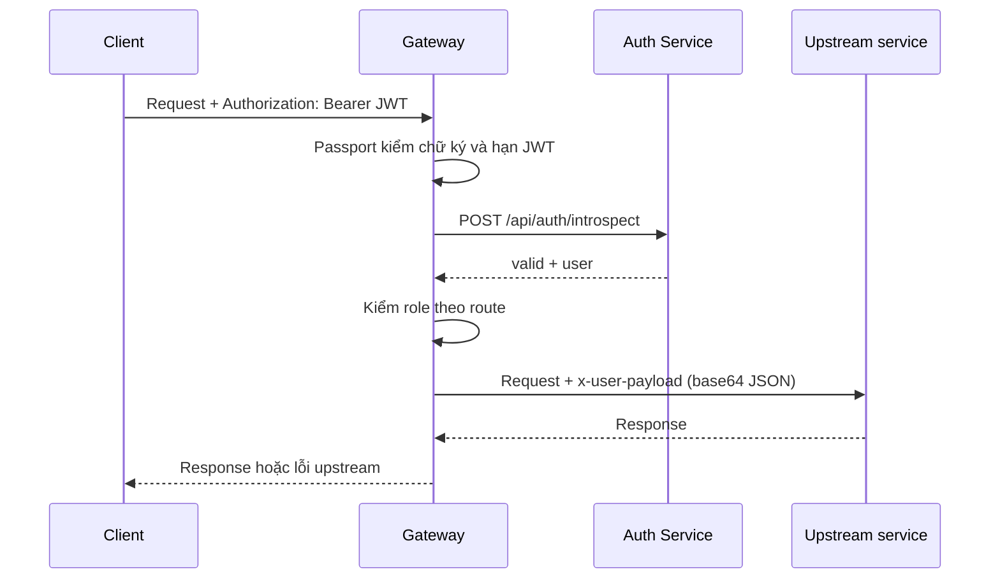

# API Gateway

Tài liệu này mô tả service `gateway/` trong repository. Đây là NestJS API
Gateway/BFF: cung cấp một HTTP API thống nhất cho client, xác thực JWT và phân
quyền trước khi chuyển tiếp request đến các microservice Auth, User, Chat,
Todo, Work Schedule và Canteen. Gateway không sở hữu database nghiệp vụ.

## 1. Vai trò trong hệ thống

```mermaid
flowchart LR
  C[Client] --> G[API Gateway :3000]
  C <-. Socket.IO /socket.io .-> G
  G <--> A[Auth :4000]
  G --> U[User :5000]
  G <--> CH[Chat :5002]
  G --> T[Todo :5003]
  G --> W[Work Schedule :5004]
  G --> CA[Canteen :5005]
```

Mọi API nghiệp vụ mà Gateway hiện expose đều có tiền tố `/api`. Request đến
module được bảo vệ sẽ đi theo luồng:



`/socket.io` là ngoại lệ: Gateway reverse-proxy cả HTTP polling và WebSocket
upgrade đến Chat Service; route này không đi qua controller/guard NestJS.

## 2. Cấu trúc thư mục

```text
gateway/
├── src/
│   ├── main.ts                         # HTTP server, CORS, validation, Swagger, Socket.IO proxy
│   ├── app.module.ts                   # Nạp cấu hình và các module BFF
│   ├── app.controller.ts               # GET / và GET /health
│   ├── common/
│   │   ├── decorators/                 # @Public, @Roles
│   │   ├── enums/role.enum.ts          # ADMIN, MANAGER, CHEF, ...
│   │   └── http/upstream-error.ts      # Chuẩn hóa lỗi Axios/upstream
│   └── modules/
│       ├── auth/                       # Proxy Auth + JWT/role guards
│       ├── user/                       # Proxy User Service
│       ├── chat/                       # Proxy Chat + upload ảnh
│       ├── todo/                       # Proxy Todo Service
│       ├── workschedule/               # Proxy Work Schedule Service
│       └── canteen/                    # Proxy Canteen Service
├── .env                                # URL các upstream và JWT secret
├── package.json
└── doc.md
```

Mỗi module BFF import `HttpModule`, có controller nhận API từ client và service
dùng `HttpService` (Axios) để gọi service đích. `AuthModule` là global, nên
`JwtAuthGuard` và `RolesGuard` được dùng ở các module khác mà không cần import
lại.

## 3. Khởi động và cấu hình HTTP

`src/main.ts` thực hiện các bước sau:

1. Nạp biến môi trường từ `.env` bằng `dotenv` trước khi khởi động Nest.
2. Giới hạn JSON body ở `10mb`.
3. Bật CORS cho mọi origin (`origin: '*'`), không gửi credentials.
4. Bật `ValidationPipe` toàn cục với `whitelist: true` và `transform: true`.
   Field không có trong DTO bị loại bỏ; các DTO dùng `class-validator` sẽ được
   kiểm tra trước khi gọi upstream.
5. Sinh Swagger từ controller/DTO và phục vụ tại `/api-docs` mặc định.
6. Tạo reverse proxy `/socket.io` sang Chat Service, gồm cả WebSocket upgrade.
7. Listen tại `PORT`, mặc định `3000`, bind `0.0.0.0`.

Hai endpoint kiểm tra nhanh không được đưa vào Swagger:

| Method | Path | Kết quả |
| --- | --- | --- |
| GET | `/` | Trạng thái Gateway và danh sách nhóm service |
| GET | `/health` | `{ status: "ok", service: "gateway" }` |

## 4. Xác thực, phân quyền và chuyển tiếp identity

Tất cả controller module đều khai báo `@UseGuards(JwtAuthGuard, RolesGuard)`.
`@Public()` bỏ qua `JwtAuthGuard`; nếu một handler không có `@Roles()`,
`RolesGuard` cho phép mọi user đã xác thực đi qua.

Với request cần đăng nhập, `JwtStrategy`:

1. Đọc bearer token từ header `Authorization`.
2. Xác minh chữ ký và `exp` cục bộ bằng `JWT_SECRET`.
3. Gọi `POST {AUTH_SERVICE_URL}/api/auth/introspect`, chuyển nguyên header
   `Authorization`.
4. Chỉ gắn `data.user` vào `req.user` khi Auth Service trả `valid: true` và có
   `user`. Điều này cũng phát hiện credential đã bị xóa sau khi token được cấp.

Các role được Gateway nhận diện là `ADMIN`, `MANAGER`, `CHEF`, `CASHIER`,
`WAITER`, `USER`, `VIP`; phép so sánh không phân biệt hoa/thường.

Khi forward request đã xác thực, Gateway JSON-serialize `req.user`, encode
base64 và gửi header nội bộ `x-user-payload`. Không chuyển bearer token đến các
upstream BFF này. Query string và body được chuyển tiếp tương ứng; mã lỗi/body
từ upstream được giữ lại. Nếu không kết nối được upstream, client nhận `502`
với thông báo service hiện không khả dụng.

> `x-user-payload` chỉ là base64, không phải chữ ký. Các service phía sau phải
> chỉ khả dụng trên private network hoặc xác minh một internal credential đã ký;
> nếu public trực tiếp, client có thể giả mạo header này.

## 5. API công khai và xác thực

Base URL local: `http://localhost:3000`. Swagger mặc định:
`http://localhost:3000/api-docs`.

### Auth — `/api/auth`

| Method | Path | Quyền tại Gateway | Body chính |
| --- | --- | --- | --- |
| POST | `/register` | Public | `email`, `password`, `username` |
| POST | `/login` | Public | `email`, `password` |
| POST | `/verify` | Public | `email`, `otp` (6 ký tự) |
| POST | `/refresh` | Public | token theo Auth Service |
| POST | `/login-google` | Public | `token` |
| GET | `/me` | JWT | — |
| PATCH | `/me/email` | JWT | `email` |
| DELETE | `/me` | JWT | — |
| GET | `/users/:userId` | ADMIN | — |
| DELETE | `/users/:userId` | ADMIN | — |
| PATCH | `/users/:userId/role` | ADMIN | `role` |

Các DTO validate `register`, `login`, `verify`, `login-google` và đổi email.
`refresh` và body đổi role hiện được khai báo inline nên Gateway chưa validate
chi tiết trước khi forward.

### User — `/api/user`

Toàn bộ nhóm này cần JWT; chỉ route cuối cần ADMIN.

| Method | Path | Quyền | Mục đích |
| --- | --- | --- | --- |
| GET | `/me` | JWT | Lấy profile của chính user |
| GET | `/user/all` | JWT | Lấy toàn bộ user |
| GET | `/:userId` | JWT | Lấy profile public của user khác |
| POST | `/update/user` | JWT | Cập nhật `username` |
| GET | `/admin/:userId` | ADMIN | Lấy profile user bất kỳ cho admin |

### Chat — `/api/chat`

Tất cả API Chat cần JWT.

| Method | Path | Body / ghi chú |
| --- | --- | --- |
| POST | `/chat/new` | `{ otherUserId }`; phải là MongoDB ObjectId |
| GET | `/chat/all` | Danh sách chat của user hiện tại |
| POST | `/message` | `multipart/form-data`: `chatId`, `text?`, `image?` |
| GET | `/message/:chatId` | Tin nhắn trong chat |

Upload `image` chỉ nhận MIME `image/*`, tối đa 5 MB. Nếu có ảnh, Gateway tạo
multipart form mới để gửi Chat Service, giới hạn request/response upstream 6 MB
và timeout 55 giây. Realtime dùng `/socket.io` thay vì các route trên.

### Todo — `/api/todo`

| Method | Path | Quyền | Body / mục đích |
| --- | --- | --- | --- |
| GET | `/my-tasks` | JWT | Công việc của bản thân |
| PATCH | `/:id/status` | JWT | `status`: `todo`, `in_progress`, `done`, `cancelled` |
| POST | `/` | ADMIN | Tạo task: `title`, `description?`, `priority?`, `deadline?`, `assignedTo?` |
| PATCH | `/:id/assign` | ADMIN | `{ assignedTo }` |
| GET | `/` | ADMIN | Tất cả task |
| DELETE | `/:id` | ADMIN | Xóa task |

### Work Schedule — `/api/workschedule`

Tất cả route trừ `GET /policy` yêu cầu JWT. Ký hiệu `Quản lý` trong bảng là
`ADMIN`, `MANAGER` hoặc `CHEF`.

| Nhóm | API | Quyền |
| --- | --- | --- |
| Quản lý lịch | `GET /schedule/pending`, `GET /schedule/all`, `POST /schedule/requests/:id/approve`, `POST /schedule/requests/:id/reject`, `POST /schedule/requests/bulk-approve`, `GET /schedule/heatmap` | Quản lý |
| Điểm danh | `POST /attendance/scan`, `GET /attendance/my` | JWT |
| Điểm danh quản trị | `POST /attendance/qr/generate`, `GET /attendance/today`, `GET /attendance/report` | Quản lý |
| Chính sách | `GET /policy` | Public |
| Chính sách | `PATCH /policy` | ADMIN |
| Lịch cá nhân | `GET /schedule/monthly-overview?month=...`, `GET /schedule/my`, `POST /schedule/requests` | JWT |
| Chỉnh lịch | `GET`, `PATCH`, `DELETE /schedule/requests/:id` | Quản lý |
| Đơn từ cá nhân | `GET /requests/my/stats?month=...`, `GET /requests/my`, `POST /requests`, `PATCH /requests/:id/cancel` | JWT |
| Đơn từ quản lý | `GET /requests/admin`, `POST /requests/:id/approve`, `POST /requests/:id/reject` | Quản lý |

`POST /schedule/requests` nhận `week_start` và 1–7 `entries`. Một entry có
`date`, `type` (`office`, `remote`, `day_off`, `leave`), `period`
(`full_day`, `morning`, `afternoon`) và `note?`. Các request đơn từ hỗ trợ loại
`leave`, `late`, `early`, `overtime`, `business_trip`, `remote`.

### Canteen — `/api/canteen`

| Nhóm | API | Quyền |
| --- | --- | --- |
| Menu | `GET /menu`, `GET /menu/search?q=...` | Public |
| Quản trị menu | `POST /admin/menu`, `PUT`/`DELETE /admin/menu/:id`, `POST /admin/menu/undo`, `POST /admin/menu/redo` | ADMIN, MANAGER |
| Đơn hàng | `POST /orders`, `GET /orders/my-orders`, `GET /orders/:id` | JWT |
| Xử lý đơn | `PATCH /orders/:id/confirm`, `PATCH /orders/:id/complete` | ADMIN, MANAGER |
| Bếp | `GET /kitchen/queue`, `POST /kitchen/next`, `PATCH /kitchen/orders/:id/cooking`, `PATCH /kitchen/orders/:id/ready` | ADMIN, MANAGER, CHEF |
| Bàn ăn | `GET /tables`, `GET /tables/:id` | Public |
| Quản lý bàn | `POST /tables` | ADMIN, MANAGER |
| Trạng thái/phân bàn | `PATCH /tables/:id/status`, `POST /tables/allocate` | ADMIN, MANAGER, WAITER |
| Kho | `POST /inventory/ingredients`, `POST /inventory/batches` | ADMIN, MANAGER |
| Kho | `GET /inventory/expiry-alerts`, `POST /inventory/consume` | ADMIN, MANAGER, CHEF |
| Phân tích | `GET /analytics/top-dishes?limit=...` | ADMIN, MANAGER |

Gateway validate DTO cho menu, order, bàn, kho và lịch. Ví dụ, order yêu cầu
`items` không rỗng, table status chỉ có `empty`, `occupied`, `reserved`, và
phương thức thanh toán là `CASH`, `VNPAY`, `MOMO` hoặc `VIETQR`.

## 6. Mapping upstream

Gateway chuyển request đến API nội bộ tương ứng (đa số giữ nguyên path; User
Service là một ví dụ có path nội bộ khác path public). Các URL sau có thể thay
qua environment; giá trị mặc định phù hợp khi các service chạy trực tiếp local.

| Module Gateway | Environment | Mặc định | Upstream path |
| --- | --- | --- | --- |
| Auth | `AUTH_SERVICE_URL` | `http://localhost:4000` | `/api/auth/*` |
| User | `USER_SERVICE_URL` | `http://localhost:5000` | `/api/user/*` |
| Chat + Socket.IO | `CHAT_SERVICE_URL` | `http://localhost:5002` | `/api/chat/*`, `/socket.io` |
| Todo | `TODO_SERVICE_URL` | `http://localhost:5003` | `/api/todo/*` |
| Work Schedule | `WORKSCHEDULE_SERVICE_URL` | `http://localhost:5004` | `/api/workschedule/*` |
| Canteen | `CANTEEN_SERVICE_URL` | `http://localhost:5005` | `/api/canteen/*` |

`MAIL_SERVICE_URL` và `PAYMENT_SERVICE_URL` có trong `.env`/Docker Compose
nhưng Gateway hiện chưa có module/controller nào gọi hai URL đó.

## 7. Biến môi trường

Không commit JWT secret production. Có thể tạo `gateway/.env` với mẫu sau:

```dotenv
PORT=3000
JWT_SECRET=replace-with-the-auth-service-jwt-secret
AUTH_SERVICE_URL=http://localhost:4000
USER_SERVICE_URL=http://localhost:5000
CHAT_SERVICE_URL=http://localhost:5002
TODO_SERVICE_URL=http://localhost:5003
WORKSCHEDULE_SERVICE_URL=http://localhost:5004
CANTEEN_SERVICE_URL=http://localhost:5005

# Tùy chọn Swagger
TITTLE_SWAGGER=Centralized API Gateway
CONTENT_SWAGGER=API Gateway for Microservices
VERSION_SWAGGER=1.0.0
ENDPOINT_SWAGGER=api-docs
```

`TITTLE_SWAGGER` được viết đúng theo tên key trong mã nguồn (dù chính tả thông
thường là `TITLE_SWAGGER`). Khi chạy Docker Compose ở root, các URL upstream
được thay bằng DNS nội bộ như `http://auth:4000`; Gateway được publish qua
`${GATEWAY_BIND_IP:-0.0.0.0}:${GATEWAY_HOST_PORT:-3000}`.

## 8. Chạy và kiểm tra

Từ thư mục `gateway/`:

```bash
npm install
npm run dev
npm run build
npm run start:prod
```

Sau khi Auth Service đã chạy, có thể kiểm tra:

```bash
curl http://localhost:3000/health
curl http://localhost:3000/api/canteen/menu

curl http://localhost:3000/api/user/me \
  -H 'Authorization: Bearer <JWT>'
```

Hoặc khởi động bằng Docker Compose ở root repository:

```bash
docker compose up --build gateway auth user chat todo workschedule canteen
```

## 9. Lưu ý triển khai và bảo mật

- JWT phải dùng cùng `JWT_SECRET` với Auth Service. Ngoài việc verify local,
  Gateway còn gọi `introspect` mỗi request được bảo vệ, nên Auth Service phải
  sẵn sàng thì các API private mới hoạt động.
- CORS đang mở cho mọi origin. Production nên thay `origin: '*'` bằng danh sách
  frontend đáng tin cậy và cấu hình credentials phù hợp nếu cần cookie.
- Auth `refresh`, đổi role là body inline; nên bổ sung DTO với validation để
  tránh chuyển dữ liệu không hợp lệ đến Auth Service.
- Các microservice hiện tin header `x-user-payload`; cần cô lập network hoặc
  ký/xác minh header nội bộ trước khi expose chúng ra ngoài.
- Gateway chưa đặt timeout chung cho `HttpService`; ngoại trừ upload Chat. Nên
  đặt timeout, retry có kiểm soát và circuit breaker phù hợp để tránh request
  treo khi upstream lỗi.
- `/socket.io` được proxy thẳng, không có JWT guard Gateway. Việc xác thực kết
  nối realtime phải được Chat Service thực hiện.
