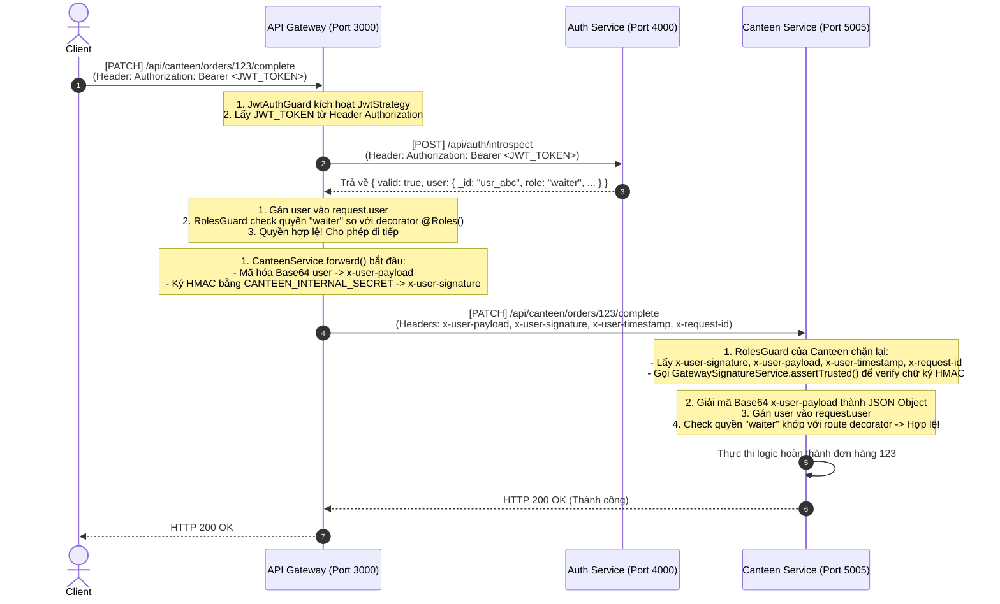
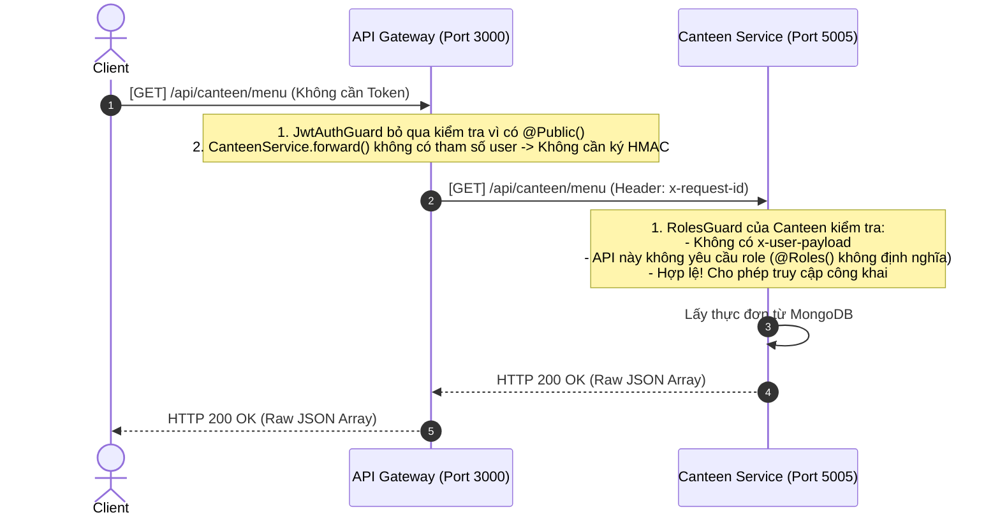
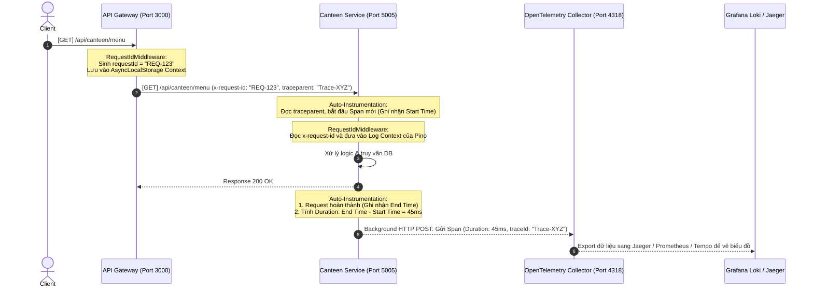

# BÁO CÁO KIẾN TRÚC: OBSERVABILITY & SECURITY ARCHITECTURE IN MICROSERVICES

Tài liệu này mô tả chi tiết cách thức hoạt động của vòng đời Request (Lifecycle), cơ chế Tracing (Đo tốc độ xử lý `ms`), cơ chế Bảo mật (JWT Verification + HMAC Gateway Signature) và xử lý lỗi 4xx/5xx trong hệ thống Backend.

---

## 1. Sự Tiến Hóa của Vòng Đời Request: Tại sao không cần Interceptor ở từng Service?

Trong NestJS, vòng đời đầy đủ của một Request đi qua các tầng như sau:

```text
Client Request ──> [1. Middleware] ──> [2. Guards] ──> [3. Interceptors (Pre)] ──> [4. Pipes]
                                                                                       │
Client Response <── [8. Exception Filters] <── [7. Interceptors (Post)] <── [5. Controller & 6. Service]
```

### Tại sao trước đây cần Interceptor ở các Service?
Trước khi chuyển sang kiến trúc Microservices với API Gateway, các service nhận request trực tiếp từ Client:
* **Xác thực (Auth):** Từng service phải chặn request bằng Interceptor hoặc Guard để parse JWT token, kiểm tra chữ ký token và truy vấn DB xác thực.
* **Chuẩn hóa Response/Error:** Mỗi service cần Response Interceptor để bọc dữ liệu trả về theo chuẩn chung (ví dụ: `{ data, success }`) hoặc xử lý chuyển đổi mã lỗi.
* **Tracing:** Tự viết Interceptor để sinh ra `requestId` và đo đạc thời gian thực thi (latency).

### Tại sao hiện tại KHÔNG cần (Thư mục `interceptors` rỗng)?
Dự án đã tách biệt trách nhiệm cực kỳ tốt theo mô hình **API Gateway Pattern** và áp dụng các Best Practice của NestJS:
1. **Interceptor được Skip (Bỏ qua):** NestJS sẽ bỏ qua tầng Interceptor nếu không được khai báo. Điều này giúp tối ưu hóa hiệu năng vì không phải đi qua các hàm trung gian rỗng.
2. **Guards thay thế Auth:** Gateway giải quyết JWT tập trung. Các service con chỉ cần một Guard gọn nhẹ là `GatewayIdentityGuard` hoặc `RolesGuard` để verify chữ ký bảo mật từ Gateway chuyển tiếp xuống.
3. **Middleware thay thế Tracing/Logging:** Việc ghi log ngữ cảnh (Log Context) và gán `requestId` được chuyển lên tầng **Middleware** (`RequestIdMiddleware`, `RequestOutcomeMiddleware`) vì Middleware chạy sớm nhất (trước cả Guard và Pipe), đảm bảo log đầy đủ nhất.
4. **Exception Filters thay thế Error Handling:** Mọi cấu trúc lỗi trả về được chuẩn hóa tự động qua **`GlobalExceptionFilter`** toàn cục.

---

## 2. Luồng Bảo Mật & Xác Thực (JWT Authentication & Role Authorization)

Hệ thống phân tách bảo mật thành 2 lớp: **Xác thực JWT tại API Gateway** và **Xác minh chữ ký bảo mật (HMAC Signature) tại Service con**.

### Sơ đồ Sequence Diagram: Luồng Gọi API Có Quyền (Private Route)
*Ví dụ: Client gọi API `PATCH /api/canteen/orders/:id/complete` để hoàn thành đơn hàng (Yêu cầu quyền ADMIN, MANAGER, CASHIER, hoặc WAITER).*



### Chi tiết các bước xác thực:

#### Bước A: Xác thực JWT tại API Gateway
1. **Client gửi JWT:** Gửi yêu cầu với header `Authorization: Bearer <JWT_TOKEN>`.
2. **Passport Extract Token:** File `jwt.strategy.ts` tự động bóc tách token này ra từ header:
   ```typescript
   jwtFromRequest: ExtractJwt.fromAuthHeaderAsBearerToken()
   ```
3. **Gọi Auth Service để kiểm tra tính hợp lệ (Introspection):** 
   Gateway gửi một POST request chứa JWT token đến Auth Service để xác thực trạng thái (ví dụ check token có bị thu hồi/hết hạn không):
   ```typescript
   const { data } = await this.httpService.post(`${this.authServiceUrl}/api/auth/introspect`, {}, {
     headers: { Authorization: authorization }
   });
   ```
4. **Thiết lập req.user:** Nếu token hợp lệ, Gateway trả về thông tin user (gồm `_id`, `role`, `username`). Đối tượng này được tự động gán vào `req.user` ở Gateway.
5. **Gateway Roles Guard:** `RolesGuard` ở Gateway so khớp quyền `req.user.role` với cấu hình yêu cầu trên Controller:
   ```typescript
   @Roles(Role.ADMIN, Role.MANAGER, Role.CASHIER, Role.WAITER)
   ```
   Nếu user có role thỏa mãn, request được cho phép tiếp tục đi xuống service.

#### Bước B: Ký bảo mật HMAC và chuyển tiếp sang Service con
Gateway sử dụng `InternalRequestSignatureService` để tạo ra các header chữ ký bảo mật trước khi gọi service con:
1. **Mã hóa Payload:** Gateway mã hóa đối tượng user thành một chuỗi **Base64** và gán vào header `x-user-payload`:
   ```typescript
   const userPayloadStr = JSON.stringify(user);
   const base64User = Buffer.from(userPayloadStr).toString('base64');
   ```
2. **Ký chữ ký bảo mật (HMAC SHA-256):** Gateway lấy mã bí mật dùng chung (ví dụ `CANTEEN_INTERNAL_SECRET`), kết hợp với `x-user-payload`, `x-request-id`, và `timestamp` hiện tại để tạo ra chữ ký mã hóa `x-user-signature`.

#### Bước C: Giải mã và Xác thực quyền tại Service con (Canteen)
Khi request đến Canteen Service, file [roles.guard.ts](file:///media/thanhle/D2/pj1/backend/canteen/src/common/guards/roles.guard.ts) của Canteen sẽ thực thi:
1. **Xác minh chữ ký Gateway:**
   Canteen gọi `GatewaySignatureService.assertTrusted()` để tự tính toán lại chữ ký HMAC sử dụng cùng một secret key `CANTEEN_INTERNAL_SECRET` và so sánh với chữ ký `x-user-signature` nhận được. Nếu chữ ký không khớp hoặc timestamp quá cũ (> 5 phút), Guard lập tức ném lỗi `UnauthorizedException`.
2. **Giải mã Base64 Payload:**
   Sau khi xác thực chữ ký là chính chủ từ Gateway gửi tới, Guard tiến hành giải mã Base64 ngược trở lại thành JSON Object và gán vào `request.user` của Canteen:
   ```typescript
   const jsonString = Buffer.from(base64Payload, 'base64').toString('utf8');
   const parsed = JSON.parse(jsonString);
   request.user = parseAuthenticatedUser(parsed);
   ```
3. **Kiểm tra quyền cục bộ:**
   Guard của Canteen so khớp role trong `request.user.role` với các role được định nghĩa cục bộ ở API của Canteen Controller. Nếu hợp lệ, Controller sẽ được gọi để xử lý Logic Nghiệp vụ.

---

## 3. Luồng Gọi API Công Khai (Public Route)
*Ví dụ: Client gọi API `GET /api/canteen/menu` để xem thực đơn.*



---

## 4. Bản Đồ Tracing & Cơ Chế Đo Tốc Độ Xử Lý (ms)

Hệ thống Tracing và đo đạc tốc độ xử lý (`latency` trong `ms`) hoạt động hoàn toàn tự động dưới nền (under the hood) nhờ **OpenTelemetry** và **Pino Logger**.



---

## 5. Luồng Xử Lý Lỗi Chi Tiết (4xx, 5xx và Lỗi Mạng)

Khi có sự cố xảy ra, các Exception Filters sẽ chuyển tiếp thông báo lỗi theo thứ tự:

### Kịch bản A: Lỗi 4xx (Lỗi Phân Quyền/Dữ Liệu - Expected Error)
*Ví dụ: Người dùng yêu cầu xem món ăn không tồn tại (404 Not Found).*

* **Canteen Service:** Bắt lỗi 404 $\rightarrow$ Định dạng JSON Response 404 $\rightarrow$ Trả về Gateway.
* **Gateway Service:** Nhận lỗi qua Axios $\rightarrow$ Ném lỗi `UpstreamHttpException` $\rightarrow$ Gateway Exception Filter bắt được $\rightarrow$ Trả JSON 404 nguyên bản cho Client.
* **Console Output (Terminal Gateway):** Log warning nhẹ dạng `"event.name": "http.request.rejected"` (Không spam stacktrace).

### Kịch bản B: Lỗi 5xx (Lỗi Hệ Thống - Unexpected Error)
*Ví dụ: Database MongoDB bị sập.*

* **Canteen Service:** Gặp lỗi DB $\rightarrow$ Filter bắt được lỗi $\rightarrow$ Gọi `logAndRecordException()` $\rightarrow$ **In toàn bộ Stack Trace ra Terminal của Canteen** $\rightarrow$ Tạo `errorId: "err_999"` $\rightarrow$ Trả về Gateway JSON ẩn danh chứa `errorId: "err_999"`.
* **Gateway Service:** Nhận lỗi 500 $\rightarrow$ Ném `UpstreamHttpException` $\rightarrow$ Gateway Exception Filter bắt được $\rightarrow$ **In log warn `"http.upstream.failed"` kèm errorId `"err_999"` ra Terminal Gateway** $\rightarrow$ Trả JSON 500 ẩn danh kèm `errorId` cho Client.

---

## 6. Tóm tắt các File chịu trách nhiệm liên kết chính

| Tên File | Đường dẫn | Chức năng |
| :--- | :--- | :--- |
| **Gateway JWT Strategy** | `/gateway/src/modules/auth/common/guard/jwt/jwt.strategy.ts` | Trích xuất JWT từ header Authorization và gọi Auth Service introspect để lấy thông tin user gán vào `req.user`. |
| **Gateway Signature Service** | `/gateway/src/common/security/internal-request-signature.service.ts` | Mã hóa Base64 user payload và tạo chữ ký HMAC SHA-256 kèm theo timestamp. |
| **Canteen Roles Guard** | `/canteen/src/common/guards/roles.guard.ts` | Verify chữ ký HMAC từ Gateway gửi sang, giải mã Base64 payload, gán `request.user` và kiểm tra quyền truy cập route. |
| **Telemetry Helper** | `/logger/packages/observability/telemetry.js` | Hàm `logAndRecordException()` ghi nhận stacktrace lỗi và gán thuộc tính `error.id`, `error.code` vào OpenTelemetry Span đang hoạt động. |
| **Gateway Exceptions Parser** | `/gateway/src/common/http/upstream-error.ts` | Hàm `throwUpstreamError()` bóc tách và phân loại lỗi HTTP từ các service con trả về, bảo toàn `errorId` và đóng gói thành `UpstreamHttpException`. |
