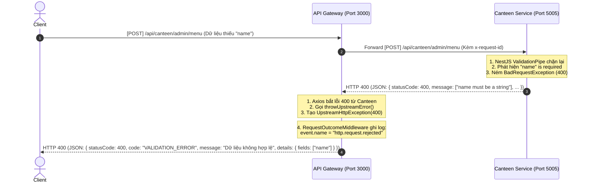
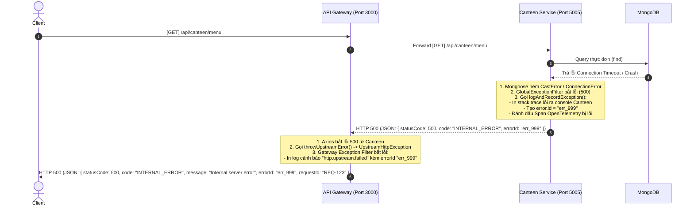
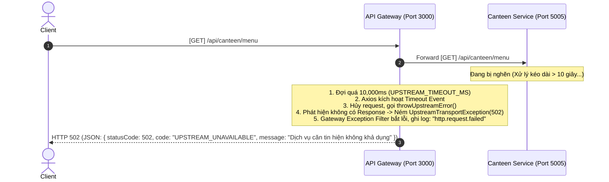

# BÁO CÁO CHI TIẾT: CÁC KỊCH BẢN LỖI VÀ NGHẼN TRONG MICROSERVICES

Báo cáo này mô tả chi tiết đường đi của Request từ phía Client khi gặp phải các sự cố:
1. **Lỗi xác thực dữ liệu (400 Validation Error)**
2. **Lỗi hệ thống / Database gặp sự cố (500 Internal Server Error)**
3. **Dịch vụ con bị nghẽn hoặc phản hồi quá chậm (Request Timeout - 502 Bad Gateway)**

---

## KỊCH BẢN 1: Lỗi Xác Thực Dữ Liệu (400 Validation Error)
*Ví dụ: Client gửi một request tạo mới món ăn nhưng thiếu trường tên món ăn (`name` bị bỏ trống).*

### Sơ đồ Sequence Diagram

### Các bước xử lý chi tiết:
1. **Client gửi dữ liệu sai:** Client gửi API POST tạo món ăn nhưng JSON Body trống rỗng.
2. **Gateway chuyển tiếp:** Do API này chỉ kiểm tra Auth ở Gateway, dữ liệu thô vẫn được chuyển xuống Canteen.
3. **Canteen ValidationPipe xử lý:** 
   * ValidationPipe của Canteen (khai báo global trong `main.ts`) đọc DTO `CreateMenuItemDto`.
   * Phát hiện vi phạm validation, pipe lập tức ném ra lỗi `BadRequestException (400)`.
4. **Canteen Exception Filter:**
   * `GlobalExceptionFilter` của Canteen bắt lỗi này, bọc lại dạng JSON chứa danh sách các trường lỗi (`details.fields`).
   * Trả response về cho Gateway với HTTP Status 400.
5. **Gateway Upstream Handler:**
   * Trong Gateway service, Axios nhận được response 400 và nhảy vào block `catch`.
   * Hàm `throwUpstreamError()` (tại `upstream-error.ts`) bóc tách danh sách các trường bị lỗi từ Canteen và ném `UpstreamHttpException`.
6. **Trả lỗi cho Client:**
   * Gateway Exception Filter bắt exception này, log cảnh báo nhẹ `http.request.rejected` (không kèm stacktrace vì đây là lỗi do Client truyền sai dữ liệu) và trả về HTTP 400 cho Client.

---

## KỊCH BẢN 2: Lỗi Hệ Thống / Lỗi Database (500 Internal Error)
*Ví dụ: Canteen Service đang chạy thì Database MongoDB bị sập hoặc quá tải dẫn đến truy vấn bị lỗi.*

### Sơ đồ Sequence Diagram

### Các bước xử lý chi tiết:
1. **Lỗi DB phát sinh:** Mongoose ném ra lỗi kết nối Database.
2. **Canteen Service ghi nhận lỗi:**
   * `GlobalExceptionFilter` của Canteen bắt lỗi 500. Vì là *Unexpected*, nó chạy hàm `logAndRecordException()`.
   * Ghi log JSON có cấu trúc chứa toàn bộ Stack Trace của Mongoose ra màn hình Terminal của Canteen để Debug.
   * Gửi thông tin lỗi vào Active Span của OpenTelemetry (giúp hiển thị lỗi đỏ trên Jaeger UI).
   * Tạo ra một `errorId = "err_999"` duy nhất.
   * Trả về cho Gateway JSON ẩn danh, chỉ chứa `statusCode: 500` và `errorId: "err_999"` để bảo mật (không để lộ cấu trúc DB cho bên ngoài).
3. **Gateway Service trung chuyển:**
   * Gateway nhận response 500, Axios ném lỗi, hàm `throwUpstreamError()` đóng gói lỗi kèm `errorId: "err_999"`.
4. **Gateway in log cảnh báo:**
   * Filter của Gateway bắt lỗi, in ra Terminal của Gateway dòng log cảnh báo `http.upstream.failed` thông báo dịch vụ Canteen đã gặp sự cố kèm theo mã lỗi khớp `errorId: "err_999"`.
   * Client nhận được thông báo lỗi 500 chung chung kèm `errorId: "err_999"`. Người dùng có thể gửi mã `err_999` này cho kỹ thuật để tra cứu nhanh log lỗi trên hệ thống.

---

## KỊCH BẢN 3: Dịch Vụ Con Bị Nghẽn / Quá Tải (Axios Timeout - 502 Bad Gateway)
*Ví dụ: Canteen Service bị quá tải CPU, xử lý quá lâu không thể trả phản hồi về cho Gateway kịp thời.*

### Sơ đồ Sequence Diagram

### Các bước xử lý chi tiết:
1. **Cấu hình Timeout giới hạn nghẽn:**
   * Trong file [upstream-http.module.ts](file:///media/thanhle/D2/pj1/backend/gateway/src/common/http/upstream-http.module.ts#L5-L19), thời gian chờ phản hồi tối đa của Gateway từ service con được giới hạn mặc định là `10_000ms` (10 giây) qua cấu hình `UPSTREAM_TIMEOUT_MS`.
2. **Kích hoạt sự kiện Timeout:**
   * Khi Canteen Service bị đơ hoặc nghẽn, thời gian phản hồi vượt quá 10 giây.
   * Thư viện Axios của Gateway lập tức kích hoạt lỗi **Timeout Exception**.
3. **Xử lý ngắt kết nối nghẽn:**
   * Hàm `throwUpstreamError()` của Gateway phát hiện lỗi Axios này không có thuộc tính `error.response` (do kết nối bị ngắt giữa chừng vì quá giờ).
   * Lập tức chuyển đổi lỗi này thành **`UpstreamTransportException`** với status code `502 Bad Gateway` và mã lỗi `UPSTREAM_UNAVAILABLE`.
4. **Phản hồi lỗi nghẽn:**
   * Gateway Exception Filter bắt lỗi, in log `error` lên Terminal Gateway và trả về HTTP 502 cho Client, giúp giải phóng kết nối cho Client mà không bắt họ phải treo màn hình chờ đợi vô tận.
