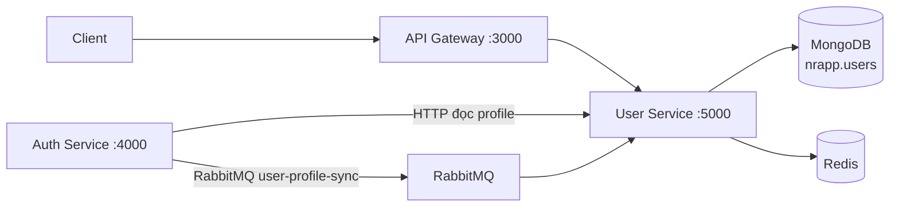
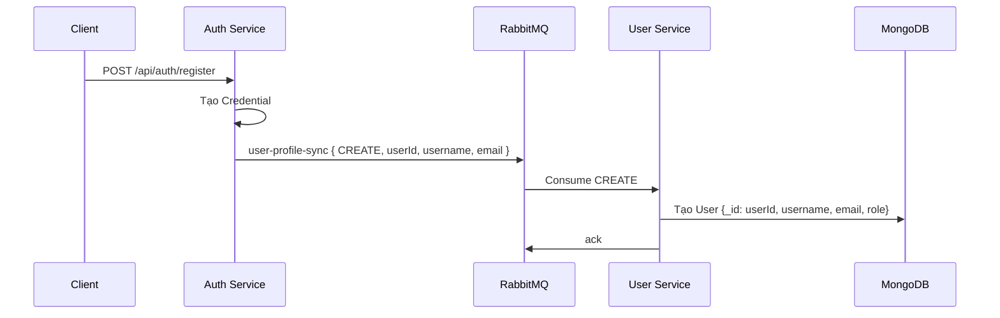

# User Service

Tài liệu này mô tả service `user/` trong repository. Đây là Express + Mongoose
microservice lưu **profile** người dùng: `username`, `email` và `role`. Mật khẩu,
OTP và JWT thuộc Auth Service; User Service dùng cùng MongoDB ObjectId với
credential để liên kết hai phần dữ liệu.

## 1. Vai trò trong hệ thống



Auth tạo credential trước rồi publish event vào queue `user-profile-sync`. User
Service consume event để tạo, đổi email/role hoặc xóa profile. Auth cũng gọi API
internal của User Service lúc cấp/refresh JWT để lấy `username` mới nhất.

Profile và credential có cùng `_id`; không có foreign key ở MongoDB nên việc
nhất quán phụ thuộc vào event RabbitMQ và các API nội bộ.

## 2. Cấu trúc thư mục

```text
user/
├── src/
│   ├── index.ts                      # Bootstrap Express, Mongo, RabbitMQ, Redis, Swagger
│   ├── config/
│   │   ├── db.ts                     # Kết nối MongoDB database nrapp
│   │   ├── rabbitmq.ts               # Connect, publish, consume durable queue
│   │   ├── TryCatch.ts               # Wrapper trả lỗi 500
│   │   └── generateToken.ts          # Hàm cũ, hiện không được gọi
│   ├── model/User.ts                 # Mongoose profile schema
│   ├── controllers/user.ts           # HTTP API và handleProfileSync
│   ├── routes/user.ts                # Route internal + route sau Gateway
│   └── middleware/isAuth.ts          # Đọc x-user-payload
├── .env
├── package.json
└── doc.md
```

## 3. Khởi động ứng dụng

Khi `src/index.ts` chạy, service lần lượt:

1. Nạp `.env` và mở kết nối MongoDB (`dbName: nrapp`).
2. Kết nối RabbitMQ, sau đó bắt đầu consume durable queue `user-profile-sync`.
3. Kiểm tra `REDIS_URL`, tạo Redis client và chờ kết nối thành công.
4. Tạo Express app với CORS và JSON parser.
5. Listen tại `PORT`, mặc định `5000`.

Redis chỉ được khởi tạo/kết nối trong service hiện tại, chưa có controller hoặc
nghiệp vụ nào đọc/ghi Redis. RabbitMQ, Redis hoặc MongoDB không sẵn sàng có thể
khiến service không kịp lắng nghe HTTP khi khởi động.

| Method | Path | Kết quả |
| --- | --- | --- |
| GET | `/health` | `{ status: "ok", service: "user" }` |
| GET | `/api-docs` | Swagger UI |
| GET | `/api/docs.json` | OpenAPI JSON |

## 4. Dữ liệu profile

File: `src/model/User.ts`.

| Field | Kiểu | Ràng buộc | Ý nghĩa |
| --- | --- | --- | --- |
| `_id` | ObjectId | do Mongoose tạo hoặc nhận từ Auth | ID chung với credential Auth Service |
| `username` | string | bắt buộc | Tên hiển thị |
| `email` | string | bắt buộc, unique | Email đồng bộ từ Auth Service |
| `role` | string | mặc định `user` | Role bản sao để trả profile |
| `createdAt`, `updatedAt` | Date | tự tạo | Do `timestamps: true` |

Schema hiện chưa `trim`, `maxlength`, `enum` role hoặc Mongoose validation email.
Đặc biệt, `email` unique tạo index nhưng không phải validation định dạng email.

## 5. Xác thực và ranh giới tin cậy

Route client (`/me`, `/user/*`, `/update/user`) gắn middleware `isAuth`.
Middleware không xác thực JWT; nó chỉ decode header do Gateway tạo:

```http
x-user-payload: <base64(JSON.stringify({ _id, email, username, role }))>
```

Gateway là nơi verify JWT với Auth Service và kiểm role. User Service phải chỉ
được gọi qua private network/Gateway, vì một client gọi trực tiếp có thể giả mạo
header base64. JSON decode cũng không có `try/catch`, nên payload hỏng có thể
trở thành lỗi `500`.

Ba route `/internal/*` hoàn toàn không gắn middleware:

- `GET /internal/:id` được Auth gọi để lấy username khi ký JWT;
- `POST /internal/create-profile` là API tạo profile dự phòng;
- `PATCH /internal/:id/role` là API đồng bộ role dự phòng.

Chúng phải chỉ được Auth Service tin cậy gọi. Auth hiện dùng RabbitMQ để đồng
bộ profile và gọi `GET /internal/:id`; hai route ghi internal không được Auth
Service hiện tại gọi.

## 6. Đồng bộ profile qua RabbitMQ

### Event contract

Auth publish các message persistent vào durable queue `user-profile-sync`:

| `action` | Payload cần dùng | Xử lý ở User Service |
| --- | --- | --- |
| `CREATE` | `userId`, `username`, `email`, `role?` | Tạo profile nếu chưa tồn tại; role mặc định `user` |
| `UPDATE_EMAIL` | `userId`, `email` | Đổi email của profile hiện có |
| `UPDATE_ROLE` | `userId`, `role` | Đổi role của profile hiện có |
| `DELETE` | `userId` | Xóa profile; không lỗi nếu không tồn tại |

Consumer chỉ `ack` sau khi `handleProfileSync` thành công. Khi xử lý lỗi hoặc
JSON message không hợp lệ, nó `nack(..., false, false)`: message bị bỏ, không
requeue và chưa có dead-letter queue. Nếu `CREATE` không thể publish hoặc event
bị bỏ, credential vẫn có thể tồn tại nhưng profile không được tạo.

### Luồng đăng ký



`CREATE` có tính idempotent một phần: nếu profile đã tồn tại, consumer chỉ log
và không cập nhật field. Với `UPDATE_EMAIL`/`UPDATE_ROLE`, profile chưa tồn tại
chỉ được cảnh báo trong log, không tạo bù.

## 7. API HTTP

Base URL nội bộ local: `http://localhost:5000/api/user`. Client nên dùng
Gateway: `http://localhost:3000/api/user`.

### API client qua Gateway

| Method | Gateway path | Route User Service được gọi | Quyền Gateway | Kết quả |
| --- | --- | --- | --- | --- |
| GET | `/me` | `/me` | JWT | Profile của chính user |
| GET | `/user/all` | `/user/all` | JWT | Toàn bộ profile |
| GET | `/:userId` | `/user/:userId` | JWT | Profile theo ID |
| POST | `/update/user` | `/update/user` | JWT | Đổi `username` của chính user |
| GET | `/admin/:userId` | `/user/:userId` | ADMIN | Gateway hiện gọi cùng data profile như route trên |

Request đổi username có body `{ "username": "New Username" }`. Controller chỉ
cập nhật nếu `username` là truthy; body rỗng vẫn trả thành công cùng profile cũ.
Không có validation DTO bên trong User Service; Gateway có kiểm `username` không
rỗng cho API công khai này.

`GET /user/all` và `GET /user/:id` ở service không lọc field hay phân quyền bổ
sung, nên response chứa email, role và timestamps. Gateway hiện cho mọi user đã
đăng nhập gọi `/user/all`; việc này không khớp phần mô tả "public profile" ở
Gateway và cần cân nhắc lại quyền/field response.

### API internal

| Method | Path | Body | Mục đích |
| --- | --- | --- | --- |
| POST | `/internal/create-profile` | `userId`, `username`, `email` | Tạo profile với `_id` từ Auth |
| GET | `/internal/:id` | — | Auth đọc profile khi cấp/refresh JWT |
| PATCH | `/internal/:id/role` | `{ role }` | Đồng bộ role qua HTTP nếu cần |

`POST /internal/create-profile` trả `400` nếu thiếu field hoặc profile đã tồn
tại. Route create internal không nhận role, vì vậy profile tạo qua route này
luôn dùng default `user`.

Ví dụ lấy profile qua Gateway:

```bash
curl http://localhost:3000/api/user/me \
  -H 'Authorization: Bearer <JWT>'
```

## 8. Response và lỗi

Response thành công không dùng envelope thống nhất. Ví dụ:

```json
{
  "message": "Username updated successfully.",
  "user": {
    "_id": "...",
    "username": "minh",
    "email": "minh@example.com",
    "role": "user"
  }
}
```

Controller trả `401` cho `/me` khi profile của user trong payload không còn;
`404` khi user/profile cần đọc hoặc cập nhật không tồn tại; `400` cho field
internal bị thiếu/trùng. `TryCatch` chuyển exception chưa xử lý thành `500` với
`message` của error.

## 9. Biến môi trường

Tạo `user/.env` theo mẫu, không commit giá trị secret:

```dotenv
PORT=5000
MONGO_URL=mongodb://localhost:27017/nrapp
REDIS_URL=redis://localhost:6379
Rabbitmq_Host=localhost
Rabbitmq_Username=guest
Rabbitmq_Password=guest
```

`JWT_SECRET` có thể nằm trong `.env` hiện tại nhưng User Service không dùng nó:
`config/generateToken.ts` có hàm ký JWT cũ nhưng không được import. Docker
Compose đặt Redis là `redis`, RabbitMQ là `rabbitmq`, publish User Service chỉ
trên `127.0.0.1:${USER_HOST_PORT:-5000}`, và chờ cả Redis/RabbitMQ healthy trước
khi khởi động.

## 10. Chạy và kiểm tra

Từ thư mục `user/`:

```bash
npm install
npm run dev
npm run build
npm start
```

Hoặc từ root repository:

```bash
docker compose up --build user auth gateway redis rabbitmq
```

Project chưa có test tự động (`npm test` hiện chỉ in thông báo và trả exit code
khác 0). Smoke test không cần profile payload:

```bash
curl http://localhost:5000/health
curl http://localhost:3000/health
```

## 11. Lưu ý cần hoàn thiện

- Xác thực bearer JWT hoặc dùng signed internal header thay vì tin
  `x-user-payload`; bảo vệ cả API `/internal/*` bằng mTLS/service token.
- Bổ sung validation/normalization username, email và enum role trong schema;
  chỉ trả các field phù hợp cho public profile và hạn chế `GET /user/all`.
- Dùng outbox, retry và dead-letter queue cho `user-profile-sync`; thêm cơ chế
  reconciliation để tự tạo/sửa profile mất đồng bộ.
- Bật retry/backoff cho kết nối RabbitMQ. Hiện lỗi kết nối lúc startup làm tiến
  trình không mở HTTP server.
- Bỏ Redis, bcrypt, JWT helper và các biến môi trường không dùng, hoặc triển
  khai use case thật sự cho chúng để giảm bề mặt vận hành.
