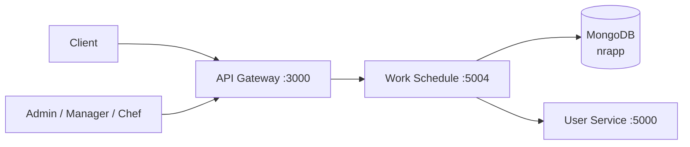
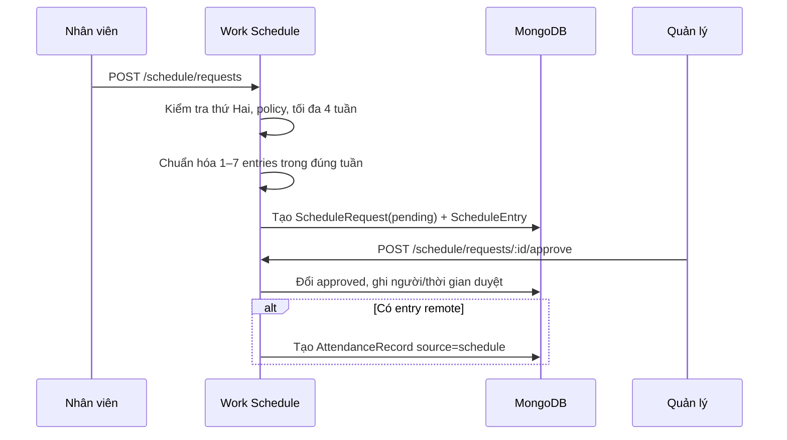
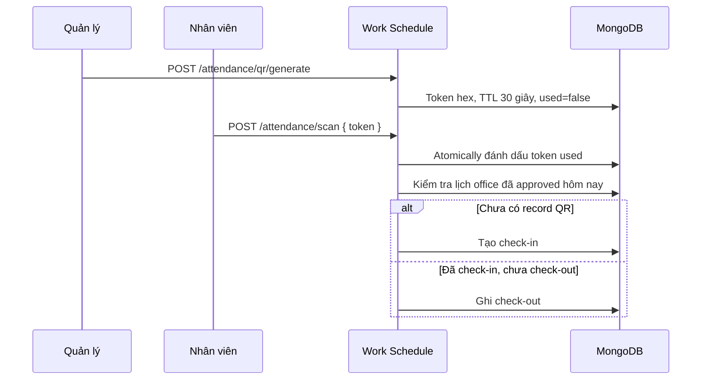

# Work Schedule Service

Tài liệu này mô tả service `workschedule/` trong repository. Đây là Express + Mongoose microservice quản lý đăng ký lịch làm việc theo tuần, quy trình duyệt lịch, điểm danh QR, chính sách mở/khóa đăng ký và các loại đơn từ nhân sự. Dữ liệu được lưu trong MongoDB database `nrapp`.

## 1. Vai trò trong hệ thống



Client nên gọi qua Gateway. Gateway xác minh JWT, kiểm role, encode identity vào `x-user-payload`, sau đó forward API vào Work Schedule Service. Service này đọc User Service để bổ sung profile nhân viên trong các danh sách của quản trị và báo cáo.

## 2. Cấu trúc thư mục

```text
workschedule/
├── src/
│   ├── index.ts                        # Express app, MongoDB, CORS, Swagger
│   ├── config/db.ts                    # Kết nối MongoDB database nrapp
│   ├── middleware/isAuth.ts            # Đọc x-user-payload từ Gateway
│   ├── routes/
│   │   ├── schedule.ts                 # Lịch cá nhân và đơn từ nhân sự
│   │   ├── adminSchedule.ts            # Duyệt lịch, heatmap
│   │   ├── attendance.ts               # QR và báo cáo điểm danh
│   │   └── policy.ts                   # Chính sách đăng ký
│   ├── controllers/                    # Nghiệp vụ theo từng route
│   ├── models/                         # Sáu MongoDB models
│   ├── services/
│   │   ├── scheduleEntryValidator.ts   # Chuẩn hóa/kiểm tra ngày trong tuần
│   │   ├── workRequestValidator.ts     # Kiểm tra đơn từ nhân sự
│   │   └── userService.ts              # Gọi User Service
│   └── utils/                          # ISO week và enrich profile
├── .env
├── package.json
└── doc.md
```

## 3. Khởi động ứng dụng

`src/index.ts` nạp `.env`, kết nối MongoDB rồi tạo Express application. Service bật CORS mặc định của package `cors`, JSON parser mặc định và lắng nghe tại `PORT`, mặc định `5004`. Không có global validation middleware: controller và service tự kiểm tra body cho các luồng tạo/cập nhật quan trọng.

| Method | Path | Kết quả |
| --- | --- | --- |
| GET | `/health` | `{ status: "ok", service: "workschedule" }` |
| GET | `/api-docs` | Swagger UI của service |
| GET | `/api/docs.json` | OpenAPI JSON |

## 4. Xác thực và phân quyền

Middleware `isAuth` không verify bearer JWT. Nó chỉ yêu cầu header `x-user-payload`, base64-decode JSON rồi đặt vào `req.user`:

```http
x-user-payload: <base64(JSON.stringify({ _id, email, username, role }))>
```

Gateway hiện tạo header này sau khi Auth Service introspect JWT. Các controller dùng `_id` hoặc `id` trong payload làm `employee_id`.

| Nhóm quyền | Vai trò được Gateway cho phép |
| --- | --- |
| Quản lý lịch/điểm danh/đơn từ | `ADMIN`, `MANAGER`, `CHEF` |
| Chỉnh chính sách | `ADMIN` |
| API cá nhân | Bất kỳ user đã xác thực |

Một số controller kiểm tra role lần nữa (`schedule` sửa/xóa, danh sách/duyệt đơn từ). Tuy nhiên nhiều route quản trị và `PATCH /policy` chỉ có `isAuth`, không kiểm role trong chính service. Header cũng không có chữ ký và JSON.parse không bắt lỗi. Vì vậy Work Schedule Service phải chỉ mở trong private network; không được expose trực tiếp ra Internet hay bỏ qua Gateway.

Khi cần enrich profile, service lấy bearer token từ header `Authorization` và gọi `GET {USER_SERVICE_URL}/api/user/user/all`. Gateway hiện không forward header này vào Work Schedule Service, nên các response đi qua Gateway có thể trả `employee: null`; dữ liệu lịch/điểm danh vẫn được trả bình thường.

## 5. Mô hình dữ liệu

### ScheduleRequest và ScheduleEntry

`ScheduleRequest` là một yêu cầu đăng ký một tuần; `ScheduleEntry` là các ngày trong yêu cầu đó.

| Model | Field chính | Ràng buộc / ý nghĩa |
| --- | --- | --- |
| `ScheduleRequest` | `employee_id`, `week_start`, `status` | Một employee chỉ có một request cho mỗi tuần nhờ unique index `(employee_id, week_start)`; trạng thái `pending`, `approved`, `rejected` |
| | `submitted_at`, `reviewed_by`, `reviewed_at`, `reject_reason` | Audit của quá trình duyệt |
| `ScheduleEntry` | `request_id`, `date` | Liên kết request và ngày làm việc |
| | `type` | `office`, `remote`, `day_off`, `leave` |
| | `period` | `full_day`, `morning`, `afternoon`; mặc định `full_day` |
| | `note` | Tùy chọn, tối đa 200 ký tự |

### Điểm danh và chính sách

| Model | Field chính | Ý nghĩa |
| --- | --- | --- |
| `AttendanceQrToken` | `token`, `date`, `expires_at`, `used` | Token hex duy nhất, dùng một lần; có `used_by`, `used_at` |
| `AttendanceRecord` | `employee_id`, `date`, `schedule_type` | Ca `office` hoặc `remote`; lưu check-in/check-out và nguồn `qr` hoặc `schedule` |
| `WorkPolicy` | `registration_start`, `registration_end`, `locked` | Khoảng thời gian được đăng ký lịch và cờ khóa; lưu người cập nhật |

`GET /policy` sẽ tự tạo một policy nếu database chưa có: thời điểm bắt đầu là hiện tại, kết thúc sau 30 ngày và `locked: true`. Do đó admin cần cập nhật/mở policy trước khi user thông thường có thể đăng ký lịch.

### WorkRequest

Đơn từ nhân sự độc lập với `ScheduleRequest`:

| Field | Giá trị / ràng buộc |
| --- | --- |
| `type` | `leave`, `late`, `early`, `overtime`, `business_trip`, `remote` |
| `status` | `pending`, `approved`, `rejected`, `cancelled` |
| `start_at`, `end_at?`, `period` | `period`: `full_day`, `morning`, `afternoon` |
| `reason` | Bắt buộc, tối đa 1.000 ký tự |
| `location?`, `project?`, `estimated_cost?` | Công tác phải có `location`; tăng ca phải có `project`; chi phí không âm |
| `manager_id?`, `attachment_urls`, `is_school_leave` | `manager_id` phải là ObjectId nếu có; tối đa 5 URL đính kèm |
| `reviewed_by?`, `reviewed_at?`, `reject_reason?` | Audit duyệt/từ chối |

Model có index cho `employee_id + start_at`, `type`, `status` và timestamp để tối ưu lịch sử/thống kê. Request trùng `employee_id`, `type`, `start_at` trong trạng thái `pending` hoặc `approved` bị từ chối.

## 6. Luồng nghiệp vụ

### 6.1 Đăng ký và duyệt lịch tuần



Khi tạo lịch:

- `week_start` phải là thứ Hai.
- Phải có 1–7 entry; không được trùng ngày và mọi ngày phải nằm trong khoảng bảy ngày bắt đầu từ `week_start` (UTC).
- Với user không phải `admin`, policy phải tồn tại trong khoảng mở và `locked` phải là `false`; tuần đăng ký không được quá bốn tuần so với tuần hiện tại.
- Tạo request trùng tuần của cùng employee bị từ chối.

Duyệt request `pending` đổi nó sang `approved`, ghi `reviewed_by`/`reviewed_at`. Với mỗi entry `remote`, service tự tạo bản ghi điểm danh nguồn `schedule` có giờ mặc định theo local time: full day `08:30–17:30`, morning `08:30–12:00`, afternoon `13:30–17:30`. Từ chối chuyển request sang `rejected` và lưu `reject_reason`.

Chỉ quản lý (`admin`, `manager`, `chef`) có thể sửa/xóa lịch đã gửi. Khi sửa một lịch đã duyệt, service xóa attendance remote nguồn `schedule` trong tuần rồi tạo lại theo entries mới; khi xóa lịch đã duyệt, các record remote này cũng bị xóa. Những thao tác này không dùng transaction MongoDB.

### 6.2 Điểm danh QR



Ngày "hôm nay" được tính theo UTC+7. QR token có hiệu lực 30 giây và chỉ dùng một lần. Chỉ user có entry `office` thuộc request đã duyệt trong ngày mới scan được. Lần scan QR đầu tạo check-in; scan tiếp theo tạo check-out; scan sau khi đã check-out trả lỗi.

> Token được đánh dấu `used` trước khi kiểm tra lịch office. Vì vậy một token scan bởi user không đủ điều kiện vẫn bị tiêu thụ; cần tạo token mới cho lần thử hợp lệ tiếp theo.

### 6.3 Đơn từ nhân sự

Nhân viên tạo đơn bằng `POST /requests`. `end_at` (nếu có) phải sau `start_at`; `overtime` và `business_trip` bắt buộc có `end_at`; `business_trip` cần `location`; `overtime` cần `project`. User chỉ hủy được đơn `pending` của chính mình. Quản lý duyệt hoặc từ chối các đơn pending; từ chối bắt buộc `reason` và được lưu thành `reject_reason`.

`GET /requests/my/stats` trả tổng số theo status/type và tổng giờ tăng ca đã duyệt (làm tròn một chữ số thập phân). Các API danh sách hỗ trợ `month=YYYY-MM`; list cá nhân còn hỗ trợ `type` và `status` (dùng `all` để bỏ filter).

## 7. API HTTP

Base URL local khi gọi trực tiếp: `http://localhost:5004/api/workschedule`. Trong môi trường chuẩn, gọi qua Gateway tại `http://localhost:3000/api/workschedule` để nhận JWT/role enforcement.

`JWT` trong các bảng có nghĩa service cần `x-user-payload` đã được Gateway tạo, không phải service tự kiểm bearer token.

### Lịch làm việc

| Method | Path | Quyền Gateway | Query/body |
| --- | --- | --- | --- |
| GET | `/schedule/my` | JWT | `week=YYYY-Www?`; lịch của bản thân, kèm entries |
| GET | `/schedule/monthly-overview` | JWT | `month=YYYY-MM` bắt buộc; lịch và thống kê tháng |
| POST | `/schedule/requests` | JWT | `week_start`, `entries` |
| GET | `/schedule/requests/:id` | Quản lý* | Chi tiết request và entries |
| PATCH | `/schedule/requests/:id` | Quản lý | `{ entries }` |
| DELETE | `/schedule/requests/:id` | Quản lý | Xóa request |
| GET | `/schedule/pending` | Quản lý | `week=YYYY-Www?` |
| GET | `/schedule/all` | Quản lý | `week=YYYY-Www?`, `status?` |
| POST | `/schedule/requests/:id/approve` | Quản lý | — |
| POST | `/schedule/requests/:id/reject` | Quản lý | `{ reason }` |
| POST | `/schedule/requests/bulk-approve` | Quản lý | `{ ids: string[] }` |
| GET | `/schedule/heatmap` | Quản lý | `week=YYYY-Www?`; approved entries nhóm theo ngày/type |

Monthly overview quy đổi `full_day` thành hai sessions và ca sáng/chiều thành một session. Nó trả `registered_sessions`, `approved_sessions`, số sessions office/remote/leave/day_off, `approved_work_days` và số request theo trạng thái.

\* Nếu gọi service nội bộ trực tiếp bằng `x-user-payload`, controller cho owner xem request của chính mình; Gateway hiện áp dụng `ADMIN`, `MANAGER` hoặc `CHEF` cho route này.

### Điểm danh và chính sách

| Method | Path | Quyền Gateway | Query/body |
| --- | --- | --- | --- |
| POST | `/attendance/scan` | JWT | `{ token }` |
| GET | `/attendance/my` | JWT | `from?`, `to?` |
| POST | `/attendance/qr/generate` | Quản lý | — |
| GET | `/attendance/today` | Quản lý | — |
| GET | `/attendance/report` | Quản lý | `from?`, `to?`, `employee_id?` |
| GET | `/policy` | Public | Tự tạo default policy nếu chưa có |
| PATCH | `/policy` | ADMIN | `registration_start?`, `registration_end?`, `locked?` |

### Đơn từ nhân sự

| Method | Path | Quyền Gateway | Query/body |
| --- | --- | --- | --- |
| GET | `/requests/my/stats` | JWT | `month=YYYY-MM?` |
| GET | `/requests/my` | JWT | `month?`, `type?`, `status?` |
| POST | `/requests` | JWT | WorkRequest body |
| PATCH | `/requests/:id/cancel` | JWT (owner) | — |
| GET | `/requests/admin` | Quản lý | `month?`, `type?`, `status?` |
| POST | `/requests/:id/approve` | Quản lý | — |
| POST | `/requests/:id/reject` | Quản lý | `{ reason }` |

Ví dụ tạo lịch tuần:

```bash
curl -X POST http://localhost:3000/api/workschedule/schedule/requests \
  -H 'Authorization: Bearer <JWT>' \
  -H 'Content-Type: application/json' \
  -d '{
    "week_start": "2026-08-17",
    "entries": [
      {"date":"2026-08-17","type":"office","period":"full_day"},
      {"date":"2026-08-18","type":"remote","period":"morning"}
    ]
  }'
```

## 8. Response và lỗi

Các controller phần lớn trả cấu trúc sau:

```json
{
  "success": true,
  "count": 1,
  "data": {}
}
```

`count` chỉ có ở API danh sách/báo cáo. Lỗi validation nghiệp vụ thường là `400`, resource không tìm thấy là `404`, không đủ quyền kiểm trong controller là `403`, trùng đơn từ là `409`, và lỗi không bắt chi tiết là `500`.

## 9. Biến môi trường

Tạo `workschedule/.env` theo mẫu và thay giá trị triển khai thực tế:

```dotenv
PORT=5004
MONGO_URL=mongodb://localhost:27017/nrapp
USER_SERVICE_URL=http://localhost:5000
```

`config/db.ts` luôn kết nối Mongoose với `dbName: 'nrapp'`, kể cả khi URI Mongo có database khác. Các biến Redis, RabbitMQ và JWT có thể có trong `.env` hiện tại nhưng code Work Schedule Service không sử dụng chúng. Docker Compose ghi đè `PORT=5004` và `USER_SERVICE_URL=http://user:5000`, đồng thời chỉ publish port này vào loopback host (`127.0.0.1`) theo cấu hình mặc định.

## 10. Chạy và kiểm tra

Từ thư mục `workschedule/`:

```bash
npm install
npm run dev
npm run build
npm start
```

Hoặc từ root repository:

```bash
docker compose up --build workschedule user gateway auth
```

Project chưa có test tự động (`npm test` hiện chỉ in thông báo và trả exit code khác 0). Kiểm tra smoke test nên đi qua Gateway:

```bash
curl http://localhost:3000/health
curl http://localhost:3000/api/workschedule/policy
```

## 11. Lưu ý cần hoàn thiện

- Service cần xác minh JWT hoặc internal signed header thay vì tin base64 `x-user-payload`; đồng thời phải bắt lỗi khi decode/parse payload.
- Phân quyền cần được thực thi nhất quán ngay trong service, đặc biệt với route admin schedule, attendance report/generate QR và cập nhật policy.
- Gateway nên forward `Authorization` đáng tin cậy cho cơ chế enrich profile, hoặc đổi Work Schedule Service sang gọi User Service với service credential.
- QR token bị consume trước khi kiểm tra lịch office. Nên chỉ đánh dấu `used` sau khi user đủ điều kiện, hoặc liên kết token với phiên/địa điểm hợp lệ.
- Các thao tác tạo request, thay entries và đồng bộ attendance gồm nhiều ghi MongoDB. Transaction hoặc outbox/reconciliation job sẽ tránh dữ liệu dở dang khi một bước thất bại.
- `getWeekStartRange` đang dùng khoảng ± một ngày quanh Monday để lọc theo tuần do xử lý timezone. Nên chuẩn hóa toàn bộ `week_start` về UTC Monday và truy vấn chính xác một giá trị để tránh lẫn dữ liệu ở biên ngày.
